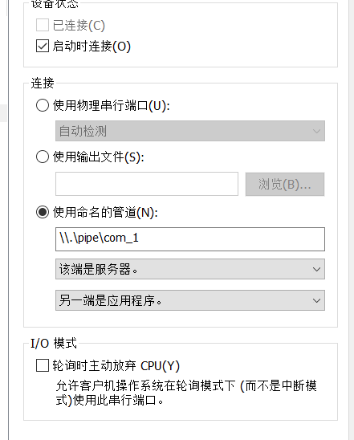

[toc]


# 001.保护模式

x86CPU三个模式：实模式， 保护模式，虚拟8086模式

市面上能见到的x64对x86向下兼容，是x86的扩展

保护模式特点：

-   段的机制
-   页的基址


# 002.段寄存器结构

学段机制之前先要知道段寄存器结构

```asm
mov dword ptr ds:[0x123456],eax
实际上读的地址是：ds.base + 0x123456
```

段寄存器共8个：

`ES,CS,SS,DS,FS,GS,LDTR,TR`

>   LDRT在win中不用

段寄存器共96位，其中高80位不可见，低16位可见

段寄存器在读的时候只能读16位：

```asm
mov ax,es//也就是Selector部分
```

# 003.段寄存器属性探测

寄存器的96位：

```
Selector	//16，可见部分
Atrribute	//16
Base		//32
Limit		//32
```

**LDTR和TR寄存器不能使用mov读写**

不同系统红色部分可能不同： 

gs寄存器win没有使用


# 004.段描述符与段选择子

介绍两张表：GDT(全局描述符表)和LDT(局部描述符表，该表在win并没有使用)

当执行类似mov ds,ax指令时，cpu会查表，

主要是查GDT	表。

本来要是用32的，这里使用x64来演示，其实都差不多：

gdtr和gdtl 分别可以知道gdt这个表的位置和大小，dd指令可以查看指定位置的数据：

```
0: kd> r gdtr
gdtr=fffff8023406afb0
0: kd> r gdtl
gdtl=0057
0: kd> dd fffff8023406afb0
fffff802`3406afb0  00000000 00000000 00000000 00000000
fffff802`3406afc0  00000000 00209b00 00000000 00409300
fffff802`3406afd0  0000ffff 00cffb00 0000ffff 00cff300
fffff802`3406afe0  00000000 0020fb00 00000000 00000000
fffff802`3406aff0  90000067 34008b06 fffff802 00000000
fffff802`3406b000  00003c00 0040f300 00000000 00000000
fffff802`3406b010  00000000 00000000 00000000 00000000
fffff802`3406b020  00000000 00000000 00000000 00000000
```


>   换成32位xp后：


段描述符，一个段描述符有8字节，查看段描述符一般使用dq查看，即qword，如上图


段选择子：16位的端描述符，


除了MOV指令，我们还可以使用LES、LSS、LDS、LFS、LGS指令修改寄存器.
CS不能通过上述的指令进行修改，CS为代码段,CS的改变会导致EIP的改变，要改CS，必须要保证CS与EIP一起改，后面会讲.

```c
char buffer[6];
__asm
{
	les ecx,fword ptr ds:[buffer] //高2个字节给es，低四个字节给ecx
    //fword 为6字节
}
```

注意:RPL<=DPL(在数值上)，上述指令才能运行

DPL：描述符特权级

# 005.段描述符属性：P位和G位

P=1：段描述符有效，0为无效

G位：

段寄存器：

```
Selector	//16,段选择子（已确定）
Atrribute	//16，高32位中的：8--23位
Base		//32，有三部分，在上面的图都能找到
Limit		//32，上面有20位，也就是最多FFFFF,当G=0时，单位为字节，那么0x000FFFFF；当G=1时，单位为4KB，0xFFFFFFFF
```

目前不要使用FS，FS与线程相关。

# 006.段描述符属性：S位和TYPE域

S=1：代码段或者数据段描述符

S=0：系统段描述符

DPL只有两种情况，00和11

也就是说只有第五位为9或者F时这里是代码段或者数据段，否则不是：


当type第11位为0时是数据段，1时是代码段：


A：是否被访问过

W：是否可写

E：向下扩展位，

R：是否可读

C：一致位

上面是当S=1的情况，下面是S=0，也就是系统段描述符的情况：


# 007.段描述符属性：DB位

```
情况一︰对CS段的影响
    D=1:采用32位寻址方式
    D=0:采用16位寻址方式
    前缀67：改变寻址方式（见下图）
情况二:对SS段的影响
    D=1:隐式堆栈访问指令(如:PUSH POP CALL）使用32位堆栈指针寄存器ESP
    D=О:隐式堆栈访问指令(如:PUSH POP CALL）使用16位堆栈指针寄存器SP
情况三:向下拓展的数据段
    D=1:段上线为4GB
    D=0:段上线为64KB
    D=1:段上线为4GB
    D=0:段上线为64KB
```

32位寻址：


# 008.段权限检查


==如何查看程序是哪一环：CPL（当前特权级）==

==CS和SS中存储的段选择子的后2位==

```
//这种就是0 环
0: kd> r
rax=000000000000df01 rbx=fffff80230fa6180 rcx=0000000000000001
rdx=0000002500000000 rsi=0000000000000001 rdi=ffffc009d5bf0040
rip=fffff80231dc00a0 rsp=fffff80234081b78 rbp=0000000000000000
 r8=000000000000014a  r9=ffffc009d18a1000 r10=00000000000000a4
r11=fffff80234081c08 r12=000000256c72b900 r13=0000000000000000
r14=fffff78000000300 r15=0000000000000001
iopl=0         nv up ei pl nz na pe nc
cs=0010  ss=0018  ds=002b  es=002b  fs=0053  gs=002b             efl=00000202
nt!DbgBreakPointWithStatus:
fffff802`31dc00a0 cc              int     3

```


```
//这种就是3环
0:000> r
rax=0000000000000000 rbx=0000000000000010 rcx=00007ffb95e4d214
rdx=0000000000000000 rsi=00007ffb95ee1a90 rdi=0000006091902000
rip=00007ffb95e806b0 rsp=0000006091a7f2a0 rbp=0000000000000000
 r8=0000006091a7f298  r9=0000000000000000 r10=0000000000000000
r11=0000000000000246 r12=0000000000000040 r13=0000000000000000
r14=00007ffb95ed48f0 r15=00000202241a0000
iopl=0         nv up ei pl zr na po nc
cs=0033  ss=002b  ds=002b  es=002b  fs=0053  gs=002b             efl=00000246
ntdll!LdrpDoDebuggerBreak+0x30:
00007ffb`95e806b0 cc              int     3
```


CPL：CPU当前的权限级别(当前程序)
DPL：(Descriptor Privilege Level:描述符特权级别)如果你想访问我，你应该具备什么样的权限，描述符特权级
RPL ：用什么权限去访问一企段，请求特权级


```
参考如下代码:
比如当前程序处于0环，也就是说CPL=O
Mov ax,00OB //1011 RPL = 3
Mov ds,ax   //ax指向的段描述符的DPL=0

数据段的权限检查:
CPL<= DPL 并且 RPL<= DPL(数值上的比较)
注意:
代码段和系统段描述符中的检查方式并不一样,具体参加后面课程.
```

# 009.代码跨段跳转流程


**代码跨段本质就是修改CS段寄存器**

```
1、代码间的跳转(段间跳转非调用门之类的)

段间跳转，有2种情况，即要跳转的段是一致代码段还是非一致代码段(如何区分参见之前视频)

同时修改CS与EIP的指令
JMP FAR/CALL FAR/RETF /INT/IRETED
注意:
只改变EIP的指令
JMP / CALL /JcC/RET


2、代码间的跳转(段间跳转非调用门之类的)执行流程:
JMP 0x20:0x004183D7 CPU如何执行这行代码?
    (1)段选择子拆分
        Ox20对应二进制形式0000 0000 0010 0000
        RPL= 00
        TI=0
        lndex = 4
    (2)查表得到段描述符
        TI=0 所以查GDT表
        Index=4 找到对应的段描述符
        四种情况可以跳转:代码段、调用门、TSS任务段、任务门
    (3)权限检查
    	如果是非一致代码段，要求:CPL == DPL并且RPL<= DPL
    	如果是一致代码段，要求:CPL >= DPL
    (4)加载段描述符
    	通过上面的权限检查后，CPU会将段描述符加载到CS段寄存器中.
    (5)代码执行
        CPU将CS.Base + Offset的值写入EIP然后执行CS:EIP处的代码，段间跳转结束.
6、总结:
对于一致代码段:也就是共享的段
	特权级高的程序不允许访问特权级低的数据:O核心态不允许访问用户态的数据
	特权级低的程序可以访问到特权级高的数据，但特权级不会改变:用户态还是用户态
对于普通代码段:也就是非一致代码段
	只允许同级访问
	绝对禁止不同级别的访问:核心态不是用户态，用户态也不是核心态.
```


直接对代码段进行JMP或者CALL的操作，无论目标是一致代码段还是非一致代码段，CPL都不会发生改变.如果要提升CPL的权限，只能通过调用门.


# 010.代码跨段跳转实验


1.构造段描述符

​	找一个非一致代码段描述符，复制一份，写入到GDT表中

将上面的那个写到下面空的地方：


在od中：


执行后，ip和cs都会改变，成功执行：


下面修改段描述符的权限级别DPL，为00cf9b00`0000ffff，在od中跳转的内容不变，执行后会发现。跳转不成功，权限检查错误，跳到了ntdll里：

```
kd> eq 8003f048 00cf9b00`0000ffff
kd> g
```


上面是非一致代码段，下面将该段描述符改为一致代码段(允许低权限执行)，改为00cf9f00xxxxxx，                                                                                              成功跳转：

```
kd> eq 8003f048 00cf9f00`0000ffff
kd> g
```


总结:

1、为了对数据进行保护，普通代码段是禁止不同级别进行访问的。用户态的代码不能访问内核的数据，同样，内核态的代码也不能访问用户态的数据.
2、如果想提供一些通用的功能，而且这些功能并不会破坏内核数据，那么可以选择一致代码段，这样低级别的程序可以在不提升CPL权限等级的情况下即可以访问.
3、如果想访问普通代码段，只有通过“调用门"等提示CPL权限，才能访问。


# 额外：双机调试

**从这里开始换调试环境了，换成winxp32位了。**

改boot.ini

```
[boot loader]
timeout=30
default=multi(0)disk(0)rdisk(0)partition(1)\WINDOWS
[operating systems]
multi(0)disk(0)rdisk(0)partition(1)\WINDOWS="Microsoft Windows XP Professional" /noexecute=optin /fastdetect
multi(0)disk(0)rdisk(0)partition(1)\WINDOWS="Microsoft Windows XP Professional" /noexecute=optin /fastdetect /debug /debugport=com1 /baudrate=115200
```

添加串行端口：





```
C:\Program Files (x86)\Windows Kits\10\Debuggers\x86>windbg.exe -b -k com:port=\\.\pipe\com_1,baud=115200,pipe
```

# 011.长调用与短调用

通过**JMP FAR**可以实现段间的跳转如果要实现跨段的调用就必须要**CALL FAR**，也就是长调用.
**CALL FAR**比**JMP FAR**要复杂，`JMP`并不影响堆栈,但`CALL`指令会影响.

1.  短调用：

    指令格式：`call 立即数/寄存器/内存`

    CALL的时候会将下一行代码的地址压入栈，call后eip与esp都会变。

    ret 的时候会将写入的地址写入eip，esp也会变。

2.  长调用（跨段不提权）

    指令格式：`call cs:eip(eip是废弃的)`

    

3.  长调用（跨段并提权）

    指令格式：`call cs:eip(eip是废弃的)`


5、总结：

1)   跨段调用时，一旦有权限切换，就会切换堆栈.
2)    CS的权限一旦改变，SS的权限也要随着改变，CS与SS的等级必须一样.
3)   `JMP FAR` 只能跳转到同级非一致代码段，但`CALL FAR`可以通过调用门提权，提升CPL的权限.

# 012.调用门——上


# 013.调用门——下

