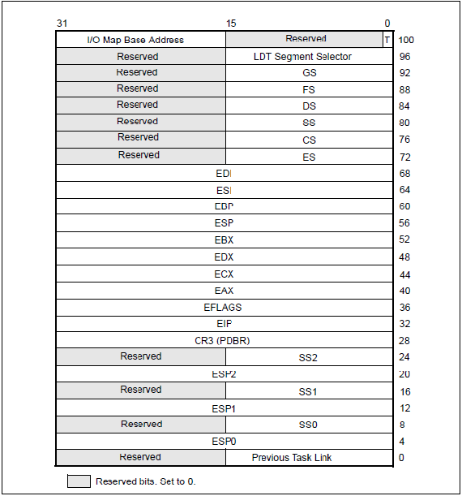
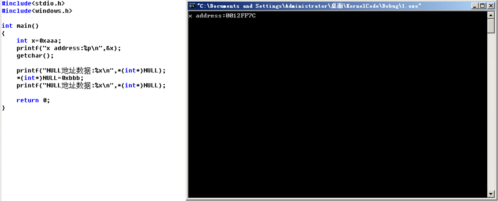
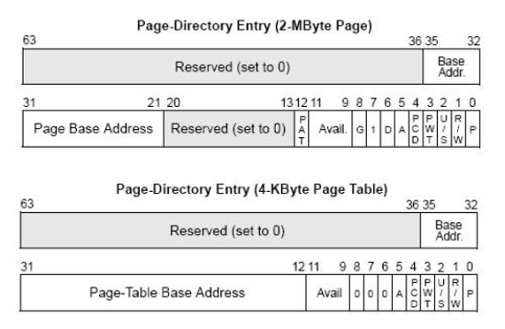

[toc]

>   https://blog.csdn.net/kwansy/category_10411796.html


# 001.保护模式

x86CPU三个模式：实模式， 保护模式，虚拟8086模式

市面上能见到的x64对x86向下兼容，是x86的扩展

保护模式特点：

-   段的机制
-   页的基址


# 002.段寄存器结构

学段机制之前先要知道段寄存器结构

```asm
mov dword ptr ds:[0x123456],eax
实际上读的地址是：ds.base + 0x123456
```

段寄存器共8个：

`ES,CS,SS,DS,FS,GS,LDTR,TR`

>   LDRT在win中不用

段寄存器共96位，其中高80位不可见，低16位可见

段寄存器在读的时候只能读16位：

```asm
mov ax,es//也就是Selector部分
```

# 003.段寄存器属性探测

寄存器的96位：

```
Selector	//16，可见部分,段选择子
Atrribute	//16
Base		//32
Limit		//32
```

**LDTR和TR寄存器不能使用mov读写**

不同系统红色部分可能不同： 

GS寄存器win没有使用


# 004.段描述符与段选择子

介绍两张表：GDT(全局描述符表)和LDT(局部描述符表，该表在win并没有使用)

当执行类似mov ds,ax指令时，cpu会查表，

主要是查GDT表。

本来要是用32的，这里使用x64来演示，其实都差不多：

gdtr和gdtl 分别可以知道gdt这个表的位置和大小，dd指令可以查看指定位置的数据：

```
0: kd> r gdtr
gdtr=fffff8023406afb0
0: kd> r gdtl
gdtl=0057
0: kd> dd fffff8023406afb0
fffff802`3406afb0  00000000 00000000 00000000 00000000
fffff802`3406afc0  00000000 00209b00 00000000 00409300
fffff802`3406afd0  0000ffff 00cffb00 0000ffff 00cff300
fffff802`3406afe0  00000000 0020fb00 00000000 00000000
fffff802`3406aff0  90000067 34008b06 fffff802 00000000
fffff802`3406b000  00003c00 0040f300 00000000 00000000
fffff802`3406b010  00000000 00000000 00000000 00000000
fffff802`3406b020  00000000 00000000 00000000 00000000
```


>   换成32位xp后：


段描述符，一个段描述符有8字节，查看段描述符一般使用dq查看，即qword，如上图


段选择子：16位的端描述符，


除了MOV指令，我们还可以使用LES、LSS、LDS、LFS、LGS指令修改寄存器.
CS不能通过上述的指令进行修改，CS为代码段,CS的改变会导致EIP的改变，要改CS，必须要保证CS与EIP一起改，后面会讲.

```c
char buffer[6];
__asm
{
	les ecx,fword ptr ds:[buffer] //高2个字节给es，低四个字节给ecx
    //fword 为6字节
}
```

注意:RPL<=DPL(在数值上)，上述指令才能运行

DPL：描述符特权级

## 使用LES指令修改ES

```c
#include "stdafx.h"
// RPL <= DPL
// Selector: 0000 0000 0011 1000(0038)
// LES高2字节给ES，低4字节给ECX，其他指令如LSS,LDS依此类推
// RPL是段选择子的权限，DPL是段描述符的权限，数值越大权限越小
// 因此当RPL=3时，只能访问DPL=3的段描述符；当RPL=0时，可以访问所有段描述符
// 下面的buffer作为源操作数执行les指令，会把ES写为0x0038，EAX写为0x11223344
char buffer[6] = {0x44,0x33,0x22,0x11,0x38, 0x00};

int main(int argc, char* argv[])
{
	// LES修改段寄存器
	__asm
	{
		les ecx,fword ptr ds:[buffer]
	}
	return 0;
}
```

可以看到ECX和ES被修改：


# 005.段描述符属性：P位和G位

P=1：段描述符有效，0为无效

G位：

-   当G=0时，Limit的范围是`0x00000000-0x000FFFFF`，其中，段描述符的20位在低位，高位补0.
-   当G=1时，Limit的范围是`0x00000FFF-0xFFFFFFFF`，其中，段描述符的20位在高位，低位补F。

段寄存器：

```
Selector	//16,段选择子（已确定）
Atrribute	//16，高32位中的：8--23位
Base		//32，有三部分，在上面的图都能找到
Limit		//32，上面有20位，也就是最多FFFFF,当G=0时，单位为字节，那么0x000FFFFF；当G=1时，单位为4KB，0xFFFFFFFF
```

目前不要使用FS，FS与线程相关。

## 练习：从GTD表中查找对应的段描述符，然后填充到段寄存器中。

段选择子：23 2B 30 3B 53

```
23：0010 0011
index:4
00cff300`0000ffff
WORD Selector: 23
WORD Atrribute: cff3
DWORD Base: 00000000
DWORD Limit: ffffffff

2B：0010 1011
index:5
80008b04`200020ab
WORD Selector: 2B
WORD Atrribute: 008b
DWORD Base: 80042000
DWORD Limit:000020ab

30：0011 0000
index:6
ffc093df`f0000001
WORD Selector: 30
WORD Atrribute: c093
DWORD Base: ffdff000
DWORD Limit: 00001fff

3B：0011 1011
index:7
0040f300`00000fff
WORD Selector: 3B
WORD Atrribute: 40f3
DWORD Base: 00000000
DWORD Limit: 00000fff

53：0101 0011
index:A
80008954`af000068
WORD Selector: 53
WORD Atrribute: 0089
DWORD Base: 8054af00
DWORD Limit: 00000068
```


# 006.段描述符属性：S位和TYPE域

S=1：代码段或者数据段描述符

S=0：系统段描述符

DPL只有两种情况，00和11

也就是说只有第五位为9或者F时这里是代码段或者数据段，否则不是：


当type第11位为0时是数据段，1时是代码段：


A：是否被访问过

W：是否可写

E：向下扩展位，

R：是否可读

C：一致位

上面是当S=1的情况，下面是S=0，也就是系统段描述符的情况：


# 007.段描述符属性：DB位

```
情况一︰对CS段的影响
    D=1:采用32位寻址方式
    D=0:采用16位寻址方式
    前缀67：改变寻址方式（见下图）
情况二:对SS段的影响
    D=1:隐式堆栈访问指令(如:PUSH POP CALL）使用32位堆栈指针寄存器ESP
    D=О:隐式堆栈访问指令(如:PUSH POP CALL）使用16位堆栈指针寄存器SP
情况三:向下拓展的数据段
    D=1:段上线为4GB
    D=0:段上线为64KB
    D=1:段上线为4GB
    D=0:段上线为64KB
```

32位寻址：


# 008.段权限检查


==如何查看程序是哪一环：CPL（当前特权级）==

==CS和SS中存储的段选择子的后2位==

```
//这种就是0 环
0: kd> r
rax=000000000000df01 rbx=fffff80230fa6180 rcx=0000000000000001
rdx=0000002500000000 rsi=0000000000000001 rdi=ffffc009d5bf0040
rip=fffff80231dc00a0 rsp=fffff80234081b78 rbp=0000000000000000
 r8=000000000000014a  r9=ffffc009d18a1000 r10=00000000000000a4
r11=fffff80234081c08 r12=000000256c72b900 r13=0000000000000000
r14=fffff78000000300 r15=0000000000000001
iopl=0         nv up ei pl nz na pe nc
cs=0010  ss=0018  ds=002b  es=002b  fs=0053  gs=002b             efl=00000202
nt!DbgBreakPointWithStatus:
fffff802`31dc00a0 cc              int     3

```


```
//这种就是3环
0:000> r
rax=0000000000000000 rbx=0000000000000010 rcx=00007ffb95e4d214
rdx=0000000000000000 rsi=00007ffb95ee1a90 rdi=0000006091902000
rip=00007ffb95e806b0 rsp=0000006091a7f2a0 rbp=0000000000000000
 r8=0000006091a7f298  r9=0000000000000000 r10=0000000000000000
r11=0000000000000246 r12=0000000000000040 r13=0000000000000000
r14=00007ffb95ed48f0 r15=00000202241a0000
iopl=0         nv up ei pl zr na po nc
cs=0033  ss=002b  ds=002b  es=002b  fs=0053  gs=002b             efl=00000246
ntdll!LdrpDoDebuggerBreak+0x30:
00007ffb`95e806b0 cc              int     3
```


CPL：CPU当前的权限级别(当前程序)
DPL：(Descriptor Privilege Level:描述符特权级别)如果你想访问我，你应该具备什么样的权限，描述符特权级
RPL ：用什么权限去访问一企段，请求特权级


```
参考如下代码:
比如当前程序处于0环，也就是说CPL=O
Mov ax,00OB //1011 RPL = 3
Mov ds,ax   //ax指向的段描述符的DPL=0

数据段的权限检查:
CPL<= DPL 并且 RPL<= DPL(数值上的比较)
注意:
代码段和系统段描述符中的检查方式并不一样,具体参加后面课程.
```

# 009.代码跨段跳转流程


**代码跨段本质就是修改CS段寄存器**

```
1、代码间的跳转(段间跳转非调用门之类的)

段间跳转，有2种情况，即要跳转的段是一致代码段还是非一致代码段(如何区分参见之前视频)

同时修改CS与EIP的指令
JMP FAR/CALL FAR/RETF /INT/IRETED
注意:
只改变EIP的指令
JMP / CALL /JcC/RET


2、代码间的跳转(段间跳转非调用门之类的)执行流程:
JMP 0x20:0x004183D7 CPU如何执行这行代码?
    (1)段选择子拆分
        Ox20对应二进制形式0000 0000 0010 0000
        RPL= 00
        TI=0
        lndex = 4
    (2)查表得到段描述符
        TI=0 所以查GDT表
        Index=4 找到对应的段描述符
        四种情况可以跳转:代码段、调用门、TSS任务段、任务门
    (3)权限检查
    	如果是非一致代码段，要求:CPL == DPL并且RPL<= DPL
    	如果是一致代码段，要求:CPL >= DPL
    (4)加载段描述符
    	通过上面的权限检查后，CPU会将段描述符加载到CS段寄存器中.
    (5)代码执行
        CPU将CS.Base + Offset的值写入EIP然后执行CS:EIP处的代码，段间跳转结束.
6、总结:
对于一致代码段:也就是共享的段
	特权级高的程序不允许访问特权级低的数据:O核心态不允许访问用户态的数据
	特权级低的程序可以访问到特权级高的数据，但特权级不会改变:用户态还是用户态
对于普通代码段:也就是非一致代码段
	只允许同级访问
	绝对禁止不同级别的访问:核心态不是用户态，用户态也不是核心态.
```


直接对代码段进行JMP或者CALL的操作，无论目标是一致代码段还是非一致代码段，CPL都不会发生改变.如果要提升CPL的权限，只能通过调用门.


# 010.代码跨段跳转实验


1.构造段描述符

​	找一个非一致代码段描述符，复制一份，写入到GDT表中

将上面的那个写到下面空的地方：


在od中：


执行后，ip和cs都会改变，成功执行：


下面修改段描述符的权限级别DPL，为00cf9b00`0000ffff，在od中跳转的内容不变，执行后会发现。跳转不成功，权限检查错误，跳到了ntdll里：

```
kd> eq 8003f048 00cf9b00`0000ffff
kd> g
```


上面是非一致代码段，下面将该段描述符改为一致代码段(允许低权限执行)，改为00cf9f00xxxxxx，                                                                                              成功跳转：

```
kd> eq 8003f048 00cf9f00`0000ffff
kd> g
```


总结:

1、为了对数据进行保护，普通代码段是禁止不同级别进行访问的。用户态的代码不能访问内核的数据，同样，内核态的代码也不能访问用户态的数据.
2、如果想提供一些通用的功能，而且这些功能并不会破坏内核数据，那么可以选择一致代码段，这样低级别的程序可以在不提升CPL权限等级的情况下即可以访问.
3、如果想访问普通代码段，只有通过“调用门"等提示CPL权限，才能访问。


# 额外：双机调试

**从这里开始换调试环境了，换成winxp32位了。**

改boot.ini

```
[boot loader]
timeout=30
default=multi(0)disk(0)rdisk(0)partition(1)\WINDOWS
[operating systems]
multi(0)disk(0)rdisk(0)partition(1)\WINDOWS="Microsoft Windows XP Professional" /noexecute=optin /fastdetect
multi(0)disk(0)rdisk(0)partition(1)\WINDOWS="Microsoft Windows XP Professional" /noexecute=optin /fastdetect /debug /debugport=com1 /baudrate=115200
```

添加串行端口：


```
C:\Program Files (x86)\Windows Kits\10\Debuggers\x86>windbg.exe -b -k com:port=\\.\pipe\com_1,baud=115200,pipe
```

# 011.长调用与短调用

短调用就是我们在汇编常见的`CALL`指令，`call`后会将EIP压栈。

长调用分为两种，一种提权，一种不提权，调用格式为：指令格式：`CALL CS:EIP`，其中`EIP`是废弃的，`CS`为指向`调用门`的段选择子。

通过**JMP FAR**可以实现段间的跳转如果要实现跨段的调用就必须要**CALL FAR**，也就是长调用.
**CALL FAR**比**JMP FAR**要复杂，`JMP`并不影响堆栈,但`CALL`指令会影响.

1.  短调用：

    指令格式：`call 立即数/寄存器/内存`

    CALL的时候会将下一行代码的地址压入栈，call后eip与esp都会变。

    ret 的时候会将写入的地址写入eip，esp也会变。

2.  长调用（跨段不提权）

    指令格式：`call cs:eip(eip是废弃的)`

    发生改变的寄存器有`ESP`、`EIP`和`CS`，比段调用多了一个`CS`

    

3.  长调用（跨段并提权）

    指令格式：`call cs:eip(eip是废弃的)`
    
    发生改变的寄存器有`ESP`、`EIP`、`CS`和`SS。


5、总结：

1)   跨段调用时，一旦有权限切换，就会切换堆栈.
2)    CS的权限一旦改变，SS的权限也要随着改变，CS与SS的等级必须一样.
3)   `JMP FAR` 只能跳转到同级非一致代码段，但`CALL FAR`可以通过调用门提权，提升CPL的权限.

# 012.调用门(无参)

win无调用门但是可以手写

p位：12bit=0：系统描述符


```
调用门执行流程

指令格式：CALL  CS:EIP(EIP是废弃的)
执行步骤：
1) 根据CS的值 查GDT表，找到对应的段描述符  这个描述符是一个调用门.
2) 在调用门描述符中存储另一个代码段段的选择子.
3) 选择子指向的段  段.Base + 偏移地址 就是真正要执行的地址.
```

可以在0x48的位置写，这个位置没有被用到，防止蓝屏。

## 调用门提权

构造一个调用门描述符：

```
0000 EC00 0008 0000
```

写到gdt表：


观察堆栈和寄存器变化：

找到地址：


这时的寄存器：


所以说要改调用门为：`0040EC00 00081020`

发生中断后，中断到了0环调试器：


可以看到cs和eip还有esp都发生了变化，成功提权，这时已经是0环权限了。

并且新的栈中，压入了原来esp和cs等内容。


## 读高2G内存

地址没变，所以gdt表的内容没改。


`sgdt`指令是用来读取`GDTR`这个寄存器的，3环也可以做到(ret就行)：

```c
void __declspec(naked) FunctionHas0CPL()
{
	__asm
	{
		sgdt GDT
		ret
	}
}
```


# 013.调用门(有参 )

调用门描述符和上节还是一样，如果有参数的话如下：`0000 EC03 0008 0000(3个参数)`

这时的堆栈：


跟上一节一样，该gdtr


测试代码及结果


## 调用门总结

```
1) 当通过门，权限不变的时候，只会PUSH两个值：CS  返回地址
	新的CS的值由调用门决定

2) 当通过门，权限改变的时候，会PUSH四个值：SS、ESP、CS、返回地址   
	新的CS的值由调用门决定  
	新的SS和ESP由TSS提供

3) 通过门调用时，要执行哪行代码有调用门决定，但使用RETF返回时，由堆栈中压人的值决定，这就是说，进门时只能按指定路线走，出门时可以翻墙(只要改变堆栈里面的值就可以想去哪去哪)	
4) 可不可以再建个门出去呢?也就是用Call  当然可以了 前门进 后门出	

```

## 调用门阶段测试

### Test1

构造调用门，实现R3读高2G内存

还是上面的，注意构造的调用门描述符


### Test2

在第一题的基础上进行修改，实现通过fq的方式返回到其他地址

意思就是不走原来的RETF，而知修改栈里面的ret地址，跳到其他地址执行。

注意修改返回地址


### Test3

在第一题的基础上进行修改，在门中再建一个门跳转到其他地址

需要注意，从第一个函数跳到第二个函数时，调用门中的DPL要设置成0，因为此时裸函数1的CPL=0.

```c
#include <windows.h>
#include <stdio.h>

DWORD dwHigh2GValue; // 高2G内存
BOOL bFunctionHas0CPL1Called; // 证明函数1被调用
BOOL bFunctionHas0CPL2Called; // 证明函数2被调用

char gate1[6] = {0,0,0,0,0x48,0}; // 0041ec00`00081000
char gate2[6] = {0,0,0,0,0x90,0}; // 00418c00`00081020

// 该函数通过 CALL FAR 调用，使用调用门提权，拥有0环权限
// 00401000
void __declspec(naked) FunctionHas0CPL1()
{
	__asm
	{
		//int 3
		pushad
		pushfd
	
		mov al,1
		mov byte ptr ds:[bFunctionHas0CPL1Called],al

		// 读取了GDT表第二项的低4字节
		mov eax,0x8003f008
		mov eax,[eax]
		mov dwHigh2GValue,eax

		call fword ptr ds:[gate2]

		popfd
		popad		

		retf	// 注意堆栈平衡，写错蓝屏
	}
}

// 00401020
void __declspec(naked) FunctionHas0CPL2()
{
	__asm
	{
		//int 3
		pushad
		pushfd
	
		mov al,1
		mov byte ptr ds:[bFunctionHas0CPL2Called],al

		popfd
		popad
		retf
	}
}

int main(int argc, char* argv[])
{	
	__asm
	{
		call fword ptr ds:[gate1] // 长调用，使用调用门提权
	}
	printf("%08x\n",dwHigh2GValue);
	printf("%d %d\n", bFunctionHas0CPL1Called,bFunctionHas0CPL2Called);
	getchar();
	return 0;
}
```


成功执行：


# 014.中断门

win中没有使用调用门，但是使用了中断门，比如系统调用和调试。

（老的CPU使用的是系统调用，新的是使用快速调用）

IDT表，即中断描述符表，每个描述符都占8字节，IDT的第一个不为空：


IDT表中只有三种描述符：

1.  任务门描述符
2.  中断门描述符
3.  陷阱们描述符

## 中断门描述符


## 提权&不提权

提权&不提权时的栈情况：

-   不提权时：压入`EFLAF`，`CS`，`EIP`
-   提权时：压入`EFLAF`，`CS`，`EIP`，并且压入`SS`和`ESP`


构造中断门：`0000EE00 00080000`

## 读取IDT表项

在IDT表中找个p=0的无效项


可以看到正确读取了


当**CPL=DPL**时，才能成功触发中断。

## 调用门中使用IRETD返回，中断门实现RETF返回

这里要对调用门(提权)和中断门(提权)的栈情况有了解。（见上面几小节

popfd将EFLAG弹出。

### 中断门

```c
#include <Windows.h>
#include <stdio.h>

BYTE IDTItem0[8];

// R0 函数，读取了IDT表第一项
// 00401000
void __declspec(naked) R0Function()
{
	__asm
	{
		//int 3 // 调试用的
		pushad
		pushfd
		mov eax,0x8003f400
		mov ebx,[eax]
		mov ecx,[eax+0x4]
		mov dword ptr ds:[IDTItem0],ebx
		mov dword ptr ds:[IDTItem0+0x4],ecx

		// 要求用 retf 返回
		add esp,0x2c		// esp指向eflags
		popfd				// esp指向3环esp
		mov eax,[esp]		// 将原ESP和SS向低地址移动4字节
		mov [esp-0x4],eax
		mov eax,[esp+0x4]
		mov [esp],eax

		sub esp,0x30		// 还原esp
		popfd
		popad

		retf
	}
}

int main()
{
	__asm 
	{
		INT 0x20
	}
	printf("%08x %08x\n", *(PDWORD)IDTItem0, *(PDWORD)((PBYTE)IDTItem0+0x4));
	getchar();
	return 0;
}
```

成功返回：


### 调用门

```c
#include <windows.h>
#include <stdio.h>

DWORD dwHigh2GValue;

// 该函数通过 CALL FAR 调用，使用调用门提权，拥有0环权限
// 00401000
void __declspec(naked) FunctionHas0CPL()
{
	__asm
	{
		pushad
		pushfd

		// 读取了GDT表第二项的低4字节
		mov eax,0x8003f008
		mov eax,[eax]
		mov dwHigh2GValue,eax

		// 要求用 iretd 返回		
		add esp,0x30		// esp指向ss
		
		mov eax,[esp]		// 将原ESP和SS向高地址移动4字节
		mov [esp+0x4],eax
		mov eax,[esp-0x4]
		mov [esp],eax
		pushfd
		sub esp,0x2c		// 还原esp

		popfd
		popad

		iretd
	}
}

int main()
{
	char buff[6] = {0,0,0,0,0x48,0};
	__asm
	{
		call fword ptr [buff] // 长调用，使用调用门提权
	}
	printf("%08x\n",dwHigh2GValue);
	getchar();
	return 0;
}
```


成功返回：


# 015.陷阱门

 陷阱门描述符：


构造一个陷阱门描述符：`0000EF00 0008 0000`

陷阱门与中断门几乎一直，唯一区别是：中断门执行时，将IF位清零，但陷阱门不会。

# 0x16.任务段

调用门中断门与陷阱门出现权限切换时，堆栈回切换，由于CS的CPL发生改变，也导致了SS也必须要切换。

切换时，会有新的ESP和SS(CS是由中断门或者调用门指定)，这两个值是从TSS (Task-state segment )，任务状态段，而来

TSS是一块内存，大小为104字节：



**作用：同时切换一堆寄存器(任务切换)**

TSS的地址在`TR`段寄存器中。


TSS段描述符：


## TR寄存器的读写

1.   将TSS段描述符加载到TR寄存器

     指令：LTR

     说明：

     -      用LTR指令去装载的话，仅仅是改变TR寄存器的值(96位) ，并没有真正改变TSS 

     -      LTR指令只能在系统层使用

     -      加载后TSS段描述符会状态位会发生改变

     ```assembly
     MOV AX,SelectorTSS
     LTR AX
     ```

     

2.   读TR寄存器

     指令：`STR`

     说明：如果用STR去读的话，只读了TR的16位，也就是选择子

     ```asm
     STR AX
     ```


# 0x17.任务段

CPU通过`TR段寄存器`来找到TSS，如果我们想用自己的TSS段来替换原来的寄存器，就要修改TR寄存器，TR寄存器的值又是来自TSS段描述符，那么我们接下来先构造一个段描述符

## 修改TR寄存器

1) 在Ring0 我们可以通过`LTR`指令去修改TR寄存器

 2) 在Ring3 我们可以通过`CALL FAR` 或者 `JMP FAR`指令来修改

用JMP去访问一个代码段的时候，改变的是CS和EIP ：

1.  JMP 0x48:0x123456  如果0x48是代码段 

2.  执行后：CS-->0x48  EIP-->0x123456

用JMP去访问一个任务段的时候：

1.  如果0x48是TSS段描述符，先修改TR寄存器，
2.  再用TR.Base指向的TSS中的值修改当前的寄存器

## CALL访问任务段，正确返回

构造TSS段描述符：`xx00 E9xx xxxx0068`

`eq xxxxxxx 0000E93A 00000068`

```
!process 0 0//查看Dirbase，即CR3
```


代码：

```c
#include <Windows.h>
#include <stdio.h>

DWORD dwOk;
DWORD dwESP;
DWORD dwCS;


// 任务切换后的EIP
void __declspec(naked) R0Func()
{
	__asm
	{
		pushad
		pushfd

		push fs
		int 3 // int 3 会修改FS
		pop fs

		mov eax,1
		mov dword ptr ds:[dwOk],eax
		mov eax,esp
		mov dword ptr ds:[dwESP],eax
		mov ax,cs
		mov word ptr ds:[dwCS],ax

		popfd
		popad
		iretd
	}
}

int main()
{	
	DWORD dwCr3; // windbg获取
	char esp[0x1000]; // 任务切换后的栈，数组名就是ESP
	
	// 此数组的地址就是TSS描述符中的Base
	DWORD *TSS = (DWORD*)VirtualAlloc(NULL,104,MEM_COMMIT,PAGE_READWRITE);
	if (TSS == NULL)
	{
		printf("VirtualAlloc 失败，%d\n", GetLastError());
		getchar();
		return -1;
	}
	printf("请在windbg执行: eq 8003f048 %02x00e9%02x`%04x0068\n", ((DWORD)TSS>>24) & 0x000000FF,((DWORD)TSS>>16) & 0x000000FF, (WORD)TSS);
	printf("请在windbg中执行!process 0 0，复制TSS.exe进程DirBase的值，并输入.\nCR3: "); // 在windbg中执行 !process 0 0 获取，DirBase: 13600420  这个数要启动程序后现查
	scanf("%x", &dwCr3); // 注意是%x
	
	TSS[0] = 0x00000000; // Previous Task Link CPU填充，表示上一个任务的选择子
	TSS[1] = 0x00000000; // ESP0
	TSS[2] = 0x00000000; // SS0
	TSS[3] = 0x00000000; // ESP1
	TSS[4] = 0x00000000; // SS1
	TSS[5] = 0x00000000; // ESP2
	TSS[6] = 0x00000000; // SS2
	TSS[7] = dwCr3; // CR3 学到页就知道是啥了
	TSS[8] = (DWORD)R0Func; // EIP
	TSS[9] = 0x00000000; // EFLAGS
	TSS[10] = 0x00000000; // EAX
	TSS[11] = 0x00000000; // ECX
	TSS[12] = 0x00000000; // EDX
	TSS[13] = 0x00000000; // EBX
	TSS[14] = (DWORD)esp+0x900; // ESP，解释：esp是一个0x1000的字节数组，作为裸函数的栈，这里传进去的应该是高地址，压栈才不会越界
	TSS[15] = 0x00000000; // EBP
	TSS[16] = 0x00000000; // ESI
	TSS[17] = 0x00000000; // EDI
	TSS[18] = 0x00000023; // ES
	TSS[19] = 0x00000008; // CS 0x0000001B
	TSS[20] = 0x00000010; // SS 0x00000023
	TSS[21] = 0x00000023; // DS
	TSS[22] = 0x00000030; // FS 0x0000003B
	TSS[23] = 0x00000000; // GS
	TSS[24] = 0x00000000; // LDT Segment Selector
	TSS[25] = 0x20ac0000; // I/O Map Base Address

	char buff[6] = {0,0,0,0,0x48,0};	
	__asm
	{
		call fword ptr[buff]
	}
	printf("ok: %d\nESP: %x\nCS: %x\n", dwOk, dwESP, dwCS);

	return 0;
}
```

上面是通过CALL去访问任务段，下面是通过JMP访问，并且可以返回：


## JMP访问任务段，正确返回

和CALL FAR对比，NT位不会置1，TSS previous task link 也不会填充旧的TR，因此想要返回，可以先保存旧的TR，然后JMP FAR回去。

```c
#include <Windows.h>
#include <stdio.h>

DWORD dwOk;
DWORD dwESP;
DWORD dwCS;

// 任务切换后的EIP
void __declspec(naked) R0Func()
{
	__asm
	{
		pushad
		pushfd

		push fs
		int 3 // int 3 会修改FS
		pop fs

		mov eax,1
		mov dword ptr ds:[dwOk],eax
		mov eax,esp
		mov dword ptr ds:[dwESP],eax
		mov ax,cs
		mov word ptr ds:[dwCS],ax

		popfd
		popad
		iretd
	}
}

int main()
{	
	DWORD dwCr3; // windbg获取
	char esp[0x1000]; // 任务切换后的栈，数组名就是ESP
	
	// 此数组的地址就是TSS描述符中的Base
	DWORD *TSS = (DWORD*)VirtualAlloc(NULL,104,MEM_COMMIT,PAGE_READWRITE);
	if (TSS == NULL)
	{
		printf("VirtualAlloc 失败，%d\n", GetLastError());
		getchar();
		return -1;
	}
	printf("请在windbg执行: eq 8003f048 %02x00e9%02x`%04x0068\n", ((DWORD)TSS>>24) & 0x000000FF,((DWORD)TSS>>16) & 0x000000FF, (WORD)TSS);
	printf("请在windbg中执行!process 0 0，复制TSS.exe进程DirBase的值，并输入.\nCR3: "); // 在windbg中执行 !process 0 0 获取，DirBase: 13600420  这个数要启动程序后现查
	scanf("%x", &dwCr3); // 注意是%x
	
	TSS[0] = 0x00000000; // Previous Task Link CPU填充，表示上一个任务的选择子
	TSS[1] = 0x00000000; // ESP0
	TSS[2] = 0x00000000; // SS0
	TSS[3] = 0x00000000; // ESP1
	TSS[4] = 0x00000000; // SS1
	TSS[5] = 0x00000000; // ESP2
	TSS[6] = 0x00000000; // SS2
	TSS[7] = dwCr3; // CR3 学到页就知道是啥了
	TSS[8] = (DWORD)R0Func; // EIP
	TSS[9] = 0x00000000; // EFLAGS
	TSS[10] = 0x00000000; // EAX
	TSS[11] = 0x00000000; // ECX
	TSS[12] = 0x00000000; // EDX
	TSS[13] = 0x00000000; // EBX
	TSS[14] = (DWORD)esp+0x900; // ESP，解释：esp是一个0x1000的字节数组，作为裸函数的栈，这里传进去的应该是高地址，压栈才不会越界
	TSS[15] = 0x00000000; // EBP
	TSS[16] = 0x00000000; // ESI
	TSS[17] = 0x00000000; // EDI
	TSS[18] = 0x00000023; // ES
	TSS[19] = 0x00000008; // CS 0x0000001B
	TSS[20] = 0x00000010; // SS 0x00000023
	TSS[21] = 0x00000023; // DS
	TSS[22] = 0x00000030; // FS 0x0000003B
	TSS[23] = 0x00000000; // GS
	TSS[24] = 0x00000000; // LDT Segment Selector
	TSS[25] = 0x20ac0000; // I/O Map Base Address

	char buff[6] = {0,0,0,0,0x48,0};	
	__asm
	{
		call fword ptr[buff]
	}
	printf("ok: %d\nESP: %x\nCS: %x\n", dwOk, dwESP, dwCS);

	return 0;
}


```


# 0x18.任务门

本节通过任务门访问任务段。

注意，任务门描述符在IDT表中，但其中的TSS选择子在GDT表中，其实画个图就全知道了

任务门描述符(Reserved为保留位，填0即可)：


任务门执行过程：

1.  `INT N`（即查IDT索引）
2.  查IDT表，找到任务门描述符
3.  通过任务门描述符，查GDT表，找到TSS段描述符
4.  使用TSS段中的值修改TR寄存器
5.  `IRETD`返回

## 练习

需要构造任务门描述符和TSS描述符：

```
eq 8003f500 0000e500`00480000	//任务门描述符
eq 8003f048 xx00e9xx`xxxx0068	//TSS描述符,xxxx是TSS malloc（(104)的地址
```


```c
#include <Windows.h>
#include <stdio.h>

DWORD *TSS;
DWORD dwOk;

// 任务切换后的EIP
void __declspec(naked) R0Func()
{
	dwOk = 1;
	__asm
	{
		iretd
	}
}

int main()
{	
	DWORD dwCr3; // windbg获取
	char esp[0x1000]; // 任务切换后的栈，数组名就是ESP
	
	// 此数组的地址就是TSS描述符中的Base
	TSS = (DWORD*)VirtualAlloc(NULL,104,MEM_COMMIT,PAGE_READWRITE);
	if (TSS == NULL)
	{
		printf("VirtualAlloc 失败，%d\n", GetLastError());
		getchar();
		return -1;
	}
	// GDT：TSS描述符
	printf("请在windbg执行: eq 8003f048 %02x00e9%02x`%04x0068\n", ((DWORD)TSS>>24) & 0x000000FF,((DWORD)TSS>>16) & 0x000000FF, (WORD)TSS);
	// IDT：任务门描述符
	printf("请在windbg执行: eq 8003f500 0000e500`00480000\n");
	printf("请在windbg中执行!process 0 0，复制TSS.exe进程DirBase的值，并输入.\nCR3: "); // 在windbg中执行 !process 0 0 获取，DirBase: 13600420  这个数要启动程序后现查
	scanf("%x", &dwCr3); // 注意是%x
	
	TSS[0] = 0x00000000; // Previous Task Link CPU填充，表示上一个任务的选择子
	TSS[1] = 0x00000000; // ESP0
	TSS[2] = 0x00000000; // SS0
	TSS[3] = 0x00000000; // ESP1
	TSS[4] = 0x00000000; // SS1
	TSS[5] = 0x00000000; // ESP2
	TSS[6] = 0x00000000; // SS2
	TSS[7] = dwCr3; // CR3 学到页就知道是啥了
	TSS[8] = (DWORD)R0Func; // EIP
	TSS[9] = 0x00000000; // EFLAGS
	TSS[10] = 0x00000000; // EAX
	TSS[11] = 0x00000000; // ECX
	TSS[12] = 0x00000000; // EDX
	TSS[13] = 0x00000000; // EBX
	TSS[14] = (DWORD)esp+0x500; // ESP，解释：esp是一个0x1000的字节数组，作为裸函数的栈，这里传进去的应该是高地址，压栈才不会越界
	TSS[15] = 0x00000000; // EBP
	TSS[16] = 0x00000000; // ESI
	TSS[17] = 0x00000000; // EDI
	TSS[18] = 0x00000023; // ES
	TSS[19] = 0x00000008; // CS 0x0000001B
	TSS[20] = 0x00000010; // SS 0x00000023
	TSS[21] = 0x00000023; // DS
	TSS[22] = 0x00000030; // FS 0x0000003B
	TSS[23] = 0x00000000; // GS
	TSS[24] = 0x00000000; // LDT Segment Selector
	TSS[25] = 0x20ac0000; // I/O Map Base Address

	char buff[6] = {0,0,0,0,0x48,0};	
	__asm
	{
		//call fword ptr[buff]
		//jmp fword ptr[buff]
		int 0x20
	}
	printf("ok: %d\n",dwOk);

	return 0;
}
```


# 0x19.10-10-12分页

首先说下，有效地址 ，线性地址，物理地址：

`MOV eax,dword ptr ds:[0x12345678]`

-   其中,0x12345678 是有效地址
-   `ds.Base + 0x12345678` 是线性地址
-   物理地址就不用说了，要找的就是这个

 x86中分页的方式有两种：

-   `10-10-12`
-   `2-9-9-12`

修改boot.ini，之后重启：

```
multi(0)disk(0)rdisk(0)partition(1)\WINDOWS="Microsoft Windows XP Professional" /execute=optin /fastdetect /debug /debugport=com1 /baudrate=115200
```

这时就是10-10-12分页了。

打开个记事本，写点东西，之后CE打开，注意选择unicode：


再随便修改下，找到线性地址：`000AB468`

```
000A B468
0000 0000 0000 1010 1011 0100 0110 1000
0000 0000 00//0
00 1010 1011//AB，这里后面查的时候需要*4=2AC
0100 0110 1000//468
```

每个进程都有一个`CR3`(这里存的是物理地址)，准确的说是都一个CR3的值，CR3本身是个寄存器，一个核，只有一套寄存器。 

CR3指向一个物理页，一共4096字节

之后找到CR3，也就是DirBase：


查物理内存的话是`!dd`

第一级：


每四字节最后的是属性，用的时候填0即可。

第二级：


第三级：helloworld就存在这里(物理地址)


# 020.PDE_PTE

注意区别：`PDT，PTT，PDE，PTE`

PTE可以不指向物理页，多个PTE也可以指向同一个物理页


正常编程中，不能读写NULL，原因是NULL指针没有对应的物理页，因此，只要我们让NULL指针最终映射到一块可读写的物理页，就可以用NULL去读写数据了。



x的物理地址查找：


一个进程只有一个CR3，分解NULL后：


用!ed指令改写成x的PTE：0f746867 


成功在NULL地址写入：


# 021.PDE_PTE属性(P_RW)

**`物理页的属性 = PDE属性 & PTE属性`**


## 修改常量

```c
#include<stdio.h>

int main()
{
	char *str = "Hello World";
	int addr = (int)str;
	printf("线性地址：0x%08x, 4*0x%x 4*0x%x 0x%x\n", addr, addr>>22,(addr>>12)&0x000002FF,addr&0x00000FFF);
	getchar(); // 修改 PDE PTE 的 RW 位为1，使物理页可读可写
	str[0] = 'Q';
	printf("修改后：%s\n", str);
	return 0;
}
```

修改PTE的RW=1即可：


成功修改：


# 022.PDE_PTE属性(US_PS_A_D )

## U/S位 

-   U/S=0：特权用户可以访问
-   U/S=1：普通用户可以访问

## 读高2G内存地址：

```c
#include<stdio.h>
#include<windows.h>
int main()
{
	PWORD p=(PWORD)0X8003f00C;
	getchar();
	printf("高2G地址：%x\n",*p);
	return 0;
}
```

查找并修改PDE和PTE：


成功读取：


## P/S位

只对PDE有意义，`PS = PageSize`的意思，当PS=1的时候，PDE直接指向物理页，无PTE，低22位是页内偏移。

线性地址只能拆成2段：大小为4MB   俗称“大页”

## A位

是否被访问（读或者写）过 ，访问过置1 ，即使只访问一个字节也会导致PDE PTE置1

## D位

脏位，是否被写过，0没有被写过，1被写过

# 023.页目录表基址

## 页目录表PDT

`0xC0300000` 指向`PDT`
`0xC0000000` 指向第一张页表`PTT`
页目录表其实是一张特殊的页表，它是第0x300张页表。
页目录表中每项PTE都指向一张页表，其中第0x300项指向了页目录表自己。

## 页表PTT

页表总共有1024张，每张4KB，总共占了1024*4KB=4MB内存，1024张页表的线性地址是连续的，但物理地址不连续。
页表被映射到了从0xC0000000到0xC03FFFFF的4MB地址空间。
在这1024个页表中，第0x300个是一张特殊的表：页目录表。

# 024.页表基址

XP 10-10-12分页下PDT、PTT、物理页关系图


这意味着我们可以通过 `0xC0000000` 找到任何一个 PTE。公式如下（PDI 是页目录表的下标，PTI是页表的下标）：

**`PDE = 0xC0300000 + PDI * 4`**
**`PTE = 0xC0000000 + PDI * 4KB + PTI * 4`**


# 025.2-9-9-12分页

10-10-12分页还是2-9-9-12分页都是从后面分的。

2-9-9-12分页,又称为PAE（物理地址扩展）分页


## 查看物理地址

```c
#include <stdio.h>

int main()
{
	int a=0x12345678;
	printf("address:%p\n",&a);
	getchar();
	return 0;
}

```

`!vtop`指令可以查看各表：

```
kd> !vtop 02880320 0012ff7c
X86VtoP: Virt 000000000012ff7c, pagedir 0000000002880320
X86VtoP: PAE PDPE 0000000002880320 - 000000000dd5d801
X86VtoP: PAE PDE 000000000dd5d000 - 000000000dcc0867
X86VtoP: PAE PTE 000000000dcc0978 - 800000000e145867
X86VtoP: PAE Mapped phys 000000000e145f7c
Virtual address 12ff7c translates to physical address e145f7c.
kd> !dd 000000000e145f7c
# e145f7c 12345678 0012ffc0 00401569 00000001
# e145f8c 00380ff0 00381078 00241fe4 0012f7bc
# e145f9c 7ffdc000 00000001 00000006 0012ff94
# e145fac 806224ce 0012ffe0 00406b50 0040e238
# e145fbc 00000000 0012fff0 7c817077 00241fe4
# e145fcc 0012f7bc 7ffdc000 8054c6ed 0012ffc8
# e145fdc 81ccb348 ffffffff 7c839ad8 7c817080
# e145fec 00000000 00000000 00000000 00401480
```


# 026.2-9-9-12分页

## PDPTE

一共有四个


## PDE

1、当PS=1时是大页，35-21位是大页的物理地址，这样36位的物理地址的低21位为0，这就意味着页的大小为2MB，且都是2MB对齐。2、当PS=0时，35-12位是页表基址,低12位补0，共36位。



## PTE


改成2-9-9-12分页：

```
[boot loader]
timeout=30
default=multi(0)disk(0)rdisk(0)partition(1)\WINDOWS
[operating systems]
multi(0)disk(0)rdisk(0)partition(1)\WINDOWS="Microsoft Windows XP Professional" /noexecute=optin /fastdetect
multi(0)disk(0)rdisk(0)partition(1)\WINDOWS="Microsoft Windows XP Professional" /noexecute=optin /fastdetect /debug /debugport=com1 /baudrate=115200
```

`!vtop`指令可以查看各表：

```
kd> !vtop 028802a0 0
X86VtoP: Virt 0000000000000000, pagedir 00000000028802a0
X86VtoP: PAE PDPE 00000000028802a0 - 000000000c47a801
X86VtoP: PAE PDE 000000000c47a000 - 000000001ba0a867
X86VtoP: PAE PTE 000000001ba0a000 - 0000000000000000
X86VtoP: PAE zero PTE
Virtual address 0 translation fails, error 0xD0000147.
```

## 给0线性地址挂上物理页

```c
#include <stdio.h>

int main()
{
	char data[0x1000] = {0};
	int *p = NULL;
	printf("可用的物理页基址：%p\n", data);
	printf("请在windbg中给NULL挂物理页.\n");
	getchar(); // windbg...
	// 读写NULL
	*p = 0x20201008;
	printf("*NULL = %x\n", *p);
	getchar();
	return 0;
}
```

线性地址：`0x0012EF80`

```
kd> !vtop 028801e0  0012ef80
X86VtoP: Virt 000000000012ef80, pagedir 00000000028801e0
X86VtoP: PAE PDPE 00000000028801e0 - 000000000da11801
X86VtoP: PAE PDE 000000000da11000 - 0000000013b23867
X86VtoP: PAE PTE 0000000013b23970 - 800000001c0e8867
X86VtoP: PAE Mapped phys 000000001c0e8f80
Virtual address 12ef80 translates to physical address 1c0e8f80.
```

不能直接`!eq`，需要`!ed`：

```
kd> !vtop 028801e0  0012ef80
X86VtoP: Virt 000000000012ef80, pagedir 00000000028801e0
X86VtoP: PAE PDPE 00000000028801e0 - 000000000da11801
X86VtoP: PAE PDE 000000000da11000 - 0000000013b23867
X86VtoP: PAE PTE 0000000013b23970 - 800000001c0e8867
X86VtoP: PAE Mapped phys 000000001c0e8f80
Virtual address 12ef80 translates to physical address 1c0e8f80.
kd> !ed 13b23000 1c0e8867
kd> !ed 13b23004 80000000
kd> g
```

挂载成功


## 公式

```c
2-9-9-12					
PDPTI-PDI-PTI-OFFSET					
					
公式：					
pPDE = 0xc0600000 + (PDPTI*4KB) + (PDI*8)					
pPTE = 0xc0000000 + (PDPTI*2MB) + (PDI*4KB) + (PTI*8)

```


# 027.TLB

TLB（Translation Lookaside Buffer）

当程序访问一个线性地址，需要先查PDPT，然后查PDT，然后查页表PTT，最后才是访问物理页。这期间多次访问内存，效率非常低。于是TLB就被设计出来了。

TLB 是CPU内部的表，一个CPU有一张TLB表，用来缓存线性地址和物理地址的映射关系，以及属性和访问次数。


说明：

1.   ATTR（属性）：属性是PDPE PDE PTE三个属性AND起来的. 如果是10-10-12 就是PDE and PTE

2.   不同的CPU 这个表的大小不一样.

3.   只要Cr3变了，TLB立马刷新，一核一套TLB.


操作系统的高2G映射基本不变，如果Cr3改了，TLB刷新 重建高2G以上很浪费。所以PDE和PTE中有个G标志位，如果G位为1刷新TLB时将不会刷新 PDE/PTE的G位为1的页，当TLB满了，根据统计信息将不常用的地址废弃，最近最常用的保留.

## 证明TLB存在

在R0给NULL挂一个物理页，并写入数据，然后修改NULL的物理页，然后读NULL，发现读取了之前写入的值，这证明第二次访问NULL的时候是从TLB中取的物理地址，证明了TLB的存在。

```c
#include<stdio.h>
#include <windows.h>

DWORD TempVal = 0;

void __declspec(naked) R0Function()
{
	__asm
	{
		pushad
		pushfd		
		// 1.给NULL挂物理页（修改PTE，这里概率蓝屏）0x01234867(G=0) 0x01234967(G=1)
		mov dword ptr ds:[0xc0000000],0x01234867
		// 2.写NULL指针，生成TLB记录
		mov dword ptr ds:[0],0x12345678
		// 3.再次修改物理页
		mov dword ptr ds:[0xc0000000],0x02345867
		// 4.读NULL，发现读了之前赋的值，证明了TLB的存在
		mov eax,dword ptr ds:[0]
		mov TempVal,eax

		popfd
		popad		
		iretd
	}
}

int main()
{
	printf("在IDT表构建中断门，请在windbg中执行下面的指令：\n");
	printf("eq 8003f500 %04xee00`0008%04x\n",(DWORD)R0Function>>16,(DWORD)R0Function & 0x0000FFFF);
	getchar();
	__asm int 0x20

	printf("%08X\n", TempVal);
	getchar();
	return 0;
}
```


# 028.控制寄存器

控制寄存器用于控制和确定CPU的操作模式。有：`Cr0`，`Cr1`，`Cr2`，`Cr3`，`Cr4`，其中`Cr1` 保留`Cr3` 页目录表基址

## Cr0


说明：

1.  PE：CR0的位0是启用保护（Protection Enable）标志。
    -   PE=1保护模式  
    -   PE=0 实地址模式 这个标志仅开启段级保护，而并没有启用分页机制。
    -   若要启用分页机制，那么PE和PG标志都要置位。
2.  PG：当设置该位时即开启了分页机制。在开启这个标志之前必须已经或者同时开启PE标志。

>   PG=0且PE=0  处理器工作在实地址模式下
>   PG=0且PE=1  处理器工作在没有开启分页机制的保护模式下
>   PG=1且PE=0  在PE没有开启的情况下  无法开启PG
>   PG=1且PE=1  处理器工作在开启了分页机制的保护模式下

## Cr2


当CPU访问某个无效页面时，会产生缺页异常，此时，CPU会将引起异常的线性地址存放在CR2中。

## Cr4


PAE=1 是2-9-9-12分页  PAE=0 是10-10-12分页。


