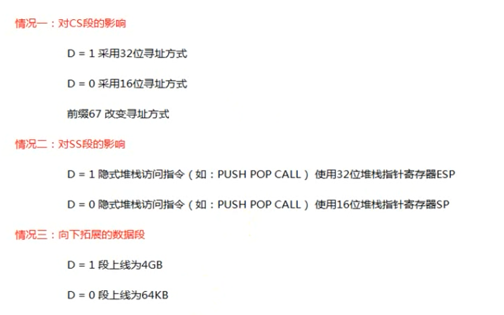
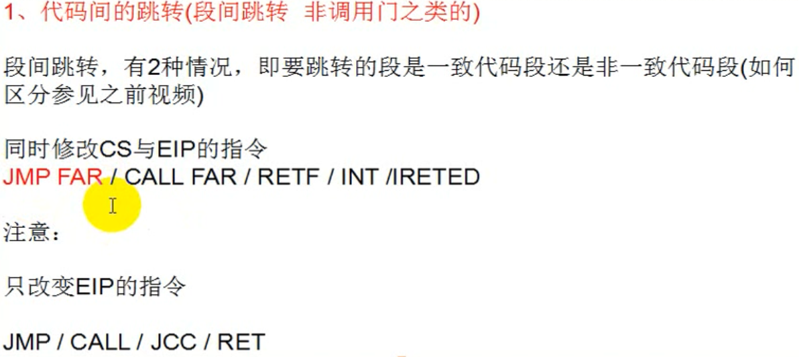
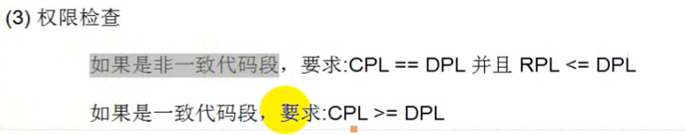

[toc]


# 001.保护模式

x86CPU三个模式：实模式， 保护模式，虚拟8086模式

市面上能见到的x64对x86向下兼容，是x86的扩展

保护模式特点：

-   段的机制
-   页的基址


# 002.段寄存器结构

学段机制之前先要知道段寄存器结构

```asm
mov dword ptr ds:[0x123456],eax
实际上读的地址是：ds.base + 0x123456
```

段寄存器共8个：

`ES,CS,SS,DS,FS,GS,LDTR,TR`

段寄存器共96位，其中高80位不可见，低16位可见

段寄存器在读的时候只能读16位：

```asm
mov ax,es
```

# 003.段寄存器属性探测

寄存器的96位：

```
Selector	//16，可见部分
Atrribute	//16
Base		//32
Limit		//32
```

**LDTR和TR寄存器不能使用mov读写**

不同系统红色部分可能不同： 

gs寄存器win没有使用


# 004.段描述符与段选择子

介绍两张表：GDT(全局描述符表)和LDT(局部描述符表，该表在win并没有使用)

当执行类似mov ds,ax指令时，cpu会查表，

主要是查GDT	表。

本来要是用32的，这里使用x64来演示，其实都差不多：

gdtr和gdtl 分别可以知道gdt这个表的位置和大小，dd指令可以查看指定位置的数据：

```
0: kd> r gdtr
gdtr=fffff8023406afb0
0: kd> r gdtl
gdtl=0057
0: kd> dd fffff8023406afb0
fffff802`3406afb0  00000000 00000000 00000000 00000000
fffff802`3406afc0  00000000 00209b00 00000000 00409300
fffff802`3406afd0  0000ffff 00cffb00 0000ffff 00cff300
fffff802`3406afe0  00000000 0020fb00 00000000 00000000
fffff802`3406aff0  90000067 34008b06 fffff802 00000000
fffff802`3406b000  00003c00 0040f300 00000000 00000000
fffff802`3406b010  00000000 00000000 00000000 00000000
fffff802`3406b020  00000000 00000000 00000000 00000000
```


段描述符，一个段描述符有8字节，查看段描述符一般使用dq查看，即qword，如上图


段选择子：16位的端描述符，


除了MOV指令，我们还可以使用LES、LSS、LDS、LFS、LGS指令修改寄存器.
CS不能通过上述的指令进行修改，CS为代码段,CS的改变会导致EIP的改变，要改CS，必须要保证CS与EIP一起改，后面会讲.

```c
char buffer[6];
__asm
{
	les ecx,fword ptr ds:[buffer] //高2个字节给es，低四个字节给ecx
    //fword 为6字节
}
```

注意:RPL<=DPL(在数值上)，上述指令才能运行

DPL：描述符特权级

# 005.段描述符属性：P位和G位

P=1：段描述符有效，0为无效

G位：

段寄存器：

```
Selector	//16,段选择子（已确定）
Atrribute	//16，高32位中的：8--23位
Base		//32，有三部分，在上面的图都能找到
Limit		//32，上面有20位，也就是最多FFFFF,当G=0时，单位为字节，那么0x000FFFFF；当G=1时，单位为4KB，0xFFFFFFFF
```

目前不要使用FS，FS与线程相关。

# 006.段描述符属性：S位和TYPE域

S=1：代码段或者数据段描述符

S=0：系统段描述符

DPL只有两种情况，00和11

也就是说只有第五位为9或者F时这里是代码段或者数据段，否则不是：


当type第11位为0时是数据段，1时是代码段：


A：是否被访问过

W：是否可写

E：向下扩展位，

R：是否可读

C：一致位

上面是当S=1的情况，下面是S=0，也就是系统段描述符的情况：


# 007.段描述符属性：DB位




# 008.段权限检查


==如何查看程序是哪一环：CPL（当前特权级）==

==CS和SS中存储的段选择子的后2位==

```
//这种就是0 环
0: kd> r
rax=000000000000df01 rbx=fffff80230fa6180 rcx=0000000000000001
rdx=0000002500000000 rsi=0000000000000001 rdi=ffffc009d5bf0040
rip=fffff80231dc00a0 rsp=fffff80234081b78 rbp=0000000000000000
 r8=000000000000014a  r9=ffffc009d18a1000 r10=00000000000000a4
r11=fffff80234081c08 r12=000000256c72b900 r13=0000000000000000
r14=fffff78000000300 r15=0000000000000001
iopl=0         nv up ei pl nz na pe nc
cs=0010  ss=0018  ds=002b  es=002b  fs=0053  gs=002b             efl=00000202
nt!DbgBreakPointWithStatus:
fffff802`31dc00a0 cc              int     3

```


```
//这种就是3环
0:000> r
rax=0000000000000000 rbx=0000000000000010 rcx=00007ffb95e4d214
rdx=0000000000000000 rsi=00007ffb95ee1a90 rdi=0000006091902000
rip=00007ffb95e806b0 rsp=0000006091a7f2a0 rbp=0000000000000000
 r8=0000006091a7f298  r9=0000000000000000 r10=0000000000000000
r11=0000000000000246 r12=0000000000000040 r13=0000000000000000
r14=00007ffb95ed48f0 r15=00000202241a0000
iopl=0         nv up ei pl zr na po nc
cs=0033  ss=002b  ds=002b  es=002b  fs=0053  gs=002b             efl=00000246
ntdll!LdrpDoDebuggerBreak+0x30:
00007ffb`95e806b0 cc              int     3
```


CPL：CPU当前的权限级别
DPL：如果你想访问我，你应该具备什么样的权限，描述符特权级
RPL ：用什么权限去访问一企段，请求特权级


数据段权限检查：


# 009.代码跨段跳转流程


代码跨段本质就是修改CS段寄存器







直接对代码段进行JMP或者CALL的操作，无论目标是一致代码段还是非一致代码段，CPL都不会发生改变.如果要提升CPL的权限，只能通过调用门.


# 010.代码跨段跳转实验 


第5位是9或者F，第6位大于8时，是代码段


在od中：


执行后，ip和cs都会改变，成功执行的。

下面修改段描述符的权限级别，为00cf9b00xxxxxx（注意b那里），在od中跳转的内容不变，执行后会发现。跳转不成功，权限检查错误，跳到了ntdll里。


上面是非一致代码段，下面将该段描述符改为一致代码段(允许低权限执行)，改为00cf9f00xxxxxx


