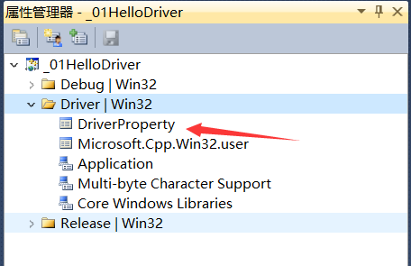
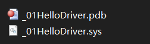
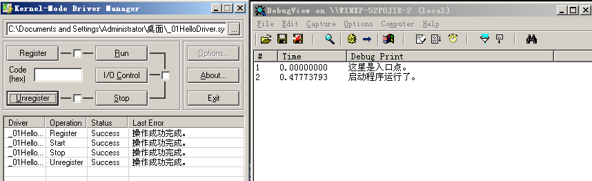
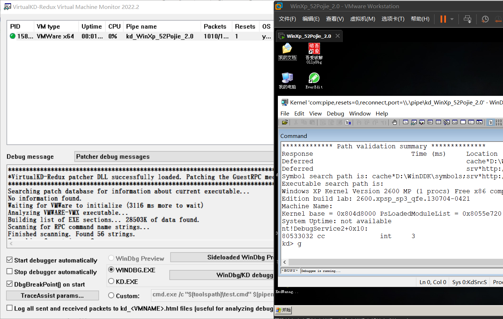
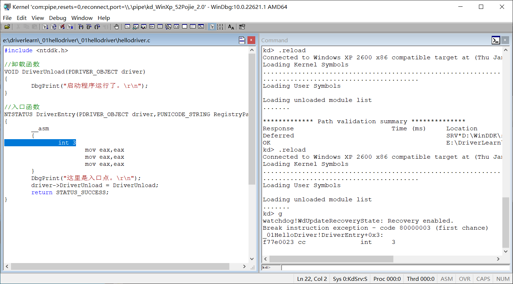
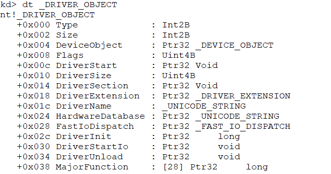
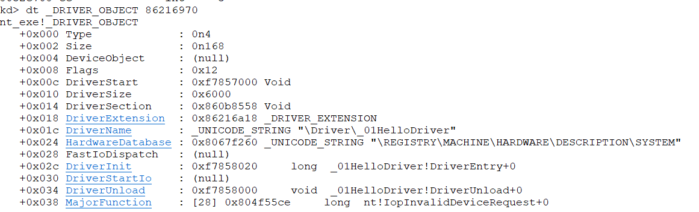
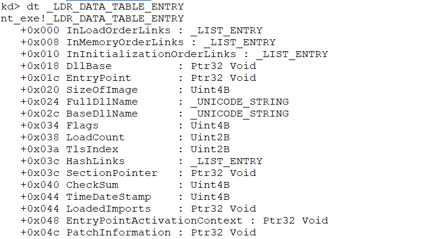
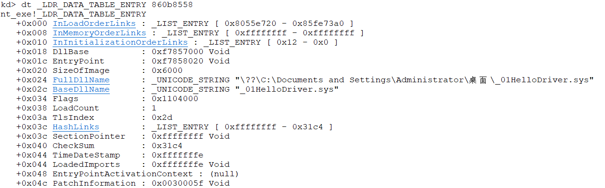
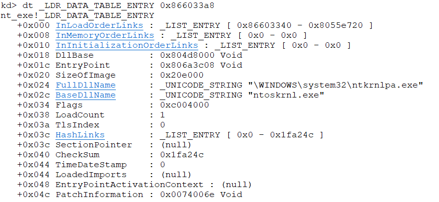

[toc]

# 001.驱动开发环境配置

vs2010:https://learn.microsoft.com/zh-cn/visualstudio/releasenotes/vs2010-sp1-vs


wdk7600:https://www.microsoft.com/en-us/download/details.aspx?id=11800


添加项目属性表：



```xml
<?xml version="1.0" encoding="utf-8"?>
<Project ToolsVersion="4.0" xmlns="http://schemas.microsoft.com/developer/msbuild/2003">
  <ImportGroup Label="PropertySheets" />
  <PropertyGroup Label="UserMacros" />
  <PropertyGroup>
    <ExecutablePath>D:\WinDDK\7600.16385.1\bin\x86;$(ExecutablePath)</ExecutablePath>
  </PropertyGroup>
  <PropertyGroup>
    <IncludePath>D:\WinDDK\7600.16385.1\inc\api;D:\WinDDK\7600.16385.1\inc\ddk;D:\WinDDK\7600.16385.1\inc\crt;$(IncludePath)</IncludePath>
  </PropertyGroup>
  <PropertyGroup>
    <LibraryPath>D:\WinDDK\7600.16385.1\lib\wxp\i386;$(LibraryPath)</LibraryPath>
    <TargetExt>.sys</TargetExt>
    <LinkIncremental>false</LinkIncremental>
    <GenerateManifest>false</GenerateManifest>
  </PropertyGroup>
  <ItemDefinitionGroup>
    <ClCompile>
      <PreprocessorDefinitions>_X86_;DBG</PreprocessorDefinitions>
      <CallingConvention>StdCall</CallingConvention>
      <ExceptionHandling>false</ExceptionHandling>
      <BasicRuntimeChecks>Default</BasicRuntimeChecks>
      <BufferSecurityCheck>false</BufferSecurityCheck>
      <CompileAs>Default</CompileAs>
      <DebugInformationFormat>ProgramDatabase</DebugInformationFormat>
      <AssemblerOutput>All</AssemblerOutput>
    </ClCompile>
    <Link>
      <AdditionalDependencies>ntoskrnl.lib;wdm.lib;wdmsec.lib;wmilib.lib;ndis.lib;Hal.lib;MSVCRT.LIB;LIBCMT.LIB;%(AdditionalDependencies)</AdditionalDependencies>
    </Link>
    <Link>
      <IgnoreAllDefaultLibraries>true</IgnoreAllDefaultLibraries>
      <EnableUAC>false</EnableUAC>
      <SubSystem>Native</SubSystem>
      <EntryPointSymbol>DriverEntry</EntryPointSymbol>
      <BaseAddress>0x10000</BaseAddress>
      <RandomizedBaseAddress>
      </RandomizedBaseAddress>
      <DataExecutionPrevention>
      </DataExecutionPrevention>
      <GenerateDebugInformation>true</GenerateDebugInformation>
      <Driver>Driver</Driver>
    </Link>
  </ItemDefinitionGroup>
  <ItemGroup />
</Project>
```

# 002.第一个驱动程序


驱动开发流程：

> 代码 => 生成sys文件 => 部署 => 启动 => 停止 => 卸载

```c
#include <ntddk.h>

//卸载函数
VOID DriverUnload(PDRIVER_OBJECT driver)
{
	DbgPrint("启动程序运行了。\r\n");
}

//入口函数
NTSTATUS DriverEntry(PDRIVER_OBJECT driver,PUNICODE_STRING RegistryPath)
{
	DbgPrint("这里是入口点。\r\n");
	driver->DriverUnload = DriverUnload;
	return STATUS_SUCCESS;
}
```


生成两个文件为驱动文件和调试文件：



之后在虚拟机里还需要两个软件：DebugView和KmdManager

DebugView在使用的时候要选择监视核心




# 003.如何调试驱动程序

PDB文件：

> PDB文件是编译驱动的同时生成的调试信息文件，它可以帮助我们像调试应用程序一样调试驱动程序。其实之前我们已经使用过PDB，我们配置双机调试环境时，在物理机上安装了符号文件，并在windbg中导入过。
>
> 有了PDB，我们就可以知道当前汇编语句属于哪个函数，程序定义的结构体等关键信息，说一句题外话，软件发布的时候，切记不要把PDB也发布出去，因为这会给别人破解你的软件提供巨大便利。

调试的话下个VirtualKD，之后将target目录放到虚拟机里，点击install(其实这步就是重新配了下环境)，物理机上点vmmon64，记得选windbg路径，重启虚拟机就ok了。



之后在windbg的symbols里面加上：`E:\DriverLearn\_01HelloDriver\Driver`

下断点的时候在代码里加上：

```asm
	__asm
	{
		int 3
			mov eax,eax
			mov eax,eax
			mov eax,eax
	}
```

这个就是最终界面了：




# 004.内核编程基础

微软提供的内核专用API在`ntddk.h`这个头文件中

## 未文档化函数与未导出函数

未文档化函数与未导出函数：

- 未文档化就是WDK文档里搜不到，但是在导出表里的函数，要使用这种函数可以使用GetProcAddress函数获取函数地址；
- 未导出函数就是不在导出表的函数，可以通过特征码搜索或者解析内核PDB的方式找到函数地址，通过函数指针调用。

如果要使用未导出的函数，只要自己定义一个函数指针，并且为函数指针提供正确的函数地址就可以使用了。有两种办法都可以获取为导出的函数地址:

1. 特征码搜索
2. 解析内核PDB文件

## 数据类型

在ntdef.h中定义，习惯使用WDK自己的类型：

| 通用类型        | wdk规范        | 说明             |
| --------------- | -------------- | ---------------- |
| unsigned long   | ULONG          | 无符号长整形     |
| unsigned char   | UCHAR          | 无符号字符型     |
| unisgned int    | UINT           | 无符号整形       |
| void            | VOID           | 无类型           |
| unsigned long\* | PULONG         | 无符号长整形指针 |
| unsigned char\* | PUCHAR         | 无符号字符型指针 |
| unsigned int\*  | PUINT          | 无符号整形指针   |
| void\*          | PVOID          | 无类型指针       |
| char\*          | UNICODE_STRING | 字符串类型       |


## 返回值

大部分内核函数返回值都是NTSTATUS类型，其实就是定义的：

```c
STATUS_SUCCESS				0x00000000	成功		
STATUS_INVALID_PARAMETER	0xC000000D	参数无效	
STATUS_BUFFER_OVERFLOW		0x80000005	缓冲区长度不够
```

在ntstatus.h文件中定义

## 异常处理

Windows提供了结构化异常处理机制，一般的编译器都是支持的，如下：

```c
__try{
	//可能出错的代码
}
__except(filter_value) {
	//出错时要执行的代码
}
```

出现异常时，可根据filter_value的值来决定程序该如果执行，当filter_value的值为：

- EXCEPTION_EXECUTE_HANDLER(1)，代码进入except块
- EXCEPTION_CONTINUE_SEARCH(0)，不处理异常，由上一层调用函数处理
- EXCEPTION_CONTINUE_EXECUTION(-1)，回去继续执行错误处的代码

## 常用的内核内存函数

| C语言  | 内核           |
| ------ | -------------- |
| malloc | ExAllocatePool |
| memset | RtlFillMemory  |
| memcpy | RtlMoveMemory  |
| free   | ExFreePool     |

## 内核字符串及常用字符串函数

为了提高安全性，内核中的字符串不再是字符串首地址指针作为开始，0作为结尾，而是采用了以下两个结构体：

**ANSI_STRING字符串：**

```c
typedef struct _STRING
{
    USHORT Length;
    USHORT MaximumLength;
    PCHAR Buffer;
}STRING;
```

**UNICODE_STRING字符串：**

```c
typedef struct _UNICODE_STRING
{
    USHORT Length;
    USHORT MaxmumLength;
    PWSTR Buffer;
} UNICODE_STRING;
```

下面的表格列出了常用的字符串函数：


| 功能 | ANSI_STRING字符串            | UNICODE_STRING字符串         |
| ---- | ---------------------------- | ---------------------------- |
| 创建 | RtlInitAnsiString            | RtlInitUnicodeString         |
| 复制 | RtlCopyString                | RtlCopyUnicodeString         |
| 比较 | RtlCompareString             | RtlCompareUnicoodeString     |
| 转换 | RtlAnsiStringToUnicodeString | RtlUnicodeStringToAnsiString |


# 005.内核空间与内核模块

```
!process 0 0 #查看所有程序
.process [dirbase]
dd 线性地址
dt _DRIVER_OBJECT #查看DRIVER_OBJECT结构体，注意要加杠
```

查看DRIVER_OBJECT结构体：



写份代码：

```c
//入口函数
NTSTATUS DriverEntry(PDRIVER_OBJECT driver,PUNICODE_STRING RegistryPath)
{
	DbgPrint("PDRIVER_OBJECT: %p %wZ\n",driver,RegistryPath);
	driver->DriverUnload = DriverUnload;
	return STATUS_SUCCESS;
}
```

在windbg中查看这个驱动进程的 _DRIVER_OBJECT 结构体：



其中的DriverSection，它实际上是 `_LDR_DATA_TABLE_ENTRY` 类型，它是一个链表的项，将所有驱动链在了一起



通过这个驱动查的时候第一个就是自己的驱动，



可以一直往下查：



# 006.r0与r3通信(常规方式)


