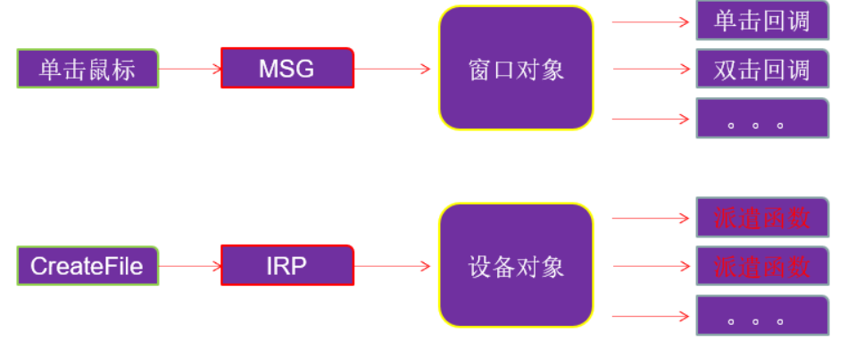
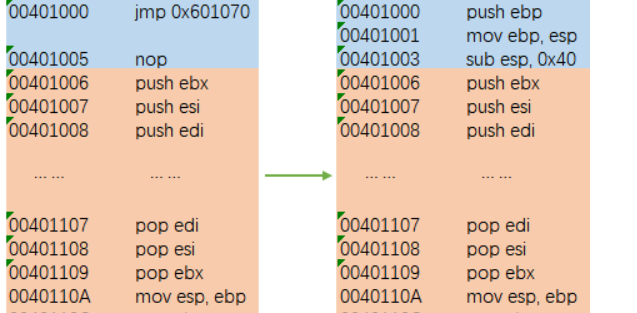

[toc]

# 001.驱动开发环境配置

vs2010:https://learn.microsoft.com/zh-cn/visualstudio/releasenotes/vs2010-sp1-vs


wdk7600:https://www.microsoft.com/en-us/download/details.aspx?id=11800


添加项目属性表：


```xml
<?xml version="1.0" encoding="utf-8"?>
<Project ToolsVersion="4.0" xmlns="http://schemas.microsoft.com/developer/msbuild/2003">
  <ImportGroup Label="PropertySheets" />
  <PropertyGroup Label="UserMacros" />
  <PropertyGroup>
    <ExecutablePath>D:\WinDDK\7600.16385.1\bin\x86;$(ExecutablePath)</ExecutablePath>
  </PropertyGroup>
  <PropertyGroup>
    <IncludePath>D:\WinDDK\7600.16385.1\inc\api;D:\WinDDK\7600.16385.1\inc\ddk;D:\WinDDK\7600.16385.1\inc\crt;$(IncludePath)</IncludePath>
  </PropertyGroup>
  <PropertyGroup>
    <LibraryPath>D:\WinDDK\7600.16385.1\lib\wxp\i386;$(LibraryPath)</LibraryPath>
    <TargetExt>.sys</TargetExt>
    <LinkIncremental>false</LinkIncremental>
    <GenerateManifest>false</GenerateManifest>
  </PropertyGroup>
  <ItemDefinitionGroup>
    <ClCompile>
      <PreprocessorDefinitions>_X86_;DBG</PreprocessorDefinitions>
      <CallingConvention>StdCall</CallingConvention>
      <ExceptionHandling>false</ExceptionHandling>
      <BasicRuntimeChecks>Default</BasicRuntimeChecks>
      <BufferSecurityCheck>false</BufferSecurityCheck>
      <CompileAs>Default</CompileAs>
      <DebugInformationFormat>ProgramDatabase</DebugInformationFormat>
      <AssemblerOutput>All</AssemblerOutput>
    </ClCompile>
    <Link>
      <AdditionalDependencies>ntoskrnl.lib;wdm.lib;wdmsec.lib;wmilib.lib;ndis.lib;Hal.lib;MSVCRT.LIB;LIBCMT.LIB;%(AdditionalDependencies)</AdditionalDependencies>
    </Link>
    <Link>
      <IgnoreAllDefaultLibraries>true</IgnoreAllDefaultLibraries>
      <EnableUAC>false</EnableUAC>
      <SubSystem>Native</SubSystem>
      <EntryPointSymbol>DriverEntry</EntryPointSymbol>
      <BaseAddress>0x10000</BaseAddress>
      <RandomizedBaseAddress>
      </RandomizedBaseAddress>
      <DataExecutionPrevention>
      </DataExecutionPrevention>
      <GenerateDebugInformation>true</GenerateDebugInformation>
      <Driver>Driver</Driver>
    </Link>
  </ItemDefinitionGroup>
  <ItemGroup />
</Project>
```

# 002.第一个驱动程序


驱动开发流程：

> 代码 => 生成sys文件 => 部署 => 启动 => 停止 => 卸载

```c
#include <ntddk.h>

//卸载函数
VOID DriverUnload(PDRIVER_OBJECT driver)
{
	DbgPrint("启动程序运行了。\r\n");
}

//入口函数
NTSTATUS DriverEntry(PDRIVER_OBJECT driver,PUNICODE_STRING RegistryPath)
{
	DbgPrint("这里是入口点。\r\n");
	driver->DriverUnload = DriverUnload;
	return STATUS_SUCCESS;
}
```


生成两个文件为驱动文件和调试文件：


之后在虚拟机里还需要两个软件：DebugView和KmdManager

DebugView在使用的时候要选择监视核心


# 003.如何调试驱动程序

PDB文件：

> PDB文件是编译驱动的同时生成的调试信息文件，它可以帮助我们像调试应用程序一样调试驱动程序。其实之前我们已经使用过PDB，我们配置双机调试环境时，在物理机上安装了符号文件，并在windbg中导入过。
>
> 有了PDB，我们就可以知道当前汇编语句属于哪个函数，程序定义的结构体等关键信息，说一句题外话，软件发布的时候，切记不要把PDB也发布出去，因为这会给别人破解你的软件提供巨大便利。

调试的话下个VirtualKD，之后将target目录放到虚拟机里，点击install(其实这步就是重新配了下环境)，物理机上点vmmon64，记得选windbg路径，重启虚拟机就ok了。


之后在windbg的symbols里面加上：`E:\DriverLearn\_01HelloDriver\Driver`

下断点的时候在代码里加上：

```asm
	__asm
	{
		int 3
			mov eax,eax
			mov eax,eax
			mov eax,eax
	}
```

这个就是最终界面了：


# 004.内核编程基础

微软提供的内核专用API在`ntddk.h`这个头文件中

## 未文档化函数与未导出函数

未文档化函数与未导出函数：

- 未文档化就是WDK文档里搜不到，但是在导出表里的函数，要使用这种函数可以使用GetProcAddress函数获取函数地址；
- 未导出函数就是不在导出表的函数，可以通过特征码搜索或者解析内核PDB的方式找到函数地址，通过函数指针调用。

如果要使用未导出的函数，只要自己定义一个函数指针，并且为函数指针提供正确的函数地址就可以使用了。有两种办法都可以获取为导出的函数地址:

1. 特征码搜索
2. 解析内核PDB文件

## 数据类型

在ntdef.h中定义，习惯使用WDK自己的类型：

| 通用类型        | wdk规范        | 说明             |
| --------------- | -------------- | ---------------- |
| unsigned long   | ULONG          | 无符号长整形     |
| unsigned char   | UCHAR          | 无符号字符型     |
| unisgned int    | UINT           | 无符号整形       |
| void            | VOID           | 无类型           |
| unsigned long\* | PULONG         | 无符号长整形指针 |
| unsigned char\* | PUCHAR         | 无符号字符型指针 |
| unsigned int\*  | PUINT          | 无符号整形指针   |
| void\*          | PVOID          | 无类型指针       |
| char\*          | UNICODE_STRING | 字符串类型       |


## 返回值

大部分内核函数返回值都是NTSTATUS类型，其实就是定义的：

```c
STATUS_SUCCESS				0x00000000	成功		
STATUS_INVALID_PARAMETER	0xC000000D	参数无效	
STATUS_BUFFER_OVERFLOW		0x80000005	缓冲区长度不够
```

在ntstatus.h文件中定义

## 异常处理

Windows提供了结构化异常处理机制，一般的编译器都是支持的，如下：

```c
__try{
	//可能出错的代码
}
__except(filter_value) {
	//出错时要执行的代码
}
```

出现异常时，可根据filter_value的值来决定程序该如果执行，当filter_value的值为：

- EXCEPTION_EXECUTE_HANDLER(1)，代码进入except块
- EXCEPTION_CONTINUE_SEARCH(0)，不处理异常，由上一层调用函数处理
- EXCEPTION_CONTINUE_EXECUTION(-1)，回去继续执行错误处的代码

## 常用的内核内存函数

| C语言  | 内核           |
| ------ | -------------- |
| malloc | ExAllocatePool |
| memset | RtlFillMemory  |
| memcpy | RtlMoveMemory  |
| free   | ExFreePool     |

## 内核字符串及常用字符串函数

为了提高安全性，内核中的字符串不再是字符串首地址指针作为开始，0作为结尾，而是采用了以下两个结构体：

**ANSI_STRING字符串：**

```c
typedef struct _STRING
{
    USHORT Length;
    USHORT MaximumLength;
    PCHAR Buffer;
}STRING;
```

**UNICODE_STRING字符串：**

```c
typedef struct _UNICODE_STRING
{
    USHORT Length;
    USHORT MaxmumLength;
    PWSTR Buffer;
} UNICODE_STRING;
```

下面的表格列出了常用的字符串函数：


| 功能 | ANSI_STRING字符串            | UNICODE_STRING字符串         |
| ---- | ---------------------------- | ---------------------------- |
| 创建 | RtlInitAnsiString            | RtlInitUnicodeString         |
| 复制 | RtlCopyString                | RtlCopyUnicodeString         |
| 比较 | RtlCompareString             | RtlCompareUnicoodeString     |
| 转换 | RtlAnsiStringToUnicodeString | RtlUnicodeStringToAnsiString |


# 005.内核空间与内核模块

```
!process 0 0 #查看所有程序
.process [dirbase]
dd 线性地址
dt _DRIVER_OBJECT #查看DRIVER_OBJECT结构体，注意要加杠
```

查看DRIVER_OBJECT结构体：


写份代码：

```c
//入口函数
NTSTATUS DriverEntry(PDRIVER_OBJECT driver,PUNICODE_STRING RegistryPath)
{
	DbgPrint("PDRIVER_OBJECT: %p %wZ\n",driver,RegistryPath);
	driver->DriverUnload = DriverUnload;
	return STATUS_SUCCESS;
}
```

在windbg中查看这个驱动进程的 _DRIVER_OBJECT 结构体：


其中的DriverSection，它实际上是 `_LDR_DATA_TABLE_ENTRY` 类型，它是一个链表的项，将所有驱动链在了一起


通过这个驱动查的时候第一个就是自己的驱动，


可以一直往下查：


# 006.r0与r3通信(常规方式)

常规方式也就是正常驱动开发的人是如何做的。

3环窗口程序中的MSG结构体和窗口对象，与0环的设备对象和IRP结构体的关系有点像；在窗口程序中，能够接收消息的只能是窗口对象。在内核中，能够接收IRP消息的只能是设备对象。

驱动程序原本的目的是用来控制硬件，但我们也可以用驱动做一些安全相关的事情，因为驱动运行在0环。为了控制驱动运行，我们需要在3环向驱动发数据，所以我们需要有一种方法来建立0环到3环的通信。本文介绍常规方式，也就是创建设备对象的方式。




## 数据交互的方式

主要有两种方式，数据量小，一般用拷贝缓冲区的方式(DO_BUFFERED_IO)；数据量大，一般用直接方式读写(DO_DIRECT_IO)。

- 缓冲区方式读写(DO_BUFFERED_IO) ：操作系统将应用程序提供缓冲区的数据复制到内核模式下的地址中。

- 直接方式读写(DO_DIRECT_IO) ：操作系统会将用户模式下的缓冲区锁住。然后操作系统将这段缓冲区在内核模式地址再次映射一遍。这样，用户模式的缓冲区和内核模式的缓冲区指向的是同一区域的物理内存。缺点就是要单独占用物理页面。

推荐使用以上两种，当然还有其他的。

## "\\\Device\\\\"与“\\\\??\\\\”

注意设备名和符号链接名：

- 设备名：r0使用，开头是"\\\Device\\\\"

- 符号链接名：r3使用，

  - 内核模式下开头是：`\\??\\`
  - 用户模式下开头是：`\\.\`，加上转义就是：`\\\\.\\`

## 派遣函数格式

```c
NTSTATUS functionName(PDEVICE_OBJECT pDeviceObject, PIRP pIrp)
{
    //业务代码区

    //设置返回状态
    pIrp->IoStatus.Status = STATUS_SUCCESS;//getLastError()得到的值
    pIrp->IoStatus.Information = 0;            //返回给3环多少数据，没有填0
    IoCompleteRequest(pIrp, IO_NO_INCREMENT);
    return STATUS_SUCCESS;
}
```


## 0环与3环通信实验

步骤：

R0：

- 创建设备：`IoCreateDevice`
- 设置交互数据的方式
- 创建符号链接：`IoCreateSymbolicLink`
- ## 设置派遣函数：`MajorFunction`，`IRP_MJ_DEVICE_CONTROL`指win32api调用`DeviceIoControl`时会执行。
- 派遣函数中：
  - 获取IRP数据：`IoGetCurrentIrpStackLocation`
  - 获取控制码
  - 获取缓冲区地址
  - 读写
  - 设置状态

R3：

- 获取设备句柄：`CreateFileW`
- 使用`DeviceIoControl`通信

## 代码

```c
#include <ntddk.h>


// 设备名，0环用
#define DEVICE_NAME L"\\Device\\HbgDev"
// 符号链接名，3环用
#define SYMBOLICLINK_NAME L"\\??\\HbgDevLnk"

#define OPER1 CTL_CODE(FILE_DEVICE_UNKNOWN,0x800,METHOD_BUFFERED,FILE_ANY_ACCESS)
#define OPER2 CTL_CODE(FILE_DEVICE_UNKNOWN,0x900,METHOD_BUFFERED,FILE_ANY_ACCESS)

// 函数声明
NTSTATUS DriverEntry(PDRIVER_OBJECT pDriver, PUNICODE_STRING RegPath);
VOID DriverUnload(PDRIVER_OBJECT pDriver);
NTSTATUS IrpCreateProc(PDEVICE_OBJECT pDevObj, PIRP pIrp);
NTSTATUS IrpCloseProc(PDEVICE_OBJECT pDevObj, PIRP pIrp);
NTSTATUS IrpDeviceControlProc(PDEVICE_OBJECT pDevObj, PIRP pIrp);

// 入口函数
NTSTATUS DriverEntry(PDRIVER_OBJECT pDriver, PUNICODE_STRING RegPath)
{
	NTSTATUS status;
	ULONG uIndex = 0;
	PDEVICE_OBJECT pDeviceObj = NULL; // 设备对象指针

	UNICODE_STRING DeviceName; // 设备名，0环用
	UNICODE_STRING SymbolicLinkName; // 符号链接名，3环用
	
	// 创建设备名称
	RtlInitUnicodeString(&DeviceName,DEVICE_NAME);
	// 创建设备
	status = IoCreateDevice(pDriver,0,&DeviceName,FILE_DEVICE_UNKNOWN,FILE_DEVICE_SECURE_OPEN,FALSE,&pDeviceObj);
	if (status != STATUS_SUCCESS)
	{
		IoDeleteDevice(pDeviceObj);
		DbgPrint("创建设备失败.\n");
		return status;
	}
	DbgPrint("创建设备成功.\n");
	// 设置交互数据的方式
	pDeviceObj->Flags |= DO_BUFFERED_IO;
	// 创建符号链接
	RtlInitUnicodeString(&SymbolicLinkName, SYMBOLICLINK_NAME);
	IoCreateSymbolicLink(&SymbolicLinkName, &DeviceName);
	// 设置分发函数
	pDriver->MajorFunction[IRP_MJ_CREATE] = IrpCreateProc;
	pDriver->MajorFunction[IRP_MJ_CLOSE] = IrpCloseProc;
	pDriver->MajorFunction[IRP_MJ_DEVICE_CONTROL] = IrpDeviceControlProc;
	// 设置卸载函数
	pDriver->DriverUnload = DriverUnload;
	return STATUS_SUCCESS;
}

// 卸载驱动
VOID DriverUnload(PDRIVER_OBJECT pDriver)
{
	UNICODE_STRING SymbolicLinkName;
	// 删除符号链接，删除设备
	RtlInitUnicodeString(&SymbolicLinkName, SYMBOLICLINK_NAME);
	IoDeleteSymbolicLink(&SymbolicLinkName);
	IoDeleteDevice(pDriver->DeviceObject);
	DbgPrint("驱动卸载成功\n");
}

// 不设置这个函数，则Ring3调用CreateFile会返回1
// IRP_MJ_CREATE 处理函数
NTSTATUS IrpCreateProc(PDEVICE_OBJECT pDevObj, PIRP pIrp)
{
	DbgPrint("应用层连接设备.\n");
	// 返回状态如果不设置，Ring3返回值是失败
	pIrp->IoStatus.Status = STATUS_SUCCESS;
	pIrp->IoStatus.Information = 0;
	IoCompleteRequest(pIrp, IO_NO_INCREMENT);
	return STATUS_SUCCESS;
}

// IRP_MJ_CLOSE 处理函数
NTSTATUS IrpCloseProc(PDEVICE_OBJECT pDevObj, PIRP pIrp)
{
	DbgPrint("应用层断开连接设备.\n");
	// 返回状态如果不设置，Ring3返回值是失败
	pIrp->IoStatus.Status = STATUS_SUCCESS;
	pIrp->IoStatus.Information = 0;
	IoCompleteRequest(pIrp, IO_NO_INCREMENT);
	return STATUS_SUCCESS;
}

// IRP_MJ_DEVICE_CONTROL 处理函数
NTSTATUS IrpDeviceControlProc(PDEVICE_OBJECT pDevObj, PIRP pIrp)
{
	// DbgPrint("IrpDeviceControlProc.\n");
	NTSTATUS status = STATUS_INVALID_DEVICE_REQUEST;
	PIO_STACK_LOCATION pIrpStack;
	ULONG uIoControlCode;
	PVOID pIoBuffer;
	ULONG uInLength;
	ULONG uOutLength;
	ULONG uRead;
	ULONG uWrite;
	
	// 设置临时变量的值
	uRead = 0;
	uWrite = 0x12345678;
	// 获取IRP数据
	pIrpStack = IoGetCurrentIrpStackLocation(pIrp);
	// 获取控制码
	uIoControlCode = pIrpStack->Parameters.DeviceIoControl.IoControlCode;
	// 获取缓冲区地址（输入输出是同一个）
	pIoBuffer = pIrp->AssociatedIrp.SystemBuffer;
	// Ring3 发送数据的长度
	uInLength = pIrpStack->Parameters.DeviceIoControl.InputBufferLength;
	// Ring0 发送数据的长度
	uOutLength = pIrpStack->Parameters.DeviceIoControl.OutputBufferLength;

	switch (uIoControlCode)
	{
	case OPER1:
		{
			DbgPrint("IrpDeviceControlProc -> OPER1...\n");
			pIrp->IoStatus.Information = 0;
			status = STATUS_SUCCESS;
			break;
		}
	case OPER2:
		{
			DbgPrint("IrpDeviceControlProc -> OPER2 输入字节数: %d\n", uInLength);
			DbgPrint("IrpDeviceControlProc -> OPER2 输出字节数: %d\n", uOutLength);
			// 读取缓冲区
			memcpy(&uRead,pIoBuffer,4);
			DbgPrint("IrpDeviceControlProc -> OPER2 uRead: %x\n", uRead);
			// 写入缓冲区
			memcpy(pIoBuffer, &uWrite, 4);
			// 设置状态
			pIrp->IoStatus.Information = 2; // 返回两字节
			status = STATUS_SUCCESS;
			break;
		}
	}
	// 返回状态如果不设置，Ring3返回值是失败
	pIrp->IoStatus.Status = status;
	IoCompleteRequest(pIrp, IO_NO_INCREMENT);
	return STATUS_SUCCESS;
}
```

应用程序代码：

```c
#include <stdio.h>
#include <Windows.h>
#include <winioctl.h>
#define SYMBOLICLINK_NAME L"\\\\.\\HbgDevLnk"
#define OPER1 CTL_CODE(FILE_DEVICE_UNKNOWN, 0x800, METHOD_BUFFERED, FILE_ANY_ACCESS)
#define OPER2 CTL_CODE(FILE_DEVICE_UNKNOWN, 0x900, METHOD_BUFFERED, FILE_ANY_ACCESS)
#define IN_BUFFER_MAXLENGTH 4
#define OUT_BUFFER_MAXLENGTH 4

int main()
{
    // 获取设备句柄
    HANDLE hDevice = CreateFileW(SYMBOLICLINK_NAME, GENERIC_READ | GENERIC_WRITE, 0, 0, OPEN_EXISTING, FILE_ATTRIBUTE_READONLY, 0);
    DWORD dwError = GetLastError();
    if (hDevice == INVALID_HANDLE_VALUE)
    {
        printf("获取设备句柄失败 %d.\n", dwError); // 如果返回1，请在驱动中指定 IRP_MJ_CREATE 处理函数
        getchar();
        return 1;
    }
    else
    {
        printf("获取设备句柄成功.\n");
    }
    // 测试通信
    DWORD dwInBuffer = 0x11111111;
    DWORD dwOutBuffer = 0xFFFFFFFF;
    DWORD dwOut;
    DeviceIoControl(hDevice, OPER2, &dwInBuffer, IN_BUFFER_MAXLENGTH, &dwOutBuffer, OUT_BUFFER_MAXLENGTH, &dwOut, NULL);
    printf("dwOutBuffer: %08X dwOut: %08X\n", dwOutBuffer, dwOut);
	CloseHandle(hDevice);
    getchar();
    return 0;
}
```

可以看到r0和r3成功建立通信：


# 007.SSTD Hook

SSDT 的全称是 System Services Descriptor Table，系统服务描述符表。这个表就是一个把 Ring3 的 Win32 API 和 Ring0 的内核 API 联系起来。

前者有 ntoskrnl.exe 导出,后者由 Win32k.sys 导出。

----------------------------

SSDT  的全称是 System Services Descriptor Table，系统服务描述符表

> kd> dd  KeServiceDescriptorTable(SSDT)

导出的 声明一下就可以使用了

> kd> dd  KeServiceDescriptorTableShadow(SSDT Shadow)

未导出 需要用其他的方式来查找


```c
// 系统服务表
typedef struct _KSYSTEM_SERVICE_TABLE
{
	PULONG ServiceTableBase;			// 函数地址表
	PULONG ServiceCounterTableBase;		// SSDT 函数被调用的次数
	ULONG NumberOfService;				// 函数个数
	PULONG ParamTableBase;				// 函数参数表
} KSYSTEM_SERVICE_TABLE, *PKSYSTEM_SERVICE_TABLE;

// SSDT表
typedef struct _KSERVICE_TABLE_DESCRIPTOR
{
	KSYSTEM_SERVICE_TABLE ntoskrnl;		// 内核函数
	KSYSTEM_SERVICE_TABLE win32k;		// win32k.sys 函数
	KSYSTEM_SERVICE_TABLE unUsed1;
	KSYSTEM_SERVICE_TABLE unUsed2;
} KSERVICE_TABLE_DESCRIPTOR, *PKSERVICE_TABLE_DESCRIPTOR;

// 内核导出的全局变量
// 导出由ntoskrnl所导出的SSDT
extern PKSERVICE_TABLE_DESCRIPTOR KeServiceDescriptorTable; 

```

## 得到函数表的地址

代码：

```c
#include <ntddk.h>
#include <ntstatus.h>

// 系统服务表
typedef struct _KSYSTEM_SERVICE_TABLE
{
    PULONG ServiceTableBase;        // 函数地址表
    PULONG ServiceCounterTableBase; // SSDT 函数被调用的次数
    ULONG NumberOfService;          // 函数个数
    PULONG ParamTableBase;          // 函数参数表
} KSYSTEM_SERVICE_TABLE, *PKSYSTEM_SERVICE_TABLE;

// SSDT表
typedef struct _KSERVICE_TABLE_DESCRIPTOR
{
    KSYSTEM_SERVICE_TABLE ntoskrnl; // 内核函数
    KSYSTEM_SERVICE_TABLE win32k;   // win32k.sys 函数
    KSYSTEM_SERVICE_TABLE unUsed1;
    KSYSTEM_SERVICE_TABLE unUsed2;
} KSERVICE_TABLE_DESCRIPTOR, *PKSERVICE_TABLE_DESCRIPTOR;

// 内核导出的全局变量
// 导出由ntoskrnl所导出的SSDT
extern PKSERVICE_TABLE_DESCRIPTOR KeServiceDescriptorTable;
VOID DriverUnload(PDRIVER_OBJECT pDriver);
NTSTATUS DriverEntry(PDRIVER_OBJECT pDriver, PUNICODE_STRING reg_path);


NTSTATUS DriverEntry(PDRIVER_OBJECT pDriver, PUNICODE_STRING reg_path)
{
    DbgPrint("--%X\n", KeServiceDescriptorTable);

    pDriver->DriverUnload = DriverUnload;

    return STATUS_SUCCESS;
}

VOID DriverUnload(PDRIVER_OBJECT pDriver)
{
    DbgPrint("Driver unloaded.\n");
}
```

运行：


可以看到是没问题的：


## SSDT Hook

其实就是再写一份函数代替上面的函数表里的函数

这里使用修改`NtOpenProcess`这个函数。

跟IDA可以知道是`0x7A`的位置，so：


在改之前还需要改一下页的属性：

SSDT所在的物理页是只读的，如果要修改，先要修改页属性为可写，可以直接通过页表基址修改：

```c
if(RCR4 & 0x00000020)
{//说明是2-9-9-12分页
	KdPrint(("2-9-9-12分页 %p\n",RCR4));
	KdPrint(("PTE1 %p\n",*(DWORD*)(0xC0000000 + ((HookFunAddr >> 9) & 0x007FFFF8))));
	*(DWORD64*)(0xC0000000 + ((HookFunAddr >> 9) & 0x007FFFF8)) |= 0x02; 
	KdPrint(("PTE1 %p\n",*(DWORD*)(0xC0000000 + ((HookFunAddr >> 9) & 0x007FFFF8))));
}
else
{//说明是10-10-12分页
	KdPrint(("10-10-12分页\n"));
	KdPrint(("PTE1 %p\n",*(DWORD*)(0xC0000000 + ((HookFunAddr >> 10) & 0x003FFFFC))));
	*(DWORD*)(0xC0000000 + ((HookFunAddr >> 10) & 0x003FFFFC)) |= 0x02;
	KdPrint(("PTE2 %p\n",*(DWORD*)(0xC0000000 + ((HookFunAddr >> 10) & 0x003FFFFC))));
}
```

还有一种方法，就是修改CR0寄存器，CR0寄存器的第16位叫做保护属性位，控制着页的读或写属性。


```c
VOID PageProtectOn()
{
	__asm{
			mov  eax,cr0
			or   eax,10000h
			mov  cr0,eax
			sti
	}
}

VOID PageProtectOff()				
{
	__asm{
			cli					
			mov  eax,cr0
			and  eax,not 10000h
			mov  cr0,eax
	}
}
```

这里要注意无论是通过页改的还是通过寄存器改的最后都要改回来。

## 代码

就是简单将`OpenProcess`的参数打印出来。

```c
#include <ntddk.h>
#include <ntstatus.h>

/************************************************************************/
/* 类型声明                                                             */
/************************************************************************/

// 系统服务表
typedef struct _KSYSTEM_SERVICE_TABLE
{
    PULONG ServiceTableBase;        // 函数地址表（SSDT）
    PULONG ServiceCounterTableBase; // SSDT 函数被调用的次数
    ULONG NumberOfService;          // 函数个数
    PULONG ParamTableBase;          // 函数参数表（SSPT）
} KSYSTEM_SERVICE_TABLE, *PKSYSTEM_SERVICE_TABLE;

typedef struct _KSERVICE_TABLE_DESCRIPTOR
{
    KSYSTEM_SERVICE_TABLE ntoskrnl; // 内核函数
    KSYSTEM_SERVICE_TABLE win32k;   // win32k.sys 函数
    KSYSTEM_SERVICE_TABLE unUsed1;
    KSYSTEM_SERVICE_TABLE unUsed2;
} KSERVICE_TABLE_DESCRIPTOR, *PKSERVICE_TABLE_DESCRIPTOR;

// NTOPENPROCESS
typedef NTSTATUS (*NTOPENPROCESS)(PHANDLE ProcessHandle, ACCESS_MASK DesiredAccess, POBJECT_ATTRIBUTES ObjectAttributes, PCLIENT_ID ClientId);

/************************************************************************/
/* 函数声明                                                             */
/************************************************************************/

VOID DriverUnload(PDRIVER_OBJECT pDriver);
NTSTATUS DriverEntry(PDRIVER_OBJECT pDriver, PUNICODE_STRING reg_path);
VOID PageProtectOff();
VOID PageProtectOn();
VOID HookNtOpenProcess();
VOID UnHookNtOpenProcess();
NTSTATUS HbgNtOpenProcess(PHANDLE ProcessHandle, ACCESS_MASK DesiredAccess, POBJECT_ATTRIBUTES ObjectAttributes, PCLIENT_ID ClientId);

/************************************************************************/
/* 全局变量                                                             */
/************************************************************************/

extern PKSERVICE_TABLE_DESCRIPTOR KeServiceDescriptorTable; // ntoskrnl.exe 导出的全局变量
ULONG uOldNtOpenProcess;                                    // 旧的函数地址

/************************************************************************/
/* 函数定义                                                             */
/************************************************************************/

// 驱动入口
NTSTATUS DriverEntry(PDRIVER_OBJECT pDriver, PUNICODE_STRING reg_path)
{
    // HOOK
    HookNtOpenProcess();

    pDriver->DriverUnload = DriverUnload;

    return STATUS_SUCCESS;
}

// 卸载驱动
VOID DriverUnload(PDRIVER_OBJECT pDriver)
{
    UnHookNtOpenProcess();
    DbgPrint("Driver unloaded.\n");
}

// 关闭页保护
VOID PageProtectOff()
{
    __asm
    {
		cli; // 关闭中断
		mov eax, cr0;
		and eax, not 0x10000; // WP位置0
		mov cr0, eax;
    }
}

// 开启页保护
VOID PageProtectOn()
{
    __asm
    {
		mov eax, cr0;
		or eax, 0x10000; // WP位置1
		mov cr0, eax;
		sti; // 恢复中断
    }
}

// HOOK NtOpenProcess
VOID HookNtOpenProcess()
{
    PageProtectOff();
    uOldNtOpenProcess = KeServiceDescriptorTable->ntoskrnl.ServiceTableBase[0x7A];
    KeServiceDescriptorTable->ntoskrnl.ServiceTableBase[0x7A] = (ULONG)HbgNtOpenProcess;
    PageProtectOn();
}

// UnHOOK NtOpenProcess
VOID UnHookNtOpenProcess()
{
    PageProtectOff();
    KeServiceDescriptorTable->ntoskrnl.ServiceTableBase[0x7A] = uOldNtOpenProcess;
    PageProtectOn();
}

// 被修改的 NtOpenProcess 函数，简单打印参数
NTSTATUS HbgNtOpenProcess(PHANDLE ProcessHandle, ACCESS_MASK DesiredAccess, POBJECT_ATTRIBUTES ObjectAttributes, PCLIENT_ID ClientId)
{
    DbgPrint("%x %x %x %x\n", ProcessHandle, DesiredAccess, ObjectAttributes, ClientId);
    return ((NTOPENPROCESS)uOldNtOpenProcess)(ProcessHandle, DesiredAccess, ObjectAttributes, ClientId);
}
```


这是没挂钩子之前的：


这是挂上之后的：


可以看到还是很容易被发现的。

# 008.Inline Hook

> https://cataloc.gitee.io/blog/2020/04/20/Inline-Hook-SSDT/
>
> https://www.cnblogs.com/luoyesiqiu/p/12306336.html
>
> https://blog.csdn.net/qq_41988448/article/details/103557383


SSDT Hook缺点：

- 容易发现，容易绕过
- 只能Hook系统服务表里面有的函数

无论是3环还是0环，Inline Hook的原理是一样的：

1. 通过**修改**函数中的**指令**，改变程序执行的流程
2. **跳转到自己定义的代码段**中执行
3. 最后再**返回到原始函数**中

inline hook是一种通过修改机器码的方式来实现hook的技术。

挂钩：


执行流程：


脱钩：



## 实验1：3环Inline Hook


```c
_declspec(naked) void OnCall() {
    ......
}
```

OnCall函数用`_declspec(naked)`修饰，被它修饰的函数我们常称它为裸函数，裸函数的特点是在编译生成的时候不会产生过多用于平衡堆栈的指令，这意味着在裸函数中我们要编写**内联汇编**控制堆栈平衡。


```c
#include <stdio.h>
#include <windows.h>

BYTE *ProcAddr = 0;    // 原函数地址
DWORD OldProtect = 0;  // 保存旧的内存保护
BYTE OldCmd[20] = {0}; // 存储原函数头部原始指令 在最后面构造返回到原函数的指令

BYTE *HookProcAddr = 0; // 钩子函数的地址

// 函数指针 将数据作为指令执行
typedef void (*POLDCMD)();
POLDCMD pOldCmd = (POLDCMD)(char *)OldCmd;
// printf的格式
char *format = "%x";

DWORD add(DWORD a, DWORD b)
{
    return a + b;
}

void __declspec(naked) HookProc()
{
    // 保存现场
    __asm
        {
    	pushad
    	pushfd
        }

    // 获得参数1
    printf("a = ");

    __asm
        {
    	mov eax, esp
    	add eax, 40

    	push [eax]
    	push format
    	call printf
    	add esp, 8
        }

    // 获得参数2
    printf("\nb = ");

    __asm
        {
    	mov eax, esp
    	add eax, 44

    	push [eax]
    	push format
    	call printf
    	add esp, 8
        }

    printf("\n");

    // 还原现场
    __asm
    {

    	popfd
    	popad

                // 执行原函数头部指令 并返回到原函数下一行继续执行
    	jmp pOldCmd
    }
}

void InlineHook()
{
    // 获得需要挂钩的函数地址
    ProcAddr = (BYTE *)add + 1;
    ProcAddr += *(DWORD *)ProcAddr + 4;
    // 修改内存保护
    VirtualProtect(ProcAddr, 6, PAGE_EXECUTE_READWRITE, &OldProtect);
    // 将被覆盖的指令复制到数组中
    strncpy((char *)OldCmd, (char *)ProcAddr, 6);

    // 数组末尾添上跳转指令 用于返回到被挂钩的函数
    OldCmd[6] = 0xE9;
    *(DWORD *)&OldCmd[7] = (DWORD)(ProcAddr + 6) - (DWORD)&OldCmd[6] - 5;

    // 获得钩子函数的地址
    HookProcAddr = (BYTE *)HookProc + 1;
    HookProcAddr += *(DWORD *)HookProcAddr + 4;
    // 修改原函数的头部 跳转到钩子函数
    ProcAddr[0] = 0xE9;
    *(DWORD *)&ProcAddr[1] = HookProcAddr - ProcAddr - 5;

    // 跳转指令只占五个字节 原函数头部三行指令占六个字节 因此将多余字节填充为nop
    ProcAddr[5] = 0x90;
}

void UnInlineHook()
{
    // 判断函数是否被挂钩
    if (ProcAddr[0] == 0xE9)
    {
        strncpy((char *)ProcAddr, (char *)OldCmd, 6);
    }
}

int main()
{
    DWORD sum;

    // 挂钩
    InlineHook();

    sum = add(1, 2);
    printf("sum = %x\n", sum);

    // 脱钩
    // UnInlineHook();

    sum = add(3, 4);
    printf("sum = %x\n", sum);

    return 0;
}
```


## 实验2：0环Inline Hook

这里还是使用`OpenProcess`举例：

```c
#include <ntddk.h>
#include <ntstatus.h>

PUCHAR pNtOpenProcess;
UCHAR  OldCmd[20] = {0};
//函数指针 用于将数据作为指令执行
typedef VOID (*POLDCMD)();
POLDCMD pOldCmd = (POLDCMD)(PUCHAR)OldCmd;

PCHAR format = "%x %x %x %x \r\n";

typedef NTSTATUS (*NTOPENPROCESS)(
	PHANDLE ProcessHandle,
	ACCESS_MASK DesiredAccess,
	POBJECT_ATTRIBUTES ObjectAttributes,
	PCLIENT_ID ClientId);

typedef struct _KSYSTEM_SERVICE_TABLE  
{  
	PULONG  ServiceTableBase;			// 服务函数地址表基址  
	PULONG  ServiceCounterTableBase;	// SSDT函数被调用的次数
	ULONG   NumberOfService;			// 服务函数的个数  
	PULONG   ParamTableBase;			// 服务函数参数表基址   
} KSYSTEM_SERVICE_TABLE, *PKSYSTEM_SERVICE_TABLE;  

typedef struct _KSERVICE_TABLE_DESCRIPTOR  
{  
	KSYSTEM_SERVICE_TABLE   ntoskrnl;		// ntoskrnl.exe 的服务函数  
	KSYSTEM_SERVICE_TABLE   win32k;			// win32k.sys 的服务函数(GDI32.dll/User32.dll 的内核支持)  
	KSYSTEM_SERVICE_TABLE   notUsed1;  
	KSYSTEM_SERVICE_TABLE   notUsed2;  
}KSERVICE_TABLE_DESCRIPTOR, *PKSERVICE_TABLE_DESCRIPTOR;

// KeServiceDescriptorTable 是 ntoskrnl.exe 所导出的全局变量 申明一下就可以直接使用了
extern PKSERVICE_TABLE_DESCRIPTOR KeServiceDescriptorTable;

VOID PageProtectOn()
{
	__asm{//开启内存保护
		mov  eax,cr0
		or   eax,10000h
		mov  cr0,eax
		sti
	}
}

VOID PageProtectOff()				
{
	__asm{//关闭内存保护
		cli					
		mov  eax,cr0
		and  eax,not 10000h
		mov  cr0,eax
	}
}

VOID __declspec(naked) HookProc(){
	__asm
	{
		//保存现场
		pushad
		pushfd
	
		mov eax, esp
		add eax, 40		//eflags + 8个通用寄存器 + 返回地址
		add eax, 12		//定位到最后一个参数
		push [eax]		//ClientId
		push [eax-0x4]	//ObjectAttributes
		push [eax-0x8]	//DesiredAccess
		push [eax-0xC]	//ProcessHandle
		push format
		call DbgPrint
		add esp, 20

		//还原现场
		popfd
		popad

		//调用原本的指令，然后返回到原函数
		jmp pOldCmd
	}
}

NTSTATUS InlineHook()
{
	NTSTATUS status;
	status = STATUS_SUCCESS;

	PageProtectOff();

	//保存原来的指令
	pNtOpenProcess = (PUCHAR)KeServiceDescriptorTable->ntoskrnl.ServiceTableBase[0x7A];
	RtlMoveMemory(OldCmd, pNtOpenProcess, 5);

	//构造回去的指令，用于返回到原函数
	OldCmd[5] = 0xE9;
	*(PULONG)&OldCmd[6] = ((ULONG)pNtOpenProcess+5) - (ULONG)&OldCmd[5] - 5;

	//内核函数不存在中间人（call后通过jmp跳转），函数地址为实际地址
	pNtOpenProcess[0] = 0xE9;
	*(PULONG)&pNtOpenProcess[1] = (ULONG)HookProc - (ULONG)pNtOpenProcess - 5;

	PageProtectOn();

	return status;
}

NTSTATUS UnInlineHook()
{
	NTSTATUS status;
	status = STATUS_SUCCESS;

	if(pNtOpenProcess[0] == 0xE9)
	{
		PageProtectOff();
		RtlMoveMemory(pNtOpenProcess, OldCmd, 5);
		PageProtectOn();
	}

	return status;
}

//卸载函数
VOID DriverUnload(PDRIVER_OBJECT driver)
{
	//卸载驱动时脱钩
	UnInlineHook();

	DbgPrint("驱动程序已停止.\r\n");
}

//驱动程序入口函数，相当于控制台的main函数
NTSTATUS DriverEntry(PDRIVER_OBJECT DriverObject,PUNICODE_STRING RegistryPath)
{
	DbgPrint("驱动程序已运行.\r\n");
	//运行驱动时挂钩
	InlineHook();

	//设置一个卸载函数  便于退出
	DriverObject->DriverUnload = DriverUnload;

	return STATUS_SUCCESS;
}
```


# 009.多核同步之临界区

并发：指多个线程在同时执行

- `单核`：各个线程分时执行，不是真正意义上的同时
- `多核`：在某一时刻，会同时有多个线程在执行

**同步**：保证在并发执行的环境中各个线程可以有序的执行

## 单行指令的同步


```c
DWORD dwVal = 0;	//全局变量
....
....    
//某个线程中
dwVal++;		//这行代码是否安全？
```

实际上是**不安全**的，

```asm
mov eax, [0x12345678]
add eax, 1
mov [0x12345678], eax
```

程序**在执行dwVal++时**，**需要按**照顺序**执行3条汇编指令**，才能实现这条语句的功能。

现在我们来考虑一种情况，线程A和线程B均要进行dwVal++这条指令，理想状态下，这两个线程执行完后，该全局变量的值会增加2。但是**如果在线程A执行完第二条指令后**，**发生了线程切换**，情况就会变的不一样了。

```asm
//线程A
mov eax, [0x12345678]
add eax, 1

//发生线程切换
//线程B
mov eax, [0x12345678]
add eax, 1
mov [0x12345678], eax

//发生线程切换
//线程A
mov [0x12345678], eax
```

那单行指令安全吗？

```asm
inc dword ptr ds:[0x12345678]	//一行汇编指令，安全吗?
```

这条汇编指令仅有一行，看上去不会出现上述的情况。即使线程发生切换了，也不会造成指令的重复执行。的确，在**单核**的情况下，这条指令是**安全**的，但是**多核**的情况下，还是有可能发生，不同线程同时执行这条指令的情况，所以这条指令并**不安全**。那如何才能在多核的情况下，依旧保证线程间的同步呢？那就需要用到下面介绍的这条指令了。

### Lock指令

只需要增加一个lock指令，就能让**单条指令**在多核的情况下做到同步，

```asm
lock inc dword ptr ds:[0x12345678]
```

**lock指令可以锁定当前指令执行时线程所访问的内存**，上述代码执行时，会对0x12345678地址处的值进行修改，**有了lock指令**的限制，此时**其它线程**是**不能访问或修改0x12345678地址处的值**的，只有在这条指令执行完后，其余线程才可以对此地址的值进行访问或者修改。这样就避免了多核情况下，不同线程同时修改此地址处的值的情况。

像上面这样通过Lock指令进行限制，从而**不可被中断的操作**叫做**原子操作**。Windows提供了一部分API（主要位于Kernel32.dll和Ntdll.dll）供用户使用从而保证在多核情况下的线程同步：

```c
//原子操作相关的API：
InterlockedIncrement			InterlockedExchangeAdd
InterlockedDecrement			InterlockedFlushSList		
InterlockedExchange			InterlockedPopEntrySList
InterlockedCompareExchange		InterlockedPushEntrySList
```

### InterlockedIncrement

挑一个来分析，该API在kernel32.dll中

```asm
.text:7C809806 ; LONG __stdcall InterlockedIncrement(volatile LONG *lpAddend)
.text:7C809806                 public InterlockedIncrement
.text:7C809806 InterlockedIncrement proc near          ; CODE XREF: CreatePipe+57↓p
.text:7C809806                                         ; sub_7C82CBB2+41↓p ...
.text:7C809806
.text:7C809806 lpAddend        = dword ptr  4
.text:7C809806
.text:7C809806                 mov     ecx, [esp+lpAddend]
.text:7C80980A                 mov     eax, 1          ; 将需要修改的变量的地址赋给ecx，此时可以通过[ecx]访问该变量的值
.text:7C80980F
.text:7C80980F loc_7C80980F:                           ; DATA XREF: .data:off_7C88500C↓o
.text:7C80980F                 lock xadd [ecx], eax    ; 第一部分是lock，用来锁住内存；另一部分核心在于xadd指令，该指令接收2个参数，先交换两个操作数的值，再进行算术加法操作:
.text:7C80980F                                         ; DWORD　temp;
.text:7C80980F                                         ; temp = [ecx];
.text:7C80980F                                         ; [ecx] = eax;
.text:7C80980F                                         ; eax = temp;
.text:7C80980F                                         ; [ecx] += eax;
.text:7C809813                 inc     eax             ; eax自增1，此时eax和[ecx]的值相同，eax可以起到返回值的作用（尽管已经完成对[ecx]值的修改）
.text:7C809814                 retn    4
.text:7C809814 InterlockedIncrement endp
```


## 多行指令的同步

### 临界区

可以设置一个临界区：一次只允许一个线程进入直到离开，从而保证线程的同步（这里的临界区指的是广义的临界区，各个操作系统根据临界区的思想都有各自的实现，后面也会学习到Windows提供的临界区实现）参考如下代码：

```c
DWORD dwFlag = 0;		//实现临界区的方式就是加锁
						//锁：全局变量  进去加一 出去减一
if(dwFlag  == 0)		//进入临界区	
{	
	dwFlag   = 1	
	.......
	.......
	.......
		
	dwFlag   = 0		//离开临界区
}
```

仔细观察一遍这个代码，其实是有问题的，考虑一种情况，在进入临界区后，如果dwFlag = 1这条指令还没有执行，此时发生了线程切换，这时，切换后的新线程也可以进入临界区，这样临界区的作用就失效了。

### 自己实现临界区

```asm
//定义全局变量
Flag = 0;

//进入临界区
Lab：
	mov eax,1
	//多核情况下必须加lock
	lock xadd [Flag],eax
	cmp eax,0
	jz endLab
	dec [Flag]
	//线程等待Sleep..
	jmp Lab

//临界区内部
endLab:
	ret
	
//离开临界区
lock dec [Flag]
```

这份伪代码提供了一个新的思路，在进入临界区之前，先判断锁的值，若达到进入临界区的条件，则**先修改锁的值**，**再进入临界区**；**若条件不符合**，则调用sleep()函数，进行**线程等待**。一段时间后，在跳回进入临界区的地方重新判断。在**线程退出临界区**后，**再**通过原子操作**还原锁的值**。

# 010.多核同步之自旋锁

> [多核同步之自旋锁](https://cataloc.gitee.io/blog/2020/05/09/%E5%A4%9A%E6%A0%B8%E5%90%8C%E6%AD%A5%E4%B9%8B%E8%87%AA%E6%97%8B%E9%94%81/)
>
> [自旋锁 ， cmpxchg8b 指令](https://blog.csdn.net/Kwansy/article/details/109995196)
>
> [多核同步&内核重载](https://blog.csdn.net/qq_41988448/article/details/103585673)
>
> [读书笔记之《Windows内核原理与实现》](https://blog.csdn.net/whatday/article/details/13170495)

Windows提供的一种实现多核同步的机制：**自旋锁**。

```
//单核
ntkrnlpa.exe					2-9-9-12分页
ntoskrnl.exe					10-10-12分页

//多核:
ntkrnlpa.exe（ntkrpamp.exe）			2-9-9-12分页
ntoskrnl.exe（ntkrnlmp.exe）			10-10-12分页
```

Intel的CPU，**多核情况下**，**系统安装时将ntkrnlmp.exe拷贝为ntoskrnl.exe**，系统加载时加载这个（原来是ntkrnlmp.exe的）ntoskrnl.exe。所以Intel多核情况下，内核**文件名仍然是ntoskrnl.exe**，但是其**源文件名是ntkrnlmp.exe**，如果加载符号，符号文件名也是ntkrnlmp.pdb。也因此，单核，多核情况下都叫做ntoskrnl.exe。

注意设置虚拟机CPU核心数量，

> 用一个例子来解释临界区和自旋锁的区别。只有一个厕所，有一个人进去了。
>
> 临界区就是外面的人过来看一眼发现没位子，就回家睡觉了，睡醒了再回来看看有没有位子，重复这样的步骤；
>
> 自旋锁就是外面人一看没位置，他就在原地打转，一有位子马上就进去了。
>

## KeAcquireSpinLockAtDpcLevel

> [BT、BTS、BTR、BTC: 位测试指令](https://www.cnblogs.com/del/archive/2010/04/15/1712467.html)

首先介绍两个指令，一个是bt一个是bts：


- BT(Bit Test)：位测试

  ```asm
  ;BT 把 10000001b 的第七位复制到 CF, 得知是 1
  mov dx, 10000001b
  bt  dx, 7
  ```


- BTS(Bit Test and Set：位测试并置位

  ```asm
  ;BTS 在执行 BT 命令的同时, 把操作数的指定位置为 1
  mov dx, 10000001b
  bts dx, 6
  ```


单核的是直接retn了。

多核：

```asm
text:0040B38B ; __stdcall KeAcquireSpinLockAtDpcLevel(x)
.text:0040B38B                 public _KeAcquireSpinLockAtDpcLevel@4
.text:0040B38B _KeAcquireSpinLockAtDpcLevel@4 proc near
.text:0040B38B
.text:0040B38B arg_0           = dword ptr  4
.text:0040B38B
.text:0040B38B                 mov     ecx, [esp+arg_0]
.text:0040B38F
.text:0040B38F loc_40B38F:                             ; CODE XREF: KeAcquireSpinLockAtDpcLevel(x)+14↓j
.text:0040B38F                 lock bts dword ptr [ecx], 0 ;
.text:0040B38F                                         ; 1.先判断[ecx]是否为0，是的话CF=1，否则为0
.text:0040B38F                                         ; 2.将[ecx]指定的下标置1
.text:0040B38F                                         ; 加lock保证多核情况下的安全
.text:0040B394                 jb      short loc_40B399 ;
.text:0040B394                                         ; 如果[ecx]!=0则跳转
.text:0040B394                                         ; 如果[ecx]==0说明没有线程进入当前临界区
.text:0040B396                 retn    4
.text:0040B399 ; ---------------------------------------------------------------------------
.text:0040B399
.text:0040B399 loc_40B399:                             ; CODE XREF: KeAcquireSpinLockAtDpcLevel(x)+9↑j
.text:0040B399                                         ; KeAcquireSpinLockAtDpcLevel(x)+18↓j
.text:0040B399                 test    dword ptr [ecx], 1 ; 如果[ecx]!=1则跳转
.text:0040B399                                         ; 如果[ecx]==1说明当前资源被占用
.text:0040B39F                 jz      short loc_40B38F ; 跳到开头再来KeAcquireSpinLockAtDpcLevel
.text:0040B3A1                 pause                   ; CPU降温指令，短时间内降低CPU功率
.text:0040B3A3                 jmp     short loc_40B399 ; 重复执行这几行指令，故称为自旋锁
.text:0040B3A3 _KeAcquireSpinLockAtDpcLevel@4 endp
```

## 思考题

 -  如何HOOK高并发的内核函数？

   > 这个问题的关键是，hook 后一般是 e8 / e9 后跟4字节，总共5字节，但没办法一次性改5个字节，可能改了第一个字节，正要改后4个字节时，别的线程进来了，就会出错。
   >
   > 有三种办法：
   >
   > - 短跳中转
   > - 中断门
   > - 找一条一次性修改8字节的指令
   
   1. 先在附近未使用的内存空间构造一个**长跳转**（五个字节），再在要hook的地方构造一个**短跳转**（一次性写入两个字节）指向长跳转位置
   2. 使用 **cmpxchg8b** 指令最多可一次性写入**八个字节**

------------------

**cmpxchg8b**指令

> cmpxchg8b mem64 指令的工作如下：
> 比较 mem64 和 EDX:EAX
> 如果相等，那么把 ECX:EBX 存储到 mem64
> 如果不相等，那么把 mem64 存储到 EDX:EAX

# 011.内核重载

- 描述：

  - 内核中的很多函数被层层HOOK，重载一份内核可以绕过这些HOOK
  
  - 内核重载与映射PE文件的方法无异，本质上没有区别
  
  - 内核重载就是重新加载一份内核文件（ntkrnlpa.exe）
  


- 步骤：

  1. 申请内存，按内存对齐展开

  2. 根据重定位表修复全局变量

  3. 修复IAT表(修复导入表的说法不准确)

  4. 山寨系统服务表

  5. 狸猫换太子（Hook KiFastCallEntry）


# 作业：

## 驱动01

> 申请一块内存，并在内存中存储GDT、IDT的所有数据。然后在debugview中显示出来，最后释放内存

会蓝屏，因该是内存分配的那个函数有问题

```c
#include "ntddk.h"
#include "ntdef.h"
#pragma warning(disable : 28159)
#pragma warning(disable : 28222)
#pragma warning(disable : 28209)
VOID DriverUnload(PDRIVER_OBJECT pDriver)
{
    DbgPrint("驱动程序停止运行了.\r\n");
}

NTSTATUS DriverEntry(PDRIVER_OBJECT driver, PUNICODE_STRING reg_path)
{

    UCHAR gdt[6];
    UCHAR idt[6];
    ULONG gdtAddr, idtAddr;
    USHORT gdtSize, idtSize;
    PVOID gdtBuffer = ExAllocatePool(PagedPool, gdtSize);
    PVOID idtBuffer = ExAllocatePool(PagedPool, idtSize);
    ULONG i;
    __asm
        {
        sgdt fword ptr gdt
        sidt fword ptr idt
        }
    DbgPrint("%X %X\n", gdt, idt);
    DbgPrint("%X %X\n", &gdt, &idt);
    DbgPrint("%p %p\n", gdt, idt);
    DbgPrint("%p %p\n", &gdt, &idt);
    gdtAddr = *(PULONG)(gdt + 2);
    idtAddr = *(PULONG)(idt + 2);
    gdtSize = *(PUSHORT)gdt;
    idtSize = *(PUSHORT)idt;

    DbgPrint("gdtAddr = %x, idtaddr = %x, gdtsize = %x, idtsize = %x\n", gdtAddr, idtAddr, gdtSize, idtSize);
    DbgPrint("%02X%02X%02X%02X%02X%02X\n", (unsigned char)gdt[0], (unsigned char)gdt[1], (unsigned char)gdt[2], (unsigned char)gdt[3], (unsigned char)gdt[4], (unsigned char)gdt[5]); // 前两个是size
                                                                                                                                                                                      // 后四个是address
    RtlMoveMemory(gdtBuffer, (PVOID)gdtAddr, gdtSize);
    RtlMoveMemory(idtBuffer, (PVOID)idtAddr, idtSize);

    DbgPrint("打印GDT表如下:\n");
    for (i = 0; i < gdtSize; i += 16)
        DbgPrint("%08x  %08x`%08x %08x`%08x\r\n", gdtAddr + i,
                 ((PULONG)(gdtAddr + i))[1], ((PULONG)(gdtAddr + i))[0],
                 ((PULONG)(gdtAddr + i))[3], ((PULONG)(gdtAddr + i))[2]);

    DbgPrint("\n打印IDT表如下:\n");
    for (i = 0; i < idtSize; i += 16)
        DbgPrint("%08x  %08x`%08x %08x`%08x\r\n", idtAddr + i,
                 ((PULONG)(idtAddr + i))[1], ((PULONG)(idtAddr + i))[0],
                 ((PULONG)(idtAddr + i))[3], ((PULONG)(idtAddr + i))[2]);
    ExFreePool(gdtBuffer);
    ExFreePool(idtBuffer);

    driver->DriverUnload = DriverUnload;
    return STATUS_SUCCESS;
}
```

## 驱动02

> **编写代码，实现如下功能：**
>
> <1> 初始化一个字符串
>
> <2> 拷贝一个字符串
>
> <3> 比较两个字符串是否相等
>
> <4> ANSI_STRING与UNICODE_STRING字符串相互转换

还有问题，需要改

```c
#include "ntddk.h"
#include "ntdef.h"
#pragma warning(disable : 28159)
#pragma warning(disable : 28222)
#pragma warning(disable : 28209)
VOID DriverUnload(PDRIVER_OBJECT pDriver)
{
    DbgPrint("驱动程序停止运行了.\r\n");
}

NTSTATUS DriverEntry(PDRIVER_OBJECT driver, PUNICODE_STRING reg_path)
{

    ANSI_STRING ansiSrc, ansiDes;
    UNICODE_STRING unicodeSrc, unicodeDes;
    RtlInitAnsiString(&ansiSrc, "Ghostasky");
    RtlInitUnicodeString(&unicodeSrc, L"Ghostasky");
    DbgPrint("%s %d %d\n", ansiSrc.Buffer, ansiSrc.Length, ansiSrc.MaximumLength);
    DbgPrint("%ls %d %d\n", unicodeSrc.Buffer, unicodeSrc.Length, unicodeSrc.MaximumLength);
    RtlCopyString(&ansiDes, &ansiSrc);
    // if (RtlCompareString(&ansiDes, &ansiSrc, TRUE) == 0)
    //     DbgPrint("两个字符串相等！\n");
    // else
    //     DbgPrint("两个字符串不相等\n");
    // RtlAnsiStringToUnicodeString(&unicodeDes, &ansiSrc, FALSE);
    // // 第三个参数好像是忽略大小写的意思
    // if (RtlCompareString(&unicodeDes, &unicodeSrc, TRUE) == 0)
    //     DbgPrint("两个字符串相等！\n");
    // else
    //     DbgPrint("两个字符串不相等\n");
    driver->DriverUnload = DriverUnload;
    return STATUS_SUCCESS;
}
```


## 驱动03

> 遍历内核模块链表的代码

```c
#include "ntddk.h"
#include "ntdef.h"
NTSTATUS DriverEntry(PDRIVER_OBJECT driver, PUNICODE_STRING reg_path);
VOID DriverUnload(PDRIVER_OBJECT driver);
typedef struct _LDR_DATA_TABLE_ENTRY
{
    LIST_ENTRY InLoadOrderLinks;
    LIST_ENTRY InMemoryOrderLinks;
    LIST_ENTRY InInitializationOrderLinks;
    PVOID DllBase;
    PVOID EntryPoint;
    UINT32 SizeOfImage;
    UNICODE_STRING FullDllName;
    UNICODE_STRING BaseDllName;
    UINT32 Flags;
    UINT16 LoadCount;
    UINT16 TlsIndex;
    LIST_ENTRY HashLinks;
    PVOID SectionPointer;
    UINT32 CheckSum;
    UINT32 TimeDateStamp;
    PVOID LoadedImports;
    PVOID EntryPointActivationContext;
    PVOID PatchInformation;
} LDR_DATA_TABLE_ENTRY, *PLDR_DATA_TABLE_ENTRY;
VOID DriverUnload(PDRIVER_OBJECT pDriver)
{
    DbgPrint("驱动程序停止运行了.\r\n");
}

NTSTATUS DriverEntry(PDRIVER_OBJECT driver, PUNICODE_STRING reg_path)
{
    PLDR_DATA_TABLE_ENTRY phead;
    PLDR_DATA_TABLE_ENTRY pcurrent;
    phead = driver->DriverSection;
    pcurrent = phead;

    do
    {
        DbgPrint("DllBase: %p, SizeOfImage: %08X %wZ\n", pcurrent->DllBase, pcurrent->SizeOfImage, &(pcurrent->FullDllName));
        pcurrent = pcurrent->InLoadOrderLinks.Flink;
    } while (phead != pcurrent);

    driver->DriverUnload = DriverUnload;
    return STATUS_SUCCESS;
}
```

## 驱动04

> 驱动在内存中通过特征码找未导出函数 `PspTerminateProcess` 的地址，0环和3环通信发送需要删除的进程PID，然后在驱动层调用 `PspTerminateProcess` 强杀进程。
