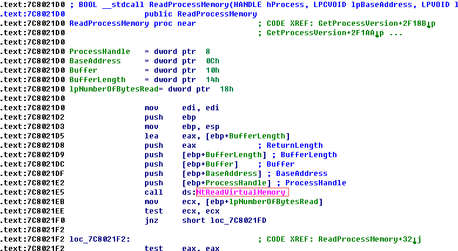
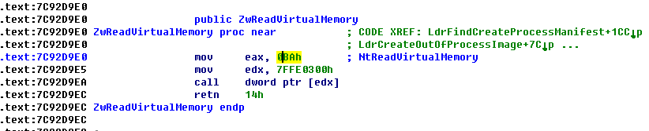
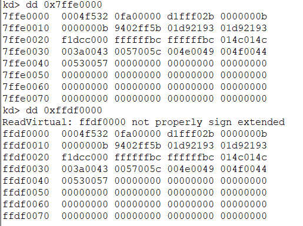
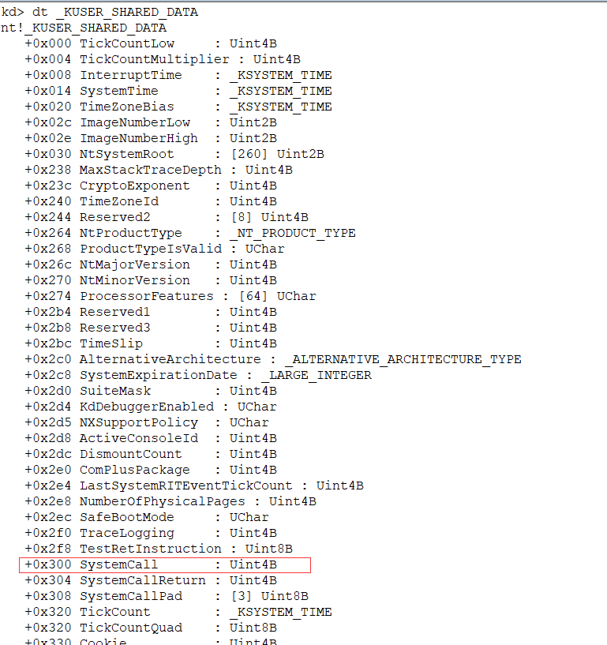
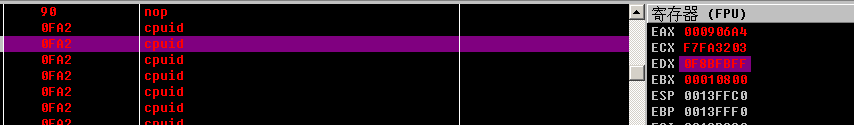
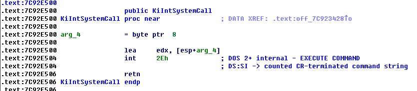
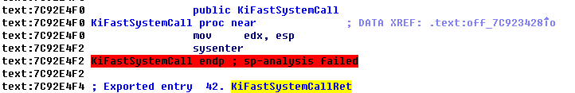
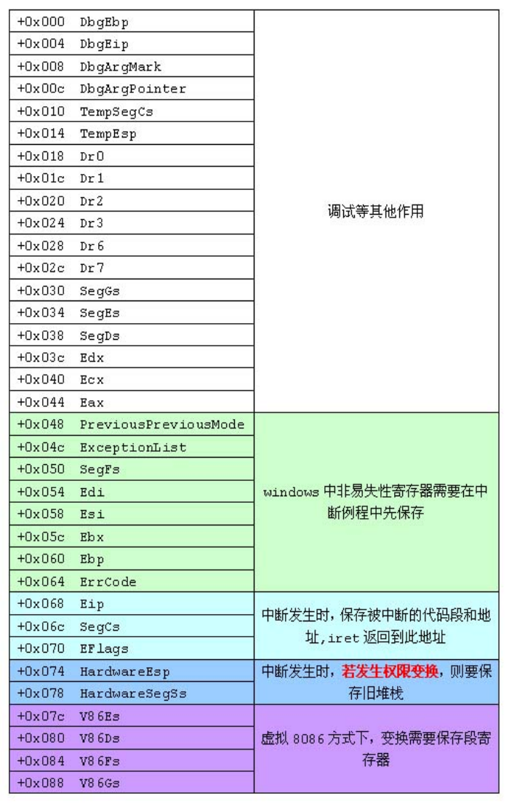

[toc]


# 001.API函数的调用过程(3环部分)

主要是存放在 C:\WINDOWS\system32 下面所有的dll


几个重要的DLL

- Kernel32.dll:最核心的功能模块，比如管理内存、进程和线程相关的函数等.
- User32.dll:是Windows用户界面相关应用程序接口,如创建窗口和发送消息等.
- GDI32.dll:全称是Graphical Device Interface(图形设备接口),包含用于画图和显示文本的函数.比如要显示一个程序窗口，就调用了其中的函数来画这个窗口.
- Ntdll.dll:大多数API都会通过这个DLL进入内核(0环).

alt+t直接搜就行，这里使用`ReadProcesMemory`来举例

首先是kernel32这个dll

可以看到是call了一个函数，之后巴拉巴拉，



调用的这个函数在ntdll这个dll里面，在import可以看到，他做了这些事：其中的`0BA`是一个编号，`7FFE0300`决定以什么方式进0环



> kernel32.dll(ReadProcessMemory) =>
>
> ntdll.dll(NtReadVirtualMemory)

# 002.API函数的调用过程(3环进0环 上)

下面说下这部分：


首先是`7FFE0300`这个地址

## _KUSER_SHARED_DATA

1. 在 User 层和 Kernel 层分别定义了一个 `_KUSER_SHARED_DATA` 结构区域，用于 User 层和 Kernel 层共享某些数据
2. 它们使用固定的地址值映射，`_KUSER_SHARED_DATA` 结构区域在 User 和 Kernel 层地址分别为：
   - User 层地址为：0x7ffe0000
   - Kernnel 层地址为：0xffdf0000

特别说明：

虽然指向的是同一个物理页，但在User 层是只读的，在Kernnel层是可写的.

可以看到两者都是一样的：



可以看到300的位置是系统调用：



## CPU是否支持快速调用

实验：是否支持快速调用

当通过`eax=1`来执行`cpuid`指令时，处理器的特征信息被放在`ecx`和`edx`寄存器中，其中`edx`包含了一个`SEP`位（11位），该位指明了当前处理器知否支持`sysenter/sysexit`指令

- 支持：ntdll.dll!KiFastSystemCall()
- 不支持：ntdll.dll!KiIntSystemCall()

eax置1后执行，发现是0xBFF，第11位是1，表示支持



当系统启动的时候，上述执行，之后将相应的函数放到偏移0x300的位置。

## 进R0需要更改哪些寄存器

1) CS的权限由3变为0，意味着需要新的CS

2) SS与CS的权限永远一致，需要新的SS

3) 权限发生切换的时候，堆栈也一定会切换，需要新的ESP

4) 进0环后代码的位置，需要EIP

--------

不支持的时候使用的是`ntdll.dll!KiIntSystemCall()`

将eax中的编号和edx(参数指针)，之后中断`0x2E`进入内核



支持快速调用的时候使用`ntdll.dll!KiFastSystemCall()`

也就2行代码：





中断门进0环，需要的CS、EIP在IDT表中，需要查内存(SS与ESP由TSS提供)而CPU如果支持sysenter指令时，操作系统会提前将CS/SS/ESP/EIP的值存储在MSR寄存器中，sysenter指令执行时，CPU会将MSR寄存器中的值直接写入相关寄存器，没有读内存的过程，所以叫快速调用，本质是一样的！


# 003.API函数的调用过程(3环进0环 下)

不支持快速调用的话就中断进0环，支持的话就sysenter，需要的寄存器信息(CS，SS,ESP,EIP)在`MSR`寄存器中可以找到：(ss在cs+8的位置)

| **MSR**           | **地址** |
| ----------------- | -------- |
| IA32_SYSENTER_CS  | 174H     |
| IA32_SYSENTER_ESP | 175H     |
| IA32_SYSENTER_EIP | 176H     |

可以通过RDMSR/WRMST来进行读写（操作系统使用WRMST写该寄存器）:

```sh
kd> rdmsr 174   //查看CS
kd> rdmsr 175   //查看ESP
kd> rdmsr 176   //查看EIP
> 参考：Intel白皮书第二卷(搜索sysenter)
```

```
kd> rdmsr 174
msr[174] = 00000000`00000008
kd> rdmsr 175
msr[175] = 00000000`f78af000
kd> rdmsr 176
msr[176] = 00000000`805426e0
kd> u 805426e0
ReadVirtual: 805426e0 not properly sign extended
805426e0 b923000000      mov     ecx,23h
805426e5 6a30            push    30h
805426e7 0fa1            pop     fs
805426e9 8ed9            mov     ds,cx
805426eb 8ec1            mov     es,cx
805426ed 648b0d40000000  mov     ecx,dword ptr fs:[40h]
805426f4 8b6104          mov     esp,dword ptr [ecx+4]
805426f7 6a23            push    23h
```

## 总结

API通过中断门进0环：

	1)  固定中断号为0x2E
	2)  CS/EIP由门描述符提供   ESP/SS由TSS提供
	3)  进入0环后执行的内核函数：NT!KiSystemService

API通过sysenter指令进0环：

	1)  CS/ESP/EIP由MSR寄存器提供(SS是算出来的)
	2)  进入0环后执行的内核函数：NT!KiFastCallEntry

内核模块：`ntoskrnl.exe/ntkrnlpa.exe`


# 004.API函数的调用过程(保存现场)

这里使用`KiSystemService`举例。

首先接收三个结构体：

## _Trap_Frame结构体

这个结构体在0环，由操作系统进行维护

无论是快速调用还是中断进0环都会将寄存器写到这个结构体里

```sh
kd> dt _ktrap_Frame
```



在中断进入0环的时候，会压入`0x068~0x078`的5个值，快速调用的 时候，这5个值是没有的。


## _ETHREAD线程相关的结构体


```
kd> dt _ETHREAD
ntdll!_ETHREAD
   +0x000 Tcb              : _KTHREAD
   +0x1c0 CreateTime       : _LARGE_INTEGER
   +0x1c0 NestedFaultCount : Pos 0, 2 Bits
   +0x1c0 ApcNeeded        : Pos 2, 1 Bit
   +0x1c8 ExitTime         : _LARGE_INTEGER
   +0x1c8 LpcReplyChain    : _LIST_ENTRY
   +0x1c8 KeyedWaitChain   : _LIST_ENTRY
   +0x1d0 ExitStatus       : Int4B
   +0x1d0 OfsChain         : Ptr32 Void
   +0x1d4 PostBlockList    : _LIST_ENTRY
   +0x1dc TerminationPort  : Ptr32 _TERMINATION_PORT
   +0x1dc ReaperLink       : Ptr32 _ETHREAD
   +0x1dc KeyedWaitValue   : Ptr32 Void
   +0x1e0 ActiveTimerListLock : Uint4B
   +0x1e4 ActiveTimerListHead : _LIST_ENTRY
   +0x1ec Cid              : _CLIENT_ID
   +0x1f4 LpcReplySemaphore : _KSEMAPHORE
   +0x1f4 KeyedWaitSemaphore : _KSEMAPHORE
   +0x208 LpcReplyMessage  : Ptr32 Void
   +0x208 LpcWaitingOnPort : Ptr32 Void
   +0x20c ImpersonationInfo : Ptr32 _PS_IMPERSONATION_INFORMATION
   +0x210 IrpList          : _LIST_ENTRY
   +0x218 TopLevelIrp      : Uint4B
   +0x21c DeviceToVerify   : Ptr32 _DEVICE_OBJECT
   +0x220 ThreadsProcess   : Ptr32 _EPROCESS
   +0x224 StartAddress     : Ptr32 Void
   +0x228 Win32StartAddress : Ptr32 Void
   +0x228 LpcReceivedMessageId : Uint4B
   +0x22c ThreadListEntry  : _LIST_ENTRY
   +0x234 RundownProtect   : _EX_RUNDOWN_REF
   +0x238 ThreadLock       : _EX_PUSH_LOCK
   +0x23c LpcReplyMessageId : Uint4B
   +0x240 ReadClusterSize  : Uint4B
   +0x244 GrantedAccess    : Uint4B
   +0x248 CrossThreadFlags : Uint4B
   +0x248 Terminated       : Pos 0, 1 Bit
   +0x248 DeadThread       : Pos 1, 1 Bit
   +0x248 HideFromDebugger : Pos 2, 1 Bit
   +0x248 ActiveImpersonationInfo : Pos 3, 1 Bit
   +0x248 SystemThread     : Pos 4, 1 Bit
   +0x248 HardErrorsAreDisabled : Pos 5, 1 Bit
   +0x248 BreakOnTermination : Pos 6, 1 Bit
   +0x248 SkipCreationMsg  : Pos 7, 1 Bit
   +0x248 SkipTerminationMsg : Pos 8, 1 Bit
   +0x24c SameThreadPassiveFlags : Uint4B
   +0x24c ActiveExWorker   : Pos 0, 1 Bit
   +0x24c ExWorkerCanWaitUser : Pos 1, 1 Bit
   +0x24c MemoryMaker      : Pos 2, 1 Bit
   +0x250 SameThreadApcFlags : Uint4B
   +0x250 LpcReceivedMsgIdValid : Pos 0, 1 Bit
   +0x250 LpcExitThreadCalled : Pos 1, 1 Bit
   +0x250 AddressSpaceOwner : Pos 2, 1 Bit
   +0x254 ForwardClusterOnly : UChar
   +0x255 DisablePageFaultClustering : UChar
```

里面有个`_KTHREAD`

```
kd> dt _KTHREAD
ntdll!_KTHREAD
   +0x000 Header           : _DISPATCHER_HEADER
   +0x010 MutantListHead   : _LIST_ENTRY
   +0x018 InitialStack     : Ptr32 Void
   +0x01c StackLimit       : Ptr32 Void
   +0x020 Teb              : Ptr32 Void
   +0x024 TlsArray         : Ptr32 Void
   +0x028 KernelStack      : Ptr32 Void
   +0x02c DebugActive      : UChar
   +0x02d State            : UChar
   +0x02e Alerted          : [2] UChar
   +0x030 Iopl             : UChar
   +0x031 NpxState         : UChar
   +0x032 Saturation       : Char
   +0x033 Priority         : Char
   +0x034 ApcState         : _KAPC_STATE
   +0x04c ContextSwitches  : Uint4B
   +0x050 IdleSwapBlock    : UChar
   +0x051 Spare0           : [3] UChar
   +0x054 WaitStatus       : Int4B
   +0x058 WaitIrql         : UChar
   +0x059 WaitMode         : Char
   +0x05a WaitNext         : UChar
   +0x05b WaitReason       : UChar
   +0x05c WaitBlockList    : Ptr32 _KWAIT_BLOCK
   +0x060 WaitListEntry    : _LIST_ENTRY
   +0x060 SwapListEntry    : _SINGLE_LIST_ENTRY
   +0x068 WaitTime         : Uint4B
   +0x06c BasePriority     : Char
   +0x06d DecrementCount   : UChar
   +0x06e PriorityDecrement : Char
   +0x06f Quantum          : Char
   +0x070 WaitBlock        : [4] _KWAIT_BLOCK
   +0x0d0 LegoData         : Ptr32 Void
   +0x0d4 KernelApcDisable : Uint4B
   +0x0d8 UserAffinity     : Uint4B
   +0x0dc SystemAffinityActive : UChar
   +0x0dd PowerState       : UChar
   +0x0de NpxIrql          : UChar
   +0x0df InitialNode      : UChar
   +0x0e0 ServiceTable     : Ptr32 Void
   +0x0e4 Queue            : Ptr32 _KQUEUE
   +0x0e8 ApcQueueLock     : Uint4B
   +0x0f0 Timer            : _KTIMER
   +0x118 QueueListEntry   : _LIST_ENTRY
   +0x120 SoftAffinity     : Uint4B
   +0x124 Affinity         : Uint4B
   +0x128 Preempted        : UChar
   +0x129 ProcessReadyQueue : UChar
   +0x12a KernelStackResident : UChar
   +0x12b NextProcessor    : UChar
   +0x12c CallbackStack    : Ptr32 Void
   +0x130 Win32Thread      : Ptr32 Void
   +0x134 TrapFrame        : Ptr32 _KTRAP_FRAME
   +0x138 ApcStatePointer  : [2] Ptr32 _KAPC_STATE
   +0x140 PreviousMode     : Char
   +0x141 EnableStackSwap  : UChar
   +0x142 LargeStack       : UChar
   +0x143 ResourceIndex    : UChar
   +0x144 KernelTime       : Uint4B
   +0x148 UserTime         : Uint4B
   +0x14c SavedApcState    : _KAPC_STATE
   +0x164 Alertable        : UChar
   +0x165 ApcStateIndex    : UChar
   +0x166 ApcQueueable     : UChar
   +0x167 AutoAlignment    : UChar
   +0x168 StackBase        : Ptr32 Void
   +0x16c SuspendApc       : _KAPC
   +0x19c SuspendSemaphore : _KSEMAPHORE
   +0x1b0 ThreadListEntry  : _LIST_ENTRY
   +0x1b8 FreezeCount      : Char
   +0x1b9 SuspendCount     : Char
   +0x1ba IdealProcessor   : UChar
   +0x1bb DisableBoost     : UChar

```


## _KPCR

KPCR  叫CPU控制区（Processor Control Region）

CPU也有自己的控制块，每一个CPU有一个，叫KPCR


```
kd> dt _KPCR
nt!_KPCR
   +0x000 NtTib            : _NT_TIB
   +0x01c SelfPcr          : Ptr32 _KPCR
   +0x020 Prcb             : Ptr32 _KPRCB
   +0x024 Irql             : UChar
   +0x028 IRR              : Uint4B
   +0x02c IrrActive        : Uint4B
   +0x030 IDR              : Uint4B
   +0x034 KdVersionBlock   : Ptr32 Void
   +0x038 IDT              : Ptr32 _KIDTENTRY
   +0x03c GDT              : Ptr32 _KGDTENTRY
   +0x040 TSS              : Ptr32 _KTSS
   +0x044 MajorVersion     : Uint2B
   +0x046 MinorVersion     : Uint2B
   +0x048 SetMember        : Uint4B
   +0x04c StallScaleFactor : Uint4B
   +0x050 DebugActive      : UChar
   +0x051 Number           : UChar
   +0x052 Spare0           : UChar
   +0x053 SecondLevelCacheAssociativity : UChar
   +0x054 VdmAlert         : Uint4B
   +0x058 KernelReserved   : [14] Uint4B
   +0x090 SecondLevelCacheSize : Uint4B
   +0x094 HalReserved      : [16] Uint4B
   +0x0d4 InterruptMode    : Uint4B
   +0x0d8 Spare1           : UChar
   +0x0dc KernelReserved2  : [17] Uint4B
   +0x120 PrcbData         : _KPRCB
```

## 逆向分析 KiSystemService


```asm
.text:004067D1 _KiSystemService proc near              ; CODE XREF: ZwAcceptConnectPort(x,x,x,x,x,x)+C↓p
.text:004067D1                                         ; ZwAccessCheck(x,x,x,x,x,x,x,x)+C↓p ...
.text:004067D1
.text:004067D1 arg_0           = dword ptr  4
.text:004067D1
.text:004067D1                 push    0
.text:004067D3                 push    ebp             ; push的0是压入0x064 ErrCode的位置
.text:004067D4                 push    ebx             ; +0x05c Ebx
.text:004067D5                 push    esi             ; +0x058 Esi
.text:004067D6                 push    edi             ; +0x054 Edi
.text:004067D7                 push    fs              ; +0x050 SegFs
.text:004067D9                 mov     ebx, 30h ; '0'  ; 为FS寄存器赋值，指向KPCR结构体
.text:004067DE                 mov     fs, ebx         ; 将段选择子0x30查询GDT这张表，找到对应的段描述符，把段描述符加载到FS寄存器
.text:004067DE                                         ;
.text:004067DE                                         ; 0x30: // 0011 0000
.text:004067DE                                         ; 索引为6的段描述符，查GDT表
.text:004067DE                                         ; 本机中idx为6的值：ffc093df`f0000001
.text:004067DE                                         ; fs.base = ffdff000，指向当前CPU的KPCR结构
.text:004067E0                 push    large dword ptr fs:0 ; 保存旧的 ExceptionList，然后把新的清成-1
.text:004067E7                 mov     large dword ptr fs:0, 0FFFFFFFFh
.text:004067F2                 mov     esi, large fs:124h ; esi 指向 CurrentThread，当前CPU所执行线程的_ETHREAD
.text:004067F9                 push    dword ptr [esi+140h] ; 保存 CurrentThread.PreviousMode(先前模式)
.text:004067F9                                         ; PreviousMode = 0 表示从0环调用过来
.text:004067F9                                         ; PreviousMode = 1 表示从3环调用过来
.text:004067FF                 sub     esp, 48h        ; esp 指向 _KTRAP_FRAME
.text:00406802                 mov     ebx, [esp+68h+arg_0] ; 取出esp+0x6C,也就是3环压入的参数CS
.text:00406806                 and     ebx, 1          ; 0环最低位为0,3环最低位为1
.text:00406809                 mov     [esi+140h], bl  ; 填写新的“先前模式”
.text:0040680F                 mov     ebp, esp        ; ESP == EBP ==_KTRAP_FRAME
.text:00406811                 mov     ebx, [esi+134h] ; EBX现在是_KTRAP_FRAME
.text:00406817                 mov     [ebp+3Ch], ebx  ; 将_KTRAP_FRAME中的TrapFrame暂时存到这里，之后
.text:00406817                                         ; mov     edx, [ebp+3Ch]
.text:00406817                                         ; 会将这个值取出来重新赋给_KTRAP_FRAME的TrapFrame
.text:0040681A                 mov     [esi+134h], ebp ; CurrentThread.TrapFrame 指向当前 _KTRAP_FRAME
.text:00406820                 cld                     ; 将标志寄存器Flag的方向标志位DF清零
.text:00406821                 mov     ebx, [ebp+60h]  ;  3环ebp
.text:00406824                 mov     edi, [ebp+68h]  ; 3环eip
.text:00406827                 mov     [ebp+0Ch], edx  ; _KTRAP_FRAME.DbgArgPointer = edx
.text:00406827                                         ; 这一步是保存3环API参数指针
.text:0040682A                 mov     dword ptr [ebp+8], 0BADB0D00h
.text:00406831                 mov     [ebp+0], ebx    ; _KTRAP_FRAME.DbgEbp = _KTRAP_FRAME.Ebp
.text:00406834                 mov     [ebp+4], edi    ; _KTRAP_FRAME.DbgEip = _KTRAP_FRAME.Eip
.text:00406837                 test    byte ptr [esi+2Ch], 0FFh
.text:0040683B                 jnz     Dr_kss_a        ; 测试 CurrentThread.DebugActive
.text:0040683B                                         ; 如果正被调试，保存调试相关的寄存器到 _KTRAP_FRAME
.text:00406841
.text:00406841 loc_406841:                             ; CODE XREF: Dr_kss_a+10↑j
.text:00406841                                         ; Dr_kss_a+7C↑j
.text:00406841                 sti                     ; 允许中断
.text:00406842                 jmp     loc_406932
.text:00406842 _KiSystemService endp
```

