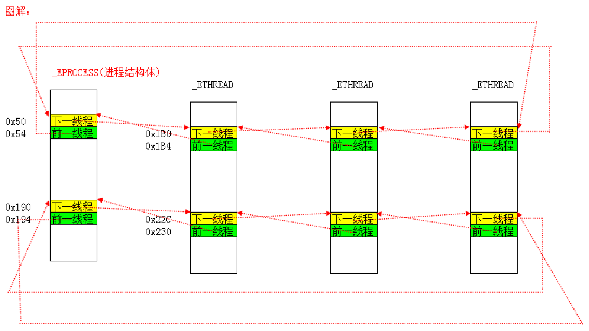

[toc]

> [进程&线程](https://blog.csdn.net/qq_41490873/category_8987386.html)
>
> [滴水中级上](https://blog.csdn.net/qq_41490873/category_9930822.html)

# 001.进程结构体

每个windows进程在0环都有一个对应的结构体：`EPROCESS` ，这个结构体包含了进程所有重要的信息。

## EPROCESS

```c
kd> dt _EPROCESS
ntdll!_EPROCESS
   +0x000 Pcb              : _KPROCESS
   +0x06c ProcessLock      : _EX_PUSH_LOCK
   +0x070 CreateTime       : _LARGE_INTEGER//进程的创建时间
   +0x078 ExitTime         : _LARGE_INTEGER//进程的退出时间
   +0x080 RundownProtect   : _EX_RUNDOWN_REF
   +0x084 UniqueProcessId  : Ptr32 Void//进程的编号 任务管理器中的PID
   +0x088 ActiveProcessLinks : _LIST_ENTRY//双向链表 所有的活动进程都连接在一起，构成了一个链表
										  //PsActiveProcessHead指向全局链表头，链的位置是0x88的位置
   +0x090 QuotaUsage       : [3] Uint4B//物理页相关的统计信息
   +0x09c QuotaPeak        : [3] Uint4B//物理页相关的统计信息
   +0x0a8 CommitCharge     : Uint4B//虚拟内存相关的统计信息
   +0x0ac PeakVirtualSize  : Uint4B//虚拟内存相关的统计信息
   +0x0b0 VirtualSize      : Uint4B//虚拟内存相关的统计信息
   +0x0b4 SessionProcessLinks : _LIST_ENTRY//可以通过这个链表，遍历到所有进程。 这个是无法隐藏的，隐藏了系统无法管理到该进程。
   +0x0bc DebugPort        : Ptr32 Void//调试相关
   +0x0c0 ExceptionPort    : Ptr32 Void//调试相关
   +0x0c4 ObjectTable      : Ptr32 _HANDLE_TABLE//句柄表
   +0x0c8 Token            : _EX_FAST_REF
   +0x0cc WorkingSetLock   : _FAST_MUTEX
   +0x0ec WorkingSetPage   : Uint4B
   +0x0f0 AddressCreationLock : _FAST_MUTEX
   +0x110 HyperSpaceLock   : Uint4B
   +0x114 ForkInProgress   : Ptr32 _ETHREAD
   +0x118 HardwareTrigger  : Uint4B
   +0x11c VadRoot          : Ptr32 Void//标识0-2G哪些地址没占用了
   +0x120 VadHint          : Ptr32 Void
   +0x124 CloneRoot        : Ptr32 Void
   +0x128 NumberOfPrivatePages : Uint4B
   +0x12c NumberOfLockedPages : Uint4B
   +0x130 Win32Process     : Ptr32 Void
   +0x134 Job              : Ptr32 _EJOB
   +0x138 SectionObject    : Ptr32 Void
   +0x13c SectionBaseAddress : Ptr32 Void
   +0x140 QuotaBlock       : Ptr32 _EPROCESS_QUOTA_BLOCK
   +0x144 WorkingSetWatch  : Ptr32 _PAGEFAULT_HISTORY
   +0x148 Win32WindowStation : Ptr32 Void
   +0x14c InheritedFromUniqueProcessId : Ptr32 Void
   +0x150 LdtInformation   : Ptr32 Void
   +0x154 VadFreeHint      : Ptr32 Void
   +0x158 VdmObjects       : Ptr32 Void
   +0x15c DeviceMap        : Ptr32 Void
   +0x160 PhysicalVadList  : _LIST_ENTRY
   +0x168 PageDirectoryPte : _HARDWARE_PTE_X86
   +0x168 Filler           : Uint8B
   +0x170 Session          : Ptr32 Void
   +0x174 ImageFileName    : [16] UChar//进程镜像文件名 最多16个字节
   +0x184 JobLinks         : _LIST_ENTRY
   +0x18c LockedPagesList  : Ptr32 Void
   +0x190 ThreadListHead   : _LIST_ENTRY
   +0x198 SecurityPort     : Ptr32 Void
   +0x19c PaeTop           : Ptr32 Void
   +0x1a0 ActiveThreads    : Uint4B//活动线程的数量
   +0x1a4 GrantedAccess    : Uint4B
   +0x1a8 DefaultHardErrorProcessing : Uint4B
   +0x1ac LastThreadExitStatus : Int4B
   +0x1b0 Peb              : Ptr32 _PEB//PEB((Process Environment Block 进程环境块)：进程在3环的一个结构体，里面包含了进程的模块列表、是否处于调试状态等信息。
   +0x1b4 PrefetchTrace    : _EX_FAST_REF
   +0x1b8 ReadOperationCount : _LARGE_INTEGER
   +0x1c0 WriteOperationCount : _LARGE_INTEGER
   +0x1c8 OtherOperationCount : _LARGE_INTEGER
   +0x1d0 ReadTransferCount : _LARGE_INTEGER
   +0x1d8 WriteTransferCount : _LARGE_INTEGER
   +0x1e0 OtherTransferCount : _LARGE_INTEGER
   +0x1e8 CommitChargeLimit : Uint4B
   +0x1ec CommitChargePeak : Uint4B
   +0x1f0 AweInfo          : Ptr32 Void
   +0x1f4 SeAuditProcessCreationInfo : _SE_AUDIT_PROCESS_CREATION_INFO
   +0x1f8 Vm               : _MMSUPPORT
   +0x238 LastFaultCount   : Uint4B
   +0x23c ModifiedPageCount : Uint4B
   +0x240 NumberOfVads     : Uint4B
   +0x244 JobStatus        : Uint4B
   +0x248 Flags            : Uint4B
   +0x248 CreateReported   : Pos 0, 1 Bit
   +0x248 NoDebugInherit   : Pos 1, 1 Bit
   +0x248 ProcessExiting   : Pos 2, 1 Bit
   +0x248 ProcessDelete    : Pos 3, 1 Bit
   +0x248 Wow64SplitPages  : Pos 4, 1 Bit
   +0x248 VmDeleted        : Pos 5, 1 Bit
   +0x248 OutswapEnabled   : Pos 6, 1 Bit
   +0x248 Outswapped       : Pos 7, 1 Bit
   +0x248 ForkFailed       : Pos 8, 1 Bit
   +0x248 HasPhysicalVad   : Pos 9, 1 Bit
   +0x248 AddressSpaceInitialized : Pos 10, 2 Bits
   +0x248 SetTimerResolution : Pos 12, 1 Bit
   +0x248 BreakOnTermination : Pos 13, 1 Bit
   +0x248 SessionCreationUnderway : Pos 14, 1 Bit
   +0x248 WriteWatch       : Pos 15, 1 Bit
   +0x248 ProcessInSession : Pos 16, 1 Bit
   +0x248 OverrideAddressSpace : Pos 17, 1 Bit
   +0x248 HasAddressSpace  : Pos 18, 1 Bit
   +0x248 LaunchPrefetched : Pos 19, 1 Bit
   +0x248 InjectInpageErrors : Pos 20, 1 Bit
   +0x248 VmTopDown        : Pos 21, 1 Bit
   +0x248 Unused3          : Pos 22, 1 Bit
   +0x248 Unused4          : Pos 23, 1 Bit
   +0x248 VdmAllowed       : Pos 24, 1 Bit
   +0x248 Unused           : Pos 25, 5 Bits
   +0x248 Unused1          : Pos 30, 1 Bit
   +0x248 Unused2          : Pos 31, 1 Bit
   +0x24c ExitStatus       : Int4B
   +0x250 NextPageColor    : Uint2B
   +0x252 SubSystemMinorVersion : UChar
   +0x253 SubSystemMajorVersion : UChar
   +0x252 SubSystemVersion : Uint2B
   +0x254 PriorityClass    : UChar
   +0x255 WorkingSetAcquiredUnsafe : UChar
   +0x258 Cookie           : Uint4B

```

## KPROCESS

```c
kd> dt _KPROCESS
ntdll!_KPROCESS
   +0x000 Header           : _DISPATCHER_HEADER //"可等待对象"，有这个成员就可以被WaitForSingleObject等待
   +0x010 ProfileListHead  : _LIST_ENTRY //性能分析
   +0x018 DirectoryTableBase : [2] Uint4B//页目录表基址，DirectoryTableBase[0] cr3 DirectoryTableBase[1] 超过4GE后的cr3
   +0x020 LdtDescriptor    : _KGDTENTRY
   +0x028 Int21Descriptor  : _KIDTENTRY
   +0x030 IopmOffset       : Uint2B
   +0x032 Iopl             : UChar
   +0x033 Unused           : UChar
   +0x034 ActiveProcessors : Uint4B
   +0x038 KernelTime       : Uint4B//记录一个进程在内核模式下花的时间
   +0x03c UserTime         : Uint4B//记录一个进程在用户模式下花的时间
   +0x040 ReadyListHead    : _LIST_ENTRY
   +0x048 SwapListEntry    : _SINGLE_LIST_ENTRY
   +0x04c VdmTrapcHandler  : Ptr32 Void
   +0x050 ThreadListHead   : _LIST_ENTRY
   +0x058 ProcessLock      : Uint4B
   +0x05c Affinity         : Uint4B//指定哪一个CPU来运行这个进程
    //如果值为1，那这个进程的所以线程只能在0号CPU上跑(00000001)				
    //如果值为3，那这个进程的所以线程能在0、1号CPU上跑(000000011)	
    //如果值为4，那这个进程的所以线程能在2号CPU上跑(000000100)	
    //如果值为5，那这个进程的所以线程能在0，2号CPU上跑(000000101)	
    //4个字节共32位  所以最多32核 Windows64位 就64核			
    //如果只有一个CPU 把这个设置为4 那么这个进程就死了
   +0x060 StackCount       : Uint2B
   +0x062 BasePriority     : Char//基础优先级或最低优先级，该进程中的所有线程最起码的优先级
   +0x063 ThreadQuantum    : Char
   +0x064 AutoAlignment    : UChar
   +0x065 State            : UChar
   +0x066 ThreadSeed       : UChar
   +0x067 DisableBoost     : UChar
   +0x068 PowerState       : UChar
   +0x069 DisableQuantum   : UChar
   +0x06a IdealNode        : UChar
   +0x06b Flags            : _KEXECUTE_OPTIONS
   +0x06b ExecuteOptions   : UChar
```

## 通过进程结构体遍历所有的进程

```c
	ULONG ProcessListHead=0;
	PLIST_ENTRY pListHead;
	PLIST_ENTRY pListNext;
	__asm{
	
		mov eax,fs:124h
		mov ebx,[eax+220h]  //得到线程结构体
		mov ProcessListHead,ebx
	}

	pListHead=(PLIST_ENTRY)(ProcessListHead+0x88);
	pListNext=pListHead;
	
	do
	{
	
		DbgPrint("ImageFileName=%s\n",(PULONG)pListNext-0x88/4+0x174/4);
		
		pListNext=pListNext->Flink;
	}while(pListHead!=pListNext);

```


# 002.线程结构体

每个windows线程在0环都有一个对应的结构体：ETHREAD  这个结构体包含了线程所有重要的信息。


## KTHREAD

```c
kd> dt _KTHREAD
ntdll!_KTHREAD
   +0x000 Header           : _DISPATCHER_HEADER//可等待对象
   +0x010 MutantListHead   : _LIST_ENTRY//互斥体对象链表
   +0x018 InitialStack     : Ptr32 Void//线程切换相关
   +0x01c StackLimit       : Ptr32 Void//线程切换相关
   +0x020 Teb              : Ptr32 Void
        //TEB，Thread Environment Block，线程环境块。
        //大小4KB,位于用户地址空间。
        //FS:[0] -> TEB(3环时  0环时FS执行KPCR)

   +0x024 TlsArray         : Ptr32 Void
   +0x028 KernelStack      : Ptr32 Void//线程切换相关
   +0x02c DebugActive      : UChar//如果值为-1 不能使用调试寄存器：Dr0 - Dr7
   +0x02d State            : UChar//线程状态：就绪、等待还是运行
   +0x02e Alerted          : [2] UChar
   +0x030 Iopl             : UChar
   +0x031 NpxState         : UChar
   +0x032 Saturation       : Char
   +0x033 Priority         : Char
   +0x034 ApcState         : _KAPC_STATE//APC相关
   +0x04c ContextSwitches  : Uint4B
   +0x050 IdleSwapBlock    : UChar
   +0x051 Spare0           : [3] UChar
   +0x054 WaitStatus       : Int4B
   +0x058 WaitIrql         : UChar
   +0x059 WaitMode         : Char
   +0x05a WaitNext         : UChar
   +0x05b WaitReason       : UChar
   +0x05c WaitBlockList    : Ptr32 _KWAIT_BLOCK
   +0x060 WaitListEntry    : _LIST_ENTRY
   +0x060 SwapListEntry    : _SINGLE_LIST_ENTRY
   +0x068 WaitTime         : Uint4B
   +0x06c BasePriority     : Char//其初始值是所属进程的BasePriority值(KPROCESS->BasePriority)，以后可以通过KeSetBasePriorityThread()函数重新设定
   +0x06d DecrementCount   : UChar
   +0x06e PriorityDecrement : Char
   +0x06f Quantum          : Char
   +0x070 WaitBlock        : [4] _KWAIT_BLOCK//等待哪个对象（WaitForSingleObject）
   +0x0d0 LegoData         : Ptr32 Void
   +0x0d4 KernelApcDisable : Uint4B
   +0x0d8 UserAffinity     : Uint4B
   +0x0dc SystemAffinityActive : UChar
   +0x0dd PowerState       : UChar
   +0x0de NpxIrql          : UChar
   +0x0df InitialNode      : UChar
   +0x0e0 ServiceTable     : Ptr32 Void//指向系统服务表基址
   +0x0e4 Queue            : Ptr32 _KQUEUE
   +0x0e8 ApcQueueLock     : Uint4B//APC相关
   +0x0f0 Timer            : _KTIMER
   +0x118 QueueListEntry   : _LIST_ENTRY
   +0x120 SoftAffinity     : Uint4B
   +0x124 Affinity         : Uint4B
   +0x128 Preempted        : UChar
   +0x129 ProcessReadyQueue : UChar
   +0x12a KernelStackResident : UChar
   +0x12b NextProcessor    : UChar
   +0x12c CallbackStack    : Ptr32 Void
   +0x130 Win32Thread      : Ptr32 Void
   +0x134 TrapFrame        : Ptr32 _KTRAP_FRAME//进0环时保存环境
   +0x138 ApcStatePointer  : [2] Ptr32 _KAPC_STATE
   +0x140 PreviousMode     : Char//某些内核函数会判断程序是0环调用还是3环调用的
   +0x141 EnableStackSwap  : UChar
   +0x142 LargeStack       : UChar
   +0x143 ResourceIndex    : UChar
   +0x144 KernelTime       : Uint4B
   +0x148 UserTime         : Uint4B
   +0x14c SavedApcState    : _KAPC_STATE//APC相关
   +0x164 Alertable        : UChar
   +0x165 ApcStateIndex    : UChar
   +0x166 ApcQueueable     : UChar
   +0x167 AutoAlignment    : UChar
   +0x168 StackBase        : Ptr32 Void
   +0x16c SuspendApc       : _KAPC
   +0x19c SuspendSemaphore : _KSEMAPHORE
   +0x1b0 ThreadListEntry  : _LIST_ENTRY//双向链表，一个进程所有的线程都挂在一个链表中，挂的就是这个位置（这是第一个）
   +0x1b8 FreezeCount      : Char
   +0x1b9 SuspendCount     : Char
   +0x1ba IdealProcessor   : UChar
   +0x1bb DisableBoost     : UChar
```


## ETHREAD


```c
kd> dt _ETHREAD
ntdll!_ETHREAD
   +0x000 Tcb              : _KTHREAD
   +0x1c0 CreateTime       : _LARGE_INTEGER
   +0x1c0 NestedFaultCount : Pos 0, 2 Bits
   +0x1c0 ApcNeeded        : Pos 2, 1 Bit
   +0x1c8 ExitTime         : _LARGE_INTEGER
   +0x1c8 LpcReplyChain    : _LIST_ENTRY
   +0x1c8 KeyedWaitChain   : _LIST_ENTRY
   +0x1d0 ExitStatus       : Int4B
   +0x1d0 OfsChain         : Ptr32 Void
   +0x1d4 PostBlockList    : _LIST_ENTRY
   +0x1dc TerminationPort  : Ptr32 _TERMINATION_PORT
   +0x1dc ReaperLink       : Ptr32 _ETHREAD
   +0x1dc KeyedWaitValue   : Ptr32 Void
   +0x1e0 ActiveTimerListLock : Uint4B
   +0x1e4 ActiveTimerListHead : _LIST_ENTRY
   +0x1ec Cid              : _CLIENT_ID//进程ID、线程ID
   +0x1f4 LpcReplySemaphore : _KSEMAPHORE
   +0x1f4 KeyedWaitSemaphore : _KSEMAPHORE
   +0x208 LpcReplyMessage  : Ptr32 Void
   +0x208 LpcWaitingOnPort : Ptr32 Void
   +0x20c ImpersonationInfo : Ptr32 _PS_IMPERSONATION_INFORMATION
   +0x210 IrpList          : _LIST_ENTRY
   +0x218 TopLevelIrp      : Uint4B
   +0x21c DeviceToVerify   : Ptr32 _DEVICE_OBJECT
   +0x220 ThreadsProcess   : Ptr32 _EPROCESS//指向自己所属进程
   +0x224 StartAddress     : Ptr32 Void
   +0x228 Win32StartAddress : Ptr32 Void
   +0x228 LpcReceivedMessageId : Uint4B
   +0x22c ThreadListEntry  : _LIST_ENTRY//双向链表 一个进程所有的线程 都挂在一个链表中 挂的就是这个位置（这是第二个）
   +0x234 RundownProtect   : _EX_RUNDOWN_REF
   +0x238 ThreadLock       : _EX_PUSH_LOCK
   +0x23c LpcReplyMessageId : Uint4B
   +0x240 ReadClusterSize  : Uint4B
   +0x244 GrantedAccess    : Uint4B
   +0x248 CrossThreadFlags : Uint4B
   +0x248 Terminated       : Pos 0, 1 Bit
   +0x248 DeadThread       : Pos 1, 1 Bit
   +0x248 HideFromDebugger : Pos 2, 1 Bit
   +0x248 ActiveImpersonationInfo : Pos 3, 1 Bit
   +0x248 SystemThread     : Pos 4, 1 Bit
   +0x248 HardErrorsAreDisabled : Pos 5, 1 Bit
   +0x248 BreakOnTermination : Pos 6, 1 Bit
   +0x248 SkipCreationMsg  : Pos 7, 1 Bit
   +0x248 SkipTerminationMsg : Pos 8, 1 Bit
   +0x24c SameThreadPassiveFlags : Uint4B
   +0x24c ActiveExWorker   : Pos 0, 1 Bit
   +0x24c ExWorkerCanWaitUser : Pos 1, 1 Bit
   +0x24c MemoryMaker      : Pos 2, 1 Bit
   +0x250 SameThreadApcFlags : Uint4B
   +0x250 LpcReceivedMsgIdValid : Pos 0, 1 Bit
   +0x250 LpcExitThreadCalled : Pos 1, 1 Bit
   +0x250 AddressSpaceOwner : Pos 2, 1 Bit
   +0x254 ForwardClusterOnly : UChar
   +0x255 DisablePageFaultClustering : UChar

```





# 003.KPCR


1. KPCR结构体是CPU临时记录线程信息的一个结构体
2. KPCR是CPU快速查找线程信息用的，自己在上面做不了什么事情。
3. 当线程进入0环时，FS:[0]指向KPCR(3环时FS:[0] -> TEB)
4. 每个CPU都有一个KPCR结构体(一个核一个)
5. KPCR中存储了CPU本身要用的一些重要数据：GDT、IDT以及线程相关的一些信息。
6. FS寄存器在三环时，记录的是TEB结构的地址。
   在0环时，记录的是KPCR的地址。

## KPCR

```c
kd> dt _KPCR
nt!_KPCR
   +0x000 NtTib            : _NT_TIB
   +0x01c SelfPcr          : Ptr32 _KPCR//指向自己，方便寻址
   +0x020 Prcb             : Ptr32 _KPRCB//指向拓展结构体PRCB  
   +0x024 Irql             : UChar
   +0x028 IRR              : Uint4B
   +0x02c IrrActive        : Uint4B
   +0x030 IDR              : Uint4B
   +0x034 KdVersionBlock   : Ptr32 Void
   +0x038 IDT              : Ptr32 _KIDTENTRY//IDT表基址
   +0x03c GDT              : Ptr32 _KGDTENTRY//GDT表基址
   +0x040 TSS              : Ptr32 _KTSS//指针，指向TSS，每个CPU都有一个TSS
   +0x044 MajorVersion     : Uint2B
   +0x046 MinorVersion     : Uint2B
   +0x048 SetMember        : Uint4B
   +0x04c StallScaleFactor : Uint4B
   +0x050 DebugActive      : UChar
   +0x051 Number           : UChar//CPU编号：0 1 2 3 4 5。。。
   +0x052 Spare0           : UChar
   +0x053 SecondLevelCacheAssociativity : UChar
   +0x054 VdmAlert         : Uint4B
   +0x058 KernelReserved   : [14] Uint4B
   +0x090 SecondLevelCacheSize : Uint4B
   +0x094 HalReserved      : [16] Uint4B
   +0x0d4 InterruptMode    : Uint4B
   +0x0d8 Spare1           : UChar
   +0x0dc KernelReserved2  : [17] Uint4B
   +0x120 PrcbData         : _KPRCB//拓展结构体
```

## NT_TIB

```c
kd> dt _NT_TIB
ntdll!_NT_TIB
   +0x000 ExceptionList    : Ptr32 _EXCEPTION_REGISTRATION_RECORD//当前线程内核异常链表(SEH)
   +0x004 StackBase        : Ptr32 Void//当前线程内核栈的基址
   +0x008 StackLimit       : Ptr32 Void//当前线程内核栈的大小
   +0x00c SubSystemTib     : Ptr32 Void
   +0x010 FiberData        : Ptr32 Void
   +0x010 Version          : Uint4B
   +0x014 ArbitraryUserPointer : Ptr32 Void
   +0x018 Self             : Ptr32 _NT_TIB//指向自己(也就是指向KPCR结构) 
```


## KPRCB


```c
kd> dt _KPRCB
ntdll!_KPRCB
   +0x000 MinorVersion     : Uint2B
   +0x002 MajorVersion     : Uint2B
   +0x004 CurrentThread    : Ptr32 _KTHREAD//当前线程
   +0x008 NextThread       : Ptr32 _KTHREAD//即将切换的下一个线程
   +0x00c IdleThread       : Ptr32 _KTHREAD//空闲线程
   +0x010 Number           : Char
   +0x011 Reserved         : Char
   +0x012 BuildType        : Uint2B
   +0x014 SetMember        : Uint4B
   +0x018 CpuType          : Char
   +0x019 CpuID            : Char
   +0x01a CpuStep          : Uint2B
   +0x01c ProcessorState   : _KPROCESSOR_STATE
   +0x33c KernelReserved   : [16] Uint4B
   +0x37c HalReserved      : [16] Uint4B
   +0x3bc PrcbPad0         : [92] UChar
   +0x418 LockQueue        : [16] _KSPIN_LOCK_QUEUE
   +0x498 PrcbPad1         : [8] UChar
   +0x4a0 NpxThread        : Ptr32 _KTHREAD
   +0x4a4 InterruptCount   : Uint4B
   +0x4a8 KernelTime       : Uint4B
   +0x4ac UserTime         : Uint4B
   +0x4b0 DpcTime          : Uint4B
   +0x4b4 DebugDpcTime     : Uint4B
   +0x4b8 InterruptTime    : Uint4B
   +0x4bc AdjustDpcThreshold : Uint4B
   +0x4c0 PageColor        : Uint4B
   +0x4c4 SkipTick         : Uint4B
   +0x4c8 MultiThreadSetBusy : UChar
   +0x4c9 Spare2           : [3] UChar
   +0x4cc ParentNode       : Ptr32 _KNODE
   +0x4d0 MultiThreadProcessorSet : Uint4B
   +0x4d4 MultiThreadSetMaster : Ptr32 _KPRCB
   +0x4d8 ThreadStartCount : [2] Uint4B
   +0x4e0 CcFastReadNoWait : Uint4B
   +0x4e4 CcFastReadWait   : Uint4B
   +0x4e8 CcFastReadNotPossible : Uint4B
   +0x4ec CcCopyReadNoWait : Uint4B
   +0x4f0 CcCopyReadWait   : Uint4B
   +0x4f4 CcCopyReadNoWaitMiss : Uint4B
   +0x4f8 KeAlignmentFixupCount : Uint4B
   +0x4fc KeContextSwitches : Uint4B
   +0x500 KeDcacheFlushCount : Uint4B
   +0x504 KeExceptionDispatchCount : Uint4B
   +0x508 KeFirstLevelTbFills : Uint4B
   +0x50c KeFloatingEmulationCount : Uint4B
   +0x510 KeIcacheFlushCount : Uint4B
   +0x514 KeSecondLevelTbFills : Uint4B
   +0x518 KeSystemCalls    : Uint4B
   +0x51c SpareCounter0    : [1] Uint4B
   +0x520 PPLookasideList  : [16] _PP_LOOKASIDE_LIST
   +0x5a0 PPNPagedLookasideList : [32] _PP_LOOKASIDE_LIST
   +0x6a0 PPPagedLookasideList : [32] _PP_LOOKASIDE_LIST
   +0x7a0 PacketBarrier    : Uint4B
   +0x7a4 ReverseStall     : Uint4B
   +0x7a8 IpiFrame         : Ptr32 Void
   +0x7ac PrcbPad2         : [52] UChar
   +0x7e0 CurrentPacket    : [3] Ptr32 Void
   +0x7ec TargetSet        : Uint4B
   +0x7f0 WorkerRoutine    : Ptr32     void 
   +0x7f4 IpiFrozen        : Uint4B
   +0x7f8 PrcbPad3         : [40] UChar
   +0x820 RequestSummary   : Uint4B
   +0x824 SignalDone       : Ptr32 _KPRCB
   +0x828 PrcbPad4         : [56] UChar
   +0x860 DpcListHead      : _LIST_ENTRY
   +0x868 DpcStack         : Ptr32 Void
   +0x86c DpcCount         : Uint4B
   +0x870 DpcQueueDepth    : Uint4B
   +0x874 DpcRoutineActive : Uint4B
   +0x878 DpcInterruptRequested : Uint4B
   +0x87c DpcLastCount     : Uint4B
   +0x880 DpcRequestRate   : Uint4B
   +0x884 MaximumDpcQueueDepth : Uint4B
   +0x888 MinimumDpcRate   : Uint4B
   +0x88c QuantumEnd       : Uint4B
   +0x890 PrcbPad5         : [16] UChar
   +0x8a0 DpcLock          : Uint4B
   +0x8a4 PrcbPad6         : [28] UChar
   +0x8c0 CallDpc          : _KDPC
   +0x8e0 ChainedInterruptList : Ptr32 Void
   +0x8e4 LookasideIrpFloat : Int4B
   +0x8e8 SpareFields0     : [6] Uint4B
   +0x900 VendorString     : [13] UChar
   +0x90d InitialApicId    : UChar
   +0x90e LogicalProcessorsPerPhysicalProcessor : UChar
   +0x910 MHz              : Uint4B
   +0x914 FeatureBits      : Uint4B
   +0x918 UpdateSignature  : _LARGE_INTEGER
   +0x920 NpxSaveArea      : _FX_SAVE_AREA
   +0xb30 PowerState       : _PROCESSOR_POWER_STATE

```

> 特别强调：
>
> 我们课程里面讲解的内容，与《内核情景分析》《Windows内核原理与实现》均有不同。
>
> ReactOS是开源免费的Windows NT系列(含NT4.0/2000/XP/2003)克隆操作系统
>
> WRK 是微软针对教育和学术界开放的 Windows 内核的部分源码
>
> 而我们的课程是基于Windows XP SP2/SP3 二进制文件.
>
> 微软并不开源，很多内核成员的作用需要自己去分析.	

# 004.等待链表_调度链表

> 回顾：
>
> EPROCESS结构体有两个链表：0x50，0x190，里面圈着当前进程的所有线程。

**对进程断链，程序可以正常运行，原因是CPU执行与调度是基于线程的，进程断链只是影响一些遍历系统进程的API，并不会影响程序执行。**

**对线程断链也是一样的，断链后在Windbg或者OD中无法看到被断掉的线程，但并不影响其执行(仍然再跑)。**
