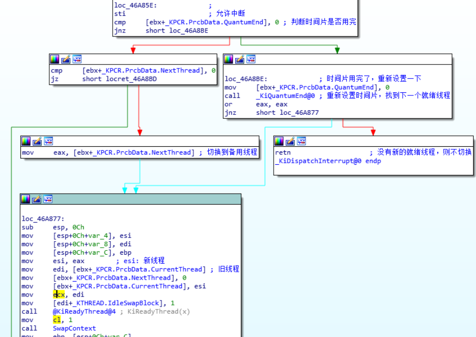
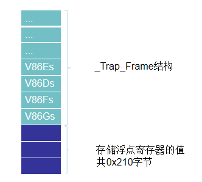
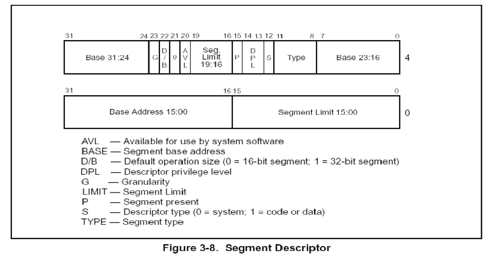
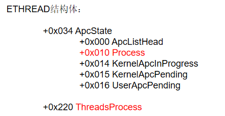

[toc]

> [进程&线程](https://blog.csdn.net/qq_41490873/category_8987386.html)
>
> [滴水中级上](https://blog.csdn.net/qq_41490873/category_9930822.html)

# 001.进程结构体

每个windows进程在0环都有一个对应的结构体：`EPROCESS` ，这个结构体包含了进程所有重要的信息。

## EPROCESS

```c
kd> dt _EPROCESS
ntdll!_EPROCESS
   +0x000 Pcb              : _KPROCESS
   +0x06c ProcessLock      : _EX_PUSH_LOCK
   +0x070 CreateTime       : _LARGE_INTEGER//进程的创建时间
   +0x078 ExitTime         : _LARGE_INTEGER//进程的退出时间
   +0x080 RundownProtect   : _EX_RUNDOWN_REF
   +0x084 UniqueProcessId  : Ptr32 Void//进程的编号 任务管理器中的PID
   +0x088 ActiveProcessLinks : _LIST_ENTRY//双向链表 所有的活动进程都连接在一起，构成了一个链表
										  //PsActiveProcessHead指向全局链表头，链的位置是0x88的位置
   +0x090 QuotaUsage       : [3] Uint4B//物理页相关的统计信息
   +0x09c QuotaPeak        : [3] Uint4B//物理页相关的统计信息
   +0x0a8 CommitCharge     : Uint4B//虚拟内存相关的统计信息
   +0x0ac PeakVirtualSize  : Uint4B//虚拟内存相关的统计信息
   +0x0b0 VirtualSize      : Uint4B//虚拟内存相关的统计信息
   +0x0b4 SessionProcessLinks : _LIST_ENTRY//可以通过这个链表，遍历到所有进程。 这个是无法隐藏的，隐藏了系统无法管理到该进程。
   +0x0bc DebugPort        : Ptr32 Void//调试相关
   +0x0c0 ExceptionPort    : Ptr32 Void//调试相关
   +0x0c4 ObjectTable      : Ptr32 _HANDLE_TABLE//句柄表
   +0x0c8 Token            : _EX_FAST_REF
   +0x0cc WorkingSetLock   : _FAST_MUTEX
   +0x0ec WorkingSetPage   : Uint4B
   +0x0f0 AddressCreationLock : _FAST_MUTEX
   +0x110 HyperSpaceLock   : Uint4B
   +0x114 ForkInProgress   : Ptr32 _ETHREAD
   +0x118 HardwareTrigger  : Uint4B
   +0x11c VadRoot          : Ptr32 Void//标识0-2G哪些地址没占用了
   +0x120 VadHint          : Ptr32 Void
   +0x124 CloneRoot        : Ptr32 Void
   +0x128 NumberOfPrivatePages : Uint4B
   +0x12c NumberOfLockedPages : Uint4B
   +0x130 Win32Process     : Ptr32 Void
   +0x134 Job              : Ptr32 _EJOB
   +0x138 SectionObject    : Ptr32 Void
   +0x13c SectionBaseAddress : Ptr32 Void
   +0x140 QuotaBlock       : Ptr32 _EPROCESS_QUOTA_BLOCK
   +0x144 WorkingSetWatch  : Ptr32 _PAGEFAULT_HISTORY
   +0x148 Win32WindowStation : Ptr32 Void
   +0x14c InheritedFromUniqueProcessId : Ptr32 Void
   +0x150 LdtInformation   : Ptr32 Void
   +0x154 VadFreeHint      : Ptr32 Void
   +0x158 VdmObjects       : Ptr32 Void
   +0x15c DeviceMap        : Ptr32 Void
   +0x160 PhysicalVadList  : _LIST_ENTRY
   +0x168 PageDirectoryPte : _HARDWARE_PTE_X86
   +0x168 Filler           : Uint8B
   +0x170 Session          : Ptr32 Void
   +0x174 ImageFileName    : [16] UChar//进程镜像文件名 最多16个字节
   +0x184 JobLinks         : _LIST_ENTRY
   +0x18c LockedPagesList  : Ptr32 Void
   +0x190 ThreadListHead   : _LIST_ENTRY
   +0x198 SecurityPort     : Ptr32 Void
   +0x19c PaeTop           : Ptr32 Void
   +0x1a0 ActiveThreads    : Uint4B//活动线程的数量
   +0x1a4 GrantedAccess    : Uint4B
   +0x1a8 DefaultHardErrorProcessing : Uint4B
   +0x1ac LastThreadExitStatus : Int4B
   +0x1b0 Peb              : Ptr32 _PEB//PEB((Process Environment Block 进程环境块)：进程在3环的一个结构体，里面包含了进程的模块列表、是否处于调试状态等信息。
   +0x1b4 PrefetchTrace    : _EX_FAST_REF
   +0x1b8 ReadOperationCount : _LARGE_INTEGER
   +0x1c0 WriteOperationCount : _LARGE_INTEGER
   +0x1c8 OtherOperationCount : _LARGE_INTEGER
   +0x1d0 ReadTransferCount : _LARGE_INTEGER
   +0x1d8 WriteTransferCount : _LARGE_INTEGER
   +0x1e0 OtherTransferCount : _LARGE_INTEGER
   +0x1e8 CommitChargeLimit : Uint4B
   +0x1ec CommitChargePeak : Uint4B
   +0x1f0 AweInfo          : Ptr32 Void
   +0x1f4 SeAuditProcessCreationInfo : _SE_AUDIT_PROCESS_CREATION_INFO
   +0x1f8 Vm               : _MMSUPPORT
   +0x238 LastFaultCount   : Uint4B
   +0x23c ModifiedPageCount : Uint4B
   +0x240 NumberOfVads     : Uint4B
   +0x244 JobStatus        : Uint4B
   +0x248 Flags            : Uint4B
   +0x248 CreateReported   : Pos 0, 1 Bit
   +0x248 NoDebugInherit   : Pos 1, 1 Bit
   +0x248 ProcessExiting   : Pos 2, 1 Bit
   +0x248 ProcessDelete    : Pos 3, 1 Bit
   +0x248 Wow64SplitPages  : Pos 4, 1 Bit
   +0x248 VmDeleted        : Pos 5, 1 Bit
   +0x248 OutswapEnabled   : Pos 6, 1 Bit
   +0x248 Outswapped       : Pos 7, 1 Bit
   +0x248 ForkFailed       : Pos 8, 1 Bit
   +0x248 HasPhysicalVad   : Pos 9, 1 Bit
   +0x248 AddressSpaceInitialized : Pos 10, 2 Bits
   +0x248 SetTimerResolution : Pos 12, 1 Bit
   +0x248 BreakOnTermination : Pos 13, 1 Bit
   +0x248 SessionCreationUnderway : Pos 14, 1 Bit
   +0x248 WriteWatch       : Pos 15, 1 Bit
   +0x248 ProcessInSession : Pos 16, 1 Bit
   +0x248 OverrideAddressSpace : Pos 17, 1 Bit
   +0x248 HasAddressSpace  : Pos 18, 1 Bit
   +0x248 LaunchPrefetched : Pos 19, 1 Bit
   +0x248 InjectInpageErrors : Pos 20, 1 Bit
   +0x248 VmTopDown        : Pos 21, 1 Bit
   +0x248 Unused3          : Pos 22, 1 Bit
   +0x248 Unused4          : Pos 23, 1 Bit
   +0x248 VdmAllowed       : Pos 24, 1 Bit
   +0x248 Unused           : Pos 25, 5 Bits
   +0x248 Unused1          : Pos 30, 1 Bit
   +0x248 Unused2          : Pos 31, 1 Bit
   +0x24c ExitStatus       : Int4B
   +0x250 NextPageColor    : Uint2B
   +0x252 SubSystemMinorVersion : UChar
   +0x253 SubSystemMajorVersion : UChar
   +0x252 SubSystemVersion : Uint2B
   +0x254 PriorityClass    : UChar
   +0x255 WorkingSetAcquiredUnsafe : UChar
   +0x258 Cookie           : Uint4B

```

## KPROCESS

```c
kd> dt _KPROCESS
ntdll!_KPROCESS
   +0x000 Header           : _DISPATCHER_HEADER //"可等待对象"，有这个成员就可以被WaitForSingleObject等待
   +0x010 ProfileListHead  : _LIST_ENTRY //性能分析
   +0x018 DirectoryTableBase : [2] Uint4B//页目录表基址，DirectoryTableBase[0] cr3 DirectoryTableBase[1] 超过4GE后的cr3
   +0x020 LdtDescriptor    : _KGDTENTRY
   +0x028 Int21Descriptor  : _KIDTENTRY
   +0x030 IopmOffset       : Uint2B
   +0x032 Iopl             : UChar
   +0x033 Unused           : UChar
   +0x034 ActiveProcessors : Uint4B
   +0x038 KernelTime       : Uint4B//记录一个进程在内核模式下花的时间
   +0x03c UserTime         : Uint4B//记录一个进程在用户模式下花的时间
   +0x040 ReadyListHead    : _LIST_ENTRY
   +0x048 SwapListEntry    : _SINGLE_LIST_ENTRY
   +0x04c VdmTrapcHandler  : Ptr32 Void
   +0x050 ThreadListHead   : _LIST_ENTRY
   +0x058 ProcessLock      : Uint4B
   +0x05c Affinity         : Uint4B//指定哪一个CPU来运行这个进程
    //如果值为1，那这个进程的所以线程只能在0号CPU上跑(00000001)				
    //如果值为3，那这个进程的所以线程能在0、1号CPU上跑(000000011)	
    //如果值为4，那这个进程的所以线程能在2号CPU上跑(000000100)	
    //如果值为5，那这个进程的所以线程能在0，2号CPU上跑(000000101)	
    //4个字节共32位  所以最多32核 Windows64位 就64核			
    //如果只有一个CPU 把这个设置为4 那么这个进程就死了
   +0x060 StackCount       : Uint2B
   +0x062 BasePriority     : Char//基础优先级或最低优先级，该进程中的所有线程最起码的优先级
   +0x063 ThreadQuantum    : Char
   +0x064 AutoAlignment    : UChar
   +0x065 State            : UChar
   +0x066 ThreadSeed       : UChar
   +0x067 DisableBoost     : UChar
   +0x068 PowerState       : UChar
   +0x069 DisableQuantum   : UChar
   +0x06a IdealNode        : UChar
   +0x06b Flags            : _KEXECUTE_OPTIONS
   +0x06b ExecuteOptions   : UChar
```

## 通过进程结构体遍历所有的进程

```c
	ULONG ProcessListHead=0;
	PLIST_ENTRY pListHead;
	PLIST_ENTRY pListNext;
	__asm{
	
		mov eax,fs:124h
		mov ebx,[eax+220h]  //得到线程结构体
		mov ProcessListHead,ebx
	}

	pListHead=(PLIST_ENTRY)(ProcessListHead+0x88);
	pListNext=pListHead;
	
	do
	{
	
		DbgPrint("ImageFileName=%s\n",(PULONG)pListNext-0x88/4+0x174/4);
		
		pListNext=pListNext->Flink;
	}while(pListHead!=pListNext);

```


# 002.线程结构体

每个windows线程在0环都有一个对应的结构体：ETHREAD  这个结构体包含了线程所有重要的信息。


## KTHREAD

```c
kd> dt _KTHREAD
ntdll!_KTHREAD
   +0x000 Header           : _DISPATCHER_HEADER//可等待对象
   +0x010 MutantListHead   : _LIST_ENTRY//互斥体对象链表
   +0x018 InitialStack     : Ptr32 Void//线程切换相关
   +0x01c StackLimit       : Ptr32 Void//线程切换相关
   +0x020 Teb              : Ptr32 Void
        //TEB，Thread Environment Block，线程环境块。
        //大小4KB,位于用户地址空间。
        //FS:[0] -> TEB(3环时  0环时FS执行KPCR)

   +0x024 TlsArray         : Ptr32 Void
   +0x028 KernelStack      : Ptr32 Void//线程切换相关
   +0x02c DebugActive      : UChar//如果值为-1 不能使用调试寄存器：Dr0 - Dr7
   +0x02d State            : UChar//线程状态：就绪、等待还是运行
   +0x02e Alerted          : [2] UChar
   +0x030 Iopl             : UChar
   +0x031 NpxState         : UChar
   +0x032 Saturation       : Char
   +0x033 Priority         : Char
   +0x034 ApcState         : _KAPC_STATE//APC相关
   +0x04c ContextSwitches  : Uint4B
   +0x050 IdleSwapBlock    : UChar
   +0x051 Spare0           : [3] UChar
   +0x054 WaitStatus       : Int4B
   +0x058 WaitIrql         : UChar
   +0x059 WaitMode         : Char
   +0x05a WaitNext         : UChar
   +0x05b WaitReason       : UChar
   +0x05c WaitBlockList    : Ptr32 _KWAIT_BLOCK
   +0x060 WaitListEntry    : _LIST_ENTRY
   +0x060 SwapListEntry    : _SINGLE_LIST_ENTRY
   +0x068 WaitTime         : Uint4B
   +0x06c BasePriority     : Char//其初始值是所属进程的BasePriority值(KPROCESS->BasePriority)，以后可以通过KeSetBasePriorityThread()函数重新设定
   +0x06d DecrementCount   : UChar
   +0x06e PriorityDecrement : Char
   +0x06f Quantum          : Char
   +0x070 WaitBlock        : [4] _KWAIT_BLOCK//等待哪个对象（WaitForSingleObject）
   +0x0d0 LegoData         : Ptr32 Void
   +0x0d4 KernelApcDisable : Uint4B
   +0x0d8 UserAffinity     : Uint4B
   +0x0dc SystemAffinityActive : UChar
   +0x0dd PowerState       : UChar
   +0x0de NpxIrql          : UChar
   +0x0df InitialNode      : UChar
   +0x0e0 ServiceTable     : Ptr32 Void//指向系统服务表基址
   +0x0e4 Queue            : Ptr32 _KQUEUE
   +0x0e8 ApcQueueLock     : Uint4B//APC相关
   +0x0f0 Timer            : _KTIMER
   +0x118 QueueListEntry   : _LIST_ENTRY
   +0x120 SoftAffinity     : Uint4B
   +0x124 Affinity         : Uint4B
   +0x128 Preempted        : UChar
   +0x129 ProcessReadyQueue : UChar
   +0x12a KernelStackResident : UChar
   +0x12b NextProcessor    : UChar
   +0x12c CallbackStack    : Ptr32 Void
   +0x130 Win32Thread      : Ptr32 Void
   +0x134 TrapFrame        : Ptr32 _KTRAP_FRAME//进0环时保存环境
   +0x138 ApcStatePointer  : [2] Ptr32 _KAPC_STATE
   +0x140 PreviousMode     : Char//某些内核函数会判断程序是0环调用还是3环调用的
   +0x141 EnableStackSwap  : UChar
   +0x142 LargeStack       : UChar
   +0x143 ResourceIndex    : UChar
   +0x144 KernelTime       : Uint4B
   +0x148 UserTime         : Uint4B
   +0x14c SavedApcState    : _KAPC_STATE//APC相关
   +0x164 Alertable        : UChar
   +0x165 ApcStateIndex    : UChar
   +0x166 ApcQueueable     : UChar
   +0x167 AutoAlignment    : UChar
   +0x168 StackBase        : Ptr32 Void
   +0x16c SuspendApc       : _KAPC
   +0x19c SuspendSemaphore : _KSEMAPHORE
   +0x1b0 ThreadListEntry  : _LIST_ENTRY//双向链表，一个进程所有的线程都挂在一个链表中，挂的就是这个位置（这是第一个）
   +0x1b8 FreezeCount      : Char
   +0x1b9 SuspendCount     : Char
   +0x1ba IdealProcessor   : UChar
   +0x1bb DisableBoost     : UChar
```


## ETHREAD


```c
kd> dt _ETHREAD
ntdll!_ETHREAD
   +0x000 Tcb              : _KTHREAD
   +0x1c0 CreateTime       : _LARGE_INTEGER
   +0x1c0 NestedFaultCount : Pos 0, 2 Bits
   +0x1c0 ApcNeeded        : Pos 2, 1 Bit
   +0x1c8 ExitTime         : _LARGE_INTEGER
   +0x1c8 LpcReplyChain    : _LIST_ENTRY
   +0x1c8 KeyedWaitChain   : _LIST_ENTRY
   +0x1d0 ExitStatus       : Int4B
   +0x1d0 OfsChain         : Ptr32 Void
   +0x1d4 PostBlockList    : _LIST_ENTRY
   +0x1dc TerminationPort  : Ptr32 _TERMINATION_PORT
   +0x1dc ReaperLink       : Ptr32 _ETHREAD
   +0x1dc KeyedWaitValue   : Ptr32 Void
   +0x1e0 ActiveTimerListLock : Uint4B
   +0x1e4 ActiveTimerListHead : _LIST_ENTRY
   +0x1ec Cid              : _CLIENT_ID//进程ID、线程ID
   +0x1f4 LpcReplySemaphore : _KSEMAPHORE
   +0x1f4 KeyedWaitSemaphore : _KSEMAPHORE
   +0x208 LpcReplyMessage  : Ptr32 Void
   +0x208 LpcWaitingOnPort : Ptr32 Void
   +0x20c ImpersonationInfo : Ptr32 _PS_IMPERSONATION_INFORMATION
   +0x210 IrpList          : _LIST_ENTRY
   +0x218 TopLevelIrp      : Uint4B
   +0x21c DeviceToVerify   : Ptr32 _DEVICE_OBJECT
   +0x220 ThreadsProcess   : Ptr32 _EPROCESS//指向自己所属进程
   +0x224 StartAddress     : Ptr32 Void
   +0x228 Win32StartAddress : Ptr32 Void
   +0x228 LpcReceivedMessageId : Uint4B
   +0x22c ThreadListEntry  : _LIST_ENTRY//双向链表 一个进程所有的线程 都挂在一个链表中 挂的就是这个位置（这是第二个）
   +0x234 RundownProtect   : _EX_RUNDOWN_REF
   +0x238 ThreadLock       : _EX_PUSH_LOCK
   +0x23c LpcReplyMessageId : Uint4B
   +0x240 ReadClusterSize  : Uint4B
   +0x244 GrantedAccess    : Uint4B
   +0x248 CrossThreadFlags : Uint4B
   +0x248 Terminated       : Pos 0, 1 Bit
   +0x248 DeadThread       : Pos 1, 1 Bit
   +0x248 HideFromDebugger : Pos 2, 1 Bit
   +0x248 ActiveImpersonationInfo : Pos 3, 1 Bit
   +0x248 SystemThread     : Pos 4, 1 Bit
   +0x248 HardErrorsAreDisabled : Pos 5, 1 Bit
   +0x248 BreakOnTermination : Pos 6, 1 Bit
   +0x248 SkipCreationMsg  : Pos 7, 1 Bit
   +0x248 SkipTerminationMsg : Pos 8, 1 Bit
   +0x24c SameThreadPassiveFlags : Uint4B
   +0x24c ActiveExWorker   : Pos 0, 1 Bit
   +0x24c ExWorkerCanWaitUser : Pos 1, 1 Bit
   +0x24c MemoryMaker      : Pos 2, 1 Bit
   +0x250 SameThreadApcFlags : Uint4B
   +0x250 LpcReceivedMsgIdValid : Pos 0, 1 Bit
   +0x250 LpcExitThreadCalled : Pos 1, 1 Bit
   +0x250 AddressSpaceOwner : Pos 2, 1 Bit
   +0x254 ForwardClusterOnly : UChar
   +0x255 DisablePageFaultClustering : UChar

```


# 003.KPCR

1. KPCR结构体是CPU临时记录线程信息的一个结构体
2. KPCR是CPU快速查找线程信息用的，自己在上面做不了什么事情。
3. 当线程进入0环时，FS:[0]指向KPCR(3环时FS:[0] -> TEB)
4. 每个CPU都有一个KPCR结构体(一个核一个)
5. KPCR中存储了CPU本身要用的一些重要数据：GDT、IDT以及线程相关的一些信息。
6. FS寄存器在三环时，记录的是TEB结构的地址。
   在0环时，记录的是KPCR的地址。

## KPCR

```c
kd> dt _KPCR
nt!_KPCR
   +0x000 NtTib            : _NT_TIB
   +0x01c SelfPcr          : Ptr32 _KPCR//指向自己，方便寻址
   +0x020 Prcb             : Ptr32 _KPRCB//指向拓展结构体PRCB  
   +0x024 Irql             : UChar
   +0x028 IRR              : Uint4B
   +0x02c IrrActive        : Uint4B
   +0x030 IDR              : Uint4B
   +0x034 KdVersionBlock   : Ptr32 Void
   +0x038 IDT              : Ptr32 _KIDTENTRY//IDT表基址
   +0x03c GDT              : Ptr32 _KGDTENTRY//GDT表基址
   +0x040 TSS              : Ptr32 _KTSS//指针，指向TSS，每个CPU都有一个TSS
   +0x044 MajorVersion     : Uint2B
   +0x046 MinorVersion     : Uint2B
   +0x048 SetMember        : Uint4B
   +0x04c StallScaleFactor : Uint4B
   +0x050 DebugActive      : UChar
   +0x051 Number           : UChar//CPU编号：0 1 2 3 4 5。。。
   +0x052 Spare0           : UChar
   +0x053 SecondLevelCacheAssociativity : UChar
   +0x054 VdmAlert         : Uint4B
   +0x058 KernelReserved   : [14] Uint4B
   +0x090 SecondLevelCacheSize : Uint4B
   +0x094 HalReserved      : [16] Uint4B
   +0x0d4 InterruptMode    : Uint4B
   +0x0d8 Spare1           : UChar
   +0x0dc KernelReserved2  : [17] Uint4B
   +0x120 PrcbData         : _KPRCB//拓展结构体
```

## NT_TIB

```c
kd> dt _NT_TIB
ntdll!_NT_TIB
   +0x000 ExceptionList    : Ptr32 _EXCEPTION_REGISTRATION_RECORD//当前线程内核异常链表(SEH)
   +0x004 StackBase        : Ptr32 Void//当前线程内核栈的基址
   +0x008 StackLimit       : Ptr32 Void//当前线程内核栈的大小
   +0x00c SubSystemTib     : Ptr32 Void
   +0x010 FiberData        : Ptr32 Void
   +0x010 Version          : Uint4B
   +0x014 ArbitraryUserPointer : Ptr32 Void
   +0x018 Self             : Ptr32 _NT_TIB//指向自己(也就是指向KPCR结构) 
```


## KPRCB


```c
kd> dt _KPRCB
ntdll!_KPRCB
   +0x000 MinorVersion     : Uint2B
   +0x002 MajorVersion     : Uint2B
   +0x004 CurrentThread    : Ptr32 _KTHREAD//当前线程
   +0x008 NextThread       : Ptr32 _KTHREAD//即将切换的下一个线程
   +0x00c IdleThread       : Ptr32 _KTHREAD//空闲线程
   +0x010 Number           : Char
   +0x011 Reserved         : Char
   +0x012 BuildType        : Uint2B
   +0x014 SetMember        : Uint4B
   +0x018 CpuType          : Char
   +0x019 CpuID            : Char
   +0x01a CpuStep          : Uint2B
   +0x01c ProcessorState   : _KPROCESSOR_STATE
   +0x33c KernelReserved   : [16] Uint4B
   +0x37c HalReserved      : [16] Uint4B
   +0x3bc PrcbPad0         : [92] UChar
   +0x418 LockQueue        : [16] _KSPIN_LOCK_QUEUE
   +0x498 PrcbPad1         : [8] UChar
   +0x4a0 NpxThread        : Ptr32 _KTHREAD
   +0x4a4 InterruptCount   : Uint4B
   +0x4a8 KernelTime       : Uint4B
   +0x4ac UserTime         : Uint4B
   +0x4b0 DpcTime          : Uint4B
   +0x4b4 DebugDpcTime     : Uint4B
   +0x4b8 InterruptTime    : Uint4B
   +0x4bc AdjustDpcThreshold : Uint4B
   +0x4c0 PageColor        : Uint4B
   +0x4c4 SkipTick         : Uint4B
   +0x4c8 MultiThreadSetBusy : UChar
   +0x4c9 Spare2           : [3] UChar
   +0x4cc ParentNode       : Ptr32 _KNODE
   +0x4d0 MultiThreadProcessorSet : Uint4B
   +0x4d4 MultiThreadSetMaster : Ptr32 _KPRCB
   +0x4d8 ThreadStartCount : [2] Uint4B
   +0x4e0 CcFastReadNoWait : Uint4B
   +0x4e4 CcFastReadWait   : Uint4B
   +0x4e8 CcFastReadNotPossible : Uint4B
   +0x4ec CcCopyReadNoWait : Uint4B
   +0x4f0 CcCopyReadWait   : Uint4B
   +0x4f4 CcCopyReadNoWaitMiss : Uint4B
   +0x4f8 KeAlignmentFixupCount : Uint4B
   +0x4fc KeContextSwitches : Uint4B
   +0x500 KeDcacheFlushCount : Uint4B
   +0x504 KeExceptionDispatchCount : Uint4B
   +0x508 KeFirstLevelTbFills : Uint4B
   +0x50c KeFloatingEmulationCount : Uint4B
   +0x510 KeIcacheFlushCount : Uint4B
   +0x514 KeSecondLevelTbFills : Uint4B
   +0x518 KeSystemCalls    : Uint4B
   +0x51c SpareCounter0    : [1] Uint4B
   +0x520 PPLookasideList  : [16] _PP_LOOKASIDE_LIST
   +0x5a0 PPNPagedLookasideList : [32] _PP_LOOKASIDE_LIST
   +0x6a0 PPPagedLookasideList : [32] _PP_LOOKASIDE_LIST
   +0x7a0 PacketBarrier    : Uint4B
   +0x7a4 ReverseStall     : Uint4B
   +0x7a8 IpiFrame         : Ptr32 Void
   +0x7ac PrcbPad2         : [52] UChar
   +0x7e0 CurrentPacket    : [3] Ptr32 Void
   +0x7ec TargetSet        : Uint4B
   +0x7f0 WorkerRoutine    : Ptr32     void 
   +0x7f4 IpiFrozen        : Uint4B
   +0x7f8 PrcbPad3         : [40] UChar
   +0x820 RequestSummary   : Uint4B
   +0x824 SignalDone       : Ptr32 _KPRCB
   +0x828 PrcbPad4         : [56] UChar
   +0x860 DpcListHead      : _LIST_ENTRY
   +0x868 DpcStack         : Ptr32 Void
   +0x86c DpcCount         : Uint4B
   +0x870 DpcQueueDepth    : Uint4B
   +0x874 DpcRoutineActive : Uint4B
   +0x878 DpcInterruptRequested : Uint4B
   +0x87c DpcLastCount     : Uint4B
   +0x880 DpcRequestRate   : Uint4B
   +0x884 MaximumDpcQueueDepth : Uint4B
   +0x888 MinimumDpcRate   : Uint4B
   +0x88c QuantumEnd       : Uint4B
   +0x890 PrcbPad5         : [16] UChar
   +0x8a0 DpcLock          : Uint4B
   +0x8a4 PrcbPad6         : [28] UChar
   +0x8c0 CallDpc          : _KDPC
   +0x8e0 ChainedInterruptList : Ptr32 Void
   +0x8e4 LookasideIrpFloat : Int4B
   +0x8e8 SpareFields0     : [6] Uint4B
   +0x900 VendorString     : [13] UChar
   +0x90d InitialApicId    : UChar
   +0x90e LogicalProcessorsPerPhysicalProcessor : UChar
   +0x910 MHz              : Uint4B
   +0x914 FeatureBits      : Uint4B
   +0x918 UpdateSignature  : _LARGE_INTEGER
   +0x920 NpxSaveArea      : _FX_SAVE_AREA
   +0xb30 PowerState       : _PROCESSOR_POWER_STATE

```

> 特别强调：
>
> 我们课程里面讲解的内容，与《内核情景分析》《Windows内核原理与实现》均有不同。
>
> ReactOS是开源免费的Windows NT系列(含NT4.0/2000/XP/2003)克隆操作系统
>
> WRK 是微软针对教育和学术界开放的 Windows 内核的部分源码
>
> 而我们的课程是基于Windows XP SP2/SP3 二进制文件.
>
> 微软并不开源，很多内核成员的作用需要自己去分析.	

# 004.等待链表_调度链表

> 回顾：
>
> EPROCESS结构体有两个链表：0x50，0x190，里面圈着当前进程的所有线程。

**对进程断链，程序可以正常运行，原因是CPU执行与调度是基于线程的，进程断链只是影响一些遍历系统进程的API，并不会影响程序执行。**

**对线程断链也是一样的，断链后在Windbg或者OD中无法看到被断掉的线程，但并不影响其执行(仍然再跑)。**

## 线程的三种状态：等待，运行，就绪

正在运行中的线程存储在KPCR中，就绪和等待的线程全在另外的33个链表中。一个等待链表，32个就绪链表：

这些链表都使用了_KTHREAD(0x060)这个位置，也就是说，线程在某一时刻，只能属于其中一个圈。

### 等待链表

导致线程等待的原因有多种，例如调用了Sleep, WaitForSingleObject 等函数，或者在创建时和运行时让线程挂起的API，例如 SuspendThread 函数。

等待线程存储在等待链表头 KiWaitListHead 中， KiWaitListHead 是一个全局变量，可以 dd 查看。


```sh
kd> dd KiWaitListHead
8055d4a8  863ee840 86407a30 00000011 00000000
8055d4b8  e57a42bd d6bf94d5 01000013 ffdff980
8055d4c8  ffdff980 805032c6 00000000 0000493c
8055d4d8  00000000 ffdff9c0 8055d4e0 8055d4e0
8055d4e8  00000000 00000000 8055d4f0 8055d4f0
8055d4f8  00000000 00000000 00000000 865b5860
8055d508  00000000 00000000 00040001 00000000
8055d518  865b58d0 865b58d0 00000000 00000000
```
比如：线程调用了Sleep() 或者 WaitForSingleObject()等函数时，就挂到这个链表(查看等待线程)

`0x8055d4a8`存储了 `KiWaitListHead` ，这是一个 `_LIST_ENTRY`，它属于某个线程 `_KTHREAD + 0x60` 的位置。

```
kd> dt _KTHREAD 863ee840-60
ntdll!_KTHREAD
   +0x000 Header           : _DISPATCHER_HEADER
   +0x010 MutantListHead   : _LIST_ENTRY [ 0x863ee7f0 - 0x863ee7f0 ]
   +0x018 InitialStack     : 0xf6fd6000 Void
   +0x01c StackLimit       : 0xf6fd3000 Void
   +0x020 Teb              : 0x7ffd7000 Void
   +0x024 TlsArray         : (null) 
   +0x028 KernelStack      : 0xf6fd5c70 Void
   +0x02c DebugActive      : 0 ''
   +0x02d State            : 0x5 ''
   +0x02e Alerted          : [2]  ""
   +0x030 Iopl             : 0 ''
   +0x031 NpxState         : 0xa ''
   +0x032 Saturation       : 0 ''
   +0x033 Priority         : 11 ''
   +0x034 ApcState         : _KAPC_STATE
   +0x04c ContextSwitches  : 0x9d
   +0x050 IdleSwapBlock    : 0 ''
   +0x051 Spare0           : [3]  ""
   +0x054 WaitStatus       : 0n0
   +0x058 WaitIrql         : 0 ''
   +0x059 WaitMode         : 1 ''
   +0x05a WaitNext         : 0 ''
   +0x05b WaitReason       : 0xf ''
   +0x05c WaitBlockList    : 0x863ee850 _KWAIT_BLOCK
   +0x060 WaitListEntry    : _LIST_ENTRY [ 0x86031998 - 0x8055d4a8 ]
   +0x060 SwapListEntry    : _SINGLE_LIST_ENTRY
   +0x068 WaitTime         : 0x45bd
   +0x06c BasePriority     : 9 ''
   +0x06d DecrementCount   : 0 ''
   +0x06e PriorityDecrement : 0 ''
   +0x06f Quantum          : 5 ''
   +0x070 WaitBlock        : [4] _KWAIT_BLOCK
   +0x0d0 LegoData         : (null) 
   +0x0d4 KernelApcDisable : 0
   +0x0d8 UserAffinity     : 1
   +0x0dc SystemAffinityActive : 0 ''
   +0x0dd PowerState       : 0 ''
   +0x0de NpxIrql          : 0 ''
   +0x0df InitialNode      : 0 ''
   +0x0e0 ServiceTable     : 0x8055d700 Void
   +0x0e4 Queue            : 0x8605c290 _KQUEUE
   +0x0e8 ApcQueueLock     : 0
   +0x0f0 Timer            : _KTIMER
   +0x118 QueueListEntry   : _LIST_ENTRY [ 0x8605c2b0 - 0x864728c0 ]
   +0x120 SoftAffinity     : 1
   +0x124 Affinity         : 1
   +0x128 Preempted        : 0 ''
   +0x129 ProcessReadyQueue : 0 ''
   +0x12a KernelStackResident : 0x1 ''
   +0x12b NextProcessor    : 0 ''
   +0x12c CallbackStack    : (null) 
   +0x130 Win32Thread      : (null) 
   +0x134 TrapFrame        : 0xf6fd5d64 _KTRAP_FRAME
   +0x138 ApcStatePointer  : [2] 0x863ee814 _KAPC_STATE
   +0x140 PreviousMode     : 1 ''
   +0x141 EnableStackSwap  : 0x1 ''
   +0x142 LargeStack       : 0 ''
   +0x143 ResourceIndex    : 0 ''
   +0x144 KernelTime       : 0
   +0x148 UserTime         : 0
   +0x14c SavedApcState    : _KAPC_STATE
   +0x164 Alertable        : 0 ''
   +0x165 ApcStateIndex    : 0 ''
   +0x166 ApcQueueable     : 0x1 ''
   +0x167 AutoAlignment    : 0 ''
   +0x168 StackBase        : 0xf6fd6000 Void
   +0x16c SuspendApc       : _KAPC
   +0x19c SuspendSemaphore : _KSEMAPHORE
   +0x1b0 ThreadListEntry  : _LIST_ENTRY [ 0x863ee4b8 - 0x8649a9d8 ]
   +0x1b8 FreezeCount      : 0 ''
   +0x1b9 SuspendCount     : 0 ''
   +0x1ba IdealProcessor   : 0 ''
   +0x1bb DisableBoost     : 0 ''
```

查看这个线程是那个进程的：

```
kd> dt _ETHREAD 863ee840-60
nt_exe!_ETHREAD
   +0x000 Tcb              : _KTHREAD
   +0x1c0 CreateTime       : _LARGE_INTEGER 0x0eca09f4`d2f538a0
   +0x1c0 NestedFaultCount : 0y00
   +0x1c0 ApcNeeded        : 0y0
   +0x1c8 ExitTime         : _LARGE_INTEGER 0x863ee9a8`863ee9a8
   +0x1c8 LpcReplyChain    : _LIST_ENTRY [ 0x863ee9a8 - 0x863ee9a8 ]
   +0x1c8 KeyedWaitChain   : _LIST_ENTRY [ 0x863ee9a8 - 0x863ee9a8 ]
   +0x1d0 ExitStatus       : 0n0
   +0x1d0 OfsChain         : (null) 
   +0x1d4 PostBlockList    : _LIST_ENTRY [ 0x863ee9b4 - 0x863ee9b4 ]
   +0x1dc TerminationPort  : 0xe1726cd8 _TERMINATION_PORT
   +0x1dc ReaperLink       : 0xe1726cd8 _ETHREAD
   +0x1dc KeyedWaitValue   : 0xe1726cd8 Void
   +0x1e0 ActiveTimerListLock : 0
   +0x1e4 ActiveTimerListHead : _LIST_ENTRY [ 0x863ee9c4 - 0x863ee9c4 ]
   +0x1ec Cid              : _CLIENT_ID
   +0x1f4 LpcReplySemaphore : _KSEMAPHORE
   +0x1f4 KeyedWaitSemaphore : _KSEMAPHORE
   +0x208 LpcReplyMessage  : (null) 
   +0x208 LpcWaitingOnPort : (null) 
   +0x20c ImpersonationInfo : 0xe1581808 _PS_IMPERSONATION_INFORMATION
   +0x210 IrpList          : _LIST_ENTRY [ 0x86472548 - 0x86472548 ]
   +0x218 TopLevelIrp      : 0
   +0x21c DeviceToVerify   : (null) 
   +0x220 ThreadsProcess   : 0x86057748 _EPROCESS //这里
   +0x224 StartAddress     : 0x7c8106f9 Void
   +0x228 Win32StartAddress : 0x77e56c7d Void
   +0x228 LpcReceivedMessageId : 0x77e56c7d
   +0x22c ThreadListEntry  : _LIST_ENTRY [ 0x863ee534 - 0x8649aa54 ]
   +0x234 RundownProtect   : _EX_RUNDOWN_REF
   +0x238 ThreadLock       : _EX_PUSH_LOCK
...

kd> dt _EPROCESS 0x86057748
nt_exe!_EPROCESS
   +0x000 Pcb              : _KPROCESS
  .....
   +0x174 ImageFileName    : [16]  "lsass.exe"//可以看到是这个进程的

```

`_KTHREAD + 0x60` 是一个共用体 union ，线程处于等待或者调度状态就会存到这个位置的链表里，如果是等待状态，这个地方就是等待链表；如果是调度状态，这里就是调度链表。

### 运行链表

一个核只有一个运行中的线程，运行中的线程存储在 KPCR 中。

### 调度链表

调度链表有32个圈，就是优先级:0 - 31  0最低  31最高  

默认优先级一般是8

改变优先级就是从一个圈里面卸下来挂到另外一个圈上

这32个圈是正在调度中的线程：包括正在运行的和准备运行的

比如：只有一个CPU但有10个线程在运行，那么某一时刻，正在运行的线程在KPCR中，其他9个在这32个圈中。

```
既然有32个链表，就要有32个链表头。
kd> dd KiDispatcherReadyListHead L70
8055df80  8055df80 8055df80 8055df88 8055df88
8055df90  8055df90 8055df90 8055df98 8055df98
8055dfa0  8055dfa0 8055dfa0 8055dfa8 8055dfa8
8055dfb0  8055dfb0 8055dfb0 8055dfb8 8055dfb8
8055dfc0  8055dfc0 8055dfc0 8055dfc8 8055dfc8
8055dfd0  8055dfd0 8055dfd0 8055dfd8 8055dfd8
8055dfe0  8055dfe0 8055dfe0 8055dfe8 8055dfe8
8055dff0  8055dff0 8055dff0 8055dff8 8055dff8
...
```

每两个4字节就构成了一个 LIST_ENTRY，我们发现这里32个链表都是空的，原因是现在windbg把系统挂起了，所有线程都处于等待状态，不能被调度了。

32个链表对应32个优先级 0-31，默认优先级是8，优先级越高越优先。

#### 版本差异

XP只有一个33个圈，也就是说上面这个数组只有一个，多核也只有一个.

Win7也是一样的只有一个圈，如果是64位的，那就有64个圈.

服务器版本：	

`KiWaitListHead`整个系统只有一个，但`KiDispatcherReadyListHead`这个数组有几个CPU就有几组

# 005.模拟线程切换

> [模拟线程切换](https://blog.csdn.net/Kwansy/article/details/109554283)

3环模拟线程切换的代码：

```c
#include <stdio.h>
#include <tchar.h>
#include <string.h>
#include <Windows.h>

#pragma warning(disable: 4996)

//--------------------------------------------------------------------------------------------
//--------------------------------------------------------------------------------------------


#define MAXGMTHREAD 0x100

#define GMTHREAD_CREATE		0x01
#define GMTHREAD_READY		0x02
#define GMTHREAD_RUNNING	0x04
#define GMTHREAD_SLEEP		0x08
#define GMTHREAD_EXIT		0x100

#define GMTHREADSTACKSIZE 0x80000

//--------------------------------------------------------------------------------------------
//--------------------------------------------------------------------------------------------

// 线程结构体（仿ETHREAD）
typedef struct {
	char *name;							// 线程名，相当于线程TID
	int Flags;							// 线程状态
	int SleepMillisecondDot;			// 休眠时间
	void *InitialStack;					// 线程堆栈起始位置
	void *StackLimit;					// 线程堆栈界限
	void *KernelStack;					// 线程堆栈当前位置，即ESP0
	void *lpParameter;					// 线程函数参数
	void (*func)(void *lpParameter);	// 线程函数
} GMThread_t;

//--------------------------------------------------------------------------------------------
//--------------------------------------------------------------------------------------------

// 当前调度线程下标
int CurrentThreadIndex = 0;

// 线程调度队列
GMThread_t GMThreadList[MAXGMTHREAD] = { 0 };

void *WindowsStackLimit = NULL;

//--------------------------------------------------------------------------------------------
//--------------------------------------------------------------------------------------------

void SwitchContext(GMThread_t *OldGMThreadp, GMThread_t *NewGMThreadp);
void GMThreadStartup(GMThread_t *GMThreadp);
void IdleGMThread(void *lpParameter);
void PushStack(unsigned int **Stackpp, unsigned int v);
void InitGMThread (GMThread_t *GMThreadp, char *name, void (*func)(void *lpParameter), void *lpParameter);
int RegisterGMThread(char *name, void (*func)(void *lpParameter), void *lpParameter);
void Scheduling();
void GMSleep(int Milliseconds);
void Thread1(void *lpParameter);
void Thread2(void *lpParameter);
void Thread3(void *lpParameter);
void Thread4(void *lpParameter);

//--------------------------------------------------------------------------------------------
//--------------------------------------------------------------------------------------------

int _tmain(int argc, _TCHAR* argv[])
{
	// 初始化线程环境
	RegisterGMThread("Thread1", Thread1, NULL);
	RegisterGMThread("Thread2", Thread2, NULL);
	RegisterGMThread("Thread3", Thread3, NULL);
	RegisterGMThread("Thread4", Thread4, NULL);

	// 仿Windows线程切换，模拟系统时钟中断，是被动切换
	//Scheduling();
	for (;;)
	{
		Sleep(20);
		Scheduling();
		// 如果回到主线程，说明没有找到就绪线程，CurrentThreadIndex 一定是 0
		//printf("时钟中断. %d\n", CurrentThreadIndex);
	}
	return 0;
}

// 线程切换函数
__declspec(naked) void SwitchContext(GMThread_t *OldGMThreadp, GMThread_t *NewGMThreadp)
{
	__asm
	{
		// 当前线程保存寄存器到自己的栈顶
		push ebp;
		mov ebp,esp;
		push edi;
		push esi;
		push ebx;
		push ecx;
		push edx;
		push eax;

		mov esi,OldGMThreadp; // mov esi, [ebp + 0x08]
		mov edi,NewGMThreadp; // mov edi, [ebp + 0x0C]

		mov [esi + GMThread_t.KernelStack], esp; // 保存旧ESP
		mov esp,[edi + GMThread_t.KernelStack]; // 设置新ESP

		// 从新线程的栈里恢复寄存器的值
		pop eax;
		pop edx;
		pop ecx;
		pop ebx;
		pop esi;
		pop edi;
		pop ebp;

		// 返回到新线程之前调用 SwitchContext 的地方；如果是第一次调度，则跳转到 GMThreadStartup
		ret;
	}
}

// 此函数在 SwitchContext 的 ret 指令执行时调用，功能是调用线程入口函数
void GMThreadStartup(GMThread_t *GMThreadp)
{
	GMThreadp->func(GMThreadp->lpParameter);
	GMThreadp->Flags = GMTHREAD_EXIT;
	Scheduling();
	printf("这句永远不会执行，因为修改线程状态为退出，Scheduling 永远不会返回到这里.\n");
	return;
}

// 空闲线程，没事做就调用它
void IdleGMThread(void *lpParameter)
{
	printf("IdleGMThread-------------------\n");
	Scheduling();
	return;
}

// 模拟压栈
void PushStack(unsigned int **Stackpp, unsigned int v)
{
	*Stackpp -= 1;
	**Stackpp = v;

	return;
}

// 初始化线程结构体和线程栈，设置状态为“就绪”
void InitGMThread (GMThread_t *GMThreadp, char *name, void (*func)(void *lpParameter), void *lpParameter)
{
	unsigned char *StackPages;
	unsigned int *ESP;
	// 结构初始化赋值
	GMThreadp->Flags = GMTHREAD_CREATE;
	GMThreadp->name = name;
	GMThreadp->func = func;
	GMThreadp->lpParameter = lpParameter;
	// 申请栈空间
	StackPages = (unsigned char*)VirtualAlloc(NULL,GMTHREADSTACKSIZE, MEM_COMMIT, PAGE_READWRITE);
	// 清零
	memset(StackPages,0,GMTHREADSTACKSIZE);
	// 栈初始化地址
	GMThreadp->InitialStack = (StackPages + GMTHREADSTACKSIZE);
	// 栈限制
	GMThreadp->StackLimit = StackPages;
	// 栈地址
	ESP = (unsigned int *)GMThreadp->InitialStack;

	// 初始化线程栈
	PushStack(&ESP, (unsigned int)GMThreadp);		// 通过这个指针来找到：线程函数、函数参数
	PushStack(&ESP, (unsigned int)0);				// 平衡堆栈，此值无意义，详见 SwitchContext 函数注释
	PushStack(&ESP, (unsigned int)GMThreadStartup);	// 线程入口函数，这个函数负责调用线程函数
	PushStack(&ESP, (unsigned int)0);				// push ebp，此值无意义，是寄存器初始值
	PushStack(&ESP, (unsigned int)0);				// push edi，此值无意义，是寄存器初始值
	PushStack(&ESP, (unsigned int)0);				// push esi，此值无意义，是寄存器初始值
	PushStack(&ESP, (unsigned int)0);				// push ebx，此值无意义，是寄存器初始值
	PushStack(&ESP, (unsigned int)0);				// push ecx，此值无意义，是寄存器初始值
	PushStack(&ESP, (unsigned int)0);				// push edx，此值无意义，是寄存器初始值
	PushStack(&ESP, (unsigned int)0);				// push eax，此值无意义，是寄存器初始值

	GMThreadp->KernelStack = ESP;

	GMThreadp->Flags = GMTHREAD_READY;

	return;
}

// 添加新线程到调度队列，然后初始化线程
int RegisterGMThread(char *name, void (*func)(void *lpParameter), void *lpParameter)
{
	int i;

	// 找一个空位置，或者是name已经存在的那个项
	// 下标0是当前正在运行的线程，所以从1开始遍历
	for (i = 1; GMThreadList[i].name; i++)
	{
		if (0 == stricmp(GMThreadList[i].name, name))
		{
			break;
		}
	}
	// 初始化线程结构体
	InitGMThread(&GMThreadList[i], name, func, lpParameter);

	return (i | 0x55AA0000);
}

// 线程调度函数，功能是遍历调度队列，找到“就绪”线程，然后切换线程
void Scheduling()
{
	int i;
	int TickCount;
	GMThread_t *OldGMThreadp;
	GMThread_t *NewGMThreadp;

	TickCount = GetTickCount(); // GetTickCount 返回操作系统启动到目前为止经过的毫秒
	// 正在调度的线程，第一次是 GMThreadList[0]，这个表示主线程
	OldGMThreadp = &GMThreadList[CurrentThreadIndex];

	// 遍历线程调度队列，找第一个“就绪”线程
	// 如果找不到，就回到主函数，模拟时钟中断
	NewGMThreadp = &GMThreadList[0];	
	for (i = 1; GMThreadList[i].name; i++)
	{
		// 如果达到“等待时间”，就修改状态为“就绪”
		if (GMThreadList[i].Flags & GMTHREAD_SLEEP)
		{
			if (TickCount > GMThreadList[i].SleepMillisecondDot)
			{
				GMThreadList[i].Flags = GMTHREAD_READY;
			}
		}
		// 找到“就绪”线程
		if (GMThreadList[i].Flags & GMTHREAD_READY)
		{
			NewGMThreadp = &GMThreadList[i];
			break;
		}
	}
	// 更新当前调度线程下标
	CurrentThreadIndex = NewGMThreadp - GMThreadList;
	// 线程切换
	SwitchContext(OldGMThreadp, NewGMThreadp);
	return;
}

// 正在运行的线程主动调用此函数，将自己设置成“等待”状态，然后让调度函数调度其他线程
void GMSleep(int Milliseconds)
{
	GMThread_t *GMThreadp;
	GMThreadp = &GMThreadList[CurrentThreadIndex];

	if ((GMThreadp->Flags) != 0)
	{
		GMThreadp->SleepMillisecondDot = GetTickCount() + Milliseconds;
		GMThreadp->Flags = GMTHREAD_SLEEP;
	}

	Scheduling();
	return;
}

void Thread1(void *lpParameter)
{
	int i;
	for (i = 0; i < 3; i++)
	{
		printf("Thread1\n");
		GMSleep(100); // 主动切换，模拟WIN32 API
	}

	return;
}

void Thread2(void *lpParameter)
{
	int i = 0;
	while (++i)
	{
		printf("	Thread2(%d)\n", i);
		GMSleep(200); // 主动切换，模拟WIN32 API
	}

	return;
}

void Thread3(void *lpParameter)
{
	int i = 0;
	while (++i)
	{
		printf("		Thread3(%d)\n", i);
		GMSleep(200); // 主动切换，模拟WIN32 API
	}

	return;
}

void Thread4(void *lpParameter)
{
	int i = 0;
	while (++i)
	{
		printf("			Thread4(%d)\n", i);
		GMSleep(400); // 主动切换，模拟WIN32 API
	}

	return;
}
```


## RegisterGMThread

RegisterGMThread 函数负责创建线程，它遍历线程调度队列，找到一个空位作为新线程结构体，然后调用 InitGMThread 初始化。

## InitGMThread

InitGMThread 函数负责初始化线程结构体；为线程申请堆栈内存；向堆栈压入必要的初始数据，包括线程结构体指针

## GMThreadStartup

GMThreadStartup 函数指针，以及一堆寄存器的初始值，最后设置线程状态为“就绪”。

**这里所做的所有压栈操作，没有一个是多余的。**

所有线程都要通过 `GMThreadStartup` 函数调用自己的线程入口函数，而调用 `GMThreadStartup` 函数的地方以及传参的过程设计非常巧妙，这一步发生在 `SwitchContext` 函数中，恢复线程后，pop了7个寄存器，esp就指向了 `GMThreadStartup`，此时 `SwitchContext` 调用 ret (ret相当于pop eip)指令，就跳转到 `GMThreadStartup` 函数，完全模拟了 call 调用的堆栈，那个看起来没用的堆栈平衡值其实模拟的是 call 时压入堆栈的返回地址，而 GMThreadp 模拟的是 call 之前push的参数。进入 `GMThreadStartup` 后，函数从 ebp + 8 处取得参数1 GMThreadp 。

## Scheduling 线程调度函数

Scheduling负责遍历线程调度队列，如果遍历到“等待”状态的线程，判断它是否已经完成了“等待”，如果是，那么修改其状态为就绪。通过遍历，找出第一个“就绪”线程，如果遍历完都没有发现新的就绪线程，那么就认为主函数是“就绪”线程。

最后，调用 SwitchContext 函数“切换”到刚才找到的“就绪”线程。

## SwitchContext 切换线程函数

旧线程调用 SwitchContext 时，首先把7个寄存器压到自己的栈顶，然后保存当前栈顶 esp 到 KernelStack，然后从新线程的线程结构体里取出 KernelStack 填到 esp，就完成了线程切换。

接下来就是从新线程的栈顶 pop 还原7个寄存器。pop 了那7个寄存器后，esp 一定是指向下一条指令的地址的，如果新线程尚未被调度过，那么栈顶一定是 GMThreadStartup；如果新线程曾被调度过，那么栈顶一定是新线程上一次调用 SwitchContext 的返回地址，即 Scheduling 函数的末尾。


## 总结

模拟线程切换总结：

1) 线程不是被动切换的，而是**主动**让出CPU.
2) **线程切换**并**没有使用TSS**来保存寄存器，而是使用堆栈.
3) 线程切换的过程就是堆栈切换的过程.

# 006.Windows线程切换_主动切换

线程切换是操作系统的核心内容，几乎所有的内核API都会调用切换线程的函数。接下来逆向 `KiSwapContext` 和 `SwapContext` 这两个函数，看看Windows是怎么切换线程的。

## 分析 KiSwapContext

```asm
.text:0040581E ; __fastcall KiSwapContext(x)
.text:0040581E @KiSwapContext@4 proc near              ; CODE XREF: KiSwapThread()+33↓p
.text:0040581E
.text:0040581E var_10          = dword ptr -10h
.text:0040581E var_C           = dword ptr -0Ch
.text:0040581E var_8           = dword ptr -8
.text:0040581E var_4           = dword ptr -4
.text:0040581E
.text:0040581E                 sub     esp, 10h;使用寄存器传参，因此要将使用到的寄存器暂时保存到堆栈中,和push等效
.text:00405821                 mov     [esp+10h+var_4], ebx ; KPCR
.text:00405825                 mov     [esp+10h+var_8], esi ; 新线程 _ETHREAD
.text:00405829                 mov     [esp+10h+var_C], edi ; 旧线程 _ETHREAD
.text:0040582D                 mov     [esp+10h+var_10], ebp ; ebp 没用
.text:00405830                 mov     ebx, large fs:1Ch ; _KPCR.Self
.text:00405837                 mov     esi, ecx        ; ecx：新线程的 _ETHREAD
.text:00405839                 mov     edi, [ebx+124h] ; edi：当前线程的 _ETHREAD
.text:00405839                                         ; [ebx+_KPCR.PrcbData.CurrentThread]
.text:0040583F                 mov     [ebx+124h], esi ; 修改 _KPCR，更新当前线程(124h同上
.text:00405845                 mov     cl, [edi+58h]   ; 58==[edi+_ETHREAD.Tcb.WaitIrql]
.text:00405848                 call    SwapContext     ; 4个参数：
.text:00405848                                         ; ebx: _KPCR
.text:00405848                                         ; esi: 新线程 _ETHREAD
.text:00405848                                         ; edi: 旧线程 _ETHREAD
.text:00405848                                         ; cl:旧线程的 WaitIrql，这个参数用来控制是否执行APC
.text:00405848                                         ;
.text:00405848                                         ; 调用 SwapContext 后，已经完成了线程切换
.text:00405848                                         ; 后面就是新线程从它自己的堆栈里恢复寄存器的值的过程
.text:0040584D                 mov     ebp, [esp+10h+var_10]
.text:00405850                 mov     edi, [esp+10h+var_C]
.text:00405854                 mov     esi, [esp+10h+var_8]
.text:00405858                 mov     ebx, [esp+10h+var_4]
.text:0040585C                 add     esp, 10h
.text:0040585F                 retn
.text:0040585F @KiSwapContext@4 endp
```

## 分析 SwapContext

`SwapContext`是线程切换最终发生的地方。

### 线程切换汇编语句

```asm
mov     esp, [esi+_ETHREAD.Tcb.KernelStack] ; 此处是切换线程，切换线程本质是切换堆栈
```

### 线程切换是否会切换CR3

如果新旧线程属于同一个进程，就不换 cr3,；否则就要换。

判断是否属于同一进程的代码：

```asm
mov     eax, [edi+_ETHREAD.Tcb.ApcState.Process] ;
                        ; 通常情况下，ApcState.Process 和 _ETHREAD.ThreadsProcess 是同一个
                        ; 但是当A进程调用API访问B进程的内存时，ApcState.Process 存的就是B进程
cmp     eax, [esi+_ETHREAD.Tcb.ApcState.Process]
mov     [edi+_ETHREAD.Tcb.IdleSwapBlock], 0
jz      short loc_46A994 ; 如果是同一个进程内的线程切换，就跳转
                        ;
                        ; 如果不是同一个进程的，那么就要做额外的工作，主要就是切换CR3
```

切换 cr3 的代码：

```asm
loc_46A975:             ; 修改 LDT 寄存器
lldt    ax
xor     eax, eax
mov     gs, eax         ; gs 寄存器清零
                        ; 这就是 Windows 不使用 gs 的依据
assume gs:GAP
mov     eax, [edi+_EPROCESS.Pcb.DirectoryTableBase]
mov     ebp, [ebx+_KPCR.TSS]
mov     ecx, dword ptr [edi+_EPROCESS.Pcb.IopmOffset]
mov     [ebp+TSS.CR3], eax
mov     cr3, eax        ; 关键步骤：切换 cr3
mov     [ebp+TSS.IOMap], cx
jmp     short loc_46A994
```

### SwapContext全部分析

```asm
.text:0046A8E0 ; 参数有4个，均通过寄存器保存
.text:0046A8E0 ; ebx: _KPCR
.text:0046A8E0 ; esi: 新线程 _ETHREAD
.text:0046A8E0 ; edi: 旧线程 _ETHREAD
.text:0046A8E0 ; cl: 旧线程的 WaitIrql，貌似用不到，直接覆盖了
.text:0046A8E0
.text:0046A8E0 SwapContext     proc near               ; CODE XREF: KiUnlockDispatcherDatabase(x)+72↑p
.text:0046A8E0                                         ; KiSwapContext(x)+29↑p ...
.text:0046A8E0                 or      cl, cl
.text:0046A8E2                 mov     es:[esi+_ETHREAD.Tcb.State], 2 ; 修改新线程状态为 2
.text:0046A8E2                                         ; 1 就绪
.text:0046A8E2                                         ; 2 运行
.text:0046A8E2                                         ; 5 等待
.text:0046A8E7                 pushf
.text:0046A8E8
.text:0046A8E8 loc_46A8E8:                             ; CODE XREF: KiIdleLoop()+5A↓j
.text:0046A8E8                 mov     ecx, [ebx+_KPCR.NtTib.ExceptionList] ;
.text:0046A8E8                                         ; 保存本线程切换时的内核seh链表
.text:0046A8EA                 cmp     [ebx+_KPCR.PrcbData.DpcRoutineActive], 0 ; 是否有DPC，有就蓝屏
.text:0046A8F1                 push    ecx
.text:0046A8F2                 jnz     loc_46AA2D
.text:0046A8F8                 cmp     ds:_PPerfGlobalGroupMask, 0
.text:0046A8FF                 jnz     loc_46AA04
.text:0046A905
.text:0046A905 loc_46A905:                             ; CODE XREF: SwapContext+12C↓j
.text:0046A905                                         ; SwapContext+13D↓j ...
.text:0046A905                 mov     ebp, cr0        ; cr0 控制寄存器可以判断当前环境是实模式还是保护模式，是否开启分页模式，写保护
.text:0046A908                 mov     edx, ebp        ; edx = ebp = cr0
.text:0046A90A                 mov     cl, [esi+_ETHREAD.Tcb.DebugActive]
.text:0046A90D                 mov     [ebx+_KPCR.DebugActive], cl ; 更新 _KPCR 中当前线程的调试状态位，此时存的是新线程的值
.text:0046A910                 cli                     ; 屏蔽时钟中断
.text:0046A911                 mov     [edi+_ETHREAD.Tcb.KernelStack], esp
.text:0046A914                 mov     eax, [esi+_ETHREAD.Tcb.InitialStack]
.text:0046A917                 mov     ecx, [esi+_ETHREAD.Tcb.StackLimit]
.text:0046A91A                 sub     eax, 210h       ; 线程堆栈的前 0x210 字节是浮点寄存器
.text:0046A91A                                         ; 此时 eax 指向 _KTRAP_FRAME.V86Gs
.text:0046A91F                 mov     [ebx+_KPCR.NtTib.StackLimit], ecx
.text:0046A922                 mov     [ebx+_KPCR.NtTib.StackBase], eax
.text:0046A925                 xor     ecx, ecx
.text:0046A927                 mov     cl, [esi+_ETHREAD.Tcb.NpxState]
.text:0046A92A                 and     edx, 0FFFFFFF1h ; 判断 NpxState 是否支持浮点
.text:0046A92A                                         ;
.text:0046A92A                                         ; 根据判断结果决定是否更新 cr0
.text:0046A92D                 or      ecx, edx
.text:0046A92F                 or      ecx, [eax+20Ch]
.text:0046A935                 cmp     ebp, ecx
.text:0046A937                 jnz     loc_46A9FC
.text:0046A93D                 lea     ecx, [ecx+0]
.text:0046A940
.text:0046A940 loc_46A940:                             ; CODE XREF: SwapContext+11F↓j
.text:0046A940                 test    dword ptr [eax-1Ch], 20000h ; SegCs & 20000h
.text:0046A940                                         ; 判断是否是虚拟8086模式，如果不是，直接减掉
.text:0046A940                                         ;    +0x07c V86Es            : Uint4B
.text:0046A940                                         ;    +0x080 V86Ds            : Uint4B
.text:0046A940                                         ;    +0x084 V86Fs            : Uint4B
.text:0046A940                                         ;    +0x088 V86Gs            : Uint4B
.text:0046A940                                         ;
.text:0046A940                                         ; 如果是，那么就不减
.text:0046A940                                         ;
.text:0046A940                                         ; 这样做了之后，eax 就指向了0环栈顶，接下来就会存储到 TSS 里
.text:0046A940                                         ; 以后这个线程进0环，不论是中断门还是快速调用，都会从 TSS 里获取 ESP0
.text:0046A947                 jnz     short loc_46A94C
.text:0046A949                 sub     eax, 10h
.text:0046A94C
.text:0046A94C loc_46A94C:                             ; CODE XREF: SwapContext+67↑j
.text:0046A94C                 mov     ecx, [ebx+_KPCR.TSS] ;
.text:0046A94C                                         ; ecx 指向 TSS
.text:0046A94C                                         ; TSS 的用途是3环进0环时，要从 TSS 取 SS0 和 ESP0
.text:0046A94F                 mov     [ecx+TSS.ESP0], eax ; 更新 TSS 中存储的0环栈顶 ESP0
.text:0046A952                 mov     esp, [esi+_ETHREAD.Tcb.KernelStack] ; 此处是切换线程，切换线程本质是切换堆栈
.text:0046A952                                         ; 将 esp 修改为新线程的栈顶，然后就可以从堆栈里取数据恢复现场了
.text:0046A955                 mov     eax, [esi+_ETHREAD.Tcb.Teb]
.text:0046A958                 mov     [ebx+_KPCR.NtTib.Self], eax ; 暂时存储 TEB 到 ffdff000
.text:0046A95B                 sti
.text:0046A95C                 mov     eax, [edi+_ETHREAD.Tcb.ApcState.Process]
.text:0046A95F                 cmp     eax, [esi+_ETHREAD.Tcb.ApcState.Process]
.text:0046A962                 mov     [edi+_ETHREAD.Tcb.IdleSwapBlock], 0
.text:0046A966                 jz      short loc_46A994 ; 如果是同一个进程内的线程切换，就跳转
.text:0046A966                                         ;
.text:0046A966                                         ; 如果不是同一个进程的，那么就要做额外的工作，主要就是切换CR3
.text:0046A968                 mov     edi, [esi+_ETHREAD.Tcb.ApcState.Process] ; edi: 新线程所属进程
.text:0046A96B                 test    [edi+_EPROCESS.Pcb.LdtDescriptor.LimitLow], 0FFFFh ; 判断 LDT
.text:0046A971                 jnz     short loc_46A9CE
.text:0046A973                 xor     eax, eax
.text:0046A975
.text:0046A975 loc_46A975:                             ; CODE XREF: SwapContext+117↓j
.text:0046A975                 lldt    ax              ; 修改 LDT 寄存器
.text:0046A978                 xor     eax, eax
.text:0046A97A                 mov     gs, eax         ; gs 寄存器清零
.text:0046A97A                                         ; 这就是 Windows 不使用 gs 的依据
.text:0046A97C                 assume gs:GAP
.text:0046A97C                 mov     eax, [edi+_EPROCESS.Pcb.DirectoryTableBase]
.text:0046A97F                 mov     ebp, [ebx+_KPCR.TSS]
.text:0046A982                 mov     ecx, dword ptr [edi+_EPROCESS.Pcb.IopmOffset]
.text:0046A985                 mov     [ebp+TSS.CR3], eax
.text:0046A988                 mov     cr3, eax        ; 关键步骤：切换 cr3
.text:0046A98B                 mov     [ebp+TSS.IOMap], cx
.text:0046A98F                 jmp     short loc_46A994
.text:0046A98F ; ---------------------------------------------------------------------------
.text:0046A991                 align 4
.text:0046A994
.text:0046A994 loc_46A994:                             ; CODE XREF: SwapContext+86↑j
.text:0046A994                                         ; SwapContext+AF↑j
.text:0046A994                 mov     eax, [ebx+_KPCR.NtTib.Self] ;
.text:0046A994                                         ; 此时 eax 指向了 TEB
.text:0046A997                 mov     ecx, [ebx+_KPCR.GDT] ; 假设 GDT表在 0x8003f000
.text:0046A997                                         ; ecx = 0x8003f000
.text:0046A997                                         ; 3环 FS = 0x3B
.text:0046A997                                         ; 所以 FS 在 GDT表里的地址是 0x8003f03B
.text:0046A997                                         ; 下面的操作是修改 FS 的段描述符，这样3环 FS 就能找到 TEB 了
.text:0046A997                                         ; ;
.text:0046A99A                 mov     [ecx+3Ah], ax   ; BaseAddress 15:00
.text:0046A99E                 shr     eax, 10h        ; eax 指向 TEB 的地址高16位
.text:0046A9A1                 mov     [ecx+3Ch], al   ; BaseAddress 23:16
.text:0046A9A4                 mov     [ecx+3Fh], ah   ; BaseAddress 31:24
.text:0046A9A7                 inc     [esi+_ETHREAD.Tcb.ContextSwitches]
.text:0046A9AA                 inc     [ebx+_KPCR.PrcbData.KeContextSwitches]
.text:0046A9B0                 pop     ecx
.text:0046A9B1                 mov     [ebx], ecx
.text:0046A9B3                 cmp     [esi+_ETHREAD.Tcb.ApcState.KernelApcPending], 0
.text:0046A9B7                 jnz     short loc_46A9BD
.text:0046A9B9                 popf
.text:0046A9BA                 xor     eax, eax
.text:0046A9BC                 retn
```

# 007.Windows线程切换_时钟中断切换

如何中断一个正在执行的程序?

1) 异常：比如缺页，或者INT N指令
2) 中断：比如时钟中断

Windows系统每隔10-20毫秒会触发一次时钟中断，可以调用 `GetSystemTimeAdjustment` 函数获取准确数值

时钟中断的中断号是0x30，中断请求级别IRQL是0，我们可以在IDT表里找到时钟中断处理函数 `KiStartUnexpectedRange` 。

时钟中断执行流程：

1. `KiStartUnexpectedRange`
2. `KiEndUnexpectedRange`
3. `KiUnexpectedInterruptTail`
4. `HalBeginSystemInterrupt`
5. `HalEndSystemInterrupt`
6. `KiDispatchInterrupt`：`KiDispatchInterrupt`会根据当前线程剩余时间片和备用线程的情况来决定下一步的调用
7. `SwapContext`

## 总结

线程切换的几种情况：

1) 主动调用API函数
2) 时钟中断
3)  异常处理

# 008.Windows线程切换_时间片管理

时钟中断不一定会切换线程。

时钟中断时，两种情况会导致线程切换：	

1、当前的线程CPU时间片到期

2、有备用线程(`KPCR.PrcbData.NextThread`)

## CPU时间片

1) 当一个新的线程开始执行时，初始化程序会在`_KTHREAD.Quantum`赋初始值，该值的大小由`_KPROCESS.ThreadQuantum`决定(观察`ThreadQuantum`大小，默认是6)
2) 每次时钟中断会调用`KeUpdateRunTime`函数，该函数每次将当前线程`Quantum`减少3个单位，如果减到0，则将`KPCR.PrcbData.QuantumEnd`的值设置为非0。
3) `KiDispatchInterrupt`判断时间片到期：调用`KiQuantumEnd`(重新设置时间片、找到要运行的线程) 

### KeUpdateRunTime

每次时钟中断会调用`KeUpdateRunTime`函数，该函数每次将当前线程`Quantum`减少3个单位，如果减到0，则将`KPCR.PrcbData.QuantumEnd`的值设置为非0。

```asm
.text:0046A1B8                 sub     [ebx+_KTHREAD.Quantum], 3 ; 时间片 -3
.text:0046A1BC                 jg      short loc_46A1D7
.text:0046A1BE                 cmp     ebx, [eax+_KPCR.PrcbData.IdleThread]
.text:0046A1C4                 jz      short loc_46A1D7
.text:0046A1C6                 mov     [eax+_KPCR.PrcbData.QuantumEnd], esp
```

一个线程初始状态有6个时间片，每次中断会把当前线程时间片减3，这意味着一个线程要经过两次时钟中断时间片才会用完。

### KiDispatchInterrupt

`KiDispatchInterrupt` 函数会判断当前线程时间片，如果 `QuantumEnd` 是非0，表明时间片用完，然后就会调用 `KiQuantumEnd` 函数重新设置时间片，然后执行线程切换；如果时间片没用完，但是存在备用线程 `NextThread`，那么也会发生切换：




### KiQuantumEnd

`KiQuantumEnd` 函数主要工作就是重新设置时间片：

```asm
mov     al, [eax+_EPROCESS.Pcb.ThreadQuantum]
mov     [esi+_ETHREAD.Tcb.Quantum], al ; 重新设置一下当前线程的时间片
```

之后调用 `KiFindReadyThread` 找新的就绪线程作为函数返回值：

```asm
movzx   ecx, [esi+_ETHREAD.Tcb.NextProcessor]
call    @KiFindReadyThread@8 ; KiFindReadyThread(x,x)
cmp     eax, ebx
jz      short loc_428C4B
```

### KiReadyThread

作用是把旧线程 ETHREAD（ecx 传参）添加到就绪链表里，关键代码如下:

```asm
.text:00429A40 loc_429A40:                             ; CODE XREF: KiReadyThread(x)+5E↑j
.text:00429A40                                         ; KiReadyThread(x)+12A↑j
.text:00429A40                 mov     [eax+_ETHREAD.Tcb.State], 1 ; 就绪状态
.text:00429A44                 add     eax, 60h        ; ETHREAD + 0x60 是一个链表, WaitListEntry / SwapListEntry
.text:00429A47                 test    bl, bl
.text:00429A49                 lea     edx, _KiDispatcherReadyListHead[ecx*8] ; edx 指向对应优先级的链表头
.text:00429A50                 jz      short loc_429A60
.text:00429A52                 mov     esi, [edx]      ; 下一个线程.FLink
.text:00429A54                 mov     [eax], esi      ; ETHREAD.WaitListEntry.FLink 指向下一个线程
.text:00429A56                 mov     [eax+4], edx    ; ETHREAD.WaitListEntry.BLink 指向链表头
.text:00429A59                 mov     [esi+4], eax    ; 下一个线程.BLink 指向 ETHREAD.WaitListEntry
.text:00429A5C                 mov     [edx], eax      ; 链表头.FLink = ETHREAD.WaitListEntry
.text:00429A5E                 jmp     short loc_429A6D
```

## 总结

线程切换的三种情况：


(1)、当前线程主动调用API：

API函数 -> `KiSwapThread` -> `KiSwapContext` -> **`SwapContext`**

(2)、当前线程时间片到期：

`KiDispatchInterrupt` -> `KiQuantumEnd` -> **`SwapContext`**

(3)、有备用线程(`KPCR.PrcbData.NextThread`)

`KiDispatchInterrupt` -> **`SwapContext`**

# 009.Windows线程切换_TSS

内核堆栈：


内核堆栈结构：

(栈底开始往上0x210个字节存储浮点寄存器的值，以上都是`TrapFrame`结构（在api3环进0环已经讲过了，`系统调用`那一节）。)



 **调用API进0环**

普通调用：通过`TSS.ESP0`得到0环堆栈

快速调用：从MSR得到一个临时0环栈，代码执行后仍然通过`TSS.esp0`得到当前线程0环堆栈。

`KiFastCallEntry`：

```asm
.text:0040689F                 mov     ecx, 23h
.text:004068A4                 push    30h
.text:004068A6                 pop     fs
.text:004068A8                 mov     ds, ecx
.text:004068AA                 mov     es, ecx
.text:004068AC                 mov     ecx, large fs:40h ; KPCR.tss
.text:004068B3                 mov     esp, [ecx+4]    ; tss.esp0
.text:004068B6                 push    23h
.text:004068B8                 push    edx
.text:004068B9                 pushf
```

## TSS

 Intel设计TSS的目的是为了任务切换(线程切换)，但Windows与Linux并没有使用。而是采用堆栈来保存线程的各种寄存器。

一个CPU只有一个TSS，但是线程很多，如何用一个TSS来保存所有线程的ESP0呢?

swapContext部分代码：

```asm
mov     eax, [esi+_ETHREAD.Tcb.InitialStack]
sub     eax, 210h       ; 线程堆栈的前 0x210 字节是浮点寄存器
                        ; 此时 eax 指向 _KTRAP_FRAME.V86Gs
sub     eax, 10h;虚拟8086模式下使用 TrapFrame结构
之后是：

.text:0046A94C loc_46A94C:                             ; CODE XREF: SwapContext+67↑j
.text:0046A94C                 mov     ecx, [ebx+_KPCR.TSS] ;
.text:0046A94C                                         ; ecx 指向 TSS
.text:0046A94C                                         ; TSS 的用途是3环进0环时，要从 TSS 取 SS0 和 ESP0
.text:0046A94F                 mov     [ecx+TSS.ESP0], eax ; 更新 TSS 中存储的0环栈顶 ESP0
.text:0046A952                 mov     esp, [esi+_ETHREAD.Tcb.KernelStack] ; 此处是切换线程，切换线程本质是切换堆栈
.text:0046A952                                         ; 将 esp 修改为新线程的栈顶，然后就可以从堆栈里取数据恢复现场了
.text:0046A955                 mov     eax, [esi+_ETHREAD.Tcb.Teb]
.text:0046A958                 mov     [ebx+_KPCR.NtTib.Self], eax ; 暂时存储 TEB 到 ffdff000
.text:0046A95B                 sti
.text:0046A95C                 mov     eax, [edi+_ETHREAD.Tcb.ApcState.Process]
.text:0046A95F                 cmp     eax, [esi+_ETHREAD.Tcb.ApcState.Process]
.text:0046A962                 mov     [edi+_ETHREAD.Tcb.IdleSwapBlock], 0
.text:0046A966                 jz      short loc_46A994 ; 如果是同一个进程内的线程切换，就跳转
.text:0046A966                                         ;
.text:0046A966                                         ; 如果不是同一个进程的，那么就要做额外的工作，主要就是切换CR3
.text:0046A968                 mov     edi, [esi+_ETHREAD.Tcb.ApcState.Process] ; edi: 新线程所属进程
.text:0046A96B                 test    [edi+_EPROCESS.Pcb.LdtDescriptor.LimitLow], 0FFFFh ; 判断 LDT
.text:0046A971                 jnz     short loc_46A9CE
.text:0046A973                 xor     eax, eax
.text:0046A975
.text:0046A975 loc_46A975:                             ; CODE XREF: SwapContext+117↓j
.text:0046A975                 lldt    ax              ; 修改 LDT 寄存器
.text:0046A978                 xor     eax, eax
.text:0046A97A                 mov     gs, eax         ; gs 寄存器清零
.text:0046A97A                                         ; 这就是 Windows 不使用 gs 的依据
.text:0046A97C                 assume gs:GAP
.text:0046A97C                 mov     eax, [edi+_EPROCESS.Pcb.DirectoryTableBase]
.text:0046A97F                 mov     ebp, [ebx+_KPCR.TSS]
.text:0046A982                 mov     ecx, dword ptr [edi+_EPROCESS.Pcb.IopmOffset]
.text:0046A985                 mov     [ebp+TSS.CR3], eax;将当前TSS中的CR3修改为目标进程的CR3
.text:0046A988                 mov     cr3, eax        ; 关键步骤：切换 cr3
.text:0046A98B                 mov     [ebp+TSS.IOMap], cx;存储IO权限位图到TSS 当前线程的IO权限位图 Windows2000以后不用了
.text:0046A98F                 jmp     short loc_46A994
```


# 010.Windows线程切换_FS

`FS:[0]`寄存器在3环时指向TEB，进入0环后`FS:[0]`指向KPCR

系统中同时存在很多个线程，这就意味着`FS:[0]`在3环时指向的TEB要有多个(每个线程一份)。

**思考**：在实际的使用中我们发现，当我们在3环查看不同线程的FS寄存器时，FS的段选择子都是相同的，那么**如何实现通过一个FS寄存器指向多个TEB**？(线程切换的时候把基址给改了)

还是`SwapContext`的部分代码：

```asm
.text:0046A994 loc_46A994:                             ; CODE XREF: SwapContext+86↑j
.text:0046A994                                         ; SwapContext+AF↑j
.text:0046A994                 mov     eax, [ebx+_KPCR.NtTib.Self] ;
.text:0046A994                                         ; 此时 eax 指向了 TEB
.text:0046A997                 mov     ecx, [ebx+_KPCR.GDT] ; 假设 GDT表在 0x8003f000
.text:0046A997                                         ; ecx = 0x8003f000
.text:0046A997                                         ; 3环 FS = 0x3B
.text:0046A997                                         ; 所以 FS 在 GDT表里的地址是 0x8003f03B
.text:0046A997                                         ; 下面的操作是修改 FS 的段描述符，这样3环 FS 就能找到 TEB 了
.text:0046A997                                         ; ;
.text:0046A99A                 mov     [ecx+3Ah], ax   ; BaseAddress 15:00
.text:0046A99E                 shr     eax, 10h        ; eax 指向 TEB 的地址高16位
.text:0046A9A1                 mov     [ecx+3Ch], al   ; BaseAddress 23:16
.text:0046A9A4                 mov     [ecx+3Fh], ah   ; BaseAddress 31:24
.text:0046A9A7                 inc     [esi+_ETHREAD.Tcb.ContextSwitches]
.text:0046A9AA                 inc     [ebx+_KPCR.PrcbData.KeContextSwitches]
.text:0046A9B0                 pop     ecx
.text:0046A9B1                 mov     [ebx], ecx
.text:0046A9B3                 cmp     [esi+_ETHREAD.Tcb.ApcState.KernelApcPending], 0
.text:0046A9B7                 jnz     short loc_46A9BD
.text:0046A9B9                 popf
.text:0046A9BA                 xor     eax, eax
.text:0046A9BC                 retn
```

### 段描述符结构



# 011.Windows线程切换_线程优先级

回顾：

三种情况会导致线程切换：

1. 当前线程主动调用API：

   `KiSwapThread` -> `KiSwapContext` -> `SwapContext`

2. 当前线程时间片到期：

   `KiDispatchInterrupt` -> `KiQuantumEnd` -> `SwapContext`

3. 存在备用线程（`KPCR.PrcbData.NextThread`）

   `KiDispatchInterrupt` -> `SwapContext`

**思考**：在**KiSwapThread与KiQuantumEnd**函数中都是通过**KiFindReadyThread**来找下一个要切换的线程，**KiFindReadyThread**是根据什么条件来选择下一个要执行的线程呢?

## 调度链表

**描述**：

1. 在**Windows 32位**操作系统中，共有**32**个双向链表（调度链表）
2. 在**Windows 64位**操作系统中，共有**64**个双向链表（调度链表）
3. 线程在调度链表的中下标表示**线程优先级**（0~31/64）

```sh
kd> dd KiDispatcherReadyListHead L70
8055df80  8055df80 8055df80 8055df88 8055df88
8055df90  8055df90 8055df90 8055df98 8055df98
8055dfa0  8055dfa0 8055dfa0 8055dfa8 8055dfa8
8055dfb0  8055dfb0 8055dfb0 8055dfb8 8055dfb8
8055dfc0  8055dfc0 8055dfc0 8055dfc8 8055dfc8
8055dfd0  8055dfd0 8055dfd0 8055dfd8 8055dfd8
8055dfe0  8055dfe0 8055dfe0 8055dfe8 8055dfe8
8055dff0  8055dff0 8055dff0 8055dff8 8055dff8
8055e000  8055e000 8055e000 8055e008 8055e008
8055e010  8055e010 8055e010 8055e018 8055e018
8055e020  8055e020 8055e020 8055e028 8055e028
8055e030  8055e030 8055e030 8055e038 8055e038
8055e040  8055e040 8055e040 8055e048 8055e048
8055e050  8055e050 8055e050 8055e058 8055e058
8055e060  8055e060 8055e060 8055e068 8055e068
8055e070  8055e070 8055e070 8055e078 8055e078
```

`KiFindReadyThread`查找方式：

> **按照优先级别进行查找**：31…30…29…28…
> 也就是说，在本次查找中，如果级别31的链表里面有线程，那么就不会查找级别为30的链表

注意：

1. Windows 32位操作系统中调度链表有32个，由于每次都从头开始查找效率太低，所以Windows通过一个DWORD类型的变量来记录：`_KiReadySummary`

2. 当向调度链表(32个)中挂入或者摘除某个线程时，会判断当前级别的链表是否为空，为空则将 `_KiReadySummary` 对应位置0，否则置1

3. 若当前级别链表的链表头和链表尾的值相同，并且等于它们的地址，说明不存在等待调度的线程

   若当前级别链表的链表头和链表尾的值相同，但不等于它们的地址，说明存在一个等待调度的线程

4. 多cpu会随机寻找 KiDispatcherReadyListHead 指向的数组中的线程。线程可以绑定某个cpu（API：setThreadAffinityMask）

5. 若当前CPU不存在就绪线程，则会执行空闲线程，每一个CPU都会指定一个空闲线程

   ```
   nt!_KPRCB
      +0x004 CurrentThread    : Ptr32 _KTHREAD		//当前线程
      +0x008 NextThread       : Ptr32 _KTHREAD		//就绪线程
      +0x00c IdleThread       : Ptr32 _KTHREAD		//空闲线程
   ```


## KiSwapThread


### 总结

1. 调度链表的下标即线程优先级
2. CPU通过遍历调度链表判断是否存在需要调度的线程
3. 若不存在需要调度的线程，则会执行空闲线程（**_KPRCB.IdleThread**）


# 012.进程挂靠

## 进程线程关系

进程为线程提供资源，也就是提供Cr3的值，Cr3中存储的是页目录表基址，Cr3确定了，线程能访问的内存也就确定了。

### 代码分析

来看这样一行代码：

```asm
mov eax,dword ptr ds:[0x12345678]
```

CPU如何解析0x12345678这个地址呢？

1. CPU解析线性地址时，需要通过**页目录表（PDT）**来找到对应的物理页，页目录表基址存在Cr3寄存器中
2. 当前的Cr3的值来源于当前的进程（**_KPROCESS.DirectoryTableBase(+0x018)**）

### 线程找进程

线程找进程有两种情况：

1. **KHTREAD.ApcState.Process**(+0x44)：**资源提供者**（养父母），为这个线程提供资源（也就提供Cr3）
2. **ETHREAD.ThreadProcess**(+0x220)：**线程创建者**（亲生父母）
3. 一般情况下，**_ETHREAD.Tcb.ApcState.Process** 和 **_ETHREAD.ThreadsProcess** 指向的是同一个进程
4. 将当前Cr3的值改为其它进程的Cr3(进程切换)，称为“**进程挂靠**”




有了上述概念后，我们知道了，正常情况下，Cr3的值是由养父母提供的，但是Cr3的值也可以改成和当前线程毫不相干的其它进程的`DirectoryTableBase`。

观察下面的代码：

```asm
mov cr3,A.DirectoryTableBase
mov eax,dword ptr ds:[0x12345678]		//A进程的0x12345678内存
mov cr3,B.DirectoryTableBase
mov eax,dword ptr ds:[0x12345678]		//B进程的0x12345678内存
mov cr3,C.DirectoryTableBase
mov eax,dword ptr ds:[0x12345678]		//C进程的0x12345678内存
```

有了进程挂靠，就意味着可以读取其它进程的内存。

## 分析NtReadVirtualMemory

`ReadProcessMemory`这个三环API是可以读取其它进程的内存的，该函数在0环的实现是`NtReadVirtualMemory`

`NtReadVirtualMemory`：读取某一个进程的内存

```
NtReadVirtualMemory =>

KiAttachProcess =>

修改养父母 =>

修改Cr3 
```

可不可以只修改Cr3而不修改养父母？不可以，如果不修改养父母的值,一旦产生线程切换，就会变成自己读自己！

如果我们自己来写这个代码，在切换Cr3后关闭中断，并且不调用会导致线程切换的API,就可以不用修改养父母的值。

`NtReadVirtualMemory`比较复杂，挑重点说：

```asm
PAGE:004B05BE                 push    eax             ; int
PAGE:004B05BF                 push    dword ptr [ebp+AccessMode] ; AccessMode
PAGE:004B05C2                 push    esi             ; Length
PAGE:004B05C3                 push    [ebp+Buffer]    ; 要存储的位置
PAGE:004B05C6                 push    dword ptr [edi+_ETHREAD.Tcb.ApcState.Process] ; PROCESS
PAGE:004B05C9                 push    [ebp+BaseAddress] ; 要存储的起始地址
PAGE:004B05CC                 push    [ebp+Object]    ; 要读取的进程的_KPROCESS
PAGE:004B05CF                 call    _MmCopyVirtualMemory@28 ; COPY函数
PAGE:004B05D4                 mov     [ebp+var_1C], eax
PAGE:004B05D7                 mov     ecx, [ebp+Object] ; Object
PAGE:004B05DA                 call    @ObfDereferenceObject@4 ; ObfDereferenceObject(x)
```

`MmCopyVirtualMemory`：

```asm
PAGE:004AB0F5 loc_4AB0F5:                             ; CODE XREF: MmCopyVirtualMemory(x,x,x,x,x,x,x)+7B771↓j
PAGE:004AB0F5                 push    edi             ; int
PAGE:004AB0F6                 push    dword ptr [ebp+AccessMode] ; char
PAGE:004AB0F9                 push    [ebp+Length]    ; Length
PAGE:004AB0FC                 push    [ebp+Address]   ; Address
PAGE:004AB0FF                 push    [ebp+PROCESS]   ; PROCESS
PAGE:004AB102                 push    [ebp+arg_4]     ; int
PAGE:004AB105                 push    ebx             ; PRKPROCESS
PAGE:004AB106                 call    _MiDoPoolCopy@28 ; 真正的COPY函数
PAGE:004AB10B                 mov     esi, eax
```

`MiDoPoolCopy`：

```asm
PAGE:004AB7B9 loc_4AB7B9:                             ; CODE XREF: MiDoPoolCopy(x,x,x,x,x,x,x)+7B0C9↓j
PAGE:004AB7B9                 lea     eax, [ebp+ApcState]
PAGE:004AB7BC                 push    eax             ; _KAPC_STATE
PAGE:004AB7BD                 push    [ebp+arg_0]     ; _KPROCESS
PAGE:004AB7C0                 call    _KeStackAttachProcess@8 ; 进程挂靠
PAGE:004AB7C5                 xor     esi, esi
```

`KeStackAttachProcess`：

```asm
.text:0041AB80                 push    eax             ; _KTHREAD -> SavedApcState
.text:0041AB81                 push    [ebp+PROCESS]
.text:0041AB84                 push    edi             ; 要读取进程的_KPROCESS
.text:0041AB85                 push    esi             ; 当前进程的_KTHREAD
.text:0041AB86                 call    _KiAttachProcess@16 ; KiAttachProcess(x,x,x,x)
```

`KiAttachProcess`：真正的挂靠函数

1）修改**养父母**，即`KTHREAD.ApcState.Process`的值，修改为将要访问的进程的**进程结构体**

2）调用进程切换函数`KiSwapProcess`（**本质是切换Cr3**）

```asm
...
.text:0041A2A2                 cmp     [ebp+arg_C], eax 
.text:0041A2A5                 mov     [esi+44h], edi ; 修改养父母(KHTREAD.ApcState.Process)的值
.text:0041A2A8                 mov     byte ptr [esi+48h], 0
.text:0041A2AC                 mov     byte ptr [esi+49h], 0
.text:0041A2B0                 mov     byte ptr [esi+4Ah], 0
.text:0041A2B4                 jnz     short loc_41A2C9
.text:0041A2B6                 mov     [esi+138h], eax
.text:0041A2BC                 mov     [esi+13Ch], ebx
.text:0041A2C2                 mov     byte ptr [esi+165h], 1
.text:0041A2C9
.text:0041A2C9 loc_41A2C9:                             ; CODE XREF: KiAttachProcess(x,x,x,x)+43↑j
.text:0041A2C9                 cmp     byte ptr [edi+65h], 0
.text:0041A2CD                 jnz     loc_44A88C
.text:0041A2D3                 lea     esi, [edi+40h]
.text:0041A2D6
.text:0041A2D6 loc_41A2D6:                             ; CODE XREF: KiAttachProcess(x,x,x,x)+30611↓j
.text:0041A2D6                 mov     eax, [esi]
.text:0041A2D8                 cmp     eax, esi
.text:0041A2DA                 jnz     loc_44A869
.text:0041A2E0                 mov     eax, [ebp+arg_C]
.text:0041A2E3                 push    dword ptr [eax+10h]
.text:0041A2E6                 push    edi             ; 新的进程
.text:0041A2E7                 call    _KiSwapProcess@8 ; 进程切换(即切换CR3)
...
```

`KiSwapProcess`：

先从外部参数，获取到了将要访问的进程的Cr3，然后分别**修改TSS.Cr3和KPROCESS+0x18（DirectoryTableBase）处的值**，然后便完成了进程切换。可以发现，进程切换，实际上就是切换了Cr3

```asm
.text:00405BA4 loc_405BA4:                             ; CODE XREF: KiSwapProcess(x,x)+2D↑j
.text:00405BA4                 lldt    ax
.text:00405BA7                 mov     ecx, large fs:20h
.text:00405BAE                 lea     ecx, [ecx+420h]
.text:00405BB4                 call    @KeReleaseQueuedSpinLockFromDpcLevel@4 ; KeReleaseQueuedSpinLockFromDpcLevel(x)
.text:00405BB9                 mov     ecx, large fs:40h ; 取KPCR.TSS
.text:00405BC0                 mov     edx, [esp+arg_0] ; 取新的KPROCESS
.text:00405BC4                 xor     eax, eax
.text:00405BC6                 mov     gs, eax
.text:00405BC8                 mov     eax, [edx+18h]  ; 获取新进程的KPRCESS+0x18(DirectoryTableBase)
.text:00405BCB                 mov     [ecx+1Ch], eax  ; 要读取进程的CR3
.text:00405BCE                 mov     cr3, eax        ; 修改CR3
.text:00405BD1                 mov     ax, [edx+30h]
.text:00405BD5                 mov     [ecx+66h], ax
.text:00405BD9                 retn    8
```

### NtReadVirtualMemory总结

`NtReadVirtualMemory`主要做了两件事：

- **修改线程养父母**
- **修改进程Cr3**

**思考**：可不可以只修改Cr3而不修改养父母？
**答案**：不可以，假设刚刚修改完Cr3，还没读取内存时，发生了线程切换，当再次切换回来时，会根据养父母的值为Cr3赋值，Cr3又变回了原来的值，此时将变成自己读自己。如果我们自己来写这个代码，在切换Cr3后关闭中断，并且不调用会导致线程切换的API,就可以不用修改养父母的值

## 进程挂靠总结

1. 正常情况下，当前线程使用的Cr3是由其所属进程提供的（`_ETHREAD.Tcb.ApcState.Process`），正是因为如此，A进程中的线程只能访问A的内存
2. 如果要让A进程中的线程能够访问B进程的内存，就必须要修改Cr3的值为B进程的页目录表基址(B.DirectoryTableBase)，这就是所谓的“进程挂靠”

# 013.跨进程读写内存

如果如下操作的话，读取的内容还是放到了B进程的空间

```asm
mov cr3,B.DirectoryTableBase		//切换Cr3的值为B进程
mov eax,dword ptr ds:[0x12345678]		//将进程B 0x12345678的值存的eax中
mov dword ptr ds:[0x00401234],eax		//将数据存储到0x00401234中
mov cr3,A.DirectoryTableBase		//切换回Cr3的值	 
```

## NtReadVirtualMemory跨进程读

执行流程：

1. 将**当前线程**的Cr3切换至**目标进程**的Cr3
2. 将要读的数据复制到**高2G**（暂存区）
3. 将**当前线程**的Cr3切换至**原本进程**的Cr3
4. 将要读的数据从**高2G**复制到**目标位置**

## NtWriteVirtualMemory跨进程写

1. 将当前线程的数据复制到**高2G**（暂存区）
2. 将**当前线程**的Cr3切换至**目标进程**的Cr3
3. 将要写入的数据从**高2G**复制到**目标位置**
4. 将**当前线程**的Cr3切换至**原本进程**的Cr3
