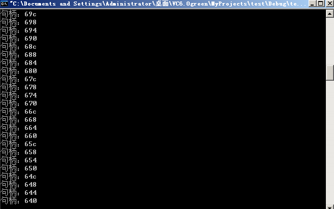
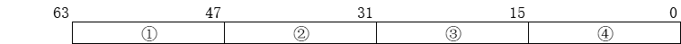
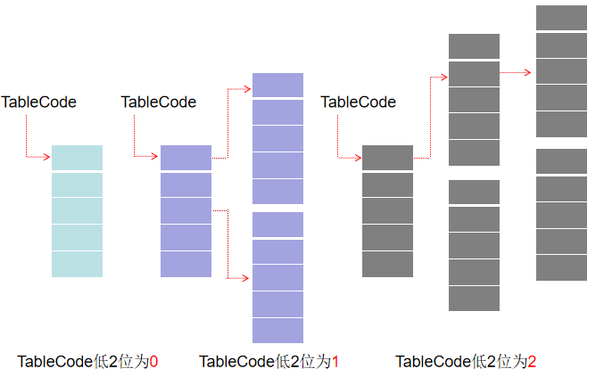
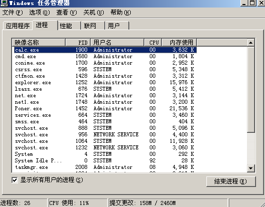
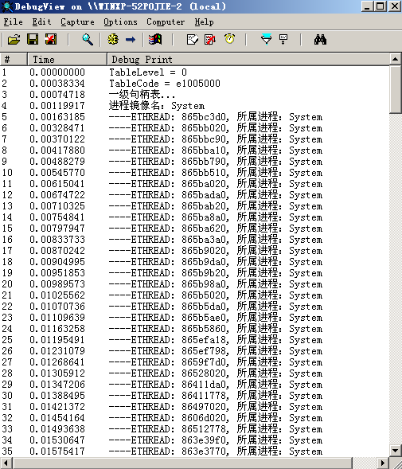
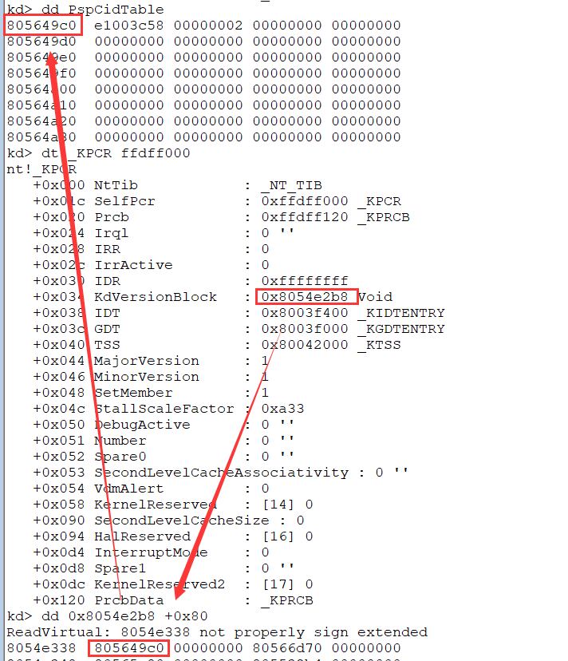

[toc]


# 01.句柄表

1. 当一个进程创建或者打开一个内核对象时，将获得一个句柄，通过这个句柄可以访问对应的内核对象

2. 句柄表存储在零环，一个进程使用了几个句柄，在该进程的句柄表中就会存储几个句柄

3. 所有的句柄所对应的内核对象，都包含在**_OBJECT_HEADER** 中，真正的内核对象保存在 **_OBJECT_HEADER +0x018 body** 的位置(`ETHREAD`和`EPROCESS`也都放在这个位置)

   ```sh
   kd> dt _OBJECT_HEADER
   nt!_OBJECT_HEADER
      +0x000 PointerCount     : Int4B
      +0x004 HandleCount      : Int4B
      +0x004 NextToFree       : Ptr32 Void
      +0x008 Type             : Ptr32 _OBJECT_TYPE
      +0x00c NameInfoOffset   : UChar
      +0x00d HandleInfoOffset : UChar
      +0x00e QuotaInfoOffset  : UChar
      +0x00f Flags            : UChar
      +0x010 ObjectCreateInfo : Ptr32 _OBJECT_CREATE_INFORMATION
      +0x010 QuotaBlockCharged : Ptr32 Void
      +0x014 SecurityDescriptor : Ptr32 Void
      +0x018 Body             : _QUAD
   ```

1. 窗口、字体、笔刷等句柄与本章所学句柄是两码事

2. 创建句柄不等同于打开句柄，当创建的时候，操作系统会在零环为内核对象分配一个结构体（例如CreateEvent），如果自己或他人打开了这个内核对象（例如OpenProcess），那么将不会再次为这个内核对象分配一个结构体，而是返回一个句柄的索引值

3. 若同一个内核对象被引用了100次，那么在句柄表中就会存储100个内核对象的地址

4. 句柄的值并非如上图所显示的只占4个字节，而是占8个字节，但是句柄表的值仍然按照4个字节进行计算

   计算：`handle = index / 4 * 8`

## 查看句柄表

示例代码：

```c
#include <stdio.h>
#include <windows.h>

int main()
{
	DWORD PID;
	HANDLE hPro = NULL;
	HWND hWnd = ::FindWindow(NULL, "计算器");
	::GetWindowThreadProcessId(hWnd, &PID);
	for(int i=0; i<100 ;i++)
	{
		hPro = ::OpenProcess(PROCESS_CREATE_THREAD|PROCESS_VM_OPERATION|PROCESS_VM_READ|PROCESS_VM_WRITE, TRUE, PID);
		printf("句柄：%x\n", hPro);
	}
	getchar();
	return 0;
}
```

运行结果：




```sh
kd> !process 0 0
...
Failed to get VadRoot
PROCESS 8613b688  SessionId: 0  Cid: 07b4    Peb: 7ffde000  ParentCid: 07ac
    DirBase: 06bc0340  ObjectTable: e35367b8  HandleCount: 116.
    Image: test.exe
------------------------------------------------------------------------------
kd> dt _EPROCESS 8613b688
ntdll!_EPROCESS
   ...
   +0x0c4 ObjectTable      : 0xe35367b8 _HANDLE_TABLE //这里
   ...
------------------------------------------------------------------------------
kd> dt _HANDLE_TABLE 0xe35367b8
nt_exe!_HANDLE_TABLE
   +0x000 TableCode        : 0xe1251000 //这里
   +0x004 QuotaProcess     : 0x8613b688 _EPROCESS
   +0x008 UniqueProcessId  : 0x000007b4 Void
   +0x00c HandleTableLock  : [4] _EX_PUSH_LOCK
   +0x01c HandleTableList  : _LIST_ENTRY [ 0x80565ba8 - 0xe2f363b4 ]
   +0x024 HandleContentionEvent : _EX_PUSH_LOCK
   +0x028 DebugInfo        : (null) 
   +0x02c ExtraInfoPages   : 0n0
   +0x030 FirstFree        : 0x63c
   +0x034 LastFree         : 0
   +0x038 NextHandleNeedingPool : 0x800
   +0x03c HandleCount      : 0n116
   +0x040 Flags            : 0
   +0x040 StrictFIFO       : 0y0
------------------------------------------------------------------------------
kd> dq 0xe1251000
ReadVirtual: e1251000 not properly sign extended
e1251000  fffffffe`00000000 00000000`00000000
e1251010  00000004`00000000 00000008`00000000
e1251020  0000000c`00000000 00000010`00000000
e1251030  00000014`00000000 00000018`00000000
e1251040  0000001c`00000000 00000020`00000000
e1251050  00000024`00000000 00000028`00000000
e1251060  0000002c`00000000 00000030`00000000
e1251070  00000034`00000000 00000038`00000000
```

## 句柄表结构


```sh
kd> dt _HANDLE_TABLE 
nt_exe!_HANDLE_TABLE
   +0x000 TableCode        : Uint4B
   +0x004 QuotaProcess     : Ptr32 _EPROCESS
   +0x008 UniqueProcessId  : Ptr32 Void
   +0x00c HandleTableLock  : [4] _EX_PUSH_LOCK
   +0x01c HandleTableList  : _LIST_ENTRY
   +0x024 HandleContentionEvent : _EX_PUSH_LOCK
   +0x028 DebugInfo        : Ptr32 _HANDLE_TRACE_DEBUG_INFO
   +0x02c ExtraInfoPages   : Int4B
   +0x030 FirstFree        : Uint4B
   +0x034 LastFree         : Uint4B
   +0x038 NextHandleNeedingPool : Uint4B
   +0x03c HandleCount      : Int4B
   +0x040 Flags            : Uint4B
   +0x040 StrictFIFO       : Pos 0, 1 Bit
```

`TableCode`就是的句柄表，结构如下：



1. 这一块共计两个字节，高位字节是给`SetHandleInformation`这个函数用的，比如写成如下形式，那么这个位置将被写入`0x02`

   ```c
   SetHandleInformation(Handle,HANDLE_FLAG_PROTECT_FROM_CLOSE,HANDLE_FLAG_PROTECT_FROM_CLOSE);
   //HANDLE_FLAG_PROTECT_FROM_CLOSE宏的值为0x00000002，取最低字节，最终这块是0x0200
   ```

2. 这块是访问掩码，是给**OpenProess**这个函数用的，具体的存的值就是这个函数的第一个参数的值。

3. ③ 和 ④ 这两个块共计四个字节，其中`bit0-bit2`存的是这个句柄的属性，其中`bit2`和`bit0`默认为`0`和`1`；`bit1`表示的函数是该句柄是否可继承，`OpenProcess`的第二个参数与`bit1`有关，`bit31-bit3`则是存放的该内核对象在内核中的具体的地址。

```sh
//代码中第一个句柄是7cc
kd> dq 0xe1251000+7cc*2
ReadVirtual: e1251f98 not properly sign extended
e1251f98  0000003a`85fcc00b 000f01ff`86187571
e1251fa8  000f037f`86408651 021f0003`85f98551
e1251fb8  020f003f`e2e7dc19 000f037f`86408651
e1251fc8  001f0003`85fc21d1 00100003`85fbb221
e1251fd8  021f0001`e1132cc9 000f000f`e135f6e9
e1251fe8  00100003`8613b5f9 00000003`e156d471
e1251ff8  000f0003`e1001109 63416553`04810600
e1252008  00000000`e11aec30 864cd650`00000000

kd> dq 0xe1251000+640*2
ReadVirtual: e1251c80 not properly sign extended
e1251c80  0000003a`85fcc00b 0000003a`85fcc00b
e1251c90  0000003a`85fcc00b 0000003a`85fcc00b
e1251ca0  0000003a`85fcc00b 0000003a`85fcc00b
e1251cb0  0000003a`85fcc00b 0000003a`85fcc00b
e1251cc0  0000003a`85fcc00b 0000003a`85fcc00b
e1251cd0  0000003a`85fcc00b 0000003a`85fcc00b
e1251ce0  0000003a`85fcc00b 0000003a`85fcc00b
e1251cf0  0000003a`85fcc00b 0000003a`85fcc00b
```

下面是置句柄表高两字节为0x20

```c
#include <stdio.h>
#include <windows.h>

int main()
{
	DWORD PID;
	HANDLE hPro = NULL;
	HWND hWnd = ::FindWindow(NULL, "计算器");
	::GetWindowThreadProcessId(hWnd, &PID);
	for(int i=0; i<100 ;i++)
	{
		hPro = ::OpenProcess(PROCESS_CREATE_THREAD, TRUE, PID);

		printf("句柄：%x\n", hPro);
	}
	//HANDLE_FLAG_PROTECT_FROM_CLOSE：句柄不可用CloseHandle关闭
	SetHandleInformation(hPro, HANDLE_FLAG_PROTECT_FROM_CLOSE, HANDLE_FLAG_PROTECT_FROM_CLOSE);
	getchar();
	return 0;
}
```

windbg中：

```sh
kd> dq 0xe11cf000+640*2
ReadVirtual: e11cfc80 not properly sign extended
e11cfc80  02000002`85fcc00b 00000002`85fcc00b
e11cfc90  00000002`85fcc00b 00000002`85fcc00b
e11cfca0  00000002`85fcc00b 00000002`85fcc00b
e11cfcb0  00000002`85fcc00b 00000002`85fcc00b
e11cfcc0  00000002`85fcc00b 00000002`85fcc00b
e11cfcd0  00000002`85fcc00b 00000002`85fcc00b
e11cfce0  00000002`85fcc00b 00000002`85fcc00b
e11cfcf0  00000002`85fcc00b 00000002`85fcc00b
```

### 根据句柄定位内核对象

此时该地址指向`_OBJECT_HEADER`，想查看真正的内核对象结构体还要加上0x18

```sh
//根据句柄查找对应的结构体地址：
/清理后三位bit，后四个字节为地址：85fcc008
kd> dt _EPROCESS  85fcc008+18
nt_exe!_EPROCESS
   ...
   +0x174 ImageFileName    : [16]  "calc.exe"
   ...
```

# 02 全局句柄表


## 全局句柄表

1. 进程的句柄表是私有的，每个进程都有一个自己的句柄表。
2. 除此之外，系统还有一个全局句柄表：`PsdCidTable` ，为 **_HANDLE_TABLE** 结构，所有的进程和线程无论无论是否打开，都在这个表中
3. 每个进程和线程都有一个唯一的编号：**PID**和**CID** 这两个值其实就是全局句柄表中的索引
4. 进程和线程的查询,主要是以下三个函数,按照给定的PID或CID从`PspCidTable`从查找相应的进线程对象：

    - `PsLookupProcessThreadByCid()`
    - `PsLookupProcessByProcessId()`
    - `PsLookupThreadByThreadId()`

## 全局句柄表结构


1. 若TableCode的低两位值为0，说明`handle_max = 4KB / 8 = 512`，此时，句柄表为一级句柄表
2. 若打开句柄数量超过512个，TableCode的低两位值就会置为1，此时，句柄表变为两级句柄表。第一级句柄表中每个成员存储着第二级句柄表的地址，第二级句柄表中才真正存储着内核对象的地址，`handle_max = 1024 * 512`
3. 若打开句柄数量超过1024 * 512个，TableCode低两位的值就会置为2，此时，句柄表变为三级句柄表，第一级为地址，第二级也为地址，第三级才是句柄，`handle_max = 1024 * 1024 * 512`
4. 全局句柄表存储了所有 `EPROCESS` 和 `ETHREAD`。和进程的句柄表不同，全局句柄表项低32位指向的就是内核对象，而非 `OBJECT_HEADER`.



### 在WinDbg中查看全局句柄表

这里还是使用计算器举例：




**index = 1900 / 4 = 0x1DB**

```sh
kd> dd PspCidTable
805649c0  e1003c58 00000002 00000000 00000000
805649d0  00000000 00000000 00000000 00000000
805649e0  00000000 00000000 00000000 00000000
805649f0  00000000 00000000 00000000 00000000
80564a00  00000000 00000000 00000000 00000000
80564a10  00000000 00000000 00000000 00000000
80564a20  00000000 00000000 00000000 00000000
80564a30  00000000 00000000 00000000 00000000
------------------------------------------------------------------------------
kd> dt _HANDLE_TABLE e1003c58
ntdll!_HANDLE_TABLE
   +0x000 TableCode        : 0xe1005000
   +0x004 QuotaProcess     : (null) 
   +0x008 UniqueProcessId  : (null) 
   +0x00c HandleTableLock  : [4] _EX_PUSH_LOCK
   +0x01c HandleTableList  : _LIST_ENTRY [ 0xe1003c74 - 0xe1003c74 ]
   +0x024 HandleContentionEvent : _EX_PUSH_LOCK
   +0x028 DebugInfo        : (null) 
   +0x02c ExtraInfoPages   : 0n0
   +0x030 FirstFree        : 0x774
   +0x034 LastFree         : 0x768
   +0x038 NextHandleNeedingPool : 0x800
   +0x03c HandleCount      : 0n253
   +0x040 Flags            : 1
   +0x040 StrictFIFO       : 0y1
------------------------------------------------------------------------------
kd> dq 0xe1005000+1DB*8
ReadVirtual: e1005ed8 not properly sign extended
e1005ed8  00000000`8632fda1 00000000`8632f989
e1005ee8  00000778`00000000 0000077c`00000000
e1005ef8  00000780`00000000 0000078c`00000000
e1005f08  00000000`86475ce9 00000000`864756c1
e1005f18  00000790`00000000 00000794`00000000
e1005f28  00000798`00000000 0000079c`00000000
e1005f38  000007a0`00000000 000007a4`00000000
e1005f48  000007a8`00000000 000007ac`00000000
------------------------------------------------------------------------------
kd> dt _EPROCESS 8632fda0//全局句柄表直接指向内核对象，不用加0x18
nt_exe!_EPROCESS
   ...
   +0x174 ImageFileName    : [16]  "calc.exe"
   ...
```


## 遍历全局句柄表

> 编写程序，通过全局句柄表PsdCidTable，遍历所有进程(包括隐藏进程)。
>
> 打印全局句柄表中内核对象的所有类型
>
> 一、需要解决的问题：
>
> 1、如何通过找到全局句柄表?
>
> 2、如何判断是否是进程?
>
> 二、有用的系统函数：MmGetSystemRoutineAddress
>
> 这个函数用来得到导出函数的地址，优点是：
>
> 1、不会被IAT Hook影响(从内核模块导出表中找函数地址的)
>
> 2、有些内核函数虽然导出了 但并没有函数说明，无法直接使用

```c
//#include <ntddk.h>
//#include <ntstatus.h>
#include <ntifs.h>

//-----------------------------------------------------------------------------------------------------
//-----------------------------------------------------------------------------------------------------

typedef struct _LDR_DATA_TABLE_ENTRY
{
	LIST_ENTRY InLoadOrderLinks;
	LIST_ENTRY InMemoryOrderLinks;
	LIST_ENTRY InInitializationOrderLinks;
	PVOID DllBase;
	PVOID EntryPoint;
	ULONG SizeOfImage;
	UNICODE_STRING FullDllName;
	UNICODE_STRING BaseDllName;
	ULONG Flags;
	UINT16 LoadCount;
	UINT16 TlsIndex;
	LIST_ENTRY HashLinks;
	PVOID SectionPointer;
	ULONG CheckSum;
	ULONG TimeDateStamp;
	PVOID LoadedImports;
	PVOID EntryPointActivationContext;
	PVOID PatchInformation;
} LDR_DATA_TABLE_ENTRY, *PLDR_DATA_TABLE_ENTRY;

typedef struct _HANDLE_TABLE_ENTRY
{

	//
	//  The pointer to the object overloaded with three ob attributes bits in
	//  the lower order and the high bit to denote locked or unlocked entries
	//

	union
	{

		PVOID Object;

		ULONG ObAttributes;

		// PHANDLE_TABLE_ENTRY_INFO InfoTable; // 用不到

		ULONG_PTR Value;
	};

	//
	//  This field either contains the granted access mask for the handle or an
	//  ob variation that also stores the same information.  Or in the case of
	//  a free entry the field stores the index for the next free entry in the
	//  free list.  This is like a FAT chain, and is used instead of pointers
	//  to make table duplication easier, because the entries can just be
	//  copied without needing to modify pointers.
	//

	union
	{

		union
		{

			ACCESS_MASK GrantedAccess;

			struct
			{

				USHORT GrantedAccessIndex;
				USHORT CreatorBackTraceIndex;
			};
		};

		LONG NextFreeTableEntry;
	};

} HANDLE_TABLE_ENTRY, *PHANDLE_TABLE_ENTRY;

typedef struct _OBJECT_TYPE
{
	ERESOURCE Mutex;
	LIST_ENTRY TypeList;
	UNICODE_STRING Name; // Copy from object header for convenience
						 //	PVOID DefaultObject;
						 //	ULONG Index;
						 //	ULONG TotalNumberOfObjects;
						 //	ULONG TotalNumberOfHandles;
						 //	ULONG HighWaterNumberOfObjects;
						 //	ULONG HighWaterNumberOfHandles;
						 //	OBJECT_TYPE_INITIALIZER TypeInfo;
						 // #ifdef POOL_TAGGING
						 //	ULONG Key;
						 // #endif //POOL_TAGGING
						 //	ERESOURCE ObjectLocks[ OBJECT_LOCK_COUNT ];
} OBJECT_TYPE, *POBJECT_TYPE;

typedef struct _OBJECT_HEADER
{
	LONG PointerCount;
	union
	{
		LONG HandleCount;
		PVOID NextToFree;
	};
	POBJECT_TYPE Type;
	UCHAR NameInfoOffset;
	UCHAR HandleInfoOffset;
	UCHAR QuotaInfoOffset;
	UCHAR Flags;
	union
	{
		// POBJECT_CREATE_INFORMATION ObjectCreateInfo;
		PVOID ObjectCreateInfo;
		PVOID QuotaBlockCharged;
	};

	PSECURITY_DESCRIPTOR SecurityDescriptor;
	QUAD Body;
} OBJECT_HEADER, *POBJECT_HEADER;

//-----------------------------------------------------------------------------------------------------
//-----------------------------------------------------------------------------------------------------

VOID DriverUnload(PDRIVER_OBJECT pDriver);
NTSTATUS DriverEntry(PDRIVER_OBJECT pDriver, PUNICODE_STRING reg_path);

//-----------------------------------------------------------------------------------------------------
//-----------------------------------------------------------------------------------------------------

ULONG PspCidTable;

// 驱动入口
NTSTATUS DriverEntry(PDRIVER_OBJECT pDriver, PUNICODE_STRING reg_path)
{
	typedef HANDLE_TABLE_ENTRY *L1P;
	typedef volatile L1P *L2P;
	typedef volatile L2P *L3P;

	int i, j, k;
	ULONG TableCode;
	ULONG TableLevel;
	L1P TableLevel1;
	L2P TableLevel2;
	L3P TableLevel3;
	UNICODE_STRING ProcessString;
	UNICODE_STRING ThreadString;
	ULONG HandleAddr;
	PEPROCESS pEprocess;
	PCHAR ImageFileName;
	POBJECT_HEADER pObjectHeader;

	// 使用 MmGetSystemRoutineAddress 动态获取函数地址可以防 IAT hook
    //这里是用MmGetSystemRoutineAddress实现的
    //https://www.cnblogs.com/wingsummer/p/15864867.html
	PspCidTable = **(PULONG *)((ULONG)PsLookupProcessByProcessId + 26);
	// DbgPrint("PspCidTable = %x\n",PspCidTable);
	TableCode = *(PULONG)PspCidTable;
	// DbgPrint("%x\n", TableCode);
	TableLevel = TableCode & 0x03; // 句柄表等级
	TableCode = TableCode & ~0x03; // 清除等级标志位
	DbgPrint("TableLevel = %x\n", TableLevel);
	DbgPrint("TableCode = %x\n", TableCode);

	RtlInitUnicodeString(&ProcessString, L"Process");
	RtlInitUnicodeString(&ThreadString, L"Thread");

	// 要测试这个程序，可以创建一个进程，进程创建512个线程，
	// 这样全局句柄表的结构就是二级的，就会进入 case 1
	// 如果想测试 case 2，要创建大于 1024 * 512 个内核对象
	switch (TableLevel)
	{
	case 0:
	{
		DbgPrint("一级句柄表...\n");
		TableLevel1 = (L1P)TableCode;
		for (i = 0; i < 512; i++)
		{
			if (MmIsAddressValid(TableLevel1[i].Object))
			{
				// DbgPrint("%x\n",TableLevel1[i].Object);
				HandleAddr = ((ULONG)(TableLevel1[i].Object) & ~0x03);
				pObjectHeader = (POBJECT_HEADER)(HandleAddr - 0x18);

				if (RtlCompareUnicodeString(&pObjectHeader->Type->Name, &ProcessString, TRUE) == 0)
				{
					// DbgPrint("EPROCESS: %x\n", HandleAddr);
					pEprocess = (PEPROCESS)HandleAddr;
					ImageFileName = (PCHAR)pEprocess + 0x174;
					DbgPrint("进程镜像名：%s\n", ImageFileName);
				}
				else if (RtlCompareUnicodeString(&pObjectHeader->Type->Name, &ThreadString, TRUE) == 0)
				{
					pEprocess = (PEPROCESS) * (PULONG)(HandleAddr + 0x220);
					ImageFileName = (PCHAR)pEprocess + 0x174;
					DbgPrint("----ETHREAD: %x, 所属进程：%s\n", HandleAddr, ImageFileName);
				}
				else
				{
					DbgPrint("既不是线程也不是进程 0x%x\n", HandleAddr); // 应该是不可能的...因为全局句柄表只存进程和线程
				}
			}
		}
		break;
	}
	case 1:
	{
		DbgPrint("二级句柄表...\n");
		TableLevel2 = (L2P)TableCode;
		for (i = 0; i < 1024; i++)
		{
			if (MmIsAddressValid((PVOID)((PULONG)TableLevel2)[i]))
			{
				for (j = 0; j < 512; j++)
				{
					if (MmIsAddressValid(TableLevel2[i][j].Object))
					{
						HandleAddr = ((ULONG)(TableLevel2[i][j].Object) & ~0x03);
						pObjectHeader = (POBJECT_HEADER)(HandleAddr - 0x18);
						if (RtlCompareUnicodeString(&pObjectHeader->Type->Name, &ProcessString, TRUE) == 0)
						{
							// DbgPrint("EPROCESS: %x\n", HandleAddr);
							pEprocess = (PEPROCESS)HandleAddr;
							ImageFileName = (PCHAR)pEprocess + 0x174;
							DbgPrint("进程镜像名：%s\n", ImageFileName);
						}
						else if (RtlCompareUnicodeString(&pObjectHeader->Type->Name, &ThreadString, TRUE) == 0)
						{
							pEprocess = (PEPROCESS) * (PULONG)(HandleAddr + 0x220);
							ImageFileName = (PCHAR)pEprocess + 0x174;
							DbgPrint("----ETHREAD: %x, 所属进程：%s\n", HandleAddr, ImageFileName);
						}
						else
						{
							DbgPrint("既不是线程也不是进程 0x%x\n", HandleAddr); // 应该是不可能的...因为全局句柄表只存进程和线程
						}
					}
				}
			}
		}
		break;
	}
	case 2:
	{
		DbgPrint("三级句柄表...\n");
		TableLevel3 = (L3P)TableCode;
		for (i = 0; i < 1024; i++)
		{
			if (MmIsAddressValid((PVOID)((PULONG)TableLevel3)[i]))
			{
				for (j = 0; j < 1024; j++)
				{
					if (MmIsAddressValid((PVOID)((PULONG *)TableLevel3)[i][j]))
					{
						for (k = 0; k < 512; k++)
						{
							if (MmIsAddressValid(TableLevel3[i][j][k].Object))
							{
								HandleAddr = ((ULONG)(TableLevel3[i][j][k].Object) & ~0x03);
								pObjectHeader = (POBJECT_HEADER)(HandleAddr - 0x18);
								if (RtlCompareUnicodeString(&pObjectHeader->Type->Name, &ProcessString, TRUE) == 0)
								{
									// DbgPrint("EPROCESS: %x\n", HandleAddr);
									pEprocess = (PEPROCESS)HandleAddr;
									ImageFileName = (PCHAR)pEprocess + 0x174;
									DbgPrint("进程镜像名：%s\n", ImageFileName);
								}
								else if (RtlCompareUnicodeString(&pObjectHeader->Type->Name, &ThreadString, TRUE) == 0)
								{
									pEprocess = (PEPROCESS) * (PULONG)(HandleAddr + 0x220);
									ImageFileName = (PCHAR)pEprocess + 0x174;
									DbgPrint("----ETHREAD: %x, 所属进程：%s\n", HandleAddr, ImageFileName);
								}
								else
								{
									DbgPrint("既不是线程也不是进程 0x%x\n", HandleAddr); // 应该是不可能的...因为全局句柄表只存进程和线程
								}
							}
						}
					}
				}
			}
		}
		break;
	}
	}

	pDriver->DriverUnload = DriverUnload;
	return STATUS_SUCCESS;
}

// 卸载驱动
VOID DriverUnload(PDRIVER_OBJECT pDriver)
{
	DbgPrint("Driver unloaded.\n");
}

ULONG GetHandleFromTable(ULONG TableCode, ULONG Handle)
{
	return 0;
}

```



找全局句柄表也可以这么写：

KPCR有一个成员，**KdVersionBlock**。这个成员非常奇妙，在他指向地址（+0x80）位置处有一个地址，这个地址指向的就是PspCidTable。

(当线程运行在R0下时, FS指向的段是GDT中的0x30段.该段的长度也为4K,基地址为0xFFDFF000.该地址指向系统的处理器控制区域（KPCR）)

```c
	PULONG PspCidTable, TableCode;
	PUCHAR pEPROCESS;
	_asm {
		mov eax, fs:[0x34]
		mov eax, [eax + 0x80]
		mov eax, [eax]
		mov PspCidTable, eax
		mov eax, [eax]
		mov TableCode, eax
	}
```




Ref：

> https://drunkmars.top/2021/03/13/readme/
>
> https://cataloc.gitee.io/blog/2020/04/26/%E5%85%A8%E5%B1%80%E5%8F%A5%E6%9F%84%E8%A1%A8/
>
> https://blog.csdn.net/Kwansy/article/details/109853108
>
> https://www.cnblogs.com/wingsummer/p/15864867.html