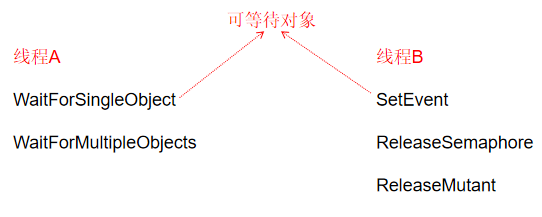
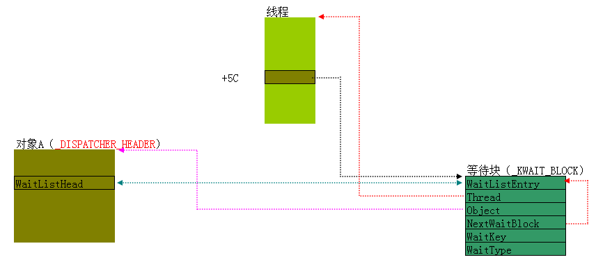
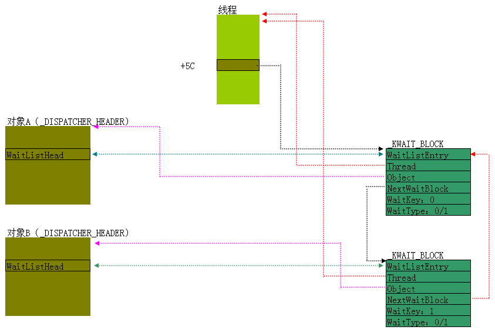
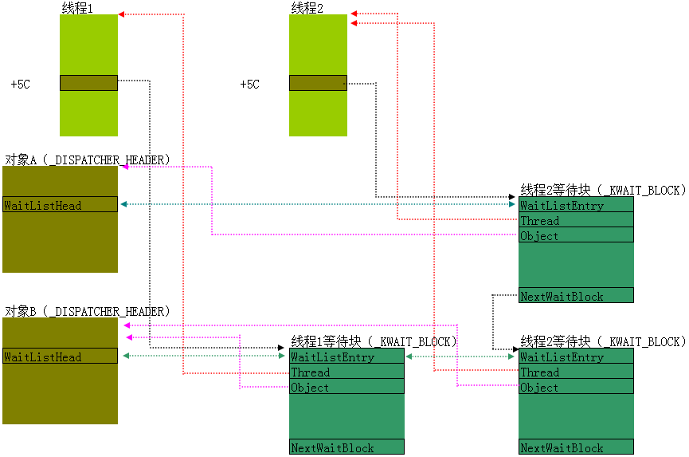
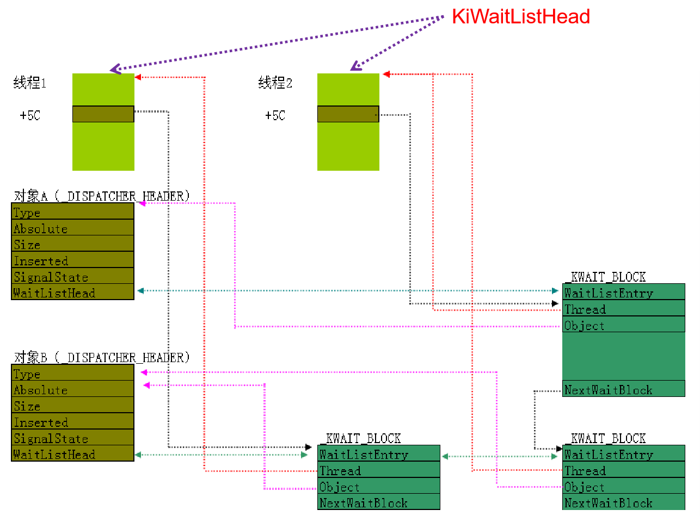
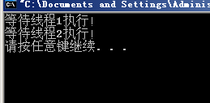
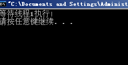
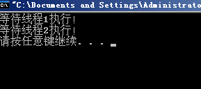
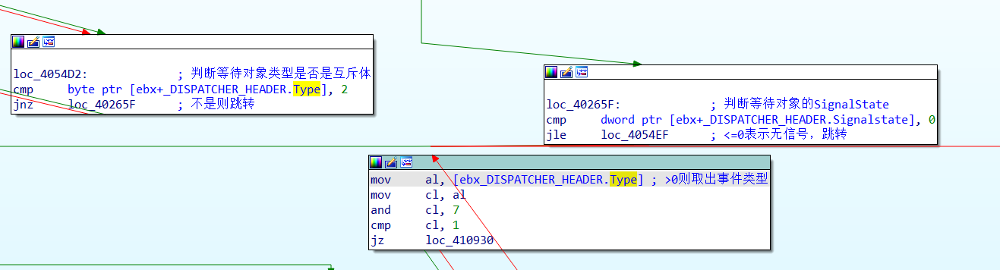

[toc]


# 01.临界区

> 这个部分在驱动那一部分写了，这里就直接复制粘贴过来了

1. 并发是指多个线程在同时执行：
   - 单核（是分时执行，不是真正的同时）
   - 多核（在某一个时刻，会同时有多个线程再执行）
2. 同步则是保证在并发执行的环境中各个线程可以有序的执行

## 单行指令的同步

```c
DWORD dwVal = 0;	//全局变量
....
....    
//某个线程中
dwVal++;		//这行代码是否安全？
```

实际上是**不安全**的，

```asm
mov eax, [0x12345678]
add eax, 1
mov [0x12345678], eax
```

程序**在执行dwVal++时**，**需要按**照顺序**执行3条汇编指令**，才能实现这条语句的功能。

现在我们来考虑一种情况，线程A和线程B均要进行dwVal++这条指令，理想状态下，这两个线程执行完后，该全局变量的值会增加2。但是**如果在线程A执行完第二条指令后**，**发生了线程切换**，情况就会变的不一样了。

```asm
//线程A
mov eax, [0x12345678]
add eax, 1

//发生线程切换
//线程B
mov eax, [0x12345678]
add eax, 1
mov [0x12345678], eax

//发生线程切换
//线程A
mov [0x12345678], eax
```

那单行指令安全吗？

```asm
inc dword ptr ds:[0x12345678]	//一行汇编指令，安全吗?
```

这条汇编指令仅有一行，看上去不会出现上述的情况。即使线程发生切换了，也不会造成指令的重复执行。的确，在**单核**的情况下，这条指令是**安全**的，但是**多核**的情况下，还是有可能发生，不同线程同时执行这条指令的情况，所以这条指令并**不安全**。那如何才能在多核的情况下，依旧保证线程间的同步呢？那就需要用到下面介绍的这条指令了。

### Lock指令

只需要增加一个lock指令，就能让**单条指令**在多核的情况下做到同步，

```asm
lock inc dword ptr ds:[0x12345678]
```

**lock指令可以锁定当前指令执行时线程所访问的内存**，上述代码执行时，会对0x12345678地址处的值进行修改，**有了lock指令**的限制，此时**其它线程**是**不能访问或修改0x12345678地址处的值**的，只有在这条指令执行完后，其余线程才可以对此地址的值进行访问或者修改。这样就避免了多核情况下，不同线程同时修改此地址处的值的情况。

像上面这样通过Lock指令进行限制，从而**不可被中断的操作**叫做**原子操作**。Windows提供了一部分API（主要位于Kernel32.dll和Ntdll.dll）供用户使用从而保证在多核情况下的线程同步：

```c
//原子操作相关的API：
InterlockedIncrement			InterlockedExchangeAdd
InterlockedDecrement			InterlockedFlushSList		
InterlockedExchange			InterlockedPopEntrySList
InterlockedCompareExchange		InterlockedPushEntrySList
```

### InterlockedIncrement

挑一个来分析，该API在kernel32.dll中

```asm
.text:7C809806 ; LONG __stdcall InterlockedIncrement(volatile LONG *lpAddend)
.text:7C809806                 public InterlockedIncrement
.text:7C809806 InterlockedIncrement proc near          ; CODE XREF: CreatePipe+57↓p
.text:7C809806                                         ; sub_7C82CBB2+41↓p ...
.text:7C809806
.text:7C809806 lpAddend        = dword ptr  4
.text:7C809806
.text:7C809806                 mov     ecx, [esp+lpAddend]
.text:7C80980A                 mov     eax, 1          ; 将需要修改的变量的地址赋给ecx，此时可以通过[ecx]访问该变量的值
.text:7C80980F
.text:7C80980F loc_7C80980F:                           ; DATA XREF: .data:off_7C88500C↓o
.text:7C80980F                 lock xadd [ecx], eax    ; 第一部分是lock，用来锁住内存；另一部分核心在于xadd指令，该指令接收2个参数，先交换两个操作数的值，再进行算术加法操作:
.text:7C80980F                                         ; DWORD　temp;
.text:7C80980F                                         ; temp = [ecx];
.text:7C80980F                                         ; [ecx] = eax;
.text:7C80980F                                         ; eax = temp;
.text:7C80980F                                         ; [ecx] += eax;
.text:7C809813                 inc     eax             ; eax自增1，此时eax和[ecx]的值相同，eax可以起到返回值的作用（尽管已经完成对[ecx]值的修改）
.text:7C809814                 retn    4
.text:7C809814 InterlockedIncrement endp
```


## 多行指令的同步

### 临界区

可以设置一个临界区：一次只允许一个线程进入直到离开，从而保证线程的同步（这里的临界区指的是广义的临界区，各个操作系统根据临界区的思想都有各自的实现，后面也会学习到Windows提供的临界区实现）参考如下代码：

```c
DWORD dwFlag = 0;		//实现临界区的方式就是加锁
						//锁：全局变量  进去加一 出去减一
if(dwFlag  == 0)		//进入临界区	
{	
	dwFlag   = 1	
	.......
	.......
	.......
		
	dwFlag   = 0		//离开临界区
}
```

仔细观察一遍这个代码，其实是有问题的，考虑一种情况，在进入临界区后，如果dwFlag = 1这条指令还没有执行，此时发生了线程切换，这时，切换后的新线程也可以进入临界区，这样临界区的作用就失效了。

### 自己实现临界区

```asm
//定义全局变量
Flag = 0;

//进入临界区
Lab：
	mov eax,1
	//多核情况下必须加lock
	lock xadd [Flag],eax
	cmp eax,0
	jz endLab
	dec [Flag]
	//线程等待Sleep..
	jmp Lab

//临界区内部
endLab:
	ret
	
//离开临界区
lock dec [Flag]
```

这份伪代码提供了一个新的思路，在进入临界区之前，先判断锁的值，若达到进入临界区的条件，则**先修改锁的值**，**再进入临界区**；**若条件不符合**，则调用sleep()函数，进行**线程等待**。一段时间后，在跳回进入临界区的地方重新判断。在**线程退出临界区**后，**再**通过原子操作**还原锁的值**。


# 02.自旋锁

> [多核同步之自旋锁](https://cataloc.gitee.io/blog/2020/05/09/%E5%A4%9A%E6%A0%B8%E5%90%8C%E6%AD%A5%E4%B9%8B%E8%87%AA%E6%97%8B%E9%94%81/)
>
> [自旋锁 ， cmpxchg8b 指令](https://blog.csdn.net/Kwansy/article/details/109995196)
>
> [多核同步&内核重载](https://blog.csdn.net/qq_41988448/article/details/103585673)
>
> [读书笔记之《Windows内核原理与实现》](https://blog.csdn.net/whatday/article/details/13170495)

Windows提供的一种实现多核同步的机制：**自旋锁**。

```
//单核
ntkrnlpa.exe					2-9-9-12分页
ntoskrnl.exe					10-10-12分页

//多核:
ntkrnlpa.exe（ntkrpamp.exe）			2-9-9-12分页
ntoskrnl.exe（ntkrnlmp.exe）			10-10-12分页
```

Intel的CPU，**多核情况下**，**系统安装时将ntkrnlmp.exe拷贝为ntoskrnl.exe**，系统加载时加载这个（原来是ntkrnlmp.exe的）ntoskrnl.exe。所以Intel多核情况下，内核**文件名仍然是ntoskrnl.exe**，但是其**源文件名是ntkrnlmp.exe**，如果加载符号，符号文件名也是ntkrnlmp.pdb。也因此，单核，多核情况下都叫做ntoskrnl.exe。

注意设置虚拟机CPU核心数量，

> 用一个例子来解释临界区和自旋锁的区别。只有一个厕所，有一个人进去了。
>
> 临界区就是外面的人过来看一眼发现没位子，就回家睡觉了，睡醒了再回来看看有没有位子，重复这样的步骤；
>
> 自旋锁就是外面人一看没位置，他就在原地打转，一有位子马上就进去了。
>

## KeAcquireSpinLockAtDpcLevel

> [BT、BTS、BTR、BTC: 位测试指令](https://www.cnblogs.com/del/archive/2010/04/15/1712467.html)

首先介绍两个指令，一个是bt一个是bts：


- BT(Bit Test)：位测试

  ```asm
  ;BT 把 10000001b 的第七位复制到 CF, 得知是 1
  mov dx, 10000001b
  bt  dx, 7
  ```


- BTS(Bit Test and Set：位测试并置位

  ```asm
  ;BTS 在执行 BT 命令的同时, 把操作数的指定位置为 1
  mov dx, 10000001b
  bts dx, 6
  ```


单核的是直接retn了。

多核：

```asm
text:0040B38B ; __stdcall KeAcquireSpinLockAtDpcLevel(x)
.text:0040B38B                 public _KeAcquireSpinLockAtDpcLevel@4
.text:0040B38B _KeAcquireSpinLockAtDpcLevel@4 proc near
.text:0040B38B
.text:0040B38B arg_0           = dword ptr  4
.text:0040B38B
.text:0040B38B                 mov     ecx, [esp+arg_0]
.text:0040B38F
.text:0040B38F loc_40B38F:                             ; CODE XREF: KeAcquireSpinLockAtDpcLevel(x)+14↓j
.text:0040B38F                 lock bts dword ptr [ecx], 0 ;
.text:0040B38F                                         ; 1.先判断[ecx]是否为0，是的话CF=1，否则为0
.text:0040B38F                                         ; 2.将[ecx]指定的下标置1
.text:0040B38F                                         ; 加lock保证多核情况下的安全
.text:0040B394                 jb      short loc_40B399 ;
.text:0040B394                                         ; 如果[ecx]!=0则跳转
.text:0040B394                                         ; 如果[ecx]==0说明没有线程进入当前临界区
.text:0040B396                 retn    4
.text:0040B399 ; ---------------------------------------------------------------------------
.text:0040B399
.text:0040B399 loc_40B399:                             ; CODE XREF: KeAcquireSpinLockAtDpcLevel(x)+9↑j
.text:0040B399                                         ; KeAcquireSpinLockAtDpcLevel(x)+18↓j
.text:0040B399                 test    dword ptr [ecx], 1 ; 如果[ecx]!=1则跳转
.text:0040B399                                         ; 如果[ecx]==1说明当前资源被占用
.text:0040B39F                 jz      short loc_40B38F ; 跳到开头再来KeAcquireSpinLockAtDpcLevel
.text:0040B3A1                 pause                   ; CPU降温指令，短时间内降低CPU功率
.text:0040B3A3                 jmp     short loc_40B399 ; 重复执行这几行指令，故称为自旋锁
.text:0040B3A3 _KeAcquireSpinLockAtDpcLevel@4 endp
```

## 思考题

 -  如何HOOK高并发的内核函数？

   > 这个问题的关键是，hook 后一般是 e8 / e9 后跟4字节，总共5字节，但没办法一次性改5个字节，可能改了第一个字节，正要改后4个字节时，别的线程进来了，就会出错。
   >
   > 有三种办法：
   >
   > - 短跳中转
   > - 中断门
   > - 找一条一次性修改8字节的指令
   
   1. 先在附近未使用的内存空间构造一个**长跳转**（五个字节），再在要hook的地方构造一个**短跳转**（一次性写入两个字节）指向长跳转位置
   2. 使用 **cmpxchg8b** 指令最多可一次性写入**八个字节**

------------------

**cmpxchg8b**指令

> cmpxchg8b mem64 指令的工作如下：
> 比较 mem64 和 EDX:EAX
> 如果相等，那么把 ECX:EBX 存储到 mem64
> 如果不相等，那么把 mem64 存储到 EDX:EAX

# 03.线程等待与唤醒

上两节中无论是自己实现的临界区还是win自旋锁都会让当前线程进入等待状态，一个是sleep实现，一个是让当前的CPU”空转”(pause)实现，但都有局限性：

1. sleep：时间如何确定？
2. pause：只有等待时间很短的情况下才有意义，否则对CPU资源是种浪费。而且自旋锁只能在多核的环境下才有意义

## 等待与唤醒机制

在Windows中，一个线程可以通过等待一个或者多个可等待对象，从而进入等待状态，另一个线程可以在某些时刻唤醒等待这些对象的其他线程



### 可等待对象

结构体中包含`_DISPATCHER_HEADER`，都为可等待对象

```
dt _KPROCESS		进程
dt _KTHREAD			线程
dt _KTIMER			定时器
dt _KSEMAPHORE		信号量
dt _KEVENT			事件
dt _KMUTANT			互斥体
dt _FILE_OBJECT		文件
```

### 可等待对象的差异

其差异如下，在NtWaitForSingleObject如果不是可等待对象，其会插入一个_DISPATCH_HEADER结构体，使其变为可等待对象。

```c
WaitForSingleObject(3环) ->

NtWaitForSingleObject(内核)->
	通过3环用户提供的句柄，找到等待对象的内核地址。
	如果是以 _DISPATCHER_HEADER 开头，直接使用。
	如果不是以 _DISPATCHER_HEADER 开头的对象,则找到在其中嵌入的 _DISPATCHER_HEADER 对象

KeWaitForSingleObject(内核) //核心功能
```


## 等待网

先介绍简单的

### 一个线程等待一个内核对象

> 这里会讲等待块的内容，

示例代码：

```c
#include <stdio.h>
#include <windows.h>

HANDLE hEvent[2];

DWORD WINAPI ThreadProc(LPVOID lpParamter)
{
	::WaitForSingleObject(hEvent[0], -1);

	printf("ThreadProc函数执行\n");
	return 0;
}


int main(int argc, char* argv[])
{
	hEvent[0] = ::CreateEvent(NULL, TRUE, FALSE, NULL);		//创建一个可等待对象 _KEVENT

	::CreateThread(NULL, 0, (LPTHREAD_START_ROUTINE)ThreadProc, NULL, 0, NULL);
	
	getchar();
	return 0;
}
```

windbg中找到该进程，查看该进程：

```
kd> !process 8630a020  
Failed to get VadRoot
PROCESS 8630a020  SessionId: 0  Cid: 01f4    Peb: 7ffd5000  ParentCid: 0790
    DirBase: 06bc0260  ObjectTable: e25bd1f0  HandleCount:  12.
    Image: test.exe
    VadRoot 00000000 Vads 0 Clone 0 Private 36. Modified 0. Locked 0.
    DeviceMap e1b1c3f8
    Token                             e108ed48
    ElapsedTime                       00:00:08.156
    UserTime                          00:00:00.015
    KernelTime                        00:00:00.000
    QuotaPoolUsage[PagedPool]         0
    QuotaPoolUsage[NonPagedPool]      0
    Working Set Sizes (now,min,max)  (177, 50, 345) (708KB, 200KB, 1380KB)
    PeakWorkingSetSize                177
    VirtualSize                       7 Mb
    PeakVirtualSize                   7 Mb
    PageFaultCount                    170
    MemoryPriority                    FOREGROUND
    BasePriority                      8
    CommitCharge                      47

        THREAD 864608b8  Cid 01f4.01ec  Teb: 7ffdf000 Win32Thread: 00000000 WAIT: (WrLpcReply) UserMode Non-Alertable
            86460aac  Semaphore Limit 0x1
        Waiting for reply to LPC MessageId 00008497:
        Current LPC port e14fa8b8
        Not impersonating
        DeviceMap                 e1b1c3f8
        Owning Process            00000000       Image:         
        Attached Process          8630a020       Image:         test.exe
        Wait Start TickCount      30765          Ticks: 520 (0:00:00:08.125)
        Context Switch Count      19             IdealProcessor: 0             
        UserTime                  00:00:00.000
        KernelTime                00:00:00.000
        Win32 Start Address 0x00401570
        Stack Init ee42f000 Current ee42ec50 Base ee42f000 Limit ee42c000 Call 00000000
        Priority 10 BasePriority 8 PriorityDecrement 2 IoPriority 0 PagePriority 0
        ChildEBP RetAddr      
        ee42ec68 8050493e     nt!KiSwapContext+0x2f (FPO: [Uses EBP] [0,0,4])
        ee42ec74 804fc0d8     nt!KiSwapThread+0x8a (FPO: [0,0,0])
        ee42ec9c 805a43e7     nt!KeWaitForSingleObject+0x1c2 (FPO: [Non-Fpo])
        ee42ed50 805427e8     nt!NtRequestWaitReplyPort+0x63d (FPO: [Non-Fpo])
    <Intermediate frames may have been skipped due to lack of complete unwind>
        ee42ed50 7c92e4f4 (T) nt!KiSystemServicePostCall (FPO: [0,0] TrapFrame @ ee42ed64)
WARNING: Frame IP not in any known module. Following frames may be wrong.
    <Intermediate frames may have been skipped due to lack of complete unwind>
        0012fce4 00000000 (T) 0x7c92e4f4

        THREAD 86101020  Cid 01f4.03b8  Teb: 7ffde000 Win32Thread: 00000000 WAIT: (UserRequest) UserMode Non-Alertable
            85fd1468  NotificationEvent
        Not impersonating
        DeviceMap                 e1b1c3f8
        Owning Process            00000000       Image:         
        Attached Process          8630a020       Image:         test.exe
        Wait Start TickCount      30765          Ticks: 520 (0:00:00:08.125)
        Context Switch Count      2              IdealProcessor: 0             
        UserTime                  00:00:00.000
        KernelTime                00:00:00.000
        Win32 Start Address 0x00401005
        Stack Init ee657000 Current ee656ca0 Base ee657000 Limit ee654000 Call 00000000
        Priority 8 BasePriority 8 PriorityDecrement 0 IoPriority 0 PagePriority 0
        ChildEBP RetAddr      
        ee656cb8 8050493e     nt!KiSwapContext+0x2f (FPO: [Uses EBP] [0,0,4])
        ee656cc4 804fc0d8     nt!KiSwapThread+0x8a (FPO: [0,0,0])
        ee656cec 805c17c8     nt!KeWaitForSingleObject+0x1c2 (FPO: [Non-Fpo])
        ee656d50 805427e8     nt!NtWaitForSingleObject+0x9a (FPO: [Non-Fpo])
    <Intermediate frames may have been skipped due to lack of complete unwind>
        ee656d50 7c92e4f4 (T) nt!KiSystemServicePostCall (FPO: [0,0] TrapFrame @ ee656d64)
WARNING: Frame IP not in any known module. Following frames may be wrong.
    <Intermediate frames may have been skipped due to lack of complete unwind>
        0052ff44 00000000 (T) 0x7c92e4f4
```

一般来说，最后一个就是我们想要找的线程：

```
kd> dt _KTHREAD 86101020
nt!_KTHREAD
   ...
   +0x05c WaitBlockList    : 0x86101090 _KWAIT_BLOCK
   +0x060 WaitListEntry    : _LIST_ENTRY [ 0x85fd7ad0 - 0x86460918 ]
   +0x060 SwapListEntry    : _SINGLE_LIST_ENTRY
   ...
```

这里重点关注0x5c的位置，是**等待块**：

```
kd> dt _KWAIT_BLOCK 0x86101090
nt!_KWAIT_BLOCK
   +0x000 WaitListEntry    : _LIST_ENTRY [ 0x85fd1470 - 0x85fd1470 ]
   +0x008 Thread           : 0x86101020 _KTHREAD
   +0x00c Object           : 0x85fd1468 Void
   +0x010 NextWaitBlock    : 0x86101090 _KWAIT_BLOCK
   +0x014 WaitKey          : 0
   +0x016 WaitType         : 1
```

这就是我们要找的等待块。由于线程只等待一个事件对象，所以只有一个可用的等待块，这里为什么说是可用的。因为虽然有4个等待块，最后一个也就是第四个等待块已经被占坑了，也就是我们调用`WaitForSingleObject`函数后的等待超时时间，如果是某一个值，第四个等待块就会启用，也就是计时器。第四个等待块：

```
kd> dt _KWAIT_BLOCK 0x86101090+18*3
nt!_KWAIT_BLOCK
   +0x000 WaitListEntry    : _LIST_ENTRY [ 0x86101118 - 0x86101118 ]
   +0x008 Thread           : 0x86101020 _KTHREAD
   +0x00c Object           : 0x86101110 Void
   +0x010 NextWaitBlock    : (null) 
   +0x014 WaitKey          : 0x102
   +0x016 WaitType         : 1
```

- `WaitKey`是指等待块的索引，但是对于第四个等待块，它是特殊的，被赋予了比较大的值`0x102`

- `Thread`指向当前线程

- `Object`指的是被等待的对象的地址

  - 看一下是不是事件：

    ```sh
    kd> dt _OBJECT_HEADER 0x85fd1468-18
    nt!_OBJECT_HEADER
       +0x000 PointerCount     : 0n2
       +0x004 HandleCount      : 0n1
       +0x004 NextToFree       : 0x00000001 Void
       +0x008 Type             : 0x865bb360 _OBJECT_TYPE
       +0x00c NameInfoOffset   : 0 ''
       +0x00d HandleInfoOffset : 0 ''
       +0x00e QuotaInfoOffset  : 0 ''
       +0x00f Flags            : 0 ''
       +0x010 ObjectCreateInfo : 0x8633f860 _OBJECT_CREATE_INFORMATION
       +0x010 QuotaBlockCharged : 0x8633f860 Void
       +0x014 SecurityDescriptor : (null) 
       +0x018 Body             : _QUAD
    kd> dt _OBJECT_TYPE 0x865bb360 
    nt!_OBJECT_TYPE
       +0x000 Mutex            : _ERESOURCE
       +0x038 TypeList         : _LIST_ENTRY [ 0x865bb398 - 0x865bb398 ]
       +0x040 Name             : _UNICODE_STRING "Event"
       +0x048 DefaultObject    : (null) 
       +0x04c Index            : 9
       +0x050 TotalNumberOfObjects : 0x4b7
       +0x054 TotalNumberOfHandles : 0x4ed
       +0x058 HighWaterNumberOfObjects : 0x4f2
       +0x05c HighWaterNumberOfHandles : 0x52b
       +0x060 TypeInfo         : _OBJECT_TYPE_INITIALIZER
       +0x0ac Key              : 0x6e657645
       +0x0b0 ObjectLocks      : [4] _ERESOURCE
    ```

- `NextWaitBlock`指向的就是下一个等待块的地址

- `WaitType`是等待类型

- `WaitListEntry`这个成员，需要看一下被等待对象的`Head`成员

  ```sh
  kd> dt _KEVENT 0x85fd1468
  nt!_KEVENT
     +0x000 Header           : _DISPATCHER_HEADER
  kd> dt _DISPATCHER_HEADER 0x85fd1468
  nt!_DISPATCHER_HEADER
     +0x000 Type             : 0 ''
     +0x001 Absolute         : 0xfc ''
     +0x002 Size             : 0x4 ''
     +0x003 Inserted         : 0x86 ''
     +0x004 SignalState      : 0n0
     +0x008 WaitListHead     : _LIST_ENTRY [ 0x86101090 - 0x86101090 ]
  kd> dt _LIST_ENTRY 0x85fd1468+8
  nt!_LIST_ENTRY
   [ 0x86101090 - 0x86101090 ]
     +0x000 Flink            : 0x86101090 _LIST_ENTRY [ 0x85fd1470 - 0x85fd1470 ]
     +0x004 Blink            : 0x86101090 _LIST_ENTRY [ 0x85fd1470 - 0x85fd1470 ]
  ```

  被等待对象的`Header`成员中的`WaitListHead`会把用来等待它的等待块通过`WaitListEntry`串起来，这个就是该成员的作用。



### 一个线程等待多个内核对象

这样的话，上面的图就变成了这样：



示例代码：

```c
#include <stdio.h>
#include <windows.h>

HANDLE hEvent[2];

DWORD WINAPI ThreadProc(LPVOID lpParamter)
{
	::WaitForMultipleObjects(2, hEvent, FALSE, -1);

	printf("ThreadProc函数执行\n");
	return 0;
}


int main(int argc, char* argv[])
{
	hEvent[0] = ::CreateEvent(NULL, TRUE, FALSE, NULL);		//创建可等待对象
	hEvent[1] = ::CreateEvent(NULL, TRUE, FALSE, NULL);		//创建可等待对象

	::CreateThread(NULL, 0, (LPTHREAD_START_ROUTINE)ThreadProc, NULL, 0, NULL);
	
	getchar();
	return 0;
}

```

wingdb：

```sh
kd> dt _KTHREAD 86149c68
nt!_KTHREAD
   ...
   +0x05c WaitBlockList    : 0x86149cd8 _KWAIT_BLOCK
   +0x060 WaitListEntry    : _LIST_ENTRY [ 0x86042e00 - 0x86450910 ]
   ...
kd> dt _KWAIT_BLOCK 0x86149cd8 
nt!_KWAIT_BLOCK
   +0x000 WaitListEntry    : _LIST_ENTRY [ 0x86116e20 - 0x86116e20 ]
   +0x008 Thread           : 0x86149c68 _KTHREAD
   +0x00c Object           : 0x86116e18 Void
   +0x010 NextWaitBlock    : 0x86149cf0 _KWAIT_BLOCK
   +0x014 WaitKey          : 0
   +0x016 WaitType         : 1
kd> dt _KWAIT_BLOCK 0x86149cf0 
nt!_KWAIT_BLOCK
   +0x000 WaitListEntry    : _LIST_ENTRY [ 0x85feeff8 - 0x85feeff8 ]
   +0x008 Thread           : 0x86149c68 _KTHREAD
   +0x00c Object           : 0x85feeff0 Void
   +0x010 NextWaitBlock    : 0x86149cd8 _KWAIT_BLOCK
   +0x014 WaitKey          : 1
   +0x016 WaitType         : 1
```

### 等待网

一个一个线程交错起来，有的被等待对象同时被多个线程等待，就会形成错综复杂的网络，也就是所谓的等待网：



## 总结

1. 等待中的线程，一定在等待链表中(`KiWaitListHead`)，同时也一定在这张网上(`KTHREAD +5C`的位置不为空)
2. 线程通过调用`WaitForSingleObject`/`WaitForMultipleObjects`函数将自己挂到这张网上
3. 线程什么时候会再次执行取决于其他线程何时调用相关函数，等待对象不同调用的函数也不同

# 04.WaitForSingleObject函数分析


```c
WaitForSingleObject->
WaitForSingleObjectEx->
进入内核->
NtWaitForSingleObject->
KeWaitForSingleObject
```

## NtWaitForSingleObject

函数原型：

```c
NTSTATUS __stdcall NtWaitForSingleObject(
    HANDLE Handle, //用户层传递的等待对象的句柄
    BOOLEAN Alertable, //KTHREAD结构体的Alertable属性。如果为1，则在插入用户APC时，该线程将被唤醒。注意这里的唤醒只是唤醒该线程执行APC，而不是真正的唤醒。因为如果当前的线程在等待网上，执行完用户APC后，仍然要进入等待状态。
    PLARGE_INTEGER Timeout//Timeout就是超时时间，就算没等待到符合条件到了指定事件也会被唤醒。
)
```

再说下`DISPATCHER_HEADER`这个结构：

```sh
kd> dt _DISPATCHER_HEADER
ntdll!_DISPATCHER_HEADER
   +0x000 Type             : UChar
   +0x001 Absolute         : UChar
   +0x002 Size             : UChar
   +0x003 Inserted         : UChar
   +0x004 SignalState      : Int4B
   +0x008 WaitListHead     : _LIST_ENTRY
```

`Type`是类型，每一个可以被等待的对象的类型是不一样的。具体值需要通过内核初始化代码可以逆向出。不同的类型，`WaitForSingleObject`处理方式是不一样的。`SignalState`指示有没有信号，如果有信号则值大于0。

### 实现

1) 调用`ObReferenceObjectByHandle`函数，通过对象句柄找到等待对象结构体地址。
2) 调用`KeWaitForSingleObject`函数，进入关键循环。

## KeWaitForSingleObject

### 上半部分

1. 准备等待块，当等待对象少于四个时，并不为等待对象分配新的空间，而是向 `_KTHREAD(+70)` 位置的等待块赋值，_KTHREAD(+5C) 指向第一个等待块的位置

   注意：**无论使用与否，`_KTHREAD(+70)`的第四个等待块被定时器占据，如果用的话，将会把定时器与第一个等待块相关联**

2. 如果超时时间不为0，`_KTHREAD(+70)` 第四个等待块与第一个等待块关联起来：

   第一个等待块指向第四个等待块，第四个等待块指向第一个等待块。

3. `_KTHREAD(+5C)` 指向第一个 `_KWAIT_BLOCK`。

4. 进入关键循环

### 关键循环

示例图：



伪代码：

```c
while(true)//每次线程被其他线程唤醒，都要进入这个循环
{
	if(符合激活条件)//1、超时   2、等待对象SignalState>0 
	{
		//1) 修改SignalState
		//2) 退出循环
	}
	else
	{
		if(第一次执行)
		      将当前线程的等待块挂到等待对象的链表(WaitListHead)中;

		//将自己挂入等待队列(KiWaitListHead)，如果调用KeWaitForSingleObject这个函数，线程就会把自己挂到等待链表中
		//切换线程...再次获得CPU时，从这里开始执行
	}
}
//1) 线程将自己+5C位置清0
//2) 释放 _KWAIT_BLOCK 所占内存
```

流程：

1. 判断当前被等待对象是否有信号
2. (每一个线程与等待对象是通过等待块进行关联的，但是对象有一个条件：至少有一个成员为 `_DISPATCHER_HEADER` 结构体)
3. 第一次循环时，若等待对象有信号，但是未超时，就不会将当前线程的等待块挂到等待对象的链表(`WaitListHead`)中，直接修改信号的值，退出循环
4. 第一次循环时，若等待对象未超时，但是无信号，就将当前线程的等待块挂到等待对象的链表(`WaitListHead`)中，将线程自己挂入等待队列(`KiWaitListHead`)，切换线程
5. 当线程将自己挂入等待队列后，需要等待另一个线程将自己唤醒（设置等待对象信号量>0），当其它线程将自己唤醒后，再沿着等待网找是谁唤醒了自己，找到了之后将自己从等待链表(`KiWaitListHead`)中摘出，但并未从等待网中摘出
6. 线程从哪里切换就从哪里复活

## 总结

1. 不同的等待对象，用不同的方法来修改 `_DISPATCHER_HEADER->SignalState`

2. 如果可等待对象是EVENT，其他线程通常使用SetEvent来设置SignalState = 1，并且，将正在等待该对象的其他线程唤醒，也就是从等待链表(`KiWaitListHead`)中摘出来，此时线程临时复活

3. SetEvent函数并不会将线程从等待网上摘下来，是否要下来，由当前线程自己来决定

4. 若使用SetEvent这种函数直接将线程从等待网上摘下来，将会非常麻烦，因为可能有非常多的线程在等待一个对象，无法判断该将谁摘下（一个也线程可能等待着多个对象）

   比如：线程A和线程B同时在等待着一个对象，这时如果有线程C调用了SetEvent（将等待对象的信号量置1），线程A和线程B会被临时唤醒（从`KiWaitLkistHead`摘下），并行进入关键循环，假设线程A先运行，线程A会设置等待对象的信号量<=0，然后将自己从等待网上摘下来，此时线程A彻底复活。线程B再去判断等待对象是否有信号量时，已经没有信号量了，这时线程B会将自己重新挂入等待链表中

5. 不同对象调用API修改信号个数只在细节上有差异，本质上都是一样的


# 05.事件

## 回顾

1. 线程在进入临界区之前会调用`WaitForSingleObject`或者`WaitForMultipleObjects`
2. 此时如果有信号，线程会从函数中退出并进入临界区；如果没有信号那么线程将自己挂入等待链表，然后将自己挂入等待网，最后切换线程
3. 其它线程在适当的时候，调用方法修改被等待对象的`SingleState`，设置为有信号（不同的等待对象，会调用不同的函数），并将等待该对象的其它线程从等待链表中摘掉，这样，当前线程便会在`WaitForSingleObject`或者`WaitForMultipleObjects`恢复执行（在哪切换就在哪开始执行），如果符合唤醒条件，此时会修改`SignalState`的值，并将自己从等待网上摘下来，此时的线程才是真正的唤醒
4. 被等待对象不同，主要差异在以下两点：
   1. 不同的被等待对象，修改`SingnalState`所调用的函数不同
   2. 当前线程一旦被临时唤醒后，会从原来进入等待状态的地方继续执行，不同的等待对象，判断是否符合激活条件和修改`SignalState`的具体操作不同


## CreateEvent参数介绍

SetEvent对应的内核函数：`KeSetEvent`

1) 修改信号值`SignalState`为1

2) 判断对象类型

3) 如果类型为通知类型对象(0)   唤醒所有等待该状态的线程

4) 如果类型为事件同步对象(1)   从链表头找到第一个 


事件的内核结构体：

```
kd> dt _KEVENT
ntdll!_KEVENT
   +0x000 Header           : _DISPATCHER_HEADER
```

就一个必须的`_DISPATCHER_HEADER`，通常用`CreateEvent`函数来进行创建使用这个内核对象，函数原型：

```c
HANDLE WINAPI CreateEventW(
    LPSECURITY_ATTRIBUTES lpEventAttributes,
    BOOL bManualReset,//布尔型，如果为True，则为通知类型对象；反之则为普通的事件同步对象。这个参数影响_DISPATCHER_HEADER的Type值，如果为通知类型对象，它的值为0，否则为1
    BOOL bInitialState,
    LPCWSTR lpName
    );
```

### bManualReset

1. 当**CreateEvent**第二个参数为**TRUE**，系统将事件对象的**Type**设置成**0**，此时对象为通知类型类型
2. 当**CreateEvent**第二个参数为**FALSE**，系统将事件对象的**Type**设置成**1**，此时对象为事件同步对象
3. 当SetEvent函数将信号值（**SignalState**）设置为1时，如果对象**Type**为**0**，唤醒所有等待该状态的线程；如果对象**Type**为**1**，从链表头找到第一个并唤醒

```
kd> dt _DISPATCHER_HEADER
ntdll!_DISPATCHER_HEADER
   +0x000 Type             : UChar
   +0x001 Absolute         : UChar
   +0x002 Size             : UChar
   +0x003 Inserted         : UChar
   +0x004 SignalState      : Int4B
   +0x008 WaitListHead     : _LIST_ENTRY
```

示例代码：

```c
#include <windows.h>
#include <stdlib.h>
#include <stdio.h>
HANDLE hEvent;

DWORD WINAPI ThreadProc1(LPVOID param)
{
   WaitForSingleObject(hEvent,INFINITE);
   puts("等待线程1执行！");
   return 0;
}

DWORD WINAPI ThreadProc2(LPVOID param)
{
   WaitForSingleObject(hEvent,INFINITE);
   puts("等待线程2执行！");
   return 0;
}

int main(int argc, char* argv[])
{
   hEvent = CreateEvent(NULL,TRUE,FALSE,NULL);
   CloseHandle(CreateThread(NULL,NULL,(LPTHREAD_START_ROUTINE)ThreadProc1,NULL,NULL,NULL));
   CloseHandle(CreateThread(NULL,NULL,(LPTHREAD_START_ROUTINE)ThreadProc2,NULL,NULL,NULL));
   SetEvent(hEvent);
   system("pause");
   CloseHandle(hEvent);
   return 0;
}
```

可以看到当第二个参数是True，也就是通知类型对象的时候，两个线程都执行了：



将第二个参数改为False，也就是同步类型对象的时候，只有线程1执行了：



### bInitialState

是否有信号。这个参数设置`_DISPATCHER_HEADER`的`SignalState`初始值的，`TRUE`就是1，反之就是0。将上面的原始代码的第三个参数改为`TRUE`，并注释掉`SetEvent`函数：



## KeWaitForSingleObject



# 06.信号量


## 回顾

线程在进入临界区之前会通过调用`WaitForSingleObject`或者`WaitForMultipleObjects`来判断当前的事件对象是否有信号(SignalState>0),只有当事件对象有信号时，才可以进入临界区(只允许一个线程进入直到退出的一段代码，不单指用`EnterCriticalSection`() 和 `LeaveCriticalSection`() 而形成的临界区)。

通过我们对EVENT对象相关函数的分析，我们发现，EVENT对象的SignalState值只有2种可能：

1：初始化时  或者调用  `SetEvent`
0：`WaitForSingleObject`、`WaitForMultipleObjects`、`ResetEvent` 


## 信号量

**描述**：

1. 在**事件**中，当一个线程进入临界区时，其它所有事件都无法进入临界区
2. **信号量**允许多个线程进入临界区

**优点**：举个例子，在生产者与消费者的问题中，若生产者只有三份，那么开五个消费者线程是没有意义的，信号量的存在正是为了解决这种问题

## CreateSemaphore

信号量内核结构体：

```
kd> dt _KSEMAPHORE
ntdll!_KSEMAPHORE
   +0x000 Header           : _DISPATCHER_HEADER
   +0x010 Limit            : Int4B
```

函数原型

```c
HANDLE WINAPI CreateSemaphoreW(
    LPSECURITY_ATTRIBUTES lpSemaphoreAttributes,
    LONG lInitialCount,//这个参数会影响_DISPATCHER_HEADER的SignalState的值。它不会像事件只设置0或者1，它可以设置更大的数，这个就是实现指定数目线程执行的关键所在。
    LONG lMaximumCount,//信号量内核结构体的Limit部分
    LPCWSTR lpName
    );
```

### 调用流程

```c
ReleaseSemaphore ->
NtReleaseSemaphore ->
KeReleaseSemaphore
```

1) 设置SignalState = SignalState  + N(参数)
2) 通过`WaitListHead`找到所有线程，并从等待链表中摘掉（不从等待网上摘除，说了好多遍了）。


# 07.互斥体

## 为什么有互斥体

互斥体(MUTANT)与事件(EVENT)和信号量(SEMAPHORE)一样，都可以用来进行线程的同步控制几个对象都是内核对象，这就意味着，通过这些对象可以进行跨进程的线程同步控制,比如：

```
A进程中的X线程
					等待对象Z
B进程中的Y线程
```

假设有A进程中的X线程和B进程中的Y线程，它们都在等待内核对象Z。如果B进程的Y线程还没有来得及调用修改`SignalState`的函数，那么等待对象Z将被遗弃，这也就意味着X线程将永远等下去，这种情况下事件和信号量无法解决，互斥体可以解决。

还有一点：重入，或者说死锁

当构造了一个临界区一，等待的对象是A，又在临界区内部构造了一个临界区二，等待对象为A、B、C三个，当临界区一执行完自己的功能后，如果等待的对象为事件或者信号量，那么就必须调用相关API将对象设置为有信号，若进入临界区二前未调用相关API，那么临界区二将永远进入等待状态，这种情况称为死锁。
当一个对象需要重复进入临界区时，若A对象为互斥体，就不会出现死锁。

## 互斥体

互斥体内核结构：

```c
kd> dt _KMUTANT
nt!_KMUTANT
   +0x000 Header           : _DISPATCHER_HEADER
   +0x010 MutantListEntry  : _LIST_ENTRY//拥有互斥体线程 (KTHREAD+0x010 MutantListHead)，是个链表头，圈着当前线程所有的互斥体
   +0x018 OwnerThread      : Ptr32 _KTHREAD//正在拥有互斥体的线程
   +0x01c Abandoned        : UChar//是否已经被放弃不用
   +0x01d ApcDisable       : UChar//是否禁用内核APC

```

### 创建互斥体

`CreateMutex`函数原型：

```c
HANDLE CreateMutex(
LPSECURITY_ATTRIBUTE SlpMutexAttributes, // 指向安全属性的指针
BOOL bInitialOwner, 	// 初始化互斥对象的所有者(是否是该线程)
LPCTSTR lpName 			// 指向互斥对象名的指针
);
```

调用过程：

> `CreateMutex` -> `NtCreateMutant`(内核函数) -> `KeInitializeMutant`(内核函数)

初始化MUTANT结构体：

```c
MUTANT.Header.Type=2;
MUTANT.Header.SignalState=bInitialOwner ? 0 : 1;
MUTANT.OwnerThread=bInitialOwner ? 当前线程 : NULL;
MUTANT.Abandoned=0;
MUTANT.ApcDisable=0;

bInitialOwner==TRUE  将当前互斥体挂入到当前线程的互斥体链表
(KTHREAD+0x010 MutantListHead)
```

### KeWaitForMutexObject


```asm
.text:004054D2 loc_4054D2:                             ; CODE XREF: KeWaitForSingleObject(x,x,x,x,x)+3C1C8↓j
.text:004054D2                 cmp     byte ptr [ebx+_DISPATCHER_HEADER.Type], 2 ; 判断等待的对象类型是否是互斥体
.text:004054D5                 jnz     loc_40265F      ; 不是则跳转
.text:004054DB                 mov     eax, [ebx+_DISPATCHER_HEADER.SignalState]
.text:004054DE                 test    eax, eax        ; 判断信号量是否为0
.text:004054E0                 jg      loc_40261E
.text:004054E6                 cmp     esi, [ebx+18h]  ; nt!_KMUTANT
.text:004054E6                                         ;    +0x000 Header           : _DISPATCHER_HEADER
.text:004054E6                                         ;    +0x010 MutantListEntry  : _LIST_ENTRY
.text:004054E6                                         ;    +0x018 OwnerThread      : Ptr32 _KTHREAD
.text:004054E6                                         ;    +0x01c Abandoned        : UChar
.text:004054E6                                         ;    +0x01d ApcDisable       : UChar
.text:004054E9                 jz      loc_40261E      ; 判断当前线程是否拥有该互斥体
;;;;;;;;;;;;;;;;;;;;;;;;;;;;;;;;;;;;;;;;;;;;;;;;;;;;;;;;;;;;;;;;;;;;;;;;;;;;;;;;;;;;;;;;;;
.text:0040261E loc_40261E:                             ; CODE XREF: KeWaitForSingleObject(x,x,x,x,x)+E0↓j
.text:0040261E                                         ; KeWaitForSingleObject(x,x,x,x,x)+E9↓j
.text:0040261E                 cmp     eax, 80000000h  ; 最多进入次数0x80000000
.text:00402623                 jz      loc_44AB42
.text:00402629                 dec     dword ptr [ebx+_DISPATCHER_HEADER.SignalState] ; 不管什么原因进来的，都会执行这条指令
.text:00402629                                         ; 当SignalState为0是，再次执行得0xFFFFFFFF
.text:0040262C                 jnz     short loc_402657 ; 唤醒原因
.text:0040262E                 movzx   eax, byte ptr [ebx+1Dh] ; nt!_KMUTANT
.text:0040262E                                         ;    +0x000 Header           : _DISPATCHER_HEADER
.text:0040262E                                         ;    +0x010 MutantListEntry  : _LIST_ENTRY
.text:0040262E                                         ;    +0x018 OwnerThread      : Ptr32 _KTHREAD
.text:0040262E                                         ;    +0x01c Abandoned        : UChar
.text:0040262E                                         ;    +0x01d ApcDisable       : UChar
.text:00402632                 sub     [esi+_KTHREAD.KernelApcDisable], eax ; 是否禁用内核APC
.text:00402638                 cmp     byte ptr [ebx+1Ch], 1 ; 判断是否被放弃使用
.text:0040263C                 mov     [ebx+18h], esi  ; 设置互斥所属线程
.text:0040263F                 jz      loc_442A97      ; 被弃用，跳转
.text:00402645
.text:00402645 loc_402645:                             ; CODE XREF: KeWaitForSingleObject(x,x,x,x,x)+3D6A2↓j
.text:00402645                 mov     ecx, [esi+_KTHREAD.MutantListHead.Blink] ; 将互斥体加入到线程的MutantListHead链表中
.text:00402648                 mov     edx, [ecx]
.text:0040264A                 lea     eax, [ebx+10h]  ; 挂载到互斥体对象+10的位置
.text:0040264D                 mov     [eax], edx      ; 这几行是挂载链表的操作
.text:0040264F                 mov     [eax+4], ecx
.text:00402652                 mov     [edx+4], eax
.text:00402655                 mov     [ecx], eax
```


### 释放互斥体

函数原型：

```c
BOOL WINAPI ReleaseMutex(HANDLE hMutex);
```

调用过程：

> `ReleaseMutex` -> `NtReleaseMutant` -> `KeReleaseMutant`

**正常调用时**：

> MUTANT.Header.SignalState++;

如果SignalState=1（即退出最外圈临界区后），说明其他进程可以使用了，将该互斥体从线程链表中移除

### 解决遗弃问题

**描述**：

当一个进程非正常“死亡时”，系统会调用内核函数`MmUnloadSystemImage`处理后事
内核函数`MmUnloadSystemImage`会调用`KeReleaseMutant(X, Y, Abandon, Z)`，第三个参数用来判断该互斥体是否被丢弃，正常释放时值为false，有且只有互斥体有这个待遇

**KeReleaseMutant函数判断：**

伪代码：

```c
  if ( Abandoned )
  {
      //将其置为符合其他线程激活条件的状态
    Mutant->Header.SignalState = 1;
    Mutant->Abandoned = 1;
  }
  else//正常调用，Abandon == false
  {
    .....
    ++Mutant->Header.SignalState;
  }
  if ( Mutant->Header.SignalState == 1 )//意外结束
  {
    
    Mutant->OwnerThread = 0;
    //从当前线程互斥体链表中将当前互斥体移除
     ...

  }
```

### ApcDisable

1. **用户层**：**Mutant**
   对应内核函数：`NtCreateMutant`
   ApcDisable=0
2. **内核层**：**Mutex**
   对应内核函数：`NtCreateMutex`
   ApcDisable=1

若在**三环**创建互斥体（Mutant），内核APC仍然可以使用；若通过**零环**创建互斥体（Mutex），那么当前内核APC是被禁止的

```asm
.text:0040261E loc_40261E:                             ; CODE XREF: KeWaitForSingleObject(x,x,x,x,x)+E0↓j
.text:0040261E                                         ; KeWaitForSingleObject(x,x,x,x,x)+E9↓j
.text:0040261E                 cmp     eax, 80000000h  ; 最多进入次数0x80000000
.text:00402623                 jz      loc_44AB42
.text:00402629                 dec     dword ptr [ebx+_DISPATCHER_HEADER.SignalState] ; 不管什么原因进来的，都会执行这条指令
.text:00402629                                         ; 当SignalState为0是，再次执行得0xFFFFFFFF
.text:0040262C                 jnz     short loc_402657 ; 唤醒原因
.text:0040262E                 movzx   eax, byte ptr [ebx+1Dh] ; nt!_KMUTANT
.text:0040262E                                         ;    +0x000 Header           : _DISPATCHER_HEADER
.text:0040262E                                         ;    +0x010 MutantListEntry  : _LIST_ENTRY
.text:0040262E                                         ;    +0x018 OwnerThread      : Ptr32 _KTHREAD
.text:0040262E                                         ;    +0x01c Abandoned        : UChar
.text:0040262E                                         ;    +0x01d ApcDisable       : UChar
.text:00402632                 sub     [esi+_KTHREAD.KernelApcDisable], eax ; 是否禁用内核APC
.text:00402632                                         ; 若ApcDisable=0: 减完结果仍然为0
.text:00402632                                         ; 若ApcDisable=1: 减完结果一 定不是0
.text:00402632                                         ; 只要结果不为0,就禁用内核APC
.text:00402638                 cmp     byte ptr [ebx+1Ch], 1 ; 判断是否被放弃使用
.text:0040263C                 mov     [ebx+18h], esi  ; 设置互斥所属线程
.text:0040263F                 jz      loc_442A97      ; 被弃用，跳转
```

