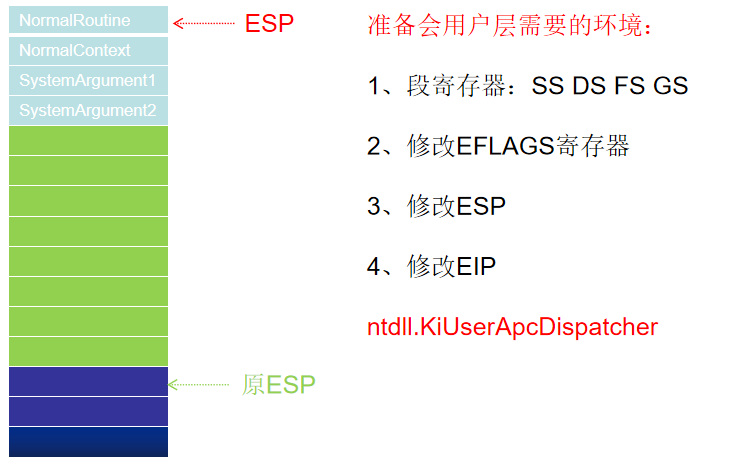

[toc]


# 01.APC的本质

1. 线程是不能被“杀掉”、“挂起”、“恢复”的，线程在执行的时候自己占据着CPU，别人不能控制它
2. 举个极端的例子：如果不调用API，屏蔽中断，并保证代码不出现异常，线程将永久占用CPU
3. 所以说线程如果想“死”，一定是自己执行代码把自己杀死，不存在“他杀”的情况

**思考**：那如果想改变一个线程的行为该怎么办
**答案**：可以给他提供一个函数，让它自己去调用：APC（Asyncroneus Procedure Call，异步过程调用）

## APC队列

- `ApcListHead`：
  1. 由两个双向链表组成，共占16个字节
  2. 提供的APC函数可能是**用户函数**，也可能是**系统函数**（简单的区分方法就是判断函数地址是否大于**0x80000000**）
- `Process`：指向线程所属或者挂靠进程
- `KernelApcInProgress`：内核Apc是否正在执行
- `KernelApcPending`：是否存在等待状态的**内核APC**，存在则置1
- `UserApcPending`：是否存在等待状态的**用户APC**，存在则置1

```c
kd> dt _KTHREAD
ntdll!_KTHREAD
   ...
   +0x034 ApcState         : _KAPC_STATE
   ...
kd> dt _KAPC_STATE
ntdll!_KAPC_STATE
   +0x000 ApcListHead      : [2] _LIST_ENTRY
   +0x010 Process          : Ptr32 _KPROCESS
   +0x014 KernelApcInProgress : UChar
   +0x015 KernelApcPending : UChar
   +0x016 UserApcPending   : UChar
```


## APC结构

```c
kd> dt _KAPC
ntdll!_KAPC
   +0x000 Type             : Int2B
   +0x002 Size             : Int2B
   +0x004 Spare0           : Uint4B
   +0x008 Thread           : Ptr32 _KTHREAD
   +0x00c ApcListEntry     : _LIST_ENTRY
   +0x014 KernelRoutine    : Ptr32     void 
   +0x018 RundownRoutine   : Ptr32     void 
   +0x01c NormalRoutine    : Ptr32     void //找到提供的APC函数，并不完全等于APC函数的地址
   +0x020 NormalContext    : Ptr32 Void
   +0x024 SystemArgument1  : Ptr32 Void
   +0x028 SystemArgument2  : Ptr32 Void
   +0x02c ApcStateIndex    : Char
   +0x02d ApcMode          : Char
   +0x02e Inserted         : UChar
```

当前线程什么时候将会执行提供的APC

1. `KiServiceExit` 函数（**系统调用**、**异常**或**中断**返回用户控件的必经之路）
2. `KiDeliverApc` 函数（负责**执行**APC函数）

## KiServiceExit

```asm
.text:004069CD loc_4069CD:                             ; CODE XREF: _KiServiceExit+8↑j
.text:004069CD                                         ; _KiServiceExit+64↓j
.text:004069CD                 mov     ebx, large fs:124h ; 获取ETHREAD
.text:004069D4                 mov     byte ptr [ebx+_KTHREAD.Alerted], 0
.text:004069D8                 cmp     byte ptr [ebx+_KTHREAD.ApcState.UserApcPending], 0 ; 检查是否有APC请求
.text:004069DC                 jz      short loc_406A23
.text:004069DE                 mov     ebx, ebp
.text:004069E0                 mov     [ebx+44h], eax  ; 堆栈中_KTRAP_FREAME结构的eax
.text:004069E3                 mov     dword ptr [ebx+50h], 3Bh ; ';' ; 堆栈中_KTRAP_FREAME结构的SegFs
.text:004069EA                 mov     dword ptr [ebx+38h], 23h ; '#' ; 堆栈中_KTRAP_FREAME结构的SegDs
.text:004069F1                 mov     dword ptr [ebx+34h], 23h ; '#' ; 堆栈中_KTRAP_FREAME结构的SegEs
.text:004069F8                 mov     dword ptr [ebx+30h], 0 ; 堆栈中_KTRAP_FREAME结构的SegGs
.text:004069FF                 mov     ecx, 1          ; APC_LEVEl参数
.text:00406A04                 call    ds:__imp_@KfRaiseIrql@4 ; KfRaiseIrql(x)
.text:00406A0A                 push    eax
.text:00406A0B                 sti                     ; 关中断
.text:00406A0C                 push    ebx
.text:00406A0D                 push    0
.text:00406A0F                 push    1
.text:00406A11                 call    _KiDeliverApc@12 ; 执行内核APC并为用户空间的APC的执行进行准备
.text:00406A16                 pop     ecx             ; 将老的运行级别出栈
.text:00406A17                 call    ds:__imp_@KfLowerIrql@4 ; 恢复原来的运行级别
.text:00406A1D                 mov     eax, [ebx+44h]
.text:00406A20                 cli                     ; 开中断
.text:00406A21                 jmp     short loc_4069CD ; 获取ETHREAD
```


# 02.备用APC队列

还是先看下线程结构体：

```c
kd> dt _kthread
nt!_KTHREAD
...
+0x034 ApcState         : _KAPC_STATE//APC
...
+0x138 ApcStatePointer  : [2] Ptr32 _KAPC_STATE//APC指针
...
+0x14c SavedApcState    : _KAPC_STATE//备用APC
...
+0x165 ApcStateIndex    : UChar//线程状态
+0x166 ApcQueueable     : UChar//当前成员是否允许插入APC
...
```

## SavedApcState

1. 在 `_KTHREAD+0x14c` 位置处，同样也存在一个 `_KAPC_STATE` 结构体，叫做 `SavedApcState`
2. **线程APC队列中的APC函数都是与进程相关联的**，具体点说：A进程的T线程中的所有APC函数，要访问的内存地址都是A进程的
3. 但线程是可以挂靠到其他的进程：比如A进程的线程T，通过修改Cr3(改为B进程的页目录基址)，就可以访问B进程地址空间，即所谓“进程挂靠”
4. 当T线程挂靠B进程后，APC队列中存储的却仍然是原来的APC。具体点说，比如某个APC函数要读取一个地址为0x12345678的数据，如果此时进行读取，读到的将是B进程的地址空间，这样逻辑就错误了
5. 为了避免混乱，在T线程挂靠B进程时，会将`ApcState`中的值暂时存储到`SavedApcState`中，等回到原进程A时，再将APC队列恢复。
6. 因此，`SavedApcState`又称为备用APC队列

```
A进程的T线程挂靠B进程  
	A是T的所属进程  
	B是T的挂靠进程
ApcState    	B进程相关的APC函数     
SavedApcState	A进程相关的APC函数
```

## ApcStateIndex

**ApcStateIndex** 用来标识当前线程处于什么状态，位于 **_KTHREAD+0x165**

**0**：正常状态
**1**：挂靠状态

## ApcStatePointer

为了操作方便，**_KTHREAD** 结构体中定义了一个指针数组 **ApcStatePointer** ，长度为2，位于 **_KTHREAD+0x138**

正常情况下：

- `ApcStatePointer[0]` 指向 ApcState
- `ApcStatePointer[1]` 指向 SavedApcState

挂靠情况下：

- `ApcStatePointer[0]` 指向 SavedApcState
- `ApcStatePointer[1]` 指向 ApcState

### 组合寻址

这样和`ApcStateIndex`就可以组合寻址了：

正常情况下，向`ApcState`队列中插入APC时：

- `ApcStatePointer[0]` 指向 `ApcState`，此时 `ApcStateIndex` 的值为 0
- `ApcStatePointer[ApcStateIndex]` 指向 `ApcState`

挂靠情况下，向`ApcState`队列中插入APC时：

- `ApcStatePointer[1]` 指向 `ApcState`，此时 `ApcStateIndex` 的值为 1
- `ApcStatePointer[ApcStateIndex]` 指向 `ApcState`

总结下来就是，无论什么环境下，**ApcStatePointer[ApcStateIndex]** 指向的都是 **ApcState**
**ApcState** 总是表示线程当前使用的apc状态

## ApcQueueable

1. 位于 `_KTHREAD+0x166`，表示是否可以向线程的APC队列中插入APC
2. 当线程正在执行退出的代码时，会将这个值设置为0 ，如果此时执行插入APC的代码（`KeInsertQueueApc`），在插入函数中会判断这个值的状态，如果为0，则插入失败

# 03.APC挂入过程

1. 无论是正常状态还是挂靠状态，都有两个APC队列，一个**内核队列**，一个**用户队列**
2. 每当要挂入一个APC函数时，不管是内核APC还是用户APC，内核都要准备一个**KAPC**的数据结构，并且将这个KAPC结构挂到相应的APC队列中

```c
kd> dt _KAPC
ntdll!_KAPC
	+0x000 Type             : Int2B				//类型 APC类型为0x12
	+0x002 Size             : Int2B				//本结构体的大小  0x30
	+0x004 Spare0           : Uint4B			//未使用
	+0x008 Thread           : Ptr32 _KTHREAD	//目标线程
	+0x00c ApcListEntry     : _LIST_ENTRY		//APC队列挂的位置
	+0x014 KernelRoutine    : Ptr32     void 	//指向一个函数(调用ExFreePoolWithTag)APC执行完毕后，释放本结构内存
	+0x018 RundownRoutine   : Ptr32     void 	//略
	+0x01c NormalRoutine    : Ptr32     void 	//用户APC总入口  或者 真正的内核apc函数
	+0x020 NormalContext    : Ptr32 Void		//内核APC：NULL  用户APC：真正的APC函数
	+0x024 SystemArgument1  : Ptr32 Void		//APC函数的参数1
	+0x028 SystemArgument2  : Ptr32 Void		//APC函数的参数2
	+0x02c ApcStateIndex    : Char				//挂哪个队列，有四个值：0 1 2 3
	+0x02d ApcMode          : Char				//内核APC 用户APC
	+0x02e Inserted         : UChar				//表示本apc是否已挂入队列 挂入前：0  挂入后  1

```

- **NormalRoutine**:
  - 如果当前的APC是内核APC，通过它就能找到内核APC函数。
  - 如果当前的APC是用户APC，通过它找到的只是**用户APC的总入口**并不是用户APC函数。
- **NormalContext**：如果是内核APC这个值为空；如果是用户APC这个值执行的就是用户APC函数
- **+0x02c ApcStateIndex**（**KTHREAD(+0x165)** 的属性同名，但含义不一样）：
  - =0：原始环境
  - =1：挂靠环境
  - =2：当前环境
  - =3：插入APC时的当前环境


## 挂入过程

- **用户层调用**：`QueueUserAPC`（kernel32.dll）=>`NtQueueApcThread`（ntosker.exe）=>内核层
- **很多内核函数调用**：`KeInitializeApc`（分配空间，初始化KAPC结构体）=>`KeInsertQueueApc`=>`KiInsertQueueApc`（将KAPC插入指定APC队列）

### KeInitializeApc

```c
VOID KeInitializeApc
(
	IN PKAPC Apc,							//KAPC指针
	IN PKTHREAD Thread,						//目标线程
	IN KAPC_ENVIRONMENT TargetEnvironment,	//0 1 2 3四种状态
	IN PKKERNEL_ROUTINE KernelRoutine,		//销毁KAPC的函数地址
	IN PKRUNDOWN_ROUTINE RundownRoutine OPTIONAL,
	IN PKNORMAL_ROUTINE NormalRoutine,		//用户APC总入口或者内核apc函数
	IN KPROCESSOR_MODE Mode,				//要插入用户apc队列还是内核apc队列
	IN PVOID Context						//内核APC：NULL  用户APC：真正的APC函数
) 
```

1. `Thread`传进来会挂到 `_KAPC.0x8 Thread`
2. `TargetEnvironment` 传进来会挂到`_KAPC.0x2c ApcStateIndex`
3. `KernelRoutine` 传进来会挂到`_KAPC.0x14 KernelPoutine`
4. `NormalRoutine` 传进来会挂到`_KAPC.0x1c NormalRoutine`
5. `Mode` 传进来会挂到`_KAPC.0x2d ApcMode`
6. `Context` 传进来会挂到`_KAPC.0x20 NormalRoutine`

#### ApcStateIndex

0表示原始环境，1表示挂靠环境，这两个比较好理解，下面说一下2和3：

当值为2的时候，插入的是当前进程的队列。什么是当前队列，是我不管你环境是挂靠还是不挂靠，我就插入当前进程的`APC`队列里面，以初始化`APC`的时候为基准。

当值为3时，插入的是当前进程的`APC`队列，此时有修复`ApcStateIndex`的操作，以插入`APC`的时候为基准。

### KeInsertQueueApc

1. 根据`KAPC`结构中的`ApcStateIndex`找到对应的APC队列
2. 再根据`KAPC`结构中的`ApcMode`确定是用户队列还是内核队列
3. 将`KAPC`挂到对应的队列中(挂到`KAPC`的`ApcListEntry`处)
4. 再根据`KAPC`结构中的`Inserted`置1，标识当前的KAPC为已插入状态
5. 修改`KAPC_STATE`结构中的`KernelApcPending`/`UserApcPending`

```asm
.text:00402C6A var_4           = dword ptr -4
.text:00402C6A
.text:00402C6A ; FUNCTION CHUNK AT .text:0040EEB3 SIZE 00000031 BYTES
.text:00402C6A ; FUNCTION CHUNK AT .text:0041049E SIZE 0000002C BYTES
.text:00402C6A ; FUNCTION CHUNK AT .text:004106A4 SIZE 00000031 BYTES
.text:00402C6A ; FUNCTION CHUNK AT .text:00412E89 SIZE 00000013 BYTES
.text:00402C6A ; FUNCTION CHUNK AT .text:0041C2D7 SIZE 0000001A BYTES
.text:00402C6A ; FUNCTION CHUNK AT .text:0042615A SIZE 0000000F BYTES
.text:00402C6A ; FUNCTION CHUNK AT .text:0042950C SIZE 0000001E BYTES
.text:00402C6A ; FUNCTION CHUNK AT .text:00432270 SIZE 0000000F BYTES
.text:00402C6A ; FUNCTION CHUNK AT .text:0044B3BF SIZE 0000001A BYTES
.text:00402C6A
.text:00402C6A                 mov     edi, edi
.text:00402C6C                 push    ebp
.text:00402C6D                 mov     ebp, esp
.text:00402C6F                 push    ecx
.text:00402C70                 mov     eax, ecx
.text:00402C72                 cmp     byte ptr [eax+2Eh], 0
.text:00402C76                 mov     ecx, [eax+8]
.text:00402C79                 mov     [ebp+var_4], edx
.text:00402C7C                 jnz     loc_44B3BF
.text:00402C82                 cmp     [eax+_KAPC.ApcStateIndex], 3 ; 判断APCStateIndex是否为3
.text:00402C86                 jz      loc_44B3C3      ; 取出当前进程的ApcStateIndex
.text:00402C8C
;;;;;;;;;;;;;;;;;;;;;;;;;;;;;;;;;;;;;;;;;;;;;;;;;;;;;;;;;;;;;;;;;;;;;;;
.text:0044B3C3 loc_44B3C3:                             ; CODE XREF: KiInsertQueueApc(x,x)+1C↑j
.text:0044B3C3                 mov     dl, [ecx+_ETHREAD.Tck.ApcStateIndex] ; 取出当前进程的ApcStateIndex
.text:0044B3C9                 mov     [eax+_KAPC.ApcStateIndex], dl ; 放入APC中
.text:0044B3CC                 jmp     loc_402C8C
;;;;;;;;;;;;;;;;;;;;;;;;;;;;;;;;;;;;;;;;;;;;;;;;;;;;;;;;;;;;;;;;;;;;;;;
.text:00402C8C loc_402C8C:                             ; CODE XREF: KiInsertQueueApc(x,x)+48762↓j
.text:00402C8C                 cmp     [eax+_KAPC.NormalRoutine], 0s
.text:00402C90                 movsx   edx, [eax+_KAPC.ApcStateIndex]
.text:00402C94                 push    ebx
.text:00402C95                 push    esi
.text:00402C96                 push    edi
.text:00402C97                 mov     edi, [ecx+edx*4+_KTHREAD.ApcStatePointer] ; l) 根据_ KAPC.ApcStateIndex找到要挂APC的队列: SaveApc/Apc
.text:00402C9E                 mov     dl, [eax+_KAPC.ApcMode]
.text:00402CA1                 jnz     loc_41049E
.text:00402CA7                 movsx   esi, dl
.text:00402CAA                 lea     edi, [edi+esi*8] ; 2)根据ApcMode找到是用户APC队列还是内核APC队列
.text:00402CAD                 mov     esi, [edi+4]
.text:00402CB0
.text:00402CB0 loc_402CB0:                             ; CODE XREF: KiInsertQueueApc(x,x)+4876A↓j
.text:00402CB0                 cmp     esi, edi
.text:00402CB2                 jnz     loc_42615A
.text:00402CB8
.text:00402CB8 loc_402CB8:                             ; CODE XREF: KiInsertQueueApc(x,x)+234F4↓j
.text:00402CB8                 mov     ebx, [esi]
.text:00402CBA                 lea     edi, [eax+_KAPC.ApcListEntry]
.text:00402CBD                 mov     [edi], ebx
.text:00402CBF                 mov     [edi+4], esi
.text:00402CC2                 mov     [ebx+4], edi
.text:00402CC5                 mov     [esi], edi      ; 3)将ApcStateIndex 挂到对应的队列中：ApcListEntry
.text:00402CC7
.text:00402CC7 loc_402CC7:                             ; CODE XREF: KiInsertQueueApc(x,x)+D85B↓j
.text:00402CC7                                         ; KiInsertQueueApc(x,x)+268BB↓j
.text:00402CC7                 movsx   edi, [eax+_KAPC.ApcStateIndex]
.text:00402CCB                 mov     [eax+_KAPC.Inserted], 1 ; 4)修改Inserted的值
.text:00402CCF                 movzx   esi, [ecx+_KTHREAD.ApcStateIndex]
.text:00402CD6                 cmp     edi, esi
.text:00402CD8                 pop     edi
.text:00402CD9                 pop     esi
.text:00402CDA                 pop     ebx
.text:00402CDB                 jnz     short loc_402D12
.text:00402CDD                 test    dl, dl
.text:00402CDF                 jnz     loc_4106A4      ; 若为用户模式APC，跳转
.text:00402CE5                 mov     dl, [ecx+_KTHREAD.State]
.text:00402CE8                 cmp     dl, 2
.text:00402CEB                 mov     [ecx+_KTHREAD.ApcState.KernelApcPending], 1 ; 5)内核模式APC，修改KernelApcPending为1
.text:00402CEF                 jnz     loc_40EEB3
.text:00402CF5                 mov     eax, large fs:_KTHREAD.Teb
.text:00402CFB                 mov     cl, [ecx+_KTHREAD.NextProcessor]
.text:00402D01                 cmp     [eax+10h], cl
.text:00402D04                 jnz     loc_412E89
.text:00402D0A                 mov     cl, 1
.text:00402D0C                 call    ds:__imp_@HalRequestSoftwareInterrupt@4 ; HalRequestSoftwareInterrupt(x)
.text:004106A4 ; START OF FUNCTION CHUNK FOR KiInsertQueueApc(x,x)
.text:004106A4
.text:004106A4 loc_4106A4:                             ; CODE XREF: KiInsertQueueApc(x,x)+75↑j
.text:004106A4                 cmp     [ecx+_KTHREAD.State], 5 ; 判断线程是否为等待状态如果不是则跳转
.text:004106A8                 jnz     loc_402D12
.text:004106AE                 cmp     [ecx+_KTHREAD.WaitMode], 1 ; 判断是否是用户导致的等待如果不是则跳转
.text:004106B2                 jnz     loc_402D12
.text:004106B8                 cmp     [ecx+_KTHREAD.Alertable], 0 ; 判断是否可以吵醒线程(Alertble=1)如果不是 则跳转
.text:004106BF                 jz      loc_432270
.text:004106C5
.text:004106C5 loc_4106C5:                             ; CODE XREF: KiInsertQueueApc(x,x)+2F610↓j
.text:004106C5                 mov     [ecx+_KTHREAD.ApcState.UserApcPending], 1
.text:004106C9                 push    0
.text:004106CB                 mov     edx, 0C0h
.text:004106D0                 jmp     loc_40EED7
.text:0040EED7 loc_40EED7:                             ; CODE XREF: KiInsertQueueApc(x,x)+DA66↓j
.text:0040EED7                 push    [ebp+var_4]
.text:0040EEDA                 call    @KiUnwaitThread@16 ; 将当前线程从等待链表转移到就绪列表
.text:0040EEDA                                         ; 即唤醒线程
.text:0040EEDF                 jmp     loc_402D12
```


### Alertable

该值指示线程是否运行被`APC`吵醒

1. `Alertable=0`，`UserApcPending = 0`：当前插入的APC函数未必有机会执行
2. `Alertable=1` ，`UserApcPending = 1`：将目标线程唤醒(从等待链表中摘出来，并挂到调度链表)

该属性在KTHREAD中：

```c
kd> dt _KTHREAD
ntdll!_KTHREAD
   ...
   +0x164 Alertable        : UChar
   ...
```

很多与线程相关的结尾带`Ex`的函数的参数都会有一个`bAlertable`，举例如下：

```c
DWORD SleepEx(
  DWORD dwMilliseconds, // time-out interval
  BOOL bAlertable        // early completion option
);
DWORD WaitForSingleObjectEx(
  HANDLE hHandle,       // handle to object
  DWORD dwMilliseconds, // time-out interval
  BOOL bAlertable       // alertable option
);
```


# 04.内核APC执行过程

 


## 何时执行APC

`APC`函数的执行与插入并不是同一个线程，具体点说在A线程中向B线程插入一个`APC`，插入的动作是在A线程中完成的，但什么时候执行则由B线程决定，所以叫“异步过程调用”

### 线程切换

1. `SwapContext` 判断是否有内核APC
2. `KiSwapThread`
3. `KiDeliverApc` 执行内核APC函数

先看下`SwapContext`的最后部分：

```asm
                cmp     [esi+_KTHREAD.ApcState.KernelApcPending], 0
                jnz     short loc_46A9BD
                popf
                xor     eax, eax
                retn
; ---------------------------------------------------------------------------

loc_46A9BD:                             ; CODE XREF: SwapContext+D7↑j
                popf
                jnz     short loc_46A9C3
                mov     al, 1
                retn
```

`KernelApcPending`是表示有没有内核`APC`处理的标志，如果是1，也就是有的话，就会使返回值置1；反之置0。

之后查看上一级函数：

```asm
.text:0040581E ; __fastcall KiSwapContext(x)
.text:0040581E @KiSwapContext@4 proc near              ; CODE XREF: KiSwapThread()+33↓p
.text:0040581E
.text:0040581E var_10          = dword ptr -10h
.text:0040581E var_C           = dword ptr -0Ch
.text:0040581E var_8           = dword ptr -8
.text:0040581E var_4           = dword ptr -4
.text:0040581E
.text:0040581E                 sub     esp, 10h
.text:00405821                 mov     [esp+10h+var_4], ebx ; KPCR
.text:00405825                 mov     [esp+10h+var_8], esi ; 新线程 _ETHREAD
.text:00405829                 mov     [esp+10h+var_C], edi ; 旧线程 _ETHREAD
.text:0040582D                 mov     [esp+10h+var_10], ebp ; ebp 没用
.text:00405830                 mov     ebx, large fs:1Ch ; _KPCR.Self
.text:00405837                 mov     esi, ecx        ; ecx：新线程的 _ETHREAD
.text:00405839                 mov     edi, [ebx+124h] ; edi：当前线程的 _ETHREAD
.text:00405839                                         ; [ebx+_KPCR.PrcbData.CurrentThread]
.text:0040583F                 mov     [ebx+124h], esi ; 修改 _KPCR，更新当前线程(124h同上
.text:00405845                 mov     cl, [edi+58h]   ; 58==[edi+_ETHREAD.Tcb.WaitIrql]
.text:00405848                 call    SwapContext     ; 4个参数：
.text:00405848                                         ; ebx: _KPCR
.text:00405848                                         ; esi: 新线程 _ETHREAD
.text:00405848                                         ; edi: 旧线程 _ETHREAD
.text:00405848                                         ; cl:旧线程的 WaitIrql，这个参数用来控制是否执行APC
.text:00405848                                         ;
.text:00405848                                         ; 调用 SwapContext 后，已经完成了线程切换
.text:00405848                                         ; 后面就是新线程从它自己的堆栈里恢复寄存器的值的过程
.text:0040584D                 mov     ebp, [esp+10h+var_10]
.text:00405850                 mov     edi, [esp+10h+var_C]
.text:00405854                 mov     esi, [esp+10h+var_8]
.text:00405858                 mov     ebx, [esp+10h+var_4]
.text:0040585C                 add     esp, 10h
.text:0040585F                 retn
.text:0040585F @KiSwapContext@4 endp
```

没有用到返回值，继续查看上一级函数：

```asm
.text:0040AB3B loc_40AB3B:                             ; CODE XREF: KiSwapThread()+5E33↓j
.text:0040AB3B                 mov     ecx, eax
.text:0040AB3D                 call    @KiSwapContext@4 ; ebx: _KPCR
.text:0040AB3D                                         ; esi: 新线程 _ETHREAD
.text:0040AB3D                                         ; edi: 旧线程 _ETHREAD
.text:0040AB3D                                         ; 使用寄存器传参，因此要将使用到的寄存器暂时保存到堆栈中
.text:0040AB3D                                         ; 和push等效
.text:0040AB42                 test    al, al
.text:0040AB44                 mov     cl, [edi+58h]   ; NewIrql
.text:0040AB47                 mov     edi, [edi+54h]
.text:0040AB4A                 mov     esi, ds:__imp_@KfLowerIrql@4 ; KfLowerIrql(x)
.text:0040AB50                 jnz     loc_41BC76
;;;;;;;;;;;;;;;;;;;;;;;;;;;;;;;;;;;;;;;;;;;;;;;;;;;;;;;;;;;;;;;;;;;;;;;;;;;;;;;;
.text:0041BC76 loc_41BC76:                             ; CODE XREF: KiSwapThread()+46↑j
.text:0041BC76                 mov     cl, 1           ; NewIrql
.text:0041BC78                 call    esi ; KfLowerIrql(x) ; KfLowerIrql(x)
.text:0041BC7A                 xor     eax, eax
.text:0041BC7C                 push    eax
.text:0041BC7D                 push    eax
.text:0041BC7E                 push    eax//第一个参数，0处理内核APC，1处理内核APC和用户APC
.text:0041BC7F                 call    _KiDeliverApc@12 ; KiDeliverApc(x,x,x)
.text:0041BC84                 xor     cl, cl
.text:0041BC86                 jmp     loc_40AB56
```

如果为1的话，也就是有内核`APC`执行，就会继续往下走，调用`KiDeliverApc`这个函数，也就是处理`APC`的函数，传递的三个参数都是0。

### 系统调用、中断或者异常(_KiServiceExit)

#### KiServiceExit

这个函数是系统调用、中断异常必经之处，和APC相关的：

```asm
.text:004069CD loc_4069CD:                             ; CODE XREF: _KiServiceExit+8↑j
.text:004069CD                                         ; _KiServiceExit+64↓j
.text:004069CD                 mov     ebx, large fs:124h ; 获取ETHREAD
.text:004069D4                 mov     byte ptr [ebx+_KTHREAD.Alerted], 0
.text:004069D8                 cmp     byte ptr [ebx+_KTHREAD.ApcState.UserApcPending], 0 ; 检查是否有APC请求
.text:004069DC                 jz      short loc_406A23
.text:004069DE                 mov     ebx, ebp
.text:004069E0                 mov     [ebx+44h], eax  ; 堆栈中_KTRAP_FREAME结构的eax
.text:004069E3                 mov     dword ptr [ebx+50h], 3Bh ; ';' ; 堆栈中_KTRAP_FREAME结构的SegFs
.text:004069EA                 mov     dword ptr [ebx+38h], 23h ; '#' ; 堆栈中_KTRAP_FREAME结构的SegDs
.text:004069F1                 mov     dword ptr [ebx+34h], 23h ; '#' ; 堆栈中_KTRAP_FREAME结构的SegEs
.text:004069F8                 mov     dword ptr [ebx+30h], 0 ; 堆栈中_KTRAP_FREAME结构的SegGs
.text:004069FF                 mov     ecx, 1          ; APC_LEVEl参数
.text:00406A04                 call    ds:__imp_@KfRaiseIrql@4 ; KfRaiseIrql(x)
.text:00406A0A                 push    eax
.text:00406A0B                 sti                     ; 关中断
.text:00406A0C                 push    ebx
.text:00406A0D                 push    0
.text:00406A0F                 push    1
.text:00406A11                 call    _KiDeliverApc@12 ; 执行内核APC并为用户空间的APC的执行进行准备
```

第一个参数是1，第二个参数是0，第三个就是所谓的`TrapFrame`

## 内核APC执行流程

### KiDeliverApc

执行过程：

1. 判断第一个链表是否为空
2. 判断`KTHREAD.ApcState.KernelApcInProgress`是否为1
3. 判断是否禁用内核APC(`KTHREAD.KernelApcDisable`是否为1)
4. 将当前KAPC结构体从链表中摘除
5. 执行`KAPC.KernelRoutine`指定的函数 释放KAPC结构体占用的空间
6. 将`KTHREAD.ApcState.KernelApcInProgress`设置为1 标识正在执行内核APC
7. 执行真正的内核APC函数(`KAPC.NormalRoutine`)
8. 执行完毕 将`KernelApcInProgress`改为0
9. 循环

```asm
.text:00405E20 loc_405E20:                             ; CODE XREF: KiDeliverApc(x,x,x)+D↑j
.text:00405E20                                         ; KiDeliverApc(x,x,x)+B580↓j ...
.text:00405E20                 push    ebx
.text:00405E21                 push    esi
.text:00405E22                 push    edi
.text:00405E23                 mov     eax, large fs:_KTHREAD
.text:00405E29                 mov     esi, eax
.text:00405E2B                 mov     eax, [esi+_KTHREAD.TrapFrame]
.text:00405E31                 mov     [ebp+var_1C], eax
.text:00405E34                 mov     eax, [esi+_KTHREAD.ApcState.Process]
.text:00405E37                 mov     [esi+_KTHREAD.TrapFrame], ecx
.text:00405E3D                 lea     ecx, [esi+_KTHREAD.ApcQueueLock] ; SpinLock
.text:00405E43                 lea     edx, [ebp+LockHandle] ; LockHandle
.text:00405E46                 mov     [ebp+BugCheckParameter1], eax
.text:00405E49                 call    ds:__imp_@KeAcquireInStackQueuedSpinLock@8 ; KeAcquireInStackQueuedSpinLock(x,x)
.text:00405E4F                 mov     [esi+_KTHREAD.ApcState.KernelApcPending], 0 ; 将KernelApcPending状态改为0
.text:00405E53                 lea     ebx, [esi+_KTHREAD.ApcState] ; 取出内核APC列表
.text:00405E56
.text:00405E56 loc_405E56:                             ; CODE XREF: KiDeliverApc(x,x,x)+14FDD↓j
.text:00405E56                                         ; KiDeliverApc(x,x,x)+15E53↓j ...
.text:00405E56                 cmp     [ebx], ebx      ; 判断第一个列表是否为空(内核APC队列)，如果内容与当前地址一样，说明没有空
.text:00405E58                 jnz     loc_41BBEF      ; 如果为空则跳转
;;;;;;;;;;;;;;;;;;;;;;;;;;;;;;;;;;;;;;;;;;;;;;;;;;;;;;;;;;;;;;;;;;;;;;;;;;
.text:0041BBEF loc_41BBEF:                             ; CODE XREF: KiDeliverApc(x,x,x)+57↑j
.text:0041BBEF                 mov     eax, [ebx]
.text:0041BBF1                 lea     edi, [eax-0Ch]  ; 减0x0C就是KAPC的首地址
.text:0041BBF4                 mov     ecx, [edi+_KAPC.KernelRoutine]
.text:0041BBF7                 mov     [ebp+ms_exc.KernelRoutine], ecx
.text:0041BBFA                 mov     ecx, [edi+_KAPC.NormalRoutine]
.text:0041BBFD                 test    ecx, ecx        ; 判断内核APC是否为空
.text:0041BBFF                 mov     [ebp+ms_exc.NormalRoutine], ecx
.text:0041BC02                 mov     edx, [edi+_KAPC.NormalContext]
.text:0041BC05                 mov     [ebp+ms_exc.NormalContext], edx
.text:0041BC08                 mov     edx, [edi+_KAPC.SystemArgument1]
.text:0041BC0B                 mov     [ebp+ms_exc.SystemArgument1], edx
.text:0041BC0E                 mov     edx, [edi+_KAPC.SystemArgument2]
.text:0041BC11                 mov     [ebp+ms_exc.SystemArgument2], edx
.text:0041BC14                 jnz     loc_41AD60      ; 不为空跳转
;;;;;;;;;;;;;;;;;;;;;;;;;;;;;;;;;;;;;;;;;;;;;;;;;;;;;;;;;;;;;;;;;;;;;;;;;;
.text:0041AD60 loc_41AD60:                             ; CODE XREF: KiDeliverApc(x,x,x)+15E13↓j
.text:0041AD60                 cmp     [esi+_KTHREAD.ApcState.KernelApcInProgress], 0
.text:0041AD64                 jnz     loc_405E6B
.text:0041AD6A                 cmp     [esi+_KTHREAD.KernelApcDisable], 0
.text:0041AD71                 jnz     loc_405E6B
.text:0041AD77                 mov     ecx, [eax]
.text:0041AD79                 mov     eax, [eax+4]
.text:0041AD7C                 mov     [eax], ecx
.text:0041AD7E                 mov     [ecx+4], eax
.text:0041AD81                 lea     ecx, [ebp+LockHandle] ; LockHandle
.text:0041AD84                 mov     [edi+_KAPC.Inserted], 0
.text:0041AD88                 call    ds:__imp_@KeReleaseInStackQueuedSpinLock@4 ; KeReleaseInStackQueuedSpinLock(x)
.text:0041AD8E                 lea     eax, [ebp+ms_exc.SystemArgunent2]
.text:0041AD91                 push    eax
.text:0041AD92                 lea     eax, [ebp+ms_exc.SystemArgunent1]
.text:0041AD95                 push    eax
.text:0041AD96                 lea     eax, [ebp+ms_exc.NormalContext]
.text:0041AD99                 push    eax
.text:0041AD9A                 lea     eax, [ebp+ms_exc.NormalRoutine]
.text:0041AD9D                 push    eax
.text:0041AD9E                 push    edi
.text:0041AD9F                 call    [ebp+ms_exc.KernelRoutine] ; 5)执行KAPC.KernelRoutine指定的函数释放KAPC结构体占用的空间
.text:0041ADA2                 cmp     [ebp+ms_exc.NormalRoutine], 0
.text:0041ADA6                 jz      short loc_41ADCB
.text:0041ADA8                 xor     cl, cl          ; NewIrql
.text:0041ADAA                 mov     [esi+_KTHREAD.ApcState.KernelApcInProgress], 1 ; 6)将KTHREAD.ApcState.KernelApcInProgress设置为1标识正在执行内核APC
.text:0041ADAE                 call    ds:__imp_@KfLowerIrql@4 ; KfLowerIrql(x)
.text:0041ADB4                 push    [ebp+ms_exc.SystemArgunent2]
.text:0041ADB7                 push    [ebp+ms_exc.SystemArgunent1]
.text:0041ADBA                 push    [ebp+ms_exc.NormalContext]
.text:0041ADBD                 call    [ebp+ms_exc.NormalRoutine] ; 7)执行真正的内核APC函数(KAPC.NormalRoutine)
.text:0041ADC0                 mov     cl, 1           ; NewIrql
.text:0041ADC2                 call    ds:__imp_@KfRaiseIrql@4 ; KfRaiseIrql(x)
.text:0041ADC8                 mov     [ebp+LockHandle.OldIrql], al
.text:0041ADCB
.text:0041ADCB loc_41ADCB:                             ; CODE XREF: KiDeliverApc(x,x,x)+14FA5↑j
.text:0041ADCB                 lea     edx, [ebp+LockHandle] ; LockHandle
.text:0041ADCE                 lea     ecx, [esi+0E8h] ; SpinLock
.text:0041ADD4                 call    ds:__imp_@KeAcquireInStackQueuedSpinLock@8 ; KeAcquireInStackQueuedSpinLock(x,x)
.text:0041ADDA                 mov     [esi+_KTHREAD.ApcState.KernelApcInProgress], 0 ; 8)执行完毕，将KernelApcInProgress改为0
.text:0041ADDE                 jmp     loc_405E56      ; 9)下一个循环
.text:0041ADDE ; END OF FUNCTION CHUNK FOR KiDeliverApc(x,x,x)
```

## 总结

1. 线程切换的时候，这就意味着只要插入内核APC很快就会执行(`SwapContext`->`KiSwapThread`->`KiDeliverApc`)
2. 如果有**用户APC**需要处理时，一定会**先处理内核APC**
3. 内核APC在内核空间执行，不需要换栈，一个循环全部执行完毕

# 05.用户APC执行过程

当产生系统调用、中断或者异常，线程在返回用户空间前都会调用`_KiServiceExit`函数，在`_KiServiceExit`会判断是否有要执行的用户APC，如果有则调用`KiDeliverApc`函数(第一个参数为1)进行处理。

执行用户APC时的堆栈操作：

1. 当线程从用户层进入内核层时，要保留原来的运行环境，比如各种寄存器，栈的位置等等 (`_Trap_Frame`)，然后切换成内核的堆栈，如果正常返回，恢复堆栈环境即可。
2. 但如果有用户APC要执行的话，就意味着线程要提前返回到用户空间去执行，而且返回的位置不是线程进入内核时的位置，而是返回到其他的位置，每处理一个用户APC都会涉及到：
   `内核`–>`用户空间`–>`再回到内核空间`
3. 堆栈的操作比较复杂，如果不了解堆栈的操作细节不可能理解用户APC是如何执行的

## KiDeliverApc

执行过程：

1. 判断用户APC链表是否为空
2. 判断第一个参数是为1
3. 判断`ApcState.UserApcPending`是否为1
4. 将`ApcState.UserApcPending`设置为0
5. 链表操作 将当前APC从用户队列中拆除
6. 调用函数(`KAPC.KernelRoutine`)释放KAPC结构体内存空间
7. 调用`KiInitializeUserApc`函数

```asm
.text:00405E56 loc_405E56:                             ; CODE XREF: KiDeliverApc(x,x,x)+14FDD↓j
.text:00405E56                                         ; KiDeliverApc(x,x,x)+15E53↓j ...
.text:00405E56                 cmp     [ebx], ebx      ; 判断第一个列表是否为空(内核APC队列)，如果内容与当前地址一样，说明没有空
.text:00405E58                 jnz     loc_41BBEF      ; 如果为空则跳转
.text:00405E5E                 lea     ecx, [esi+(_KTHREAD.ApcState.ApcListHead.Flink+8)] ; 取第二个链表，也就是用户APC队列
.text:00405E61                 mov     eax, [ecx]
.text:00405E63                 cmp     eax, ecx
.text:00405E65                 jnz     loc_4104CA
;;;;;;;;;;;;;;;;;;;;;;;;;;;;;;;;;;;;;;;;;;;;;;;;;;;;;;;;;;;;;;;;;;;;;;;;;;
.text:004104CA loc_4104CA:                             ; CODE XREF: KiDeliverApc(x,x,x)+64↑j
.text:004104CA                 cmp     [ebp+arg_0], 1  ; 2)判断第一个参数是为1
.text:004104CE                 jnz     loc_405E6B
.text:004104D4                 cmp     [esi+_KTHREAD.ApcState.UserApcPending], 0 ; 3)判断ApcState.UserApcPending是否为1
.text:004104D8                 jz      loc_405E6B
.text:004104DE                 mov     [esi+_KTHREAD.ApcState.UserApcPending], 0 ; 4)将ApcState.UserApcPending设置为0
.text:004104E2                 lea     edi, [eax-0Ch]  ; 减0xc得到KAPC首地址
.text:004104E5                 mov     ecx, [edi+_KAPC.NormalRoutine]
.text:004104E8                 mov     ebx, [edi+_KAPC.KernelRoutine]
.text:004104EB                 mov     [ebp+NormalRoutine], ecx
.text:004104EE                 mov     ecx, [edi+_KAPC.NormalContext]
.text:004104F1                 mov     [ebp+NormalContext], ecx
.text:004104F4                 mov     ecx, [edi+_KAPC.SystemArgument1]
.text:004104F7                 mov     [ebp+SystemArgument1], ecx
.text:004104FA                 mov     ecx, [edi+_KAPC.SystemArgument2]
.text:004104FD                 mov     [ebp+SystemArgument2], ecx
.text:00410500                 mov     ecx, [eax]      ; 5)链表操作将当前APC从用户队列中拆除
.text:00410502                 mov     eax, [eax+4]
.text:00410505                 mov     [eax], ecx
.text:00410507                 mov     [ecx+4], eax
.text:0041050A                 lea     ecx, [ebp+LockHandle] ; LockHandle
.text:0041050D                 mov     [edi+_KAPC.Inserted], 0
.text:00410511                 call    ds:__imp_@KeReleaseInStackQueuedSpinLock@4 ; KeReleaseInStackQueuedSpinLock(x)
.text:00410517                 lea     eax, [ebp+var_8]
.text:0041051A                 push    eax
.text:0041051B                 lea     eax, [ebp+var_C]
.text:0041051E                 push    eax
.text:0041051F                 lea     eax, [ebp+var_10]
.text:00410522                 push    eax
.text:00410523                 lea     eax, [ebp+var_4]
.text:00410526                 push    eax
.text:00410527                 push    edi
.text:00410528                 call    ebx             ; 6)调用函数KAPC.KernelRoutine释放KAPC结构体内存空间
.text:0041052A                 cmp     [ebp+ms_exc.NormalRoutine], 0
.text:0041052E                 jz      loc_44B394
.text:00410534                 push    [ebp+ms_exc.SystemArgunent2]
.text:00410537                 push    [ebp+ms_exc.SystemArgunent1]
.text:0041053A                 push    [ebp+ms_exc.NormalContext]
.text:0041053D                 push    [ebp+ms_exc.NormalRoutine]
.text:00410540                 push    [ebp+arg_8]     ; TrapFrame
.text:00410543                 push    [ebp+arg_4]     ; ExceptionFrame
.text:00410546                 call    _KiInitializeUserApc@24 ; 这里并未直接调用处理用户APC的函数
.text:00410546                                         ; 原因是当前堆栈在0环用户APC需要到3环去执行
.text:0041054B                 jmp     loc_405E74

```

## KiInitializeUserApc

1. 线程进0环时，原来的运行环境(寄存器栈顶等)保存到 `_Trap_Frame` 结构体中，如果要提前返回3环去处理用户APC，就必须要修改 `_Trap_Frame` 结构体：

2. 比如：进0环时的位置存储在EIP中，现在要提前返回，而且返回的并不是原来的位置，那就意味着必须要修改EIP为新的返回位置。还有堆栈ESP，也要修改为处理APC需要的堆栈。那原来的值怎么办呢?处理完APC后该如何返回原来的位置呢？

3. `KiInitializeUserApc`要做的第一件事就是备份：

   将原来 `_Trap_Frame` 的值备份到一个新的结构体中( `CONTEXT` ),这个功能由其子函数`KeContextFromKframes`来完成

```asm
.text:00410555 _KiInitializeUserApc@24 proc near       ; CODE XREF: KiDeliverApc(x,x,x)+A745↑p
.text:00410555
.text:00410555 ExceptionRecord = _EXCEPTION_RECORD ptr -34Ch
.text:00410555 var_2FC         = dword ptr -2FCh
.text:00410555 var_2F8         = dword ptr -2F8h
.text:00410555 var_2F4         = dword ptr -2F4h
.text:00410555 BugCheckParameter3= dword ptr -2F0h
.text:00410555 var_2EC         = dword ptr -2ECh
.text:00410555 var_2E8_CONTEXT = dword ptr -2E8h
.text:00410555 var_228         = dword ptr -228h
.text:00410555 var_224_CONTEXT.esp= dword ptr -224h
.text:00410555 var_1C          = dword ptr -1Ch
.text:00410555 ms_exc          = CPPEH_RECORD ptr -18h
.text:00410555 a1              = dword ptr  8
.text:00410555 TrapFrame_Address= dword ptr  0Ch
.text:00410555 arg_NormalRoutine= dword ptr  10h
.text:00410555 NormalContext   = dword ptr  14h
.text:00410555 SystemArgument1 = dword ptr  18h
.text:00410555 SystemArgument2 = dword ptr  1Ch
.text:00410555
.text:00410555 ; FUNCTION CHUNK AT .text:0043C680 SIZE 00000009 BYTES
.text:00410555 ; FUNCTION CHUNK AT .text:0044B92B SIZE 0000001F BYTES
.text:00410555 ; FUNCTION CHUNK AT .text:0044B94F SIZE 00000012 BYTES
.text:00410555 ; FUNCTION CHUNK AT .text:0044B966 SIZE 0000002E BYTES
.text:00410555
.text:00410555 ; __unwind { // __SEH_prolog
.text:00410555                 push    33Ch
.text:0041055A                 push    offset stru_410698
.text:0041055F                 call    __SEH_prolog
.text:00410564                 mov     eax, ds:___security_cookie
.text:00410569                 mov     [ebp+var_1C], eax ; 暂存___security_cookie
.text:0041056C                 mov     eax, [ebp+a1]   ; ExceptionFrame
.text:0041056F                 mov     [ebp+var_2F4], eax
.text:00410575                 mov     ebx, [ebp+TrapFrame_Address]
.text:00410578                 mov     [ebp+BugCheckParameter3], ebx ; 暂存TrapFrame
.text:0041057E                 test    byte ptr [ebx+72h], 2
.text:00410582                 jnz     loc_410681
.text:00410588                 mov     [ebp+var_2E8_CONTEXT], 10017h
.text:00410592                 lea     ecx, [ebp+var_2E8_CONTEXT]
.text:00410598                 push    ecx             ; CONTEXT对象的首地址
.text:00410599                 push    eax             ; ExceptionFrame
.text:0041059A                 push    ebx             ; TrapFrame地址
.text:0041059B                 call    _KeContextFromKframes@12 ; 将TrapFrame备份到Context，这时候还在r0
.text:004105A0                 and     [ebp+ms_exc.registration.TryLevel], 0
.text:004105A4                 mov     eax, 2DCh       ; 2DC =  CONTEXT 结构体的大小+用户APC所需要的4个参数
.text:004105A9                 mov     [ebp+var_2F8], eax
.text:004105AF                 mov     esi, [ebp+var_224_CONTEXT.esp] ; 2E8-224=C4 刚好是CONTEXT结构体ESP的偏移
.text:004105B5                 and     esi, 0FFFFFFFCh ; 进行4字节对齐
.text:004105B8                 sub     esi, eax        ; 在0环直接修改3环的栈 将用户3环的栈减0x2DC个字节
.text:004105BA                 mov     [ebp+var_2EC], esi
.text:004105C0                 push    4               ; Alignment
.text:004105C2                 push    eax             ; Length
.text:004105C3                 push    esi             ; Address
.text:004105C4                 call    _ProbeForWrite@12 ; 修改新增部分的内存属性
.text:004105C9                 lea     edi, [esi+10h]  ; 这里edi指向r3的Context
.text:004105CC                 mov     ecx, 0B3h
.text:004105D1                 lea     esi, [ebp+var_2E8_CONTEXT] ; 这里esi指向r0的context头
.text:004105D7                 rep movsd               ; 从esi复制ecx个dword到edi
.text:004105D9                 mov     [ebx+_KTRAP_FRAME.SegCs], 1Bh
.text:004105E0                 push    23h ; '#'
.text:004105E2                 pop     eax
.text:004105E3                 mov     [ebx+_KTRAP_FRAME.HardwareSegSs], eax ; 修改Trap_Frame中的SS
.text:004105E6                 mov     [ebx+_KTRAP_FRAME.SegDs], eax ; 修改Trap_Frame中的DS
.text:004105E9                 mov     [ebx+_KTRAP_FRAME.SegEs], eax ; 修改Trap_Frame中的ES
.text:004105EC                 mov     [ebx+_KTRAP_FRAME.SegFs], 3Bh ; ';' ; 修改Trap_Frame中的FS
.text:004105F3                 and     [ebx+_KTRAP_FRAME.SegGs], 0 ; 修改Trap_Frame中的GS
.text:004105F7                 mov     ecx, [ebp+var_228] ; 2E8 - 228=C0：是EFLAGS寄存器
.text:004105FD                 test    ecx, 20000h     ; 判断EFLAGS
.text:00410603                 jnz     loc_44B92B
.text:00410609
.text:00410609 loc_410609:                             ; CODE XREF: KiInitializeUserApc(x,x,x,x,x,x)+3B3DD↓j
.text:00410609                 and     ecx, 3E0DD7h
.text:0041060F                 or      ecx, 200h
.text:00410615                 mov     eax, ecx
.text:00410617
.text:00410617 loc_410617:                             ; CODE XREF: KiInitializeUserApc(x,x,x,x,x,x)+3B3F0↓j
.text:00410617                 mov     [ebx+_KTRAP_FRAME.EFlags], eax ; 修改Trap_Frame中的EFLAGS
.text:0041061A                 mov     eax, large fs:_KTHREAD.Affinity
.text:00410620                 mov     [ebp-var_CurrentThread], eax
.text:00410626                 cmp     byte ptr [eax+_KTRAP_FRAME.SegGs], 0
.text:0041062A                 jnz     loc_43C680
.text:00410630
.text:00410630 loc_410630:                             ; CODE XREF: KiInitializeUserApc(x,x,x,x,x,x)+2C12F↓j
.text:00410630                 mov     eax, [ebp+var_2EC]
.text:00410636                 mov     [ebx+_KTRAP_FRAME.HardwareEsp], eax ; 修改Trap_Frame中的ESP
.text:00410639                 mov     ecx, ds:_KeUserApcDispatcher ; ntdll.KiUserApcDispatcher
.text:0041063F                 mov     [ebx+_KTRAP_FRAME._Eip], ecx ; 修改Trap_Frame的eip,由KiUserApcDispatcher执行用户APC
.text:00410642                 and     [ebx+_KTRAP_FRAME.ErrCode], 0
.text:00410646                 mov     ecx, [ebp+arg_NormalRoutine] ; 将APC用到的4个值放到堆栈
.text:00410649                 mov     [eax], ecx
.text:0041064B                 push    4
.text:0041064D                 pop     ecx
.text:0041064E                 add     eax, ecx
.text:00410650                 mov     [ebp+var_2EC], eax
.text:00410656                 mov     edx, [ebp+NormalContext]
.text:00410659                 mov     [eax], edx
.text:0041065B                 add     eax, ecx
.text:0041065D                 mov     [ebp+var_2EC], eax
.text:00410663                 mov     edx, [ebp+SystemArgument1]
.text:00410666                 mov     [eax], edx
.text:00410668                 add     eax, ecx
.text:0041066A                 mov     [ebp+var_2EC], eax
.text:00410670                 mov     edx, [ebp+SystemArgument2]
.text:00410673                 mov     [eax], edx
.text:00410675                 add     eax, ecx
.text:00410677                 mov     [ebp+var_2EC], eax ; 修复r3堆栈栈顶
.text:0041067D
.text:0041067D loc_41067D:                             ; CODE XREF: KiInitializeUserApc(x,x,x,x,x,x)+3B43A↓j
.text:0041067D                 or      [ebp+ms_exc.registration.TryLevel], 0FFFFFFFFh
.text:00410681
.text:00410681 loc_410681:                             ; CODE XREF: KiInitializeUserApc(x,x,x,x,x,x)+2D↑j
.text:00410681                 mov     ecx, [ebp+var_1C]
.text:00410684                 call    sub_403063
.text:00410689                 call    __SEH_epilog
.text:0041068E                 retn    18h
.text:0041068E ; } // starts at 410555
.text:0041068E _KiInitializeUserApc@24 endp
```



## KiUserApcDispatcher

1. 当用户在3环调用`QueueUserAPC`函数来插入APC时，不需要提供`NormalRoutine`，这个参数是在`QueueUserAPC`内部指定的：`Kernel.BaseDispatchAPC`
2. `ZwContinue`函数的意义：
   1. 返回内核，如果还有用户APC，重复上面的执行过程
   2. 如果没有需要执行的用户APC，会将 CONTEXT 赋值给 `Trap_Frame` 结构体，就像从来没有修改过一样；`ZwContinue`后面的代码不会执行，线程从哪里进0环仍然会从哪里回去

```asm
.text:7C92E430 _KiUserApcDispatcher@20 proc near       ; DATA XREF: .text:off_7C923428↑o
.text:7C92E430
.text:7C92E430 arg_C           = byte ptr  10h
.text:7C92E430
.text:7C92E430                 lea     edi, [esp+arg_C] ; +10是r3的context
.text:7C92E434                 pop     eax             ; 处理用户APC的总入口，NormalRoutine
.text:7C92E435                 call    eax
.text:7C92E437                 push    1
.text:7C92E439                 push    edi
.text:7C92E43A                 call    _ZwContinue@8   ; 返回到用户内核
;;;;;;;;;;;;;;;;;;;;;;;;;;;;;;;;;;;;;;;;;;;;;;;;;;;;;;;;;;;;;;;;;;;;;;;;;;;;;;;;;;
.text:7C92D040 _ZwContinue@8   proc near               ; CODE XREF: KiUserApcDispatcher(x,x,x,x,x)+A↓p
.text:7C92D040                                         ; KiUserExceptionDispatcher(x,x)+17↓p ...
.text:7C92D040                 mov     eax, 20h ; ' '  ; NtContinue
.text:7C92D045                 mov     edx, 7FFE0300h
.text:7C92D04A                 call    dword ptr [edx]
.text:7C92D04C                 retn    8
.text:7C92D04C _ZwContinue@8   endp
```


以上可以用一张图表示：


## 总结

1. 内核APC在线程切换时执行，不需要换栈，比较简单，一个循环执行完毕
2. 用户APC在系统调用、中断或异常返回3环前会进行判断，如果有要执行的用户APC，再执行
3. 用户APC执行前会先执行内核APC
