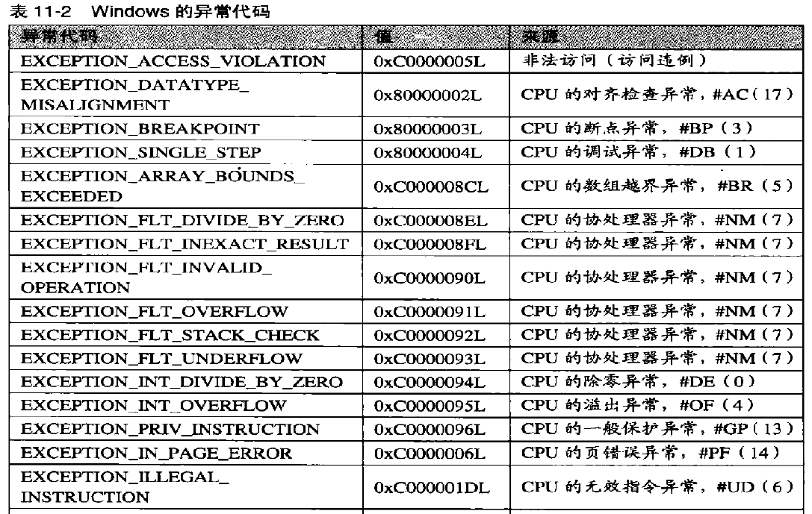

[toc]


# 01.CPU异常记录

一个异常产生后，首先是要**记录异常信息**（异常的类型、异常发生的位置等），然后要寻找异常的处理函数，称为**异常的分发**,最后找到异常处理函数并调用，称为**异常处理**。

分类：

1. CPU产生的异常
2. 软件产生的异常

## 异常处理流程

1. CPU指令检测到异常（例：除0），异常一定是先由CPU发现的
2. 查IDT表，执行中断处理函数，不同的异常调用不同的中断处理函数
3. `CommonDispatchException`
4. `KiDispatchExceeption`

Windows异常代码：




## _KiTrap00


ida中alt+t搜索`_IDT`，这里使用0号举例

```asm
.text:00407522 _KiTrap00       proc near               ; DATA XREF: INIT:_IDT↓o
.text:00407522
.text:00407522 var_2           = word ptr -2
.text:00407522 arg_4           = dword ptr  8
.text:00407522
.text:00407522 ; FUNCTION CHUNK AT .text:00407399 SIZE 00000021 BYTES
.text:00407522
.text:00407522                 push    0
.text:00407524                 mov     word ptr [esp+(_KTRAP_FRAME.DbgEbp+2)], 0
.text:0040752B                 push    ebp;_Trap_Frame保存现场
.text:0040752C                 push    ebx
.text:0040752D                 push    esi
.text:0040752E                 push    edi
.text:0040752F                 push    fs
.text:00407531                 mov     ebx, 30h ; '0'
.text:00407536                 mov     fs, ebx
.text:00407538                 assume fs:nothing
.text:00407538                 mov     ebx, large fs:0
.text:0040753F                 push    ebx
.text:00407540                 sub     esp, 4
.text:00407543                 push    eax
.text:00407544                 push    ecx
.text:00407545                 push    edx
.text:00407546                 push    ds
.text:00407547                 push    es
.text:00407548                 push    gs
.text:0040754A                 mov     ax, 23h ; '#'
.text:0040754E                 sub     esp, 30h
.text:00407551                 mov     ds, eax
.text:00407553                 assume ds:nothing
.text:00407553                 mov     es, eax
.text:00407555                 assume es:nothing
.text:00407555                 mov     ebp, esp
.text:00407557                 test    [esp+_KTRAP_FRAME.EFlags], 20000h
.text:0040755F                 jnz     short V86_kit0_a
.text:00407561
.text:00407561 loc_407561:                             ; CODE XREF: V86_kit0_a+25↑j
.text:00407561                 cld
.text:00407562                 mov     ebx, [ebp+_KTRAP_FRAME._Ebp]
.text:00407565                 mov     edi, [ebp+_KTRAP_FRAME._Eip]
.text:00407568                 mov     [ebp+_KTRAP_FRAME.DbgArgPointer], edx
.text:0040756B                 mov     [ebp+_KTRAP_FRAME.DbgArgMark], 0BADB0D00h
.text:00407572                 mov     [ebp+_KTRAP_FRAME.DbgEbp], ebx
.text:00407575                 mov     [ebp+_KTRAP_FRAME.DbgEip], edi
.text:00407578                 test    large byte ptr fs:_KTRAP_FRAME.SegFs, 0FFh
.text:00407580                 jnz     Dr_kit0_a
.text:00407586
.text:00407586 loc_407586:                             ; CODE XREF: Dr_kit0_a+10↑j
.text:00407586                                         ; Dr_kit0_a+7C↑j
.text:00407586                 test    [ebp+_KTRAP_FRAME.EFlags], 20000h
.text:0040758D                 jnz     short loc_4075CC
.text:0040758F                 test    byte ptr [ebp+_KTRAP_FRAME.SegCs], 1
.text:00407593                 jz      short loc_40759C
.text:00407595                 cmp     word ptr [ebp+_KTRAP_FRAME.SegCs], 1Bh
.text:0040759A                 jnz     short loc_4075B9
.text:0040759C
.text:0040759C loc_40759C:                             ; CODE XREF: _KiTrap00+71↑j
.text:0040759C                 sti
.text:0040759D                 push    ebp
.text:0040759E                 call    _Ki386CheckDivideByZeroTrap@4 ; Ki386CheckDivideByZeroTrap(x)
.text:004075A3                 mov     ebx, [ebp+_KTRAP_FRAME._Eip];保存进入异常处理前的地址
.text:004075A6                 jmp     loc_407399;这里
.text:004075AB ; ---------------------------------------------------------------------------
.text:004075AB
.text:004075AB loc_4075AB:                             ; CODE XREF: _KiTrap00+A8↓j
.text:004075AB                                         ; _KiTrap00+B9↓j
.text:004075AB                 sti
.text:004075AC                 mov     ebx, [ebp+_KTRAP_FRAME._Eip];保存进入异常处理前的地址
.text:004075AF                 mov     eax, 0C0000094h
.text:004075B4                 jmp     loc_407399;这里
;;;;;;;;;;;;;;;;;;;;;;;;;;;;;;;;;;;;;;;;;;;;;;;;;;;;;;;;;;;;;;;;;;;;;;;;;;;;;;;;;;;;;;;;
.text:00407399 loc_407399:                             ; CODE XREF: _KiTrap00+84↓j
.text:00407399                                         ; _KiTrap00+92↓j ...
.text:00407399                 xor     ecx, ecx
.text:0040739B                 call    CommonDispatchException
```


### CommonDispatchException

`CommonDispatchException`这个函数就是构建一个`_EXCEPTION_RECORD`结构体并赋值

```c
kd> dt _EXCEPTION_RECORD
nt!_EXCEPTION_RECORD
   +0x000 ExceptionCode    : Int4B//异常码
   +0x004 ExceptionFlags   : Uint4B//异常标志 cpu 0 ,软件模拟 1,嵌套异常10h ...
   +0x008 ExceptionRecord  : Ptr32 _EXCEPTION_RECORD//下一个异常 一般为NULL 除非出现嵌套异常
   +0x00c ExceptionAddress : Ptr32 Void	//发生异常的指令地址
   +0x010 NumberParameters : Uint4B//参数个数
   +0x014 ExceptionInformation : [15] Uint4B//附加参数指针
```

代码：

```asm
.text:004073BA CommonDispatchException proc near       ; CODE XREF: _KiTrap00-187↑p
.text:004073BA                                         ; _KiTrap00-17B↑p ...
.text:004073BA
.text:004073BA var_50          = dword ptr -50h
.text:004073BA var_4C          = dword ptr -4Ch
.text:004073BA var_48          = dword ptr -48h
.text:004073BA var_44          = dword ptr -44h
.text:004073BA var_40          = dword ptr -40h
.text:004073BA var_3C          = byte ptr -3Ch
.text:004073BA
.text:004073BA                 sub     esp, 50h
.text:004073BD                 mov     [esp+_EXCEPTION_RECORD.ExceptionCode], eax
.text:004073C0                 xor     eax, eax
.text:004073C2                 mov     [esp+_EXCEPTION_RECORD.ExceptionFlags], eax
.text:004073C6                 mov     [esp+_EXCEPTION_RECORD.ExceptionRecord], eax
.text:004073CA                 mov     [esp+_EXCEPTION_RECORD.ExceptionAddress], ebx
.text:004073CE                 mov     [esp+_EXCEPTION_RECORD.NumberParameters], ecx
.text:004073D2                 cmp     ecx, 0
.text:004073D5                 jz      short loc_4073E3
.text:004073D7                 lea     ebx, [esp+_EXCEPTION_RECORD.ExceptionInformation]
.text:004073DB                 mov     [ebx], edx
.text:004073DD                 mov     [ebx+_EXCEPTION_RECORD.ExceptionFlags], esi
.text:004073E0                 mov     [ebx+_EXCEPTION_RECORD.ExceptionRecord], edi
.text:004073E3
.text:004073E3 loc_4073E3:                             ; CODE XREF: CommonDispatchException+1B↑j
.text:004073E3                 mov     ecx, esp
.text:004073E5                 test    [ebp+_KTRAP_FRAME.EFlags], 20000h
.text:004073EC                 jz      short loc_4073F5
.text:004073EE                 mov     eax, 0FFFFh
.text:004073F3                 jmp     short loc_4073F8
.text:004073F5 ; ---------------------------------------------------------------------------
.text:004073F5
.text:004073F5 loc_4073F5:                             ; CODE XREF: CommonDispatchException+32↑j
.text:004073F5                 mov     eax, [ebp+_KTRAP_FRAME.SegCs]
.text:004073F8
.text:004073F8 loc_4073F8:                             ; CODE XREF: CommonDispatchException+39↑j
.text:004073F8                 and     eax, 1
.text:004073FB                 push    1               ; char
.text:004073FD                 push    eax             ; int
.text:004073FE                 push    ebp             ; BugCheckParameter3
.text:004073FF                 push    0               ; int
.text:00407401                 push    ecx             ; ExceptionRecord
.text:00407402                 call    _KiDispatchException@20 ; KiDispatchException(x,x,x,x,x)
.text:00407407                 mov     esp, ebp
.text:00407409                 jmp     Kei386EoiHelper@0 ; Kei386EoiHelper()
.text:00407409 CommonDispatchException endp
```

