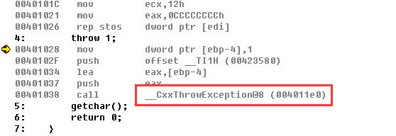
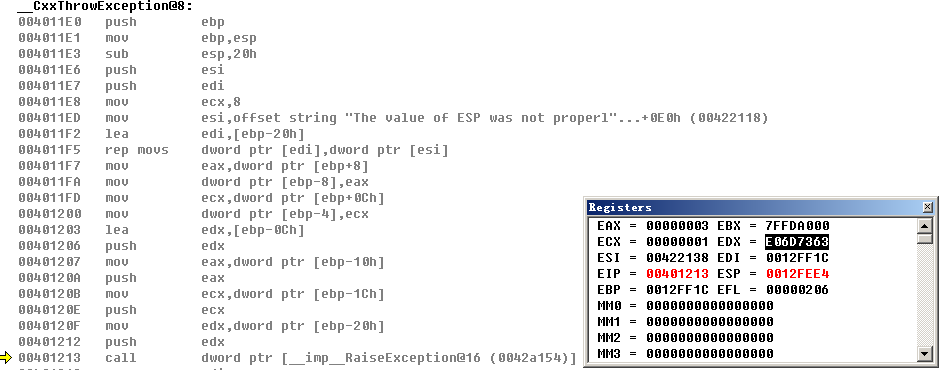

[toc]


# 01.CPU异常记录

一个异常产生后，首先是要**记录异常信息**（异常的类型、异常发生的位置等），然后要寻找异常的处理函数，称为**异常的分发**,最后找到异常处理函数并调用，称为**异常处理**。

分类：

1. CPU产生的异常
2. 软件产生的异常

## 异常处理流程

1. CPU指令检测到异常（例：除0），异常一定是先由CPU发现的
2. 查IDT表，执行中断处理函数，不同的异常调用不同的中断处理函数
3. `CommonDispatchException`
4. `KiDispatchExceeption`

Windows异常代码：


## _KiTrap00


ida中alt+t搜索`_IDT`，这里使用0号举例

```asm
.text:00407522 _KiTrap00       proc near               ; DATA XREF: INIT:_IDT↓o
.text:00407522
.text:00407522 var_2           = word ptr -2
.text:00407522 arg_4           = dword ptr  8
.text:00407522
.text:00407522 ; FUNCTION CHUNK AT .text:00407399 SIZE 00000021 BYTES
.text:00407522
.text:00407522                 push    0
.text:00407524                 mov     word ptr [esp+(_KTRAP_FRAME.DbgEbp+2)], 0
.text:0040752B                 push    ebp;_Trap_Frame保存现场
.text:0040752C                 push    ebx
.text:0040752D                 push    esi
.text:0040752E                 push    edi
.text:0040752F                 push    fs
.text:00407531                 mov     ebx, 30h ; '0'
.text:00407536                 mov     fs, ebx
.text:00407538                 assume fs:nothing
.text:00407538                 mov     ebx, large fs:0
.text:0040753F                 push    ebx
.text:00407540                 sub     esp, 4
.text:00407543                 push    eax
.text:00407544                 push    ecx
.text:00407545                 push    edx
.text:00407546                 push    ds
.text:00407547                 push    es
.text:00407548                 push    gs
.text:0040754A                 mov     ax, 23h ; '#'
.text:0040754E                 sub     esp, 30h
.text:00407551                 mov     ds, eax
.text:00407553                 assume ds:nothing
.text:00407553                 mov     es, eax
.text:00407555                 assume es:nothing
.text:00407555                 mov     ebp, esp
.text:00407557                 test    [esp+_KTRAP_FRAME.EFlags], 20000h
.text:0040755F                 jnz     short V86_kit0_a
.text:00407561
.text:00407561 loc_407561:                             ; CODE XREF: V86_kit0_a+25↑j
.text:00407561                 cld
.text:00407562                 mov     ebx, [ebp+_KTRAP_FRAME._Ebp]
.text:00407565                 mov     edi, [ebp+_KTRAP_FRAME._Eip]
.text:00407568                 mov     [ebp+_KTRAP_FRAME.DbgArgPointer], edx
.text:0040756B                 mov     [ebp+_KTRAP_FRAME.DbgArgMark], 0BADB0D00h
.text:00407572                 mov     [ebp+_KTRAP_FRAME.DbgEbp], ebx
.text:00407575                 mov     [ebp+_KTRAP_FRAME.DbgEip], edi
.text:00407578                 test    large byte ptr fs:_KTRAP_FRAME.SegFs, 0FFh
.text:00407580                 jnz     Dr_kit0_a
.text:00407586
.text:00407586 loc_407586:                             ; CODE XREF: Dr_kit0_a+10↑j
.text:00407586                                         ; Dr_kit0_a+7C↑j
.text:00407586                 test    [ebp+_KTRAP_FRAME.EFlags], 20000h
.text:0040758D                 jnz     short loc_4075CC
.text:0040758F                 test    byte ptr [ebp+_KTRAP_FRAME.SegCs], 1
.text:00407593                 jz      short loc_40759C
.text:00407595                 cmp     word ptr [ebp+_KTRAP_FRAME.SegCs], 1Bh
.text:0040759A                 jnz     short loc_4075B9
.text:0040759C
.text:0040759C loc_40759C:                             ; CODE XREF: _KiTrap00+71↑j
.text:0040759C                 sti
.text:0040759D                 push    ebp
.text:0040759E                 call    _Ki386CheckDivideByZeroTrap@4 ; Ki386CheckDivideByZeroTrap(x)
.text:004075A3                 mov     ebx, [ebp+_KTRAP_FRAME._Eip];保存进入异常处理前的地址
.text:004075A6                 jmp     loc_407399;这里
.text:004075AB ; ---------------------------------------------------------------------------
.text:004075AB
.text:004075AB loc_4075AB:                             ; CODE XREF: _KiTrap00+A8↓j
.text:004075AB                                         ; _KiTrap00+B9↓j
.text:004075AB                 sti
.text:004075AC                 mov     ebx, [ebp+_KTRAP_FRAME._Eip];保存进入异常处理前的地址
.text:004075AF                 mov     eax, 0C0000094h
.text:004075B4                 jmp     loc_407399;这里
;;;;;;;;;;;;;;;;;;;;;;;;;;;;;;;;;;;;;;;;;;;;;;;;;;;;;;;;;;;;;;;;;;;;;;;;;;;;;;;;;;;;;;;;
.text:00407399 loc_407399:                             ; CODE XREF: _KiTrap00+84↓j
.text:00407399                                         ; _KiTrap00+92↓j ...
.text:00407399                 xor     ecx, ecx
.text:0040739B                 call    CommonDispatchException
```


### CommonDispatchException

`CommonDispatchException`这个函数就是构建一个`_EXCEPTION_RECORD`结构体并赋值

```c
kd> dt _EXCEPTION_RECORD
nt!_EXCEPTION_RECORD
   +0x000 ExceptionCode    : Int4B//异常码
   +0x004 ExceptionFlags   : Uint4B//异常标志 cpu 0 ,软件模拟 1,嵌套异常10h ...
   +0x008 ExceptionRecord  : Ptr32 _EXCEPTION_RECORD//下一个异常 一般为NULL 除非出现嵌套异常
   +0x00c ExceptionAddress : Ptr32 Void	//发生异常的指令地址
   +0x010 NumberParameters : Uint4B//参数个数
   +0x014 ExceptionInformation : [15] Uint4B//附加参数指针
```

代码：

```asm
.text:004073BA CommonDispatchException proc near       ; CODE XREF: _KiTrap00-187↑p
.text:004073BA                                         ; _KiTrap00-17B↑p ...
.text:004073BA
.text:004073BA var_50          = dword ptr -50h
.text:004073BA var_4C          = dword ptr -4Ch
.text:004073BA var_48          = dword ptr -48h
.text:004073BA var_44          = dword ptr -44h
.text:004073BA var_40          = dword ptr -40h
.text:004073BA var_3C          = byte ptr -3Ch
.text:004073BA
.text:004073BA                 sub     esp, 50h
.text:004073BD                 mov     [esp+_EXCEPTION_RECORD.ExceptionCode], eax
.text:004073C0                 xor     eax, eax
.text:004073C2                 mov     [esp+_EXCEPTION_RECORD.ExceptionFlags], eax
.text:004073C6                 mov     [esp+_EXCEPTION_RECORD.ExceptionRecord], eax
.text:004073CA                 mov     [esp+_EXCEPTION_RECORD.ExceptionAddress], ebx
.text:004073CE                 mov     [esp+_EXCEPTION_RECORD.NumberParameters], ecx
.text:004073D2                 cmp     ecx, 0
.text:004073D5                 jz      short loc_4073E3
.text:004073D7                 lea     ebx, [esp+_EXCEPTION_RECORD.ExceptionInformation]
.text:004073DB                 mov     [ebx], edx
.text:004073DD                 mov     [ebx+_EXCEPTION_RECORD.ExceptionFlags], esi
.text:004073E0                 mov     [ebx+_EXCEPTION_RECORD.ExceptionRecord], edi
.text:004073E3
.text:004073E3 loc_4073E3:                             ; CODE XREF: CommonDispatchException+1B↑j
.text:004073E3                 mov     ecx, esp
.text:004073E5                 test    [ebp+_KTRAP_FRAME.EFlags], 20000h
.text:004073EC                 jz      short loc_4073F5
.text:004073EE                 mov     eax, 0FFFFh
.text:004073F3                 jmp     short loc_4073F8
.text:004073F5 ; ---------------------------------------------------------------------------
.text:004073F5
.text:004073F5 loc_4073F5:                             ; CODE XREF: CommonDispatchException+32↑j
.text:004073F5                 mov     eax, [ebp+_KTRAP_FRAME.SegCs]
.text:004073F8
.text:004073F8 loc_4073F8:                             ; CODE XREF: CommonDispatchException+39↑j
.text:004073F8                 and     eax, 1
.text:004073FB                 push    1               ; char
.text:004073FD                 push    eax             ; int
.text:004073FE                 push    ebp             ; BugCheckParameter3
.text:004073FF                 push    0               ; int
.text:00407401                 push    ecx             ; ExceptionRecord
.text:00407402                 call    _KiDispatchException@20 ; KiDispatchException(x,x,x,x,x)
.text:00407407                 mov     esp, ebp
.text:00407409                 jmp     Kei386EoiHelper@0 ; Kei386EoiHelper()
.text:00407409 CommonDispatchException endp
```


# 02.模拟异常记录


模拟异常的产生：

```c
CxxThrowException()=>

(KERNEL32.DLL)RaiseException()=>

NTDLL.DLL!RtlRaiseException()=>

NT!NtRaiseException=>

NT!KiRaiseException
```

## 分析模拟异常

```c
#include <stdio.h>
int main()
{
	throw 1;
	getchar();
	return 0;
}
```

可以看到调用了`CxxThrowException`：

> 本实验使用的编辑器为vc6.0，为C++环境，在不同的环境中，调用的函数可能是不同的，但是最终调用的系统函数都是相同的



F11跟进去，可以看到调用了`RaiseException`，位于**Kernel32.dll**：

当CPU产生异常时会记录一个**ErrorCode**，通过查表可以查到ErrorCode具体的含义，不同的异常对应不同的错误代码，但是软件抛出的ErrorCode是根据编译环境决定的，如下图的EDX中存储的值即为当前编译环境的ErrorCode：




**CPU**记录异常的地址是真正发生异常的地址，但软件抛出异常时记录的地址是__RaiseException函数的地址

```asm
.text:00474ECE ; __stdcall RaiseException(x, x, x, x)
.text:00474ECE _RaiseException@16 proc near            ; CODE XREF: __raise_exc+194↓p
.text:00474ECE                                         ; DATA XREF: RaiseException(x,x,x,x)+21↓o
.text:00474ECE
.text:00474ECE ExceptionRecord = _EXCEPTION_RECORD ptr -50h
.text:00474ECE arg_0           = dword ptr  8
.text:00474ECE arg_4           = dword ptr  0Ch
.text:00474ECE arg_8           = dword ptr  10h
.text:00474ECE arg_C           = dword ptr  14h
.text:00474ECE
.text:00474ECE                 mov     edi, edi
.text:00474ED0                 push    ebp
.text:00474ED1                 mov     ebp, esp
.text:00474ED3                 sub     esp, 50h
.text:00474ED6                 mov     eax, [ebp+arg_0]
.text:00474ED9                 and     [ebp+ExceptionRecord.ExceptionRecord], 0
.text:00474EDD                 mov     [ebp+ExceptionRecord.ExceptionCode], eax
.text:00474EE0                 mov     eax, [ebp+arg_4]
.text:00474EE3                 push    esi
.text:00474EE4                 mov     esi, [ebp+arg_C]
.text:00474EE7                 and     eax, 1
.text:00474EEA                 test    esi, esi
.text:00474EEC                 mov     [ebp+ExceptionRecord.ExceptionFlags], eax
.text:00474EEF                 mov     [ebp+ExceptionRecord.ExceptionAddress], offset _RaiseException@16 ; RaiseException(x,x,x,x);CPU记录异常的地址是真正发生异常的地址，但软件抛出异常时记录的地址是__RaiseException函数的地址
.text:00474EF6                 jz      short loc_474F13
.text:00474EF8                 mov     ecx, [ebp+arg_8]
.text:00474EFB                 cmp     ecx, 0Fh
.text:00474EFE                 jbe     short loc_474F03
.text:00474F00                 push    0Fh
.text:00474F02                 pop     ecx
.text:00474F03
.text:00474F03 loc_474F03:                             ; CODE XREF: RaiseException(x,x,x,x)+30↑j
.text:00474F03                 test    ecx, ecx
.text:00474F05                 mov     [ebp+ExceptionRecord.NumberParameters], ecx
.text:00474F08                 jz      short loc_474F17
.text:00474F0A                 push    edi
.text:00474F0B                 lea     edi, [ebp+ExceptionRecord.ExceptionInformation]
.text:00474F0E                 rep movsd
.text:00474F10                 pop     edi
.text:00474F11                 jmp     short loc_474F17
.text:00474F13 ; ---------------------------------------------------------------------------
.text:00474F13
.text:00474F13 loc_474F13:                             ; CODE XREF: RaiseException(x,x,x,x)+28↑j
.text:00474F13                 and     [ebp+ExceptionRecord.NumberParameters], 0
.text:00474F17
.text:00474F17 loc_474F17:                             ; CODE XREF: RaiseException(x,x,x,x)+3A↑j
.text:00474F17                                         ; RaiseException(x,x,x,x)+43↑j
.text:00474F17                 lea     eax, [ebp+ExceptionRecord]
.text:00474F1A                 push    eax             ; ExceptionRecord
.text:00474F1B                 call    _RtlRaiseException@4 ; RtlRaiseException(x)
.text:00474F20                 pop     esi
.text:00474F21                 leave
.text:00474F22                 retn    10h
.text:00474F22 _RaiseException@16 endp
```

最后调用了`_RtlRaiseException`，位于**Ntdll.dll**

`_RtlRaiseException`调用了`ZwRaiseException`，之后继续调用了`NtRaiseException`，之后是`KiRaiseException`，最终和CPU异常一样调用到了`KiDispatchException`分发异常


## CPU异常和软件模拟异常流程

如下图所示：


# 03.内核异常处理流程

异常可以发生在用户空间，也可以发生在内核空间

内核异常处理流程：

1. `KeContextFromKframes`将`TrapFrame`备份到`Context`，为返回3环做准备。
2. 判断先前模式，0是内核调用反之是用户层调用。
3. 是否是第一次机会。
4. 是否有内核调试器。
5. 如果没有或者内核调试器不处理。
6. 调用`RtlDispatchException`，查找并调用异常处理函数。
7. 如果返回`FALSE`，再次判断是否有内核调试器，有调用，没有直接蓝屏。

## KiDispatchException分析

函数原型：

```c
VOID KiDispatchException (
    IN PEXCEPTION_RECORD ExceptionRecord,
    IN PKEXCEPTION_FRAME ExceptionFrame,
    IN PKTRAP_FRAME TrapFrame,
    IN KPROCESSOR_MODE PreviousMode,
    IN BOOLEAN FirstChance //TRUE第一次处理该异常，FALSE不是第一次
)
```


首先备份`TrapFrame`到`Context`

```asm
text:00424A69 loc_424A69:                             ; CODE XREF: KiDispatchException(x,x,x,x,x)+55↑j
.text:00424A69                                         ; KiDispatchException(x,x,x,x,x)+68↑j
.text:00424A69                 lea     eax, [ebp+Context]
.text:00424A6F                 push    eax
.text:00424A70                 push    ecx
.text:00424A71                 push    ebx
.text:00424A72                 call    _KeContextFromKframes@12 ; 1)KeContextFromKframes将TrapFrame备份到Context，为返回3环做准备。
.text:00424A77                 mov     eax, [esi]
.text:00424A79                 cmp     eax, 80000003h
.text:00424A7E                 jnz     loc_44110E
.text:00424A84                 dec     [ebp+Context._Eip]
;;;;;;;;;;;;;;;;;;;;;;;;;;;;;;;;;;;;;;;;;;;;;;;;;;;;;;;;;;;;;;;;;;;;;;;;;;;;
.text:00424A8C loc_424A8C:                             ; CODE XREF: KiDispatchException(x,x,x,x,x)+266BE↓j
.text:00424A8C                 cmp     byte ptr [ebp+CONTEXT.Dr6], 0 ; 2)判断先前模式，0是内核调用，1是用户层调用，此时能够知道要分发的异常来自哪里。
.text:00424A90                 jnz     loc_440F9E      ; 用户层调用跳转
.text:00424A96                 cmp     byte ptr [ebp+CONTEXT.Dr7], 1 ; 3)是否是第一次调用
.text:00424A9A                 jnz     loc_44B0C0      ; 不是第一次调用跳转
.text:00424AA0                 mov     eax, ds:_KiDebugRoutine ; 4)是否有内核调试器
.text:00424AA5                 cmp     eax, edi
.text:00424AA7                 jz      loc_4335A6      ; 没有内核调试则跳转
.text:00424AAD                 push    edi             ; _DWORD
.text:00424AAE                 push    edi             ; _DWORD
.text:00424AAF                 lea     ecx, [ebp+Context]
.text:00424AB5                 push    ecx             ; _DWORD
.text:00424AB6                 push    esi             ; _DWORD
.text:00424AB7                 push    [ebp+var_2F0]   ; _DWORD
.text:00424ABD                 push    ebx             ; _DWORD
.text:00424ABE                 call    eax ; _KiDebugRoutine ; 有内核调试先 调用内核调试器
.text:00424ABE                                         ; 如果调用返回成功,说明内核调试器已经处理异常,就将CONTEXT再转成Trap_Frame直接返回
.text:00424ABE                                         ; 如果调试器未处理,就让3环处理
.text:00424AC0                 test    al, al
.text:00424AC2                 jz      loc_4335A6      ; 若内核调试器未处理(返回值为FALSE), 跳转
;;;;;;;;;;;;;;;;;;;;;;;;;;;;;;;;;;;;;;;;;;;;;;;;;;;;;;;;;;;;;;;;;;;;;;;;;;;;;;;;;;;
.text:004335A6 ; START OF FUNCTION CHUNK FOR KiDispatchException(x,x,x,x,x)
.text:004335A6
.text:004335A6 loc_4335A6:                             ; CODE XREF: KiDispatchException(x,x,x,x,x)+B2↑j
.text:004335A6                                         ; KiDispatchException(x,x,x,x,x)+CD↑j
.text:004335A6 ; __unwind { // __SEH_prolog            ; 5)如果没有或者内核调试器不处理
.text:004335A6                 lea     eax, [ebp+Context]
.text:004335AC                 push    eax             ; Context
.text:004335AD                 push    esi             ; ExceptionRecord
.text:004335AE                 call    _RtlDispatchException@8 ; 6)调用RtlDispatchException，查找并调用异常处理函数。
.text:004335B3                 jmp     loc_44B0B8      
;;;;;;;;;;;;;;;;;;;;;;;;;;;;;;;;;;;;;;;;;;;;;;;;;;;;;;;;;;;;;;;;;;;;;;;;;;;;;;
.text:0044B0B8 loc_44B0B8:                             ; CODE XREF: KiDispatchException(x,x,x,x,x)+EBBE↑j
.text:0044B0B8                 cmp     al, 1           ; 7)判断异常是否被解决，解决了跳转
.text:0044B0BA                 jz      loc_424AC8
.text:0044B0C0
.text:0044B0C0 loc_44B0C0:                             ; CODE XREF: KiDispatchException(x,x,x,x,x)+A5↑j
.text:0044B0C0                 mov     eax, ds:_KiDebugRoutine ; 判断是否有内核调试器，有就调用，没有会直接蓝屏
.text:0044B0C5                 cmp     eax, edi
.text:0044B0C7                 jz      loc_44B1C2
.text:0044B0CD                 push    1               ; _DWORD
.text:0044B0CF                 push    edi             ; _DWORD
.text:0044B0D0                 lea     ecx, [ebp+Context]
.text:0044B0D6                 push    ecx             ; _DWORD
.text:0044B0D7                 push    esi             ; _DWORD
.text:0044B0D8                 push    [ebp+var_2F0]   ; _DWORD
.text:0044B0DE                 push    ebx             ; _DWORD
.text:0044B0DF                 call    eax ; _KiDebugRoutine
.text:0044B0E1                 test    al, al
.text:0044B0E3                 jz      loc_44B1C2      ; 内核调试器调用结束，未解决，跳转，蓝屏
.text:0044B0E9                 jmp     loc_424AC8      ; 成功解决跳转
.text:0044B0E9 ; } // starts at 44B06C
.text:0044B0E9 ; END OF FUNCTION CHUNK FOR KiDispatchException(x,x,x,x,x)
;;;;;;;;;;;;;;;;;;;;;;;;;;;;;;;;;;;;;;;;;;;;;;;;;;;;;;;;;;;;;;;;;;;;;;;;;;;;;;
;蓝屏
.text:0044B1C2 loc_44B1C2:                             ; CODE XREF: KiDispatchException(x,x,x,x,x)+266D2↑j
.text:0044B1C2                                         ; KiDispatchException(x,x,x,x,x)+266EE↑j ...
.text:0044B1C2                 push    edi             ; BugCheckParameter4
.text:0044B1C3                 push    ebx             ; BugCheckParameter3
.text:0044B1C4                 push    dword ptr [esi+0Ch] ; BugCheckParameter2
.text:0044B1C7                 push    dword ptr [esi] ; BugCheckParameter1
.text:0044B1C9                 push    8Eh             ; BugCheckCode
.text:0044B1CE                 call    _KeBugCheckEx@20 ; KeBugCheckEx(x,x,x,x,x)
.text:0044B1CE ; } // starts at 44B14A
;;;;;;;;;;;;;;;;;;;;;;;;;;;;;;;;;;;;;;;;;;;;;;;;;;;;;;;;;;;;;;;;;;;;;;;;;;;;;;
.text:00424AC8 loc_424AC8:                             ; CODE XREF: KiDispatchException(x,x,x,x,x)+1C5EB↓j
.text:00424AC8                                         ; KiDispatchException(x,x,x,x,x)+1C743↓j ...
.text:00424AC8                 push    [ebp+arg_C]
.text:00424ACB                 push    [ebp+Context.ContextFlags]
.text:00424AD1                 lea     eax, [ebp+Context]
.text:00424AD7                 push    eax
.text:00424AD8                 push    [ebp+var_2F0]
.text:00424ADE                 push    ebx
.text:00424ADF                 call    _KeContextToKframes@20 ; 成功解决，复原
```


## RtlDispatchException分析

没有调试器或者内核调试器没有处理


```asm
.text:004257D8 ; BOOLEAN __stdcall RtlDispatchException(PEXCEPTION_RECORD ExceptionRecord, PCONTEXT Context)
.text:004257D8 _RtlDispatchException@8 proc near       ; CODE XREF: ExRaiseException(x)+92↑p
.text:004257D8                 mov     edi, edi
.text:004257DA                 push    ebp
.text:004257DB                 mov     ebp, esp
.text:004257DD                 sub     esp, 64h
.text:004257E0                 push    ebx
.text:004257E1                 lea     eax, [ebp+HighLimit]
.text:004257E4                 push    eax             ; HighLimit
.text:004257E5                 lea     eax, [ebp+LowLimit]
.text:004257E8                 push    eax             ; LowLimit
.text:004257E9                 mov     [ebp+var_1], 0
.text:004257ED                 call    _RtlpGetStackLimits@8 ; RtlpGetStackLimits(x,x)
.text:004257F2                 call    _RtlpGetRegistrationHead@0 ; RtlpGetRegistrationHead()
.text:004257F7                 and     [ebp+var_8], 0
.text:004257FB                 mov     ebx, eax
.text:004257FD                 cmp     ebx, 0FFFFFFFFh
.text:00425800                 jz      loc_455060
.text:00425806                 push    esi
.text:00425807                 mov     esi, [ebp+ExceptionRecord]
.text:0042580A                 push    edi
;;;;;;;;;;;;;;;;;;;;;;;;;;;;;;;;;;;;;;;;;;;;;;;;;;;;;;;;;;;;;;
.text:00405230 _RtlpGetRegistrationHead@0 proc near    ; CODE XREF: RtlUnwind(x,x,x,x)+90↓p
.text:00405230                                         ; RtlDispatchException(x,x)+1A↓p
.text:00405230                 mov     eax, large fs:0
.text:00405236                 retn
.text:00405236 _RtlpGetRegistrationHead@0 endp
```

`fs:0`也就是KPCR的`ExceptionList`，结构如下：

```c
typedef struct _EXCEPTION_REGISTRATION_RECORD 
{ 
	struct EXCEPTION_REGISTRATION_RECORD* Next;	//下一个节点，如过为-1就是没有下一个节点了
	PEXCEPTION_ROUTINE Handler; //指向下一个异常处理函数
} EXCEPTION_REGISTRATION_RECORD;
```


1. 遍历异常链表,调用异常处理函数,如果异常被正确处理了,该函数返回1
2. 如果当前异常处理函数不能处理该异常,那么调用下一个,以此类推。
3. 如果到最后也没有人处理这个异常,返回0。

## 总结


# 04.用户异常的分发


1. 异常如果发生在内核层，处理起来比较简单，因为异常处理函数也在0环，不用切换堆栈，但是如果异常发生在3环，就意味着必须要切换堆栈，回到3环执行处理函数

2. 切换堆栈的处理方式与用户APC的执行过程几乎是一样的，惟一的区别就是执行用户APC时返回3环后执行的函数是`KiUserApcDispatcher`，而异常处理时返回3环后执行的函数是`KiUserExceptionDispatcher`

3. 理解用户APC的执行过程是理解3环异常处理的关键

用户异常处理流程：

1. KeContextFromKframes将Trap_frame备份到 context 为返回3环做准备
2. 判断先前模式0是内核调用1是用户层调
3. 是否是第一次机会
4. 是否有内核调试器
5. 发送给3环调试
6. 如果3环调试器没有处理这个异常,把异常数据填充到用户栈。
7. 修正EIP为`KiUserExceptionDispatcher`。这个函数是`ntdll`的

### KiDispatchException

前面的部分和内核异常处理流程一样，关键：

```asm
.text:00440F9E loc_440F9E:                             ; CODE XREF: KiDispatchException(x,x,x,x,x)+9B↑j
.text:00440F9E ; __unwind { // __SEH_prolog            ; 判断是否是第一次
.text:00440F9E                 cmp     byte ptr [ebp+CONTEXT.Dr7], 1
.text:00440FA2                 jnz     loc_44B196
.text:00440FA8                 cmp     ds:_KiDebugRoutine, edi ; 判断是否存在内核调试器
.text:00440FAE                 jz      short loc_440FE6 ; 没有则跳转
;;;;;;;;;;;;;;;;;;;;;;;;;;;;;;;;;;;;;;;;;;;;;;;;;;;;;;;;;;;;;;;;;;;;;
.text:00440FE6 loc_440FE6:                             ; CODE XREF: KiDispatchException(x,x,x,x,x)+EBCB↑j
.text:00440FE6                                         ; KiDispatchException(x,x,x,x,x)+1C5B9↑j
.text:00440FE6                 push    edi             ; 5)发送给3环调试
.text:00440FE7                 push    1
.text:00440FE9                 push    esi
.text:00440FEA                 call    _DbgkForwardException@12 ; DbgkForwardException(ExceptionRecord,TRUE,FALSE);
.text:00440FEA                                         ; 参数1:ExceptionRecord异常结构
.text:00440FEA                                         ; 参数2:调试端口-TRUE，异常端口-FALSE
.text:00440FEA                                         ; 参数3:是否是第二次机会(1/0)
.text:00440FEF                 test    al, al
.text:00440FF1                 jnz     loc_424AE4      ; 若存在三环调试器，并处理了该异常，跳转
.text:00440FF7                 mov     [ebp+var_3A0], edi ; 若三环调试器没处理这个异常，则准备返回3环
.text:00440FF7                                         ; 走到这一步说明即不存在0环调试器也不存在3环调试器
.text:00440FF7                                         ; 为返回3环做准备(修改_ TRAP_ FRAME里各寄存器的值)
........................
;这里一堆为TRAP_FRAME结构体赋值，结束的地方：
.........................
.text:004410D3                 mov     [ebx+_KTRAP_FRAME.SegDs], ecx
.text:004410D6                 mov     [ebx+_KTRAP_FRAME.SegEs], ecx
.text:004410D9                 neg     al
.text:004410DB                 sbb     eax, eax
.text:004410DD                 and     eax, 3
.text:004410E0                 add     eax, 38h ; '8'
.text:004410E3                 mov     [ebx+_KTRAP_FRAME.SegFs], eax
.text:004410E6                 and     [ebx+_KTRAP_FRAME.SegGs], 0
.text:004410EA                 mov     eax, ds:_KeUserExceptionDispatcher
.text:004410EF                 mov     [ebx+_KTRAP_FRAME._Eip], eax ; 最关键的修改:回到3环的什么地方
.text:004410EF                                         ; 此时eax = KiUserExceptionDispatcher
.text:004410EF                                         ; 改完之后，当前函数执行结束，CPU异常与模拟异常返回地点不同
.text:004410F2                 or      [ebp+ms_exc.registration.TryLevel], 0FFFFFFFFh
.text:004410F6                 jmp     loc_424AE4
;;;;;;;;;;;;;;;;;;;;;;;;;;;;;;;;;;;;;;;;;;;;;;;;;;;;;;;;;;;;;;;;;;;;;;;;;;;;;
.text:00424AE4 loc_424AE4:                             ; CODE XREF: KiDispatchException(x,x,x,x,x)+1C5FC↓j
.text:00424AE4                                         ; KiDispatchException(x,x,x,x,x)+1C701↓j ...
.text:00424AE4                 mov     ecx, [ebp+var_1C]
.text:00424AE7                 call    sub_403063
.text:00424AEC                 call    __SEH_epilog
.text:00424AF1                 retn    14h
.text:00424AF1 ; } // starts at 4249F5
.text:00424AF1 _KiDispatchException@20 endp
```

KiDispatchException结束后返回KiRaiseException，之后继续返回NtRaiseException，然后调用KiServiceExit返回

r3执行`_KeUserExceptionDispatcher`

```asm
.text:0040A20D                 call    _KiRaiseException@20 ; KiRaiseException(x,x,x,x,x)
.text:0040A212                 pop     ebp
.text:0040A213                 mov     esp, ebp
.text:0040A215                 or      eax, eax
.text:0040A217                 jz      _KiServiceExit2
.text:0040A21D                 jmp     _KiServiceExit
.text:0040A21D _NtRaiseException@12 endp
```

## 小结

CPU异常与模拟异常返回地点不同

> CPU异常：
> 	CPU检测到异常
> 	→查IDT执行处理函数
> 	→CommonDispatchException
> 	→KiDispatchException通过`IRETD`返回3环
> 模拟异常：
> 	CxxThrowException
> 	→RaiseException
> 	→RtlRaiseException
> 	→NT!NtRaiseException
> 	→NT!KiRaiseException
> 	→KiDispatchException通过系统调用返回3环


# 05.VEH


1. 当用户异常产生后，内核函数`KiDispatchException`并不是像处理内核异常那样在0环直接进行处理 ，而是修正3环EIP为`KiUserExceptionDispatcher`函数后就结束了
2. 当线程再次回到3环时，将会从`KiUserExceptionDispatcher`函数开始执行

## 处理流程

1. `CPU`捕获异常信息；
2. 通过`KiDispatchException`进行分发；
3. `KiUserExceptionDispatcher`调用`RtlDispatchException`；
4. `RtlDispatchException`查找`VEH`处理函数链表 并调用相关处理函数；
5. 代码返回到`KiUserExceptionDispatcher`；
6. 调用`ZwContinue`再次进入0环（`ZwContinue`调用`NtContinue`,主要作用就是恢复`_TRAP_FRAME`然后通过`KiServiceExit`返回到3环）；
7. 线程再次返回3环后，从修正后的位置开始执行；

其中，RtlDispatchException是个库函数，内核调用与用户调用的是不一样的：

ntoskrn：

```asm
.text:004257D8                 mov     edi, edi
.text:004257DA                 push    ebp
.text:004257DB                 mov     ebp, esp
.text:004257DD                 sub     esp, 64h
.text:004257E0                 push    ebx
.text:004257E1                 lea     eax, [ebp+HighLimit]
.text:004257E4                 push    eax             ; HighLimit
.text:004257E5                 lea     eax, [ebp+LowLimit]
.text:004257E8                 push    eax             ; LowLimit
.text:004257E9                 mov     [ebp+var_1], 0
.text:004257ED                 call    _RtlpGetStackLimits@8 ; RtlpGetStackLimits(x,x)
.text:004257F2                 call    _RtlpGetRegistrationHead@0 ; RtlpGetRegistrationHead()
.text:004257F7                 and     [ebp+var_8], 0
.text:004257FB                 mov     ebx, eax
.text:004257FD                 cmp     ebx, 0FFFFFFFFh
.text:00425800                 jz      loc_455060
.text:00425806                 push    esi
.text:00425807                 mov     esi, [ebp+ExceptionRecord]
.text:0042580A                 push    edi
```

ntdll.dll中：

```asm
.text:7C94A950                 mov     edi, edi
.text:7C94A952                 push    ebp
.text:7C94A953                 mov     ebp, esp
.text:7C94A955                 sub     esp, 64h
.text:7C94A958                 push    esi
.text:7C94A959                 push    [ebp+arg_4]
.text:7C94A95C                 mov     esi, [ebp+arg_0]
.text:7C94A95F                 push    esi
.text:7C94A960                 mov     [ebp+var_1], 0
.text:7C94A964                 call    _RtlCallVectoredExceptionHandlers@8 ; RtlCallVectoredExceptionHandlers(x,x)
.text:7C94A969                 test    al, al
.text:7C94A96B                 jnz     loc_7C96E2DA
.text:7C94A971                 push    ebx
.text:7C94A972                 lea     eax, [ebp+var_C]
.text:7C94A975                 push    eax
.text:7C94A976                 lea     eax, [ebp+var_8]
.text:7C94A979                 push    eax
.text:7C94A97A                 call    _RtlpGetStackLimits@8 ; RtlpGetStackLimits(x,x)
.text:7C94A97F                 call    _RtlpGetRegistrationHead@0 ; RtlpGetRegistrationHead()
.text:7C94A984                 and     [ebp+arg_0], 0
.text:7C94A988                 mov     ebx, eax
.text:7C94A98A                 cmp     ebx, 0FFFFFFFFh
.text:7C94A98D                 jz      loc_7C94AA22
.text:7C94A993                 push    edi
```

## RtlDispatchException

`ntdll.dll`中的`RtlDispatchException`调用了`_RtlCallVectoredExceptionHandlers`

## _RtlCallVectoredExceptionHandlers

**作用**：

1. 查找**VEH**链表(**全局链表**)，如果有则调用
2. 查找**SEH**链表(**局部链表**，在堆栈中)，如果有则调用

## VEH

VEH(向量化异常处理)，这个是`XP`及其之后才有的。不同的线程共用一个。


### 自定义VEH

示例代码：

```c
#include <stdio.h>
#include <windows.h>

typedef PVOID (NTAPI *FnAddVectoredExceptionHandler)(ULONG, _EXCEPTION_POINTERS *);
FnAddVectoredExceptionHandler MyAddVectoredExceptionHandler;

// VEH异常处理只能返回2个值
// EXCEPTION_CONTINUE_EXECUTION 已处理
// EXCEPTION_CONTINUE_SEARCH    未处理

LONG NTAPI VectExcepHandler( PEXCEPTION_POINTERS pExcepInfo)
{
	// pExcepInfo->ContextRecord	保存进入异常处理前的线程信息
	// pExcepInfo->ExceptionRecord	保存异常信息
	if( pExcepInfo->ExceptionRecord->ExceptionCode == 0xC0000094 )
	{
		::MessageBoxA(NULL, "VEH除0异常触发了", "VEH异常", MB_OK);
		//修改完EIP之后并不是异常处理结束后直接返回，而是通过ZwContinue进行修正
		pExcepInfo->ContextRecord->Eip = pExcepInfo->ContextRecord->Eip+2;
		//pExcepInfo->ContextRecord->Ecx = 1;
		return EXCEPTION_CONTINUE_EXECUTION;
	}
	return EXCEPTION_CONTINUE_SEARCH;
}

int main()
{
	//1. 动态获取AddVectoredExceptionHandler函数地址
	HMODULE hMyModule = GetModuleHandle("kernel32.dll");
	MyAddVectoredExceptionHandler = (FnAddVectoredExceptionHandler)GetProcAddress(hMyModule, "AddVectoredExceptionHandler");

	//2. 参数1表示插入到VEH头部，0表示插入到VEH尾部
	MyAddVectoredExceptionHandler(0, (_EXCEPTION_POINTERS *)&VectExcepHandler);

	//3. 构造除0异常
	__asm
	{
		xor edx, edx
		xor ecx, ecx
		mov eax, 0x10
		idiv ecx		//EDX:EAX 除以 ECX
	}

	//4. 产生异常，从这里继续
	printf("代码从这里继续执行\n");
	return 0;
}
```

可以看到：


# 06.SEH

SEH(结构化异常处理)

KiUserExceptionDispatcher会调用RtIDispatchException函数来查找并调用异常处理函数,查找的顺序：

1. 先查局链表: VEH
2. 如果VEH没找到，再查局部链表: SEH

fs寄存器：

- 3环`fs[0]->TEB.+ 0x0 _NT_TIB`
- 0环`fs[0]->KPCR.+ 0x0 _NT_TIB`

SEH与VEH不同，VEH所有线程都能用的与线程无关，SEH哪个线程想用这个异常处理函数，就必须往自己的堆栈里压入`_EXCEPTION_REGISTRATION_RECORD`这种结构（你压入当前进程的A线程对B线程没有影响的），然后让fs[0]指向新构建的结构体，再给Handler提供异常处理函数。


## KiUserExceptionDispatcher

```asm
.text:7C94A950 _RtlDispatchException@8 proc near       ; CODE XREF: KiUserExceptionDispatcher(x,x)+9↑p
......
.text:7C94A964                 call    _RtlCallVectoredExceptionHandlers@8 ; 
.....
.text:7C94A97A                 call    _RtlpGetStackLimits@8 ; 得到StackBase与StackLimit
.text:7C94A97A                                         ; 用于校验找到的SEH结构体是否位于当前线程
.text:7C94A97F                 call    _RtlpGetRegistrationHead@0 ; 获得链表头fs:[0]
.....
.text:7C94A9DE loc_7C94A9DE:                           ; CODE XREF: RtlDispatchException(x,x)+239A4↓j
.text:7C94A9DE                 push    dword ptr [ebx+4]
.text:7C94A9E1                 lea     eax, [ebp+var_14]
.text:7C94A9E4                 push    eax
.text:7C94A9E5                 push    [ebp+arg_4]
.text:7C94A9E8                 push    ebx
.text:7C94A9E9                 push    esi
.text:7C94A9EA                 call    _RtlpExecuteHandlerForException@20 ; 这里真正调用了SEH异常处理
.text:7C94A9EA                                         ; Handler必须遵守相关调用约定
.text:7C94A9EF                 test    byte_7C99B3FA, 80h
.text:7C94A9F6                 mov     edi, eax
.text:7C94A9F8                 jnz     loc_7C96E2F9
```


Handler结构：

```c
EXCEPTION_DISPOSITION __cdecl MyExceptionHandler(
	struct _EXCEPTION_RECORD *ExceptionRecord,	//存储异常信息：类型、产生位置
	void * EstablisherFrame,					//MyException结构体地址
	struct _CONTEXT *ContextRecord,				//结构体，异常发生时各种寄存器的值，堆栈位置等
	void * Dispatchercontext
)
```

## 自定义SEH

示例：

```c
#include <stdio.h>
#include <windows.h>

/*
//0环异常处理时讲过这个结构体
typedef struct _EXCEPTION_REGISTRATION_RECORD
{
	struct _EXCEPTION_REGISTRATION_RECORD *Next;
	PEXCEPtiON_ROUTINE Handler;
}
*/

//定义时结构体名字可以不同，但必须遵守这个格式
struct MyException
{
	struct MyException *prev;
	DWORD handler;
};

EXCEPTION_DISPOSITION __cdecl MyExceptionHandler(
	struct _EXCEPTION_RECORD *ExceptionRecord,	//存储异常信息：类型、产生位置
	void * EstablisherFrame,					//MyException结构体地址
	struct _CONTEXT *ContextRecord,				//结构体，异常发生时各种寄存器的值，堆栈位置等
	void * Dispatchercontext)
{
	if( ExceptionRecord->ExceptionCode == 0xC0000094 )
	{
		MessageBoxA(NULL, "SEH除0异常触发了", "SEH异常", MB_OK);
		ContextRecord->Eip = ContextRecord->Eip+2;
		//pExcepInfo->ContextRecord->Ecx = 1;
		return ExceptionContinueExecution;
	}
	return ExceptionContinueSearch;
}

void TestException()
{
	DWORD temp;
	
	//插入异常，必须在当前线程的堆栈当中
	//若定义成全局变量则无效
	MyException myException;
	__asm
	{
		mov eax, FS:[0]
		mov temp, eax
		lea ecx, myException
		mov FS:[0], ecx
	}
	
	//原来的异常链表中也许有值，因此需要挂上
	myException.prev = (MyException*)temp;
	myException.handler = (DWORD)&MyExceptionHandler;

	//构造除0异常
	__asm
	{
		xor edx, edx
		xor ecx, ecx
		mov eax, 0x10
		idiv ecx		//EDX:EAX 除以 ECX
	}

	//处理完成，摘掉异常
	__asm
	{
		mov eax, temp
		mov FS:[0], eax
	}

	printf("函数执行完毕\n");
}

int main()
{
	TestException();	
	return 0;
}
```

结果：


## 总结

SEH异常处理流程

1. FS:[0]指向SEH链表的第一个成员
2. SEH的目标结构体必须在当前线程的堆栈中
3. 只有当VEH中的异常处理函数不存在或者不处理才会到SEH链表中查找

# 07.编译器扩展SEH

## 编译器支持的SEH

语法：

```c
_try				//挂入链表
{
	//代码
}
_except(过滤表达式)	//异常过滤
{
	//异常处理程序	//异常处理
}

```

其中

```c
_try
//相当于
__asm
{
	mov eax, FS:[0]
	mov temp, eax
	lea ecx, myException
	mov FS:[0], ecx
}
/////////////////
_except(过滤表达式)
//相当于
if( ExceptionRecord->ExceptionCode == 0xC0000094 ) //除0异常
```

过滤表达式有三个值：

```
1. EXCEPTION_EXECUTE_HANDLER(1)		执行except代码
2. EXCEPTION_CONTINUE_SEARCH(0)		不处理异常，寻找下一个异常处理函数
3. EXCEPTION_CONTINUE_EXECUTION(-1)	返回出错位置重新执行
```

## 拓展SEH结构体

当嵌套try-except的时候，还是挂一个，代码：

```c
#include <stdio.h>
#include <windows.h>

void TestException()
{
	_try
	{
		_try
		{
			
		}
		_except(1)
		{
			
		}
	}
	_except(1)
	{

	}

	_try
	{
		
	}
	_except(1)
	{
		
	}
}

int main()
{
	TestException();
	getchar();
	return 0;
}
```

汇编：

可以看到只改了一次fs:0

```asm
0040D810   push        ebp
0040D811   mov         ebp,esp
0040D813   push        0FFh
0040D815   push        offset string "\xb4\xfa\xc2\xeb\xb4\xd3\xd5\xe2\xc0\xef\xbc\xcc\xd0\xf8\xd6\xb4\xd0\xd0\
0040D81A   push        offset __except_handler3 (00404300)
0040D81F   mov         eax,fs:[00000000]
0040D825   push        eax
0040D826   mov         dword ptr fs:[0],esp
0040D82D   add         esp,0FFFFFFB8h
0040D830   push        ebx
0040D831   push        esi
0040D832   push        edi
0040D833   mov         dword ptr [ebp-18h],esp
0040D836   lea         edi,[ebp-58h]
0040D839   mov         ecx,10h
0040D83E   mov         eax,0CCCCCCCCh
0040D843   rep stos    dword ptr [edi]
```

那边一起是怎么实现对所有异常进行处理的呢？扩展`_EXCEPTION_REGISTRATION_RECORD`结构体

原本只有next和handler，现在扩展：

```c
struct _EXCEPTION_REGISTRATION{
	struct _EXCEPTION_REGISTRATION *prev;
	void (*handler)(PEXCEPTION_RECORD, PEXCEPTION_REGISTRATION, PCONTEXT, PEXCEPTION_RECORD);
	struct scopetable_entry *scopetable;
	int trylevel;
	int _ebp;
}
```

一般情况下，当我们将代码分别编译为debug与release版本时，其汇编代码变化较大（release进行了优化），而当函数中存在`_try_except`这样的语法时，两者变化较小（保证异常处理语句的堆栈结构）

### scopetable

**描述**：结构体指针，指向了一堆结构体数组

```c
struct scopetable_entry{
	DWORD	previousTryLevel	//上一个try{}结构编号
	PDWRD	lpfnFilter			//过滤函数的起始地址
	PDWRD	lpfnHandler			//异常处理程序的地址
}

/*
scopetable[0].previousTryLevel = -1;
scopetable[0].lpfnFilter = 过滤函数1;
scopetable[0].lpfnHandler = 异常处理函数1;

scopetable[1].previousTryLevel = -1;
scopetable[1].lpfnFilter = 过滤函数2;
scopetable[1].lpfnHandler = 异常处理函数2;

scopetable[2].previousTryLevel = 1;
scopetable[2].lpfnFilter = 过滤函数3;
scopetable[2].lpfnHandler = 异常处理函数3;
*/
```

示例代码：

```c
int ExceptFilter()
{
	return EXCEPTION_CONTINUE_EXECUTION;
}

void TestException()
{
	_try
	{
		
	}
	_except(EXCEPTION_EXECUTE_HANDLER)
	{
		printf("异常处理函数X\n");
	}

	_try
	{
		_try
		{
			
		}
		_except(GetExceptionCode() == 0xC0000094?EXCEPTION_EXECUTE_HANDLER:EXCEPTION_CONTINUE_SEARCH)
		{
			printf("异常处理函数Y\n");
		}
	}
	_except(ExceptFilter())
	{
		printf("异常处理函数Z\n");
	}
}
```

汇编：

```asm
00401060   push        ebp
00401061   mov         ebp,esp
00401063   push        0FFh
00401065   push        offset string "\xd2\xec\xb3\xa3\xb4\xa6\xc0\xed\xba\xaf\xca\xfdX\n"+14h (00423058)
0040106A   push        offset __except_handler3 (004013e0)
0040106F   mov         eax,fs:[00000000]
00401075   push        eax
00401076   mov         dword ptr fs:[0],esp
0040107D   add         esp,0FFFFFFB4h
00401080   push        ebx
00401081   push        esi
00401082   push        edi
00401083   mov         dword ptr [ebp-18h],esp
00401086   lea         edi,[ebp-5Ch]
00401089   mov         ecx,11h
0040108E   mov         eax,0CCCCCCCCh
00401093   rep stos    dword ptr [edi]
11:       _try
00401095   mov         dword ptr [ebp-4],0
12:       {
13:
14:       }
0040109C   mov         dword ptr [ebp-4],0FFFFFFFFh
004010A3   jmp         $L42284+17h (004010c2)
15:       _except(EXCEPTION_EXECUTE_HANDLER)
004010A5   mov         eax,1
$L42285:
004010AA   ret
$L42284:
004010AB   mov         esp,dword ptr [ebp-18h]
16:       {
17:           printf("异常处理函数X\n");
004010AE   push        offset string "\xd2\xec\xb3\xa3\xb4\xa6\xc0\xed\xba\xaf\xca\xfdX\n" (00423044)
004010B3   call        printf (00401230)
004010B8   add         esp,4
18:       }
004010BB   mov         dword ptr [ebp-4],0FFFFFFFFh
19:
20:       _try
004010C2   mov         dword ptr [ebp-4],1
21:       {
22:           _try
004010C9   mov         dword ptr [ebp-4],2
23:           {
24:
25:           }
004010D0   mov         dword ptr [ebp-4],1
004010D7   jmp         $L42292+17h (0040110a)
26:           _except(GetExceptionCode() == 0xC0000094?EXCEPTION_EXECUTE_HANDLER:EXCEPTION_CONTINUE_SEARCH)
004010D9   mov         eax,dword ptr [ebp-14h]
004010DC   mov         ecx,dword ptr [eax]
004010DE   mov         edx,dword ptr [ecx]
004010E0   mov         dword ptr [ebp-1Ch],edx
004010E3   mov         eax,dword ptr [ebp-1Ch]
004010E6   xor         ecx,ecx
004010E8   cmp         eax,0C0000094h
004010ED   sete        cl
004010F0   mov         eax,ecx
$L42293:
004010F2   ret
$L42292:
004010F3   mov         esp,dword ptr [ebp-18h]
27:           {
28:               printf("异常处理函数Y\n");
004010F6   push        offset string "\xd2\xec\xb3\xa3\xb4\xa6\xc0\xed\xba\xaf\xca\xfdY\n" (00423030)
004010FB   call        printf (00401230)
00401100   add         esp,4
29:           }
00401103   mov         dword ptr [ebp-4],1
30:       }
0040110A   mov         dword ptr [ebp-4],0FFFFFFFFh
00401111   jmp         $L42288+17h (00401130)
31:       _except(ExceptFilter())
00401113   call        @ILT+5(ExceptFilter) (0040100a)
$L42289:
00401118   ret
$L42288:
00401119   mov         esp,dword ptr [ebp-18h]
32:       {
33:           printf("异常处理函数Z\n");
0040111C   push        offset string "\xd2\xec\xb3\xa3\xb4\xa6\xc0\xed\xba\xaf\xca\xfdZ\n" (0042301c)
00401121   call        printf (00401230)
00401126   add         esp,4
34:       }
00401129   mov         dword ptr [ebp-4],0FFFFFFFFh
35:   }
00401130   mov         ecx,dword ptr [ebp-10h]
00401133   mov         dword ptr fs:[0],ecx
0040113A   pop         edi
0040113B   pop         esi
0040113C   pop         ebx
0040113D   add         esp,5Ch
00401140   cmp         ebp,esp
00401142   call        __chkesp (004012b0)
00401147   mov         esp,ebp
00401149   pop         ebp
0040114A   ret

```

内存

```c
00423058 : FFFFFFFF /*不存在上级异常处理*/ 004010A5  004010AB  
00423064 : FFFFFFFF /*不存在上级异常处理*/ 00401113  00401119  
00423070 : 00000001 /*存在上级异常处理*/ 004010D9  004010F3
```

**思考**：如何判断当前需要调用第几个`scopetable_entry`？
**答案**：根据trylevel的值进行判断

### trylevel

代码：

```c
int ExceptFilter()
{
	return EXCEPTION_CONTINUE_EXECUTION;
}

void TestException()
{
	_try
	{
		_try
		{
			
		}
		_except(EXCEPTION_EXECUTE_HANDLER)
		{
			printf("异常处理函数\n");
		}
	}
	_except(EXCEPTION_EXECUTE_HANDLER)
	{
		printf("异常处理函数X\n");
	}

	_try
	{
		_try
		{
			
		}
		_except(GetExceptionCode() == 0xC0000094?EXCEPTION_EXECUTE_HANDLER:EXCEPTION_CONTINUE_SEARCH)
		{
			printf("异常处理函数Y\n");
		}
	}
	_except(ExceptFilter())
	{
		printf("异常处理函数Z\n");
	}
}
```

汇编：

```asm
9:    void TestException()
10:   {
00401050   push        ebp
00401051   mov         ebp,esp
00401053   push        0FFh		//trylevel，初始值为-1，位于[ebp-4]
00401055   push        offset string "\xd2\xec\xb3\xa3\xb4\xa6\xc0\xed\xba\xaf\xca\xfd\n"+10h (00423018)
0040105A   push        offset __except_handler3 (0040127c)
0040105F   mov         eax,fs:[00000000]
00401065   push        eax
00401066   mov         dword ptr fs:[0],esp
0040106D   add         esp,0FFFFFFB4h
00401070   push        ebx
00401071   push        esi
00401072   push        edi
00401073   mov         dword ptr [ebp-18h],esp
00401076   lea         edi,[ebp-5Ch]
00401079   mov         ecx,11h
0040107E   mov         eax,0CCCCCCCCh
00401083   rep stos    dword ptr [edi]
11:       _try
00401085   mov         dword ptr [ebp-4],0	//修改trylevel为0
12:       {
13:           _try
0040108C   mov         dword ptr [ebp-4],1	//修改trylevel为1
14:           {
15:
16:           }
00401093   mov         dword ptr [ebp-4],0	//恢复到0
0040109A   jmp         $L53982+17h (004010b9)
17:           _except(EXCEPTION_EXECUTE_HANDLER)
0040109C   mov         eax,1
$L53983:
004010A1   ret
$L53982:
004010A2   mov         esp,dword ptr [ebp-18h]
18:           {
19:               printf("异常处理函数\n");
004010A5   push        offset string "\xd2\xec\xb3\xa3\xb4\xa6\xc0\xed\xba\xaf\xca\xfd\n" (00423008)
004010AA   call        printf (0040de70)
004010AF   add         esp,4
20:           }
004010B2   mov         dword ptr [ebp-4],0	//恢复到0
21:       }
004010B9   mov         dword ptr [ebp-4],0FFFFFFFFh
004010C0   jmp         $L53978+17h (004010df)
22:       _except(EXCEPTION_EXECUTE_HANDLER)
004010C2   mov         eax,1
$L53979:
004010C7   ret
$L53978:
004010C8   mov         esp,dword ptr [ebp-18h]
23:       {
24:           printf("异常处理函数X\n");
004010CB   push        offset string "\xd2\xec\xb3\xa3\xb4\xa6\xc0\xed\xba\xaf\xca\xfdX\n" (00422fc8)
004010D0   call        printf (0040de70)
004010D5   add         esp,4
25:       }
004010D8   mov         dword ptr [ebp-4],0FFFFFFFFh	//恢复到-1
26:
27:       _try
004010DF   mov         dword ptr [ebp-4],2	//修改trylevel为2
28:       {
29:           _try
004010E6   mov         dword ptr [ebp-4],3	//修改trylevel为3
30:           {
31:
32:           }
004010ED   mov         dword ptr [ebp-4],2	//恢复到2
004010F4   jmp         $L53990+17h (00401127)
33:           _except(GetExceptionCode() == 0xC0000094?EXCEPTION_EXECUTE_HANDLER:EXCEPTION_CONTINUE_SEARCH)
004010F6   mov         eax,dword ptr [ebp-14h]
004010F9   mov         ecx,dword ptr [eax]
004010FB   mov         edx,dword ptr [ecx]
004010FD   mov         dword ptr [ebp-1Ch],edx
00401100   mov         eax,dword ptr [ebp-1Ch]
00401103   xor         ecx,ecx
00401105   cmp         eax,0C0000094h
0040110A   sete        cl
0040110D   mov         eax,ecx
$L53991:
0040110F   ret
$L53990:
00401110   mov         esp,dword ptr [ebp-18h]
34:           {
35:               printf("异常处理函数Y\n");
00401113   push        offset string "\xd2\xec\xb3\xa3\xb4\xa6\xc0\xed\xba\xaf\xca\xfdY\n" (00422fb8)
00401118   call        printf (0040de70)
0040111D   add         esp,4
36:           }
00401120   mov         dword ptr [ebp-4],2	//恢复到2
37:       }
00401127   mov         dword ptr [ebp-4],0FFFFFFFFh	//恢复到-1
0040112E   jmp         $L53986+17h (0040114d)
38:       _except(ExceptFilter())
00401130   call        @ILT+10(ExceptFilter) (0040100f)
$L53987:
00401135   ret
$L53986:
00401136   mov         esp,dword ptr [ebp-18h]
39:       {
40:           printf("异常处理函数Z\n");
00401139   push        offset string "\xd2\xec\xb3\xa3\xb4\xa6\xc0\xed\xba\xaf\xca\xfdZ\n" (00422fa8)
0040113E   call        printf (0040de70)
00401143   add         esp,4
41:       }
00401146   mov         dword ptr [ebp-4],0FFFFFFFFh	//恢复到-1
42:   }
0040114D   mov         ecx,dword ptr [ebp-10h]
00401150   mov         dword ptr fs:[0],ecx
00401157   pop         edi
00401158   pop         esi
00401159   pop         ebx
0040115A   add         esp,5Ch
0040115D   cmp         ebp,esp
0040115F   call        __chkesp (00401690)
00401164   mov         esp,ebp
00401166   pop         ebp
00401167   ret

```


### _except_handler3执行过程

1. 根据**trylevel**选择**scopetable**数组

2. 调用**scopetable**数组中对应的**lpfnFilter**函数
3. 如果**lpfnFilter**函数**返回0**，向上遍历，直到**previousTryLevel = -1**

## \_\_try\_\_finally

示例代码

```c
void TestException()
{
	for(int i=0; i<10; i++)
	{
		__try
		{
			//continue;
			//break;
			//return;
			printf("其他代码\n");
		}
		__finally
		{
			printf("一定会执行的代码\n");
		}
	}
}
```

可以把上面三个注释逐次删掉运行试试

# 08.未处理异常

windows异常处理流程：

```c
CPU检测到异常
↓
查IDT表执行中断处理函数
↓
CommonDispatchException		//存储异常相关信息
↓
KiDispatchException			//异常分发处理函数，查找由哪一个处理程序处理这个异常
							//判断0环异常还是3环异常
							//若为3环，修正EIP，指向KiUserExceptionDispatcher（ntdll.dll）
↓
KiUserExceptionDispatcher	//通过RtlDispatchException查找异常处理函数位置，VEH/SEH
↓
RtlDispatchException		//先查找VEH，若找不到，查找SEH（从FS:[0]开始遍历）
↓
VEH
↓
SEH
```

一般来说，不存在SEH中也没有能处理当前程的序异常

## 入口程序的最后一道防线

main的上面还有其他函数调用它：


ida中搜`BaseProcessStart`就能找到对应上面的代码

```asm
.text:7C817054 ; __unwind { // __SEH_prolog
.text:7C817054                 push    0Ch
.text:7C817056                 push    offset stru_7C817080
.text:7C81705B                 call    __SEH_prolog;注册了一个异常处理程序
.text:7C817060 ;   __try { // __except at loc_7C843900
.text:7C817060                 and     [ebp+ms_exc.registration.TryLevel], 0
.text:7C817064                 push    4               ; ThreadInformationLength
.text:7C817066                 lea     eax, [ebp+ThreadInformation]
.text:7C817069                 push    eax             ; ThreadInformation
.text:7C81706A                 push    9               ; ThreadInformationClass
.text:7C81706C                 push    0FFFFFFFEh      ; ThreadHandle
.text:7C81706E                 call    ds:__imp__NtSetInformationThread@16 ; NtSetInformationThread(x,x,x,x)
.text:7C817074                 call    [ebp+ThreadInformation]
.text:7C817077                 push    eax             ; dwExitCode
.text:7C817078
.text:7C817078 loc_7C817078:                           ; CODE XREF: BaseProcessStart(x)+2C8B9↓j
.text:7C817078                 call    _ExitThread@4   ; ExitThread(x)
.text:7C817078 ;   } // starts at 7C817060
.text:7C817078 ; } // starts at 7C817054
.text:7C817078 _BaseProcessStart@4 endp
;;;;;;;;;;;;;;;;;;;;;;;;;;;;;;;;;;;;;;;;;;;;;;;;;;;;;;;;;;;;;;;;;;;;;;;;;;;;;;
.text:7C8024D6 __SEH_prolog    proc near               ; CODE XREF: DeviceIoControl(x,x,x,x,x,x,x,x)+7↑p
.text:7C8024D6                                         ; ReadFile(x,x,x,x,x)+7↑p ...
.text:7C8024D6
.text:7C8024D6 arg_4           = dword ptr  8
.text:7C8024D6
.text:7C8024D6                 push    offset __except_handler3
.text:7C8024DB                 mov     eax, large fs:0
.text:7C8024E1                 push    eax
.text:7C8024E2                 mov     eax, [esp+8+arg_4]
.text:7C8024E6                 mov     [esp+8+arg_4], ebp
.text:7C8024EA                 lea     ebp, [esp+8+arg_4]
.text:7C8024EE                 sub     esp, eax
.text:7C8024F0                 push    ebx
.text:7C8024F1                 push    esi
.text:7C8024F2                 push    edi
.text:7C8024F3                 mov     eax, [ebp-8]
.text:7C8024F6                 mov     [ebp-18h], esp
.text:7C8024F9                 push    eax
.text:7C8024FA                 mov     eax, [ebp-4]
.text:7C8024FD                 mov     dword ptr [ebp-4], 0FFFFFFFFh
.text:7C802504                 mov     [ebp-8], eax
.text:7C802507                 lea     eax, [ebp-10h]
.text:7C80250A                 mov     large fs:0, eax
.text:7C802510                 retn
.text:7C802510 __SEH_prolog    endp
```

kernel32：

```asm
7C817054   push        0Ch
7C817056   push        7C817080h
7C81705B   call        7C8024D6;在堆栈中注册了一个异常处理程序
7C817060   and         dword ptr [ebp-4],0
7C817064   push        4
7C817066   lea         eax,[ebp+8]
7C817069   push        eax
7C81706A   push        9
7C81706C   push        0FEh
7C81706E   call        dword ptr ds:[7C8013B0h]
7C817074   call        dword ptr [ebp+8];这里是mainCRTStartup
7C817077   push        eax
7C817078   call        7C80C0F8
```

ctrl+G查看`7C8024D6`

```asm
7C8024D6   push        7C839AD8h
7C8024DB   mov         eax,fs:[00000000]
7C8024E1   push        eax
7C8024E2   mov         eax,dword ptr [esp+10h]
7C8024E6   mov         dword ptr [esp+10h],ebp
7C8024EA   lea         ebp,[esp+10h]
7C8024EE   sub         esp,eax
7C8024F0   push        ebx
7C8024F1   push        esi
7C8024F2   push        edi
7C8024F3   mov         eax,dword ptr [ebp-8]
7C8024F6   mov         dword ptr [ebp-18h],esp
7C8024F9   push        eax
7C8024FA   mov         eax,dword ptr [ebp-4]
7C8024FD   mov         dword ptr [ebp-4],0FFFFFFFFh
7C802504   mov         dword ptr [ebp-8],eax
7C802507   lea         eax,[ebp-10h]
7C80250A   mov         fs:[00000000],eax
7C802510   ret
```

## 新线程的最后一道防线

示例：

```c
#include <stdio.h>
#include <windows.h>

DWORD WINAPI ThreadProc(LPVOID lpParam)
{
	int x = 1;

	return 0;
}

int main()
{
	CreateThread(NULL, 0, ThreadProc, NULL, 0, NULL);
	getchar();
	return 0;
}
```

可以看到也不是从提供的线程函数开始运行的，还是kernel32的一个位置：


kernel32的代码：

````asm
7C80B6F2   push        10h
7C80B6F4   push        7C80B730h
7C80B6F9   call        7C8024D6
7C80B6FE   and         dword ptr [ebp-4],0
7C80B702   mov         eax,fs:[00000018]
7C80B708   mov         dword ptr [ebp-20h],eax
7C80B70B   cmp         dword ptr [eax+10h],1E00h
7C80B712   jne         7C80B723
7C80B714   cmp         byte ptr ds:[7C885008h],0
7C80B71B   jne         7C80B723
7C80B71D   call        dword ptr ds:[7C8012F8h]
7C80B723   push        dword ptr [ebp+0Ch]
7C80B726   call        dword ptr [ebp+8]
7C80B729   push        eax
7C80B72A   call        7C80C0F8
````

在地址`7C80B6F9`处也调用了地址`7C8024D6`的代码（**__SEH_prolog**），注册了异常处理函数

## UnhandledExceptionFilter

可以理解为线程开始的时候都加了：

```c
__try
{

}
__except(UnhandledExceptionFilter(GetExceptionInformation())
{
	//终止线程
	//终止进程
}
如果UnhandledExceptionFilter(GetExceptionlnformation()
返回0那就是真正找不到对应的异常处理程序了，
但这中情况如果你的程序在没有被 调试 的情况下是不会发生的
只有程序被调试时，才会存在未处理异常
```

**描述**：

1. 最后一道防线调用的异常处理程序的过滤函数
2. 只有当它的返回值为**EXCEPTION_CONTINUE_SEARCH**(0)时，当前线程不存在对应的SEH
3. 只有在当前程序处于调试状态时，才会发生上述情况

执行流程：

通过`NtQueryInformationProcess`查询当前进程是否正在被调试，如果是，返回`EXCEPTION_CONTINUE_SEARCH`，此时会进入第二轮分发
如果没有被调试：

1) 查询是否通过`SetUnhandledExceptionFilter`注册处理函数 如果有就调用

2) 如果没有通过`SetUnhandledExceptionFilter`注册处理函数，弹出窗口，让用户选择终止程序还是启动即时调试器
3) 如果用户没有启用即时调试器，那么该函数返回`EXCEPTION_EXECUTE_HANDLER`，此时会执行except中的代码

示例代码：

```c
#include <stdio.h>
#include <windows.h>

long __stdcall callback(_EXCEPTION_POINTERS *excp)
{
	excp->ContextRecord->Ecx = 1;
	return EXCEPTION_CONTINUE_EXECUTION;
}

int main()
{
	SetUnhandledExceptionFilter(callback);

	__asm
	{
		xor edx, edx
		xor ecx, ecx
		mov eax, 0x10
		idiv ecx
	}

	printf("程序正常执行\n");
	getchar();
	return 0;
}

```


## 未处理异常

执行流程：

```asm
KiUserExceptionDispatcher
↓
RtlDispatchException			//查找并执行异常处理函数
								//如果返回真,调用ZwContinue再次进入0环
								//但线程再次返回3环时，会从修正后的位置开始执行
							
								//如果返回假,调用ZwRaiseException进行第二轮异常分发
								//(参见KiUserExceptionDispatcher代码)

```

`KiUserExceptionDispatcher`：

```asm
.text:7C92E45C ; __stdcall KiUserExceptionDispatcher(x, x)
.text:7C92E45C                 public _KiUserExceptionDispatcher@8
.text:7C92E45C _KiUserExceptionDispatcher@8 proc near  ; DATA XREF: .text:off_7C923428↑o
.text:7C92E45C
.text:7C92E45C var_C           = dword ptr -0Ch
.text:7C92E45C var_8           = dword ptr -8
.text:7C92E45C var_4           = dword ptr -4
.text:7C92E45C arg_0           = dword ptr  4
.text:7C92E45C
.text:7C92E45C                 mov     ecx, [esp+arg_0]
.text:7C92E460                 mov     ebx, [esp+0]
.text:7C92E463                 push    ecx
.text:7C92E464                 push    ebx
.text:7C92E465                 call    _RtlDispatchException@8 ; RtlDispatchException(x,x)
.text:7C92E46A                 or      al, al
.text:7C92E46C                 jz      short loc_7C92E47A
.text:7C92E46E                 pop     ebx
.text:7C92E46F                 pop     ecx
.text:7C92E470                 push    0
.text:7C92E472                 push    ecx
.text:7C92E473                 call    _ZwContinue@8   ; ZwContinue(x,x)
.text:7C92E478                 jmp     short loc_7C92E485
.text:7C92E47A ; ---------------------------------------------------------------------------
.text:7C92E47A
.text:7C92E47A loc_7C92E47A:                           ; CODE XREF: KiUserExceptionDispatcher(x,x)+10↑j
.text:7C92E47A                 pop     ebx
.text:7C92E47B                 pop     ecx
.text:7C92E47C                 push    0;第一次调用为1，第二次调用为0
.text:7C92E47E                 push    ecx
.text:7C92E47F                 push    ebx
.text:7C92E480                 call    _ZwRaiseException@12 ; 进入二次分发
```

