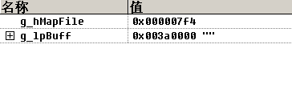
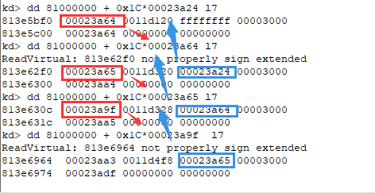
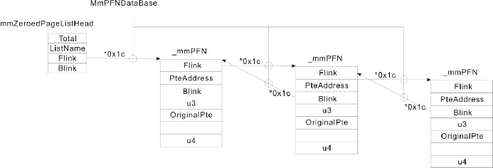
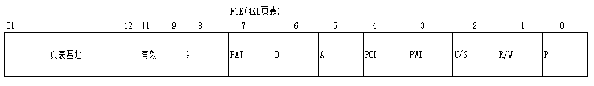
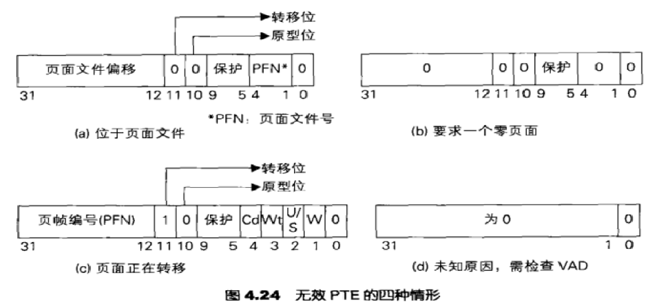
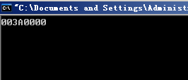
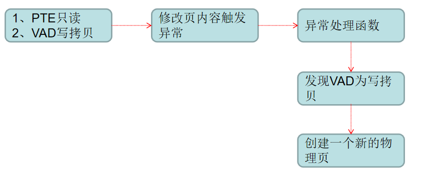

[toc]


# 01.线性地址的管理

1. 每个进程都有自己的用户空间需要管理，当我们使用**VirtualAlloc**等函数申请一块固定的地址空间时，首先需要确认这块空间是否被占用，如果该空间已被占用则申请失败。
2. 用户空间并非像内核空间一样通过一块链表去管理已占用的线性地址空间（效率低）， 而是通过**搜索二叉树**


**申请内存的两种方式**：

1. 通过**VirtualAlloc/VirtualAllocEx**申请：**Private Memory（独享物理页）**
2. 通过**CreateFileMapping**进行映射：**Mapped Memory（共享物理页）**

进程空间的地址划分：

| 分区         | x86 32位Windows         |
| ------------ | ----------------------- |
| 空指针赋值区 | 0x00000000 - 0x0000FFFF |
| 空指针赋值区 | 0x00010000 - 0x7FFEFFFF |
| 64KB禁入区   | 0x7FFF0000 - 0x7FFFFFFF |
| 内核         | 0x80000000 - 0xFFFFFFFF |


## 理解用户空间线性地址管理

随便找个exe：

```c
kd> dt _eprocess 85fd2b88      
ntdll!_EPROCESS
   ...
   +0x11c VadRoot          : 0x86140188   Void//入口点，进去后是搜索二叉树,每一个节点记录了一块已被占用的线性地址空间
   //对应_MMVAD结构体
   +0x120 VadHint          : 0x86140188   Void
 
////////////////////////////////////////////////////////////////////////////////

```

查看`_MMVAD`结构体：

```c
kd> dt _mmvad 0x86140188 
nt_exe!_MMVAD
   +0x000 StartingVpn      : 0x2c60//重要，以页为单位，后面添上三个0即是当前节点所描述的线性地址的起始位置
   +0x004 EndingVpn        : 0x2c9f//重要，以页为单位，后面添上三个0即是当前节点所描述的线性地址的结束位置
   +0x008 Parent           : (null) //根节点，不存在父节点
   +0x00c LeftChild        : 0x863536e0 _MMVAD//左子树
   +0x010 RightChild       : 0x863392c8 _MMVAD//右子树
   +0x014 u                : __unnamed//对应_MMVAD_FLAGS结构体
   +0x018 ControlArea      : 0x0a040004 _CONTROL_AREA//包含该节点所对应的线性地址被谁占用等信息
   +0x01c FirstPrototypePte : 0x53646156 _MMPTE
   +0x020 LastContiguousPte : 0x00002c20 _MMPTE
   +0x024 u2               : __unnamed

```

查看**CONTROL_AREA**结构体：

```c
kd> dt _CONTROL_AREA 0x865224d8 
nt_exe!_CONTROL_AREA
   +0x000 Segment          : 0xe14eb9b0 _SEGMENT
   +0x004 DereferenceList  : _LIST_ENTRY [ 0x0 - 0x0 ]
   +0x00c NumberOfSectionReferences : 1
   +0x010 NumberOfPfnReferences : 0
   +0x014 NumberOfMappedViews : 0x12
   +0x018 NumberOfSubsections : 1
   +0x01a FlushInProgressCount : 0
   +0x01c NumberOfUserReferences : 0x13
   +0x020 u                : __unnamed
   +0x024 FilePointer      : (null) //文件指针,若为空，表示线性地址指向真正的物理页;如果不为null就是自己分配的内存
   +0x028 WaitingForDeletion : (null) 
   +0x02c ModifiedWriteCount : 0
   +0x02e NumberOfSystemCacheViews : 0
kd> dt _FILE_OBJECT
nt_exe!_FILE_OBJECT
   +0x000 Type             : Int2B
   +0x002 Size             : Int2B
   +0x004 DeviceObject     : Ptr32 _DEVICE_OBJECT
   +0x008 Vpb              : Ptr32 _VPB
   +0x00c FsContext        : Ptr32 Void
   +0x010 FsContext2       : Ptr32 Void
   +0x014 SectionObjectPointer : Ptr32 _SECTION_OBJECT_POINTERS
   +0x018 PrivateCacheMap  : Ptr32 Void
   +0x01c FinalStatus      : Int4B
   +0x020 RelatedFileObject : Ptr32 _FILE_OBJECT
   +0x024 LockOperation    : UChar
   +0x025 DeletePending    : UChar
   +0x026 ReadAccess       : UChar
   +0x027 WriteAccess      : UChar
   +0x028 DeleteAccess     : UChar
   +0x029 SharedRead       : UChar
   +0x02a SharedWrite      : UChar
   +0x02b SharedDelete     : UChar
   +0x02c Flags            : Uint4B
   +0x030 FileName         : _UNICODE_STRING//线性地址属于主模块
   +0x038 CurrentByteOffset : _LARGE_INTEGER
   +0x040 Waiters          : Uint4B
   +0x044 Busy             : Uint4B
   +0x048 LastLock         : Ptr32 Void
   +0x04c Lock             : _KEVENT
   +0x05c Event            : _KEVENT
   +0x06c CompletionContext : Ptr32 _IO_COMPLETION_CONTEXT
```

**查看MMVAD_FLAGS结构体**

```c
kd> dt _MMVAD_FLAGS 0x86313578+14
nt_exe!_MMVAD_FLAGS
   +0x000 CommitCharge     : 0y0000000000000000000 (0)
   +0x000 PhysicalMapping  : 0y0
   +0x000 ImageMap         : 0y0//为1表示镜像文件（可执行文件），0表示其他
   +0x000 UserPhysicalPages : 0y0
   +0x000 NoChange         : 0y0
   +0x000 WriteWatch       : 0y0
   +0x000 Protection       : 0y00100 (0x4)//表示内存权限
   +0x000 LargePages       : 0y0
   +0x000 MemCommit        : 0y0
   +0x000 PrivateMemory    : 0y1//0表示Mapped Memory
```

**遍历所有节点**：

```c
kd> !vad 0x86313578 （随便找了个）
VAD   Level     Start       End Commit
86322b18  3        10        10      1 Private      READWRITE          
864ac328  2        20        20      1 Private      READWRITE          
86127360  5        30        3f      8 Private      READWRITE          
86330d60  4        40        7f      4 Private      READWRITE          
85fb1188  3        80        82      0 Mapped       READONLY           Pagefile section, shared commit 0x3
8611ee50  4        90        91      0 Mapped       READONLY           Pagefile section, shared commit 0x2
85fb7a08  1        a0       19f     23 Private      READWRITE          
86322cf8  4       1a0       1af      6 Private      READWRITE          
8611ee20  3       1b0       1bf      0 Mapped       READWRITE          Pagefile section, shared commit 0x3
8611f6d8  4       1c0       1d5      0 Mapped       READONLY           \WINDOWS\system32\unicode.nls
863129d0  2       1e0       220      0 Mapped       READONLY           \WINDOWS\system32\locale.nls
86312910  4       230       270      0 Mapped       READONLY           \WINDOWS\system32\sortkey.nls
86313488  3       280       285      0 Mapped       READONLY           \WINDOWS\system32\sorttbls.nls
86313578  0       290       2d0      0 Mapped       READONLY           Pagefile section, shared commit 0x41
86312a00  4       2e0       3a7      0 Mapped       EXECUTE_READ       Pagefile section, shared commit 0x8
85f96608  5       3b0       3b0      1 Private      READWRITE          
864583f8  3       3c0       3c0      1 Private      READWRITE          
86124128  5       3d0       3df      5 Private      READWRITE          
8611ef10  4       3e0       3e1      0 Mapped       READONLY           Pagefile section, shared commit 0x2
85fb1bc8  6       3f0       3f0      0 Mapped       READWRITE          Pagefile section, shared commit 0x1
85fb1e68  5       400       401      0 Mapped       READONLY           Pagefile section, shared commit 0x2
85fbbd98  2       410       41f      8 Private      READWRITE          
8612f808  4       420       42f      4 Private      READWRITE          
85fa8e50  3       430       432      0 Mapped       READONLY           \WINDOWS\system32\ctype.nls
85fb9e28  5       440       47f      3 Private      READWRITE          
8631b8e0  4       480       582      0 Mapped       READONLY           Pagefile section, shared commit 0x103
863128b0  6       590       88f      0 Mapped       EXECUTE_READ       Pagefile section, shared commit 0x26
85fb79c8  5       890       90f      1 Private      READWRITE          
85fb1fa8  7       910       94f      0 Mapped       READWRITE          Pagefile section, shared commit 0x10
85fb1f78  6       950       95d      0 Mapped       READWRITE          Pagefile section, shared commit 0xe
85fc1610  7       960       a5f    123 Private      READWRITE          
86321260  8       a60       a63      0 Mapped       READWRITE          Pagefile section, shared commit 0x4
8631ccc8  9       a80       aff      0 Mapped       READWRITE          Pagefile section, shared commit 0x7
86476b08  1      1000      101e      3 Mapped  Exe  EXECUTE_WRITECOPY  \WINDOWS\system32\calc.exe
86313458  8     58fb0     59179     10 Mapped  Exe  EXECUTE_WRITECOPY  \WINDOWS\AppPatch\AcGenral.dll
863133f8  9     5adc0     5adf6      2 Mapped  Exe  EXECUTE_WRITECOPY  \WINDOWS\system32\uxtheme.dll
86312a30  7     5cc30     5cc55     21 Mapped  Exe  EXECUTE_WRITECOPY  \WINDOWS\system32\shimeng.dll
8611da38 11     62c20     62c28      2 Mapped  Exe  EXECUTE_WRITECOPY  \WINDOWS\system32\lpk.dll
85fb2b10 13     73640     7366d      2 Mapped  Exe  EXECUTE_WRITECOPY  \WINDOWS\system32\MSCTFIME.IME
863158f8 12     73fa0     7400a     17 Mapped  Exe  EXECUTE_WRITECOPY  \WINDOWS\system32\usp10.dll
85fb2c10 13     74680     746cb      3 Mapped  Exe  EXECUTE_WRITECOPY  \WINDOWS\system32\MSCTF.dll
85faf260 10     759d0     75a7e      3 Mapped  Exe  EXECUTE_WRITECOPY  \WINDOWS\system32\userenv.dll
86313518 11     76300     7631c      2 Mapped  Exe  EXECUTE_WRITECOPY  \WINDOWS\system32\imm32.dll
863128e0  9     76990     76acd      8 Mapped  Exe  EXECUTE_WRITECOPY  \WINDOWS\system32\ole32.dll
86315830  8     76b10     76b39      3 Mapped  Exe  EXECUTE_WRITECOPY  \WINDOWS\system32\winmm.dll
85fa8e20  9     770f0     7717a      4 Mapped  Exe  EXECUTE_WRITECOPY  \WINDOWS\system32\oleaut32.dll
86313398 11     77180     77282      2 Mapped  Exe  EXECUTE_WRITECOPY  \WINDOWS\WinSxS\x86_Microsoft.Windows.Common-Controls_6595b64144ccf1df_6.0.2600.6028_x-ww_61e65202\comctl32.dll
85fabd48 10     77bb0     77bc4      2 Mapped  Exe  EXECUTE_WRITECOPY  \WINDOWS\system32\msacm32.dll
863134e8 11     77bd0     77bd7      2 Mapped  Exe  EXECUTE_WRITECOPY  \WINDOWS\system32\version.dll
86313428  6     77be0     77c37      8 Mapped  Exe  EXECUTE_WRITECOPY  \WINDOWS\system32\msvcrt.dll
8613c0e0  5     77d10     77d9f      3 Mapped  Exe  EXECUTE_WRITECOPY  \WINDOWS\system32\user32.dll
8611e1d0  4     77da0     77e48      6 Mapped  Exe  EXECUTE_WRITECOPY  \WINDOWS\system32\advapi32.dll
86312970  5     77e50     77ee2      2 Mapped  Exe  EXECUTE_WRITECOPY  \WINDOWS\system32\rpcrt4.dll
85fa83d8  7     77ef0     77f39      3 Mapped  Exe  EXECUTE_WRITECOPY  \WINDOWS\system32\gdi32.dll
863133c8  8     77f40     77fb5      2 Mapped  Exe  EXECUTE_WRITECOPY  \WINDOWS\system32\shlwapi.dll
863129a0  6     77fc0     77fd0      2 Mapped  Exe  EXECUTE_WRITECOPY  \WINDOWS\system32\secur32.dll
864b70d8  3     7c800     7c91d      6 Mapped  Exe  EXECUTE_WRITECOPY  \WINDOWS\system32\kernel32.dll
8611eee0  2     7c920     7c9b2      5 Mapped  Exe  EXECUTE_WRITECOPY  \WINDOWS\system32\ntdll.dll
863135a8  5     7d590     7dd83     31 Mapped  Exe  EXECUTE_WRITECOPY  \WINDOWS\system32\shell32.dll
863134b8  4     7f6f0     7f7ef      0 Mapped       EXECUTE_READ       Pagefile section, shared commit 0x7
85fa21a0  3     7ffa0     7ffd2      0 Mapped       READONLY           Pagefile section, shared commit 0x33
86305638  4     7ffdd     7ffdd      1 Private      READWRITE          
864a8530  5     7ffdf     7ffdf      1 Private      READWRITE          

Total VADs: 63, average level: 6, maximum depth: 13
Total private commit: 0x159 pages (1380 KB)
Total shared commit:  0x1e2 pages (1928 KB)
```

## 总结

1. 所有的线性地址空间是需要管理的（哪些地址是占用的，哪些地址是未占用的）

2. 所有用户线性地址空间通过搜索二叉树进行管理（占用大小，占用方式，内存属性）

3. 所有已占用的线性地址可以分为两类

   1. VirtualAlloc分配的普通内存

   2. 文件映射（Mapped）的内存（例如dll/exe/txt等）

4. 传统的模块隐藏技术，终究会在VadRoot中留下痕迹，假设摘除，操作系统会误认为该地址空间未被分配，从而产生非预期中的错误

# 02.Private Memory

通过**VirtualAlloc/VirtualAllocEx**申请的内存，叫做Private Memory

函数原型：

```c
LPVOID VirtualAlloc{
	LPVOID lpAddress, 		// 要分配的内存区域的地址，填0则随机分配一块符合条件的地址
	DWORD dwSize, 			// 分配的大小，4kb对齐
	DWORD flAllocationType, 	// 分配的类型
							// MEM_RESERVE：只保留线性地址，不分配物理页
							// MEM_COMMIT：既保留线性地址，又分配物理页
	DWORD flProtect 			// 该内存的初始保护属性
};
```

代码：

```c
#include <stdio.h>
#include <windows.h>

LPVOID lpAddress;

int main()
{
	printf("程序运行了...内存还没有申请\n");
	getchar();

	lpAddress = VirtualAlloc(NULL, 0x1000*2, MEM_COMMIT, PAGE_READWRITE);
	printf("内存地址：%x\n", lpAddress);

	getchar();
	return 0;
}
```

可以对比`VirtualAlloc`前后的不同，这里就不贴图了。


# 03.Mapped Memory

1. 通过`CreateFileMapping`映射的内存，叫做Mapped Memory，一个进程中大部分的内存都属于Mapped Memory
2. Mapped Memory可以分为两类
   1. 共享内存：当内存为共享内存时，本质是共享一份物理页
   2. 共享文件：当内存为共享文件时，这块内存可能被映射到多个进程空间中，但真正占用的物理页只有一份
3. 无论是共享内存还是文件，在底层实现都是一样的，当我们需要共享物理页的时候，系统只需将物理页准备好，当我们需要共享文件时，系统先将物理页准备好，然后将物理页与文件进行关联


## 共享内存

代码1：

```c
#include <stdio.h>
#include <windows.h>

#define MapFileName "共享内存"

int main()
{
	//内核对象：1.物理页	2. 文件
	//准备一块内存，若第一个参数为INVALID_HANDLE_VALUE(-1)表示共享物理页
	HANDLE g_hMapFile = CreateFileMapping(INVALID_HANDLE_VALUE, NULL, PAGE_READWRITE, 0, BUFSIZ, MapFileName);

	//将物理页与线性地址进行映射
	LPTSTR g_lpBuff = (LPTSTR)MapViewOfFile(g_hMapFile, FILE_MAP_ALL_ACCESS, 0, 0, BUFSIZ);

	*(PDWORD)g_lpBuff = 0x12345678;

	printf("A进程写入地址，内容：%p - %x", g_lpBuff, *(PDWORD)g_lpBuff);

	getchar();
	return 0;
}
```

代码2：

```c
#include <stdio.h>
#include <windows.h>

#define MapFileName "共享内存"

int main()
{
	//内核对象：1.物理页	2. 文件
	HANDLE g_hMapFile = OpenFileMapping(FILE_MAP_ALL_ACCESS, FALSE, MapFileName);

	//将物理页与线性地址进行映射
	LPTSTR g_lpBuff = (LPTSTR)MapViewOfFile(g_hMapFile, FILE_MAP_ALL_ACCESS, 0, 0, BUFSIZ);


	printf("B进程读取地址，内容：%p - %x", g_lpBuff, *(PDWORD)g_lpBuff);

	getchar();
	return 0;
}
```


## 共享文件

示例代码，ret的地方断点：

```c
#include <stdio.h>
#include <windows.h>

int main()
{
	//内核对象：1.物理页	2. 文件
	HANDLE g_hFile = CreateFile("C:\\NOTEPAD.EXE",GENERIC_READ|GENERIC_WRITE,FILE_SHARE_READ,NULL,OPEN_ALWAYS,FILE_ATTRIBUTE_NORMAL,NULL);	
	
	HANDLE g_hMapFile = CreateFileMapping(g_hFile,NULL,PAGE_READWRITE,0, BUFSIZ,NULL);

	//将物理页与线性地址进行映射
	LPTSTR g_lpBuff = (LPTSTR)MapViewOfFile(g_hMapFile, FILE_MAP_ALL_ACCESS, 0, 0, BUFSIZ);

	return 0;
}

```

可以看到：



```c
86128f20  1        10        10      1 Private      READWRITE          
85f9d600  2        20        20      1 Private      READWRITE          
860362f8  0        30       12f      3 Private      READWRITE          
8645de68  3       130       132      0 Mapped       READONLY           Pagefile section, shared commit 0x3
86128f70  2       140       23f      3 Private      READWRITE          
85f96588  4       240       24f      6 Private      READWRITE          
86354738  3       250       25f      0 Mapped       READWRITE          Pagefile section, shared commit 0x3
863aef38  5       260       275      0 Mapped       READONLY           \WINDOWS\system32\unicode.nls
86358510  4       280       2c0      0 Mapped       READONLY           \WINDOWS\system32\locale.nls
863584b0  6       2d0       310      0 Mapped       READONLY           \WINDOWS\system32\sortkey.nls
85fa69b8  5       320       325      0 Mapped       READONLY           \WINDOWS\system32\sorttbls.nls
8645de08  7       330       370      0 Mapped       READONLY           Pagefile section, shared commit 0x41
8614a3f8  6       380       38f      3 Private      READWRITE          
8602e848  7       390       392      0 Mapped       READONLY           \WINDOWS\system32\ctype.nls
861451e0  8       3a0       3a0      0 Mapped       READWRITE          \NOTEPAD.EXE
86128f40  1       400       42c      8 Mapped  Exe  EXECUTE_WRITECOPY  \Documents and Settings\Administrator\桌面\VC6.0green\MyProjects\test\Debug\test.exe
863a6b08  3     7c800     7c91d      6 Mapped  Exe  EXECUTE_WRITECOPY  \WINDOWS\system32\kernel32.dll
85f968a0  2     7c920     7c9b2      5 Mapped  Exe  EXECUTE_WRITECOPY  \WINDOWS\system32\ntdll.dll
863aefd8  4     7f6f0     7f7ef      0 Mapped       EXECUTE_READ       Pagefile section, shared commit 0x7
85f96870  3     7ffa0     7ffd2      0 Mapped       READONLY           Pagefile section, shared commit 0x33
```


### Mapped Exe

1. 当一个程序通过`LoadLibrary`进行加载时，此时该文件所在的线性地址空间的属性为Mapped Exe，权限为`EXECUTE_WRITECOPY`
2. 由于权限为`EXECUTE_WRITECOPY`的地址空间是需要共享给所有程序使用的，因此当我们对权限为`EXECUTE_WRITECOPY`的线性地址空间的任何位置进行修改时，系统会先给这块内存重新映射一份物理页，然后再进行修改

示例代码：

```c
#include <stdio.h>
#include <windows.h>

int main()
{
	HMODULE hModule = LoadLibrary("C:\\NOTEPAD.EXE");

	return 0;
}
```

## 总结

1）线性地址分为三类：私有内存 | 共享内存 | 共享文件
2）共享内存和共享文件本质相同，都是分配了一块物理页，不同的是共享文件将物理页和文件关联了起来
3）传统的模块隐藏技术很难在VadRoot中进行隐藏（脱钩可能会导致程序崩溃），除非通过VirtualAlloc分配私有内存，手动将文件进行拉伸与贴入等一系列操作，此时能够大大增加寻找该模块的难度

# 04.物理内存管理


32位最大物理内存：

1. 10-10-12分页  最多识别物理内存为4GB
2. 2-9-9-12分页  最多识别物理内存为64GB

操作系统的 `_ExVerifySuite()` 函数限制了它无法超越4GB（网上有补丁可以突破4GB）

实际物理内存：

> MmNumberOfPhysicalPages * 4 = 物理内存

可以看到一共7FF6C个物理页，乘4后得到KB，与人物管理器中的一致。

```c
kd> dd MmNumberOfPhysicalPages
80563128  0003ff6a 00000040 00000000 7fff0000
80563138  80000000 7ffeffff 00000000 00000000
80563148  00000000 00000000 00000000 00000000
80563158  00000000 00000000 00000004 00000000

```


## 物理内存管理

是一个全局数组：

```c
数组指针：_MMPFN* MmPfnDatabase	
数组长度：MmNumberOfPhysicalPages
```

81000000~(81000000+0x18)描述的就是第一个物理页的信息，8100001C~(8100001C+0x18)是第二个物理页的描述信息，以此类推。

`80c86000+1c*索引 == 这个物理页对应的_MMPFN结构`

```c
kd> dd MmPfnDatabase
805630c8  81000000 ffffffff 00000006 0000003f
805630d8  0000cfc5 00030c23 00020ae2 0000155f
805630e8  0000cb3e 00000000 000114f4 00009737
805630f8  00001f9c 00000000 00000000 000000c0
80563108  0000000c 00000000 00000000 0000001e
80563118  000000fa 0002f6b3 0003ffff 0003ffff
```

## PFN

`_MMPFN`结构体：

```c
kd> dt _MMPFN
nt!_MMPFN
   +0x000 u1               : __unnamed
   +0x004 PteAddress       : Ptr32 _MMPTE
   +0x008 u2               : __unnamed
   +0x00c u3               : __unnamed
   +0x010 OriginalPte      : _MMPTE
   +0x018 u4               : __unnamed

typedef struct _MMPFN
{
    union
    {
        PFN_NUMBER Flink;
        ULONG WsIndex;//该页面在进程工作集链表中的索引
        PKEVENT Event;
        NTSTATUS ReadStatus;
        SINGLE_LIST_ENTRY NextStackPfn;

        // HACK for ROSPFN
        SWAPENTRY SwapEntry;
    } u1;
    PMMPTE PteAddress;//执行此页面的PTE的虚拟地址
    union
    {
        PFN_NUMBER Blink;
        ULONG_PTR ShareCount;//指向该页面的PTE数量
    } u2;
    union
    {
        struct
        {
            USHORT ReferenceCount;//代表这个页面必须要保留在内存中的引用计数
            MMPFNENTRY e1;
        };
        struct
        {
            USHORT ReferenceCount;
            USHORT ShortFlags;
        } e2;
    } u3;
    union
    {
        MMPTE OriginalPte;//包含了指向此页面的PTE的原始内容
        LONG AweReferenceCount;

        // HACK for ROSPFN
        PMM_RMAP_ENTRY RmapListHead;
    };
    union
    {
        ULONG_PTR EntireFrame;
        struct
        {
            ULONG_PTR PteFrame:25;
            ULONG_PTR InPageError:1;
            ULONG_PTR VerifierAllocation:1;
            ULONG_PTR AweAllocation:1;
            ULONG_PTR Priority:3;
            ULONG_PTR MustBeCached:1;
        };
    } u4;//指向该页面的PTE所在的页表页面的物理页帧编号,以及一些标志位

u3.e1.PageLocation 这个成员标识了当前物理页空闲状态（空闲：使用中，两大类）
0：MmZeroedPageListHead         //零化
1：MmFreePageListHead           //空闲
2：MmStandbyPageListHead        //备用
3：MmModifiedPageListHead       //修改 OriginalPte.u.Soft.Prototype=1 或者 外存都会在这
4：MmModifiedNoWritePageListHead//已修改但不写出
5：MmBadPageListHead            //损坏
```

### 零化链表

`MmPfnDatabase`：第一个物理页描述信息：`81000000`

```c
kd> dd MmPfnDatabase l1
805630c8  81000000
```

零化链表：

```c
kd> dd MmZeroedPageListHead l4
805528e8  0002949c 00000000 00023a24 00023ab3
```

第一个零化链表：

```c
kd> dd 81000000 + 0x1C*00023a24 l4
813e5bf0  00023a64 0011d120 ffffffff 00003000
```

零化链表：



结构如下：




```c
kd> dt _eprocess 86104020  
ntdll!_EPROCESS
	+0x1f8 Vm               : _MMSUPPORT
kd> dt _MMSUPPORT
nt_exe!_MMSUPPORT
   +0x000 LastTrimTime     : _LARGE_INTEGER
   +0x008 Flags            : _MMSUPPORT_FLAGS
   +0x00c PageFaultCount   : Uint4B
   +0x010 PeakWorkingSetSize : Uint4B
   +0x014 WorkingSetSize   : Uint4B
   +0x018 MinimumWorkingSetSize : Uint4B//最小的物理页大小
   +0x01c MaximumWorkingSetSize : Uint4B//最大的物理页大小
   +0x020 VmWorkingSetList : Ptr32 _MMWSLz//这个成员可以找到这个进程使用的所有物理页
   +0x024 WorkingSetExpansionLinks : _LIST_ENTRY
   +0x02c Claim            : Uint4B
   +0x030 NextEstimationSlot : Uint4B
   +0x034 NextAgingSlot    : Uint4B
   +0x038 EstimatedAvailable : Uint4B
   +0x03c GrowthSinceLastEstimate : Uint4B
/////////////////////////////////////////////////////////////////////////
nt!_MMWSL
   +0x000 Quota            : 0
   +0x004 FirstFree        : 0x1e
   +0x008 FirstDynamic     : 0xa
   +0x00c LastEntry        : 0x217
   +0x010 NextSlot         : 7
   +0x014 Wsle             : 0xc0883cfc _MMWSLE			//物理页起始地址
   +0x018 LastInitializedWsle : 0x4c0					//物理页个数
   +0x01c NonDirectCount   : 0x33
   +0x020 HashTable        : 0xc0a84000 _MMWSLE_HASH
   +0x024 HashTableSize    : 0x200
   +0x028 NumberOfCommittedPageTables : 2
   +0x02c HashTableStart   : 0xc0a84000 Void
   +0x030 HighestPermittedHashAddress : 0xc0e00000 Void
   +0x034 NumberOfImageWaiters : 0
   +0x038 VadBitMapHint    : 0x16
   +0x03c UsedPageTableEntries : [1536] 0x34
   +0xc3c CommittedPageTables : [48] 1

```

# 05.缺页异常

PTE页表：



P位表示当前页是否有效

> Windows是只有正在被使用的线性地址才会给你挂上物理页，如果你的线性地址隔了一段时间没使用或者当前的物理页快被占用完了，这时它会将你这些物理页的数据拿出来存到硬盘上。
>
> 右键我的电脑 -> 属性 -> 高级 -> 性能下的设置 -> 高级 ->虚拟内存更改
> 设置虚拟内存后它会在你的c盘下生成一个pagefile.sys，它的大小刚好是你设置的虚拟内存大小。
>
> 当你的物理页不够用了，这时系统会将物理页里的数据放到pagefile.sys这个文件中，再将这个物理页跟程序使用。
>
> 如果我们在某个程序中使用了0x12345678这个线性地址，它的物理页被存放的pagefile.sys了，如果我门在次使用这个地址就出问题了，这时就需要用到缺页异常了

当线性地址对应的物理页被存储到文件中时，PTE结构被拓展为以下四种情形：



> 图a：位于页面文件中
> 当你的线性地址的物理页被存放到页面文件（pagefile.sys）中的时候，你的PTE就会变成这样
>
> CPU访问了这地址你的p:0，进入缺页异常处理程序，缺页异常位于idt表里的E号中断。
>
> 进入缺页异常处理它会回头查看你的这个PTE，这时地址时发现你的1-9位，12-31位都是有值的，它就会知道你这个线性地址是有效的，只不过数据放到页面文件里了
>
> 异常处理程序会到pagefile.sys中，按照PTE上描述的页面文件偏移将页的数据取出来挂到一个新的物理页上，将12-31位改为新的物理页地址，再将p=1
>
> 图b：要求0页面
> 页面尚未分配，下次访问时请求一个0页面
>
> 图c：转移
> 页面在物理内存中，但已被转移到某个物理页面链表中，可以通过查询_MMPFN数据库获取实际情况
>
> 图d：缺页异常处理发现你PTE全部为0就会去查VAD，发现这个线性地址已经分配了它会帮你把物理页挂上，如果这个线性地址没有分配就会报0xC0000005。(具体看 “保留与提交的误区” )

## 保留与提交

`VirtualAlloc`：

```c
LPVOID VirtualAlloc(
	LPVOID lpAddress, 	// 要分配的内存区域的地址
	DWORD dwSize, 		// 分配的大小
	DWORD flAllocationType, // 类型：MEM_RESERVE MEM_COMMIT
	DWORD flProtect 	// 该内存的初始保护属性
);

// MEM_RESERVE：只保留线性地址，不分配物理页
// MEM_COMMIT：既保留线性地址，又分配物理页
```

示例代码：

```c
#include <stdio.h>
#include <windows.h>

int main()
{
	LPVOID pAddr = VirtualAlloc(NULL, 0x1000*8, MEM_COMMIT, PAGE_READWRITE);
	printf("%p\n", pAddr);
	getchar();
	*(PDWORD)pAddr = 0x12345678;
	getchar();
	return 0;
}
```

结果：



查看该地址有没有物理页：

```c
kd> !process 0 0
Failed to get VadRoot
PROCESS 86301020  SessionId: 0  Cid: 023c    Peb: 7ffd7000  ParentCid: 0238
    DirBase: 06bc01c0  ObjectTable: e1bbbd20  HandleCount:  10.
    Image: test.exe

kd> !vtop 06bc01c0  3a0000
X86VtoP: Virt 00000000003a0000, pagedir 0000000006bc01c0
X86VtoP: PAE PDPE 0000000006bc01c0 - 000000002aa4d801
X86VtoP: PAE PDE 000000002aa4d008 - 000000002aaff867
X86VtoP: PAE PTE 000000002aaffd00 - 0000000000000000//这里，没有
X86VtoP: PAE zero PTE
Virtual address 3a0000 translation fails, error 0xD0000147.
```

敲个回车后：

```c
kd> !vtop 06bc01c0  3a0000
X86VtoP: Virt 00000000003a0000, pagedir 0000000006bc01c0
X86VtoP: PAE PDPE 0000000006bc01c0 - 000000002aa4d801
X86VtoP: PAE PDE 000000002aa4d008 - 000000002aaff867
X86VtoP: PAE PTE 000000002aaffd00 - 800000002b62e867//已经挂上了
X86VtoP: PAE Mapped phys 000000002b62e000
Virtual address 3a0000 translates to physical address 2b62e000.
```

也可以这样看：

```c
!dd 06bc01c0 + 3a0*4
```


## 写拷贝（EXECUTE_WRITECOPY）





先将PTE的R/W=0，`_MMVAD_FLAGS`设为`EXECUTE_WRITECOPY`

当你HOOK一些属性为EXECUTE_WRITECOPY的模块时：

1. 修改它的物理页，这时它PTE.R/W为0就会触发缺页异常
2. 进入异常处理程序发现PTE.R/W=0，查这个页对应的VAD发现 Protection 为写拷贝
3. 创建一份新的物理页，修改的数据放到新的物理页，将你的线性地址会指向这个新的物理页。

如果写驱动程序将它的PTE.R/W强行修改为1，这样它就不会触发缺页异常，可实现A进程中hook了这个模块，所有使用这个模块的进程也会被HOOK。


