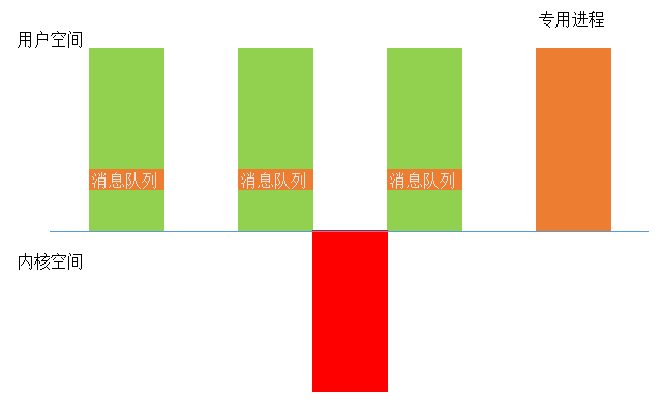
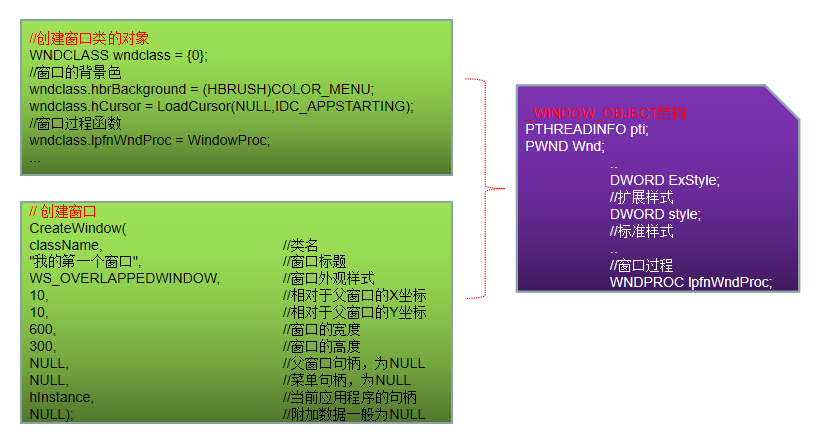
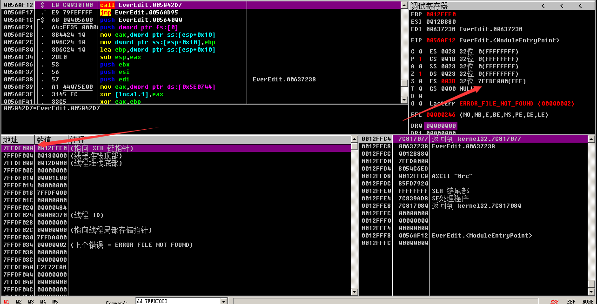
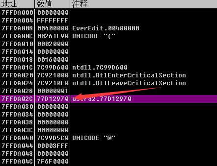
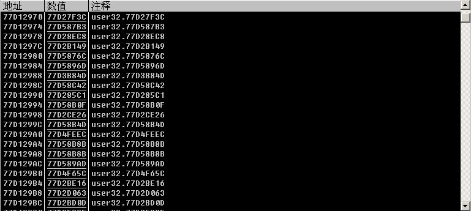

[toc]


# 1.消息队列

## 消息队列

本质上是一种数据结构，先进先出。

## 消息队列在哪


### Linux：专用进程

1. 使用专用进程捕获所有消息
2. 判断消息所属进程，进行分发，将消息分配到目标进程的消息队列中




### Windows：GUI线程

KTHREAD结构体：

```c
kd> dt _KTHREAD
ntdll!_KTHREAD
   ...
   +0x130 Win32Thread	//若当前程序为控制台程序且无使用任何图形界面相关API，该成员为空
   						//若当前程序使用了图形界面相关的API，该成员指向一个结构体，该结构体包含了消息队列
   ...
```

**GUI**：微软提供的与图形界面相关的API，称为GUI
**GDI**：自定义的用于图形界面相关的API，称为GDI


**GUI线程**：

1. 当线程刚创建的时候，都是普通线程：
   `Thread.ServiceTable`指向`KeServiceDescriptorTable`
2. 当线程第一次调用`Win32k.sys`（调用号大于0x100）时，会调用一个函数，将当前线程转换成GUI线程：`PsConvertToGuiThread`
   主要做几件事：
   1. 扩充内核栈，必须换成64KB的大内核栈，因为普通内核栈只有12KB大小
   2. 创建一个包含消息队列的结构体，并挂到KTHREAD上
   3. 将`Thread.ServiceTable`指向`KeServiceDescriptorTableShadow`（只有当调用GUI时，才会指向`SSDTShadow`）
   4. 把需要的内存数据映射到本进程空间


### Win32Thread

位于KTHREAD，若当前程序使用了图形界面相关的API，该成员指向一个结构体，其中包含了当前线程的消息队列：**THREADINFO**

```c
//FROM ReactOS v0.4.13
typedef struct _THREADINFO{
	...
    struct _USER_MESSAGE_QUEUE* MessageQueue;	//消息队列
    ...
} THREADINFO;
```


## 总结

1. 消息队列存储在**0环**,通过**KTHREAD.Win32Thread**可以找到
2. 并不是所有线程都要消息队列，只有GUI线程才有消息队列
3. 一个GUI线程对应1个消息队列


# 2.窗口与线程


## 消息去处

1. 当我们使用鼠标某个窗口进行点击与滑动时，都会产生一个消息，消息会进入当前窗口对应线程的消息队列中
2. 当我们编写程序时，并不会去特地启动两个线程去监控鼠标和键盘，`w32k.sys`负责了这个事情

> 当初始化**w32k.sys**这个模块时，会调用一个叫做**InitInputImpl**的函数
> 这个函数会启动两个线程，分别用来监控鼠标和键盘，这两个线程都是0环的线程
> 平时我们的电脑遭遇“死机”时，常常是屏幕动不了，鼠标还能动，这正式由于鼠标是有一个独立的线程在监控它的行动

当调用`CreateWindow`时，该函数实际上是一个宏，`CreateWindowA`实际对应`CreateWindowExA`函数，`CreateWindowW`对应`CreateWindowExW`函数。

最终窗口在0环被画出（由w32k.sys实现）

## 窗口对象

1. 每个窗口对应一个`WINDOW_OBJECT`结构体，位于0环，包含当前窗口所有信息
2. 除了大窗口之外，窗口中的每个控件也都是一个窗口，也分别对应一个`WINDOW_OBJECT`结构体
3. 一个窗口内包含着许多个窗口，按钮，对话框也都属于窗口，属于同一个线程
4. 一个线程可以包含多个窗口，但每个窗口只能属于一个线程

```c
//FROM ReactOS v3.12
typedef struct _WINDOW_OBJECT
{
	...
	PWND Wnd;			//包含大量窗口信息
	PTHREADINFO pti;	//线程
	...
}
typedef struct _WND
{
    ...
    /* Style. */
    DWORD style;		//包含窗口风格/后一个窗口/前一个窗口/父窗口/子窗口等信息
    ...
} WND, *PWND;
```


# 3.消息的接收和分发

## 消息队列

消息队列共有七组，用于存放不同类型的消息。

```c
1）SentMessagesListHead		//接收SendMessage发来的消息
2）PostedMessagesListHead	//接收PostMessage发来的消息
3）HardwareMessagesListHead	//接收键盘、鼠标等硬件设备的消息
...
```

完整队列：

```c
//ReactOS v3.12
typedef struct _USER_MESSAGE_QUEUE
{
	...
	/* Owner of the message queue */
	struct _ETHREAD *Thread;
	/* Queue of messages sent to the queue. */
	LIST_ENTRY SentMessagesListHead;
	/* Queue of messages posted to the queue. */
	LIST_ENTRY PostedMessagesListHead;
	/* Queue of sent-message notifies for the queue. */
	LIST_ENTRY NotifyMessagesListHead;
	/* Queue for hardware messages for the queue. */
	LIST_ENTRY HardwareMessagesListHead;
	...
	/* messages that are currently dispatched by other threads */
	LIST_ENTRY DispatchingMessagesHead;
	/* messages that are currently dispatched by this message queue, required for cleanup */
	LIST_ENTRY LocalDispatchingMessagesHead;
	...
}
```

## 消息的接收

创建窗口就是在0环创建_WINDOW_OBJECT结构体，然后赋值。



### GetMessage

从消息队列中取出消息

```c
BOOL WINAPI GetMessage(
	LPMSG lpMsg,	//返回从队列中取出的消息
	HWND hWnd,		//过滤条件一：窗口句柄
	UINT wMsgFilterMin,	//过滤条件二：最小值
	UINT wMsgFilterMax	//过滤条件三：最大值
);
```

**主要功能**：循环判断是否存在属于该窗口的消息，若存在，则将消息存储到MSG指定的结构中，并将消息从列表中删除。

示例程序：

```c
#include <windows.h>

LRESULT CALLBACK WindowProc(
	IN HWND hwnd,
	IN UINT uMsg,
	IN WPARAM wParam,
	IN LPARAM lParam
){
	switch(uMsg)
	{
	case 0x401:
		MessageBoxA(NULL, "测试窗口接收到消息", "新消息", MB_OK);
		return false;
	}
	
	return DefWindowProc(hwnd, uMsg, wParam, lParam);
}


int APIENTRY WinMain(
	HINSTANCE hInstance,
	HINSTANCE hPrevInstance,
	LPSTR lpCmdLine,
	int nShowCmd
){
	//窗口的类名
	TCHAR className[] = "My First Window";

	//创建一个自己的窗口
	WNDCLASS wndclass = {0};
	wndclass.hbrBackground = (HBRUSH)COLOR_MENU;
	wndclass.lpfnWndProc = WindowProc;
	wndclass.lpszClassName = className;
	wndclass.hInstance = hInstance;

	//注册
	RegisterClass(&wndclass);

	//创建窗口
	HWND hwnd = CreateWindow(
		className,
		TEXT("测试窗口"),
		WS_OVERLAPPEDWINDOW,
		10,
		10,
		600,
		300,
		NULL,
		NULL,
		hInstance,
		NULL);
	
	if(hwnd == NULL)
		return 0;
	
	//显示窗口
	ShowWindow(hwnd, SW_SHOW);
	
	//消息循环
	MSG msg;
	while(GetMessage(&msg, NULL, 0, 0))
	{
		//TranslateMessage(&msg);
		//DispatchMessage(&msg);
	}
    return 0;
}
```

不关闭该程序，运行：

```c
#include <stdio.h>
#include <windows.h>

int main()
{
	HWND hwnd = FindWindow("My First Window", "测试窗口");
	SendMessage(hwnd, 0x401, 0, 0);
	
	return 0;
}
```

### 同步与异步

1. 同步
`SendMessage()`发送消息,`GetMessage()`接收,进入0环要遍历`SentMessagesListHead`有没有消息，有就处理,没有就返回，必须要处理完才会返回结果，`SendMessage()`要接收到结果才会结束否则会一直 堵塞在这

2. 异步
`PostMessage()`发送消息，`GetMessage()`只会接收它的消息,不会处理，它的消息由`TranslateMessage(&msg)`与`DispatchMessage(&msg)来`处理

`PostMessage()`发送完后是不会等待你的处理结果的,发完立马就结束

可以将上面的程序中改为：`PostMessage(hwnd, 0x401, 0, 0);`，可以看到上面的程序并没有处理消息。

## 消息的分发

`GetMessage`能够处理`SentMessagesListHead`队列中的消息，其他队列中的消息则由`DispatchMessage`进行分发处理。

**大致流程**：

1. 根据**窗口句柄**找到**窗口对象**。
2. 根据窗口对象得到**窗口过程函数**，由**0环**进行调用。

### DispatchMessage

用于消息分发，根据窗口句柄调用相关的窗口过程，通常用于分发由`GetMessage`函数检索到的消息。

```c
LRESULT DispatchMessage(
  CONST MSG *lpmsg   // message information
);
```

示例代码：

```c
#include <stdio.h>
#include <windows.h>

LRESULT CALLBACK WindowProc(
	IN HWND hwnd,
	IN UINT uMsg,
	IN WPARAM wParam,
	IN LPARAM lParam
){

	switch(uMsg)
	{
	case 0x401:
		{
			MessageBoxA(NULL, "测试窗口接收到消息", "新消息", MB_OK);
			return 0;
		}
	case WM_DESTROY:
		{
			ExitProcess(0);
			return 0;
		}
	}
	return DefWindowProc(hwnd, uMsg, wParam, lParam);
}


int APIENTRY WinMain(
	HINSTANCE hInstance,
	HINSTANCE hPrevInstance,
	LPSTR lpCmdLine,
	int nShowCmd
){
	//窗口的类名
	TCHAR className[] = "My First Window";

	//创建一个自己的窗口
	WNDCLASS wndclass = {0};
	wndclass.hbrBackground = (HBRUSH)COLOR_MENU;
	wndclass.lpfnWndProc = WindowProc;
	wndclass.lpszClassName = className;
	wndclass.hInstance = hInstance;

	//注册
	RegisterClass(&wndclass);

	//创建窗口
	HWND hwnd = CreateWindow(
		className,
		TEXT("测试窗口"),
		WS_OVERLAPPEDWINDOW,
		10,
		10,
		600,
		300,
		NULL,
		NULL,
		hInstance,
		NULL);
	
	if(hwnd == NULL)
		return 0;
	
	//显示窗口
	ShowWindow(hwnd, SW_SHOW);
	
	//消息循环
	MSG msg;
	while(GetMessage(&msg, NULL, 0, 0))
	{
		//TranslateMessage(&msg);
		//DispatchMessage(&msg);
	}
	
	return 0;
}
```

拖动窗口、点击最小化、缩放、关闭按钮均**无反应**；将`DispatchMessage`的注释去掉，可以得到响应。

### TranslateMessage

用于将虚拟键码转换为字符消息。该字符消息又被发送给对应线程（调用`TranslateMessage`的线程）的消息队列，当线程再次调用`GetMessage`函数或`PeekMessage`函数获取消息的时候被读取。


## 总结

- `GetMessage`的不止能够取出消息，还能够处理消息。
- `GetMessage`处理消息时，从0环回到3环调用窗口过程函数进行处理。
- `SendMessage`发送消息后会等待目标处理完毕，`PostMessage`不会。
- `GetMessage`只会处理`SentMessagesListHead`列表中的消息。
- `DispatchMessage`的作用是分发除了`SentMessagesListHead`队列以外的消息给各窗口对象进行处理。
- `TranslateMessage`只处理键盘消息，将虚拟键码转换为字符消息，再由`DispatchMessage`进行分发。
- 未经过`TranslateMessage`处理的键盘消息，虚拟键码由`WM_KEYDOWN`进行处理；经过`TranslateMessage`处理的键盘消息，字符消息由`WM_CHAR`进行处理


# 4.内核回调机制


## KeUserModeCallback

1）从0环调用3环函数的几种方式：

- APC

- 异常
- 内核回调

APC与异常回三环的落脚点比较单一，而消息机制需要处理的情况较多，不能使用同一个逻辑进行处理，因此消息机制使用内核回调调用三环函数。

2）回到3环的落脚点：

- APC：`ntdll!KiUserApcDispatcher`

- 异常：`ntdll!KiUserExceptionDispatcher`

3）内核回调在3环的落脚点：`KeUserModeCallback`

> PEB+0x2C指向回调函数地址表。

4）凡是有窗口的程序就有可能0环直接调用3环的程序。

## 在OD中查看回调函数地址表

随便找个程序，找TEB：



找PEB：在TEB+0x30的位置，+2C的位置就是回调地址表：



可以看到：




## 总结

- 不是所有消息都是在进入消息循环后由`GetMessage`和`DispatchMessage`进行处理的，部分内核代码也能够调用窗口处理函数。
- 内核代码通过`KeUserModeCallback`调用窗口处理函数，由第一个参数`FunctionID`决定回到三环时的落脚点。
- `FunctionID`的值为回调地址表的索引，回调地址表位于`PEB+0x2C`位置，每个值为一个函数地址。
