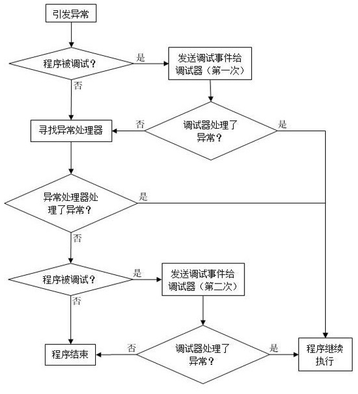
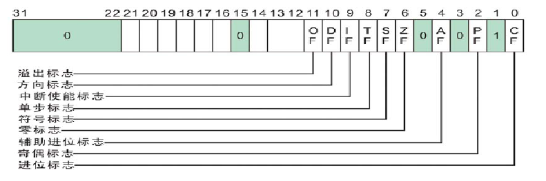

[toc]


# 01.调试对象

## 调试器与被调试程序

示例图如下：


**调试器与被调试对象建立联系的方式**：

1. CreateProcess（创建进程）
2. **DebugActiveProcess（附加进程）**

这里主要是附加进程的方式。

## DebugActiveProcess

调试器进程执行流程：

1. kernel32!DebugActiveProcess()

3. ntdll!DbgUiConnectToDbg()
4. ntdll!ZwCreateDebugObject()
5. nt!NtCreateDebugObject()

被调试程序执行流程

1. kernel32!DebugActiveProcess()

2. kernel32!DbgUiDebugActiveProcess(被调试进程句柄)
3. ntdll!DbgUiDebugActiveProcess(被调试进程句柄)
4. ntdll!NtDebugActiveProcess(被调试进程句柄,调试器进程TEB+0xF24)
5. nt!NtDebugActiveProcess(HANDLE ProcessHandle, HANDLE DebugObjectHandle)
6. nt!DbgkpSetProcessDebugObject：把调试对象和被调试进程关联起来

大致流程：

```c
kernel32!DebugActiveProcess:
	1.创建调试对象：ntdll!DbgUiConnectToDbg()
        1.ntdll!ZwCreateDebugObject()，放到TEB+F24的位置
    2.获取被调试进程的句柄
    3.通过句柄激活被调试进程：ntdll!DbgUiDebugActiveProcess
        1.Nt!NtDebugActiveProcess：传入被调试进程句柄与调试对象
        	1.获取被调试进程的EPROCESS结构体
        	2.获取调试对象的结构体，放到Process（变量复用
        	3.调用nt!DbgkpSetProcessDebugObject将调试与被调试进程连接起来
        		1.将被调试进程的DebugPort传入Debug_Object
```


### kernel32!DebugActiveProcess

```asm
.text:7C85B0FB ; BOOL __stdcall DebugActiveProcess(DWORD dwProcessId)
.text:7C85B0FB                 public _DebugActiveProcess@4
.text:7C85B0FB _DebugActiveProcess@4 proc near         ; DATA XREF: .text:off_7C802654↑o
.text:7C85B0FB
.text:7C85B0FB dwProcessId     = dword ptr  8
.text:7C85B0FB
.text:7C85B0FB                 mov     edi, edi
.text:7C85B0FD                 push    ebp
.text:7C85B0FE                 mov     ebp, esp
.text:7C85B100                 call    _DbgUiConnectToDbg@0 ; 创建调试对象，跟入
.text:7C85B105                 test    eax, eax
.text:7C85B107                 jge     short loc_7C85B113;1.成功创建调试对象，跳转
.text:7C85B109                 push    eax             ; Status
.text:7C85B10A                 call    _BaseSetLastNTError@4  
.text:7C85B10F                 xor     eax, eax
.text:7C85B111                 jmp     short loc_7C85B145
```

跟入`ntdll!DbgUiConnectToDbg`

```asm
.text:7C96FEF1                 public _DbgUiConnectToDbg@0
.text:7C96FEF1 _DbgUiConnectToDbg@0 proc near          ; DATA XREF: .text:off_7C923428↑o
.text:7C96FEF1
.text:7C96FEF1 var_18          = dword ptr -18h
.text:7C96FEF1 var_14          = dword ptr -14h
.text:7C96FEF1 var_10          = dword ptr -10h
.text:7C96FEF1 var_C           = dword ptr -0Ch
.text:7C96FEF1 var_8           = dword ptr -8
.text:7C96FEF1 var_4           = dword ptr -4
.text:7C96FEF1
.text:7C96FEF1                 mov     edi, edi
.text:7C96FEF3                 push    ebp
.text:7C96FEF4                 mov     ebp, esp
.text:7C96FEF6                 sub     esp, 18h
.text:7C96FEF9                 xor     ecx, ecx
.text:7C96FEFB                 mov     eax, large fs:TEB.NtTib.Self
.text:7C96FF01                 cmp     [eax+0F24h], ecx
.text:7C96FF07                 jnz     short loc_7C96FF3D
.text:7C96FF09                 mov     [ebp+var_18], 18h
.text:7C96FF10                 mov     [ebp+var_14], ecx
.text:7C96FF13                 mov     [ebp+var_C], ecx
.text:7C96FF16                 mov     [ebp+var_10], ecx
.text:7C96FF19                 mov     [ebp+var_8], ecx
.text:7C96FF1C                 mov     [ebp+var_4], ecx
.text:7C96FF1F                 mov     eax, large fs:18h
.text:7C96FF25                 push    1
.text:7C96FF27                 lea     ecx, [ebp+var_18]
.text:7C96FF2A                 push    ecx
.text:7C96FF2B                 push    1F000Fh
.text:7C96FF30                 add     eax, 0F24h      ; TEB+F24
.text:7C96FF35                 push    eax             ; 入栈，用于存放创建出来的句柄
.text:7C96FF36                 call    _ZwCreateDebugObject@16 ; ZwCreateDebugObject(x,x,x,x)
.text:7C96FF3B                 mov     ecx, eax
```

`ZwCreateDebugObject` 第一个参数是OUT类型返回一个句柄，返回到EAX了，这时EAX的位置是`TEB+0xF24`的位置。

**CreateDebugObject**的目的是创建一个**DebugObject**对象，并存放在TEB(0xF24)。

之后继续是`kernel32!DebugActiveProcess`的`loc_7C85B113`：

```asm
.text:7C85B113 loc_7C85B113:                           ; CODE XREF: DebugActiveProcess(x)+C↑j
.text:7C85B113                 push    esi
.text:7C85B114                 push    [ebp+dwProcessId] ; ProcessHandle
.text:7C85B117                 call    _ProcessIdToHandle@4 ; 2.根据进程ID获取被调试进程的句柄
.text:7C85B11C                 mov     esi, eax
.text:7C85B11E                 test    esi, esi
.text:7C85B120                 jz      short loc_7C85B144
.text:7C85B122                 push    edi
.text:7C85B123                 push    esi             ; 3.被调试郡城的句柄
.text:7C85B124                 call    _DbgUiDebugActiveProcess@4 ; 跟入
```

`ntdll!DbgUiDebugActiveProcess`

```asm
.text:7C970082 _DbgUiDebugActiveProcess@4 proc near    ; DATA XREF: .text:off_7C923428↑o
.text:7C970082
.text:7C970082 Handle          = dword ptr  8
.text:7C970082
.text:7C970082                 mov     edi, edi
.text:7C970084                 push    ebp
.text:7C970085                 mov     ebp, esp
.text:7C970087                 push    esi
.text:7C970088                 mov     eax, large fs:TEB.NtTib.Self
.text:7C97008E                 push    dword ptr [eax+0F24h] ; 调试器线程：TEB+F24，挑食对象(_DEBGU_OBJECT)
.text:7C970094                 push    [ebp+Handle]    ; 被调试进程的句柄
.text:7C970097                 call    _NtDebugActiveProcess@8 ; 跟入
```

这里开始进入0环

```asm
.text:7C92D1D0 _NtDebugActiveProcess@8 proc near       ; CODE XREF: DbgUiDebugActiveProcess(x)+15↓p
.text:7C92D1D0                                         ; DATA XREF: .text:off_7C923428↑o
.text:7C92D1D0                 mov     eax, 39h ; '9'  ; NtDebugActiveProcess
.text:7C92D1D5                 mov     edx, 7FFE0300h
.text:7C92D1DA                 call    dword ptr [edx]
.text:7C92D1DC                 retn    8
.text:7C92D1DC _NtDebugActiveProcess@8 endp
```

**NtDebugActiveProcess**的实现位于**nt!NtDebugActiveProcess**

```asm
PAGE:0058C431 ; NTSTATUS __stdcall NtDebugActiveProcess(HANDLE Process, HANDLE DebugObject)
PAGE:0058C431 _NtDebugActiveProcess@8 proc near       ; DATA XREF: .text:0040D904↑o
PAGE:0058C431
PAGE:0058C431 AccessMode      = byte ptr -4
PAGE:0058C431 Process         = dword ptr  8
PAGE:0058C431 DebugObject     = dword ptr  0Ch
PAGE:0058C431
PAGE:0058C431                 mov     edi, edi
PAGE:0058C433                 push    ebp
PAGE:0058C434                 mov     ebp, esp
PAGE:0058C436                 push    ecx
PAGE:0058C437                 mov     eax, large fs:KPCR.PrcbData.CurrentThread
PAGE:0058C43D                 mov     al, [eax+140h]
PAGE:0058C443                 push    0               ; HandleInformation
PAGE:0058C445                 mov     [ebp+AccessMode], al
PAGE:0058C448                 lea     eax, [ebp+Process]
PAGE:0058C44B                 push    eax             ; Object
PAGE:0058C44B                                         ; OUT PEPROCESS
PAGE:0058C44C                 push    dword ptr [ebp+AccessMode] ; AccessMode
PAGE:0058C44F                 push    _PsProcessType  ; ObjectType
PAGE:0058C455                 push    800h            ; DesiredAccess
PAGE:0058C45A                 push    [ebp+Process]   ; Handle
PAGE:0058C45A                                         ; 被调试进程的句柄
PAGE:0058C45D                 call    _ObReferenceObjectByHandle@24 ; 得到被调试进程的KPROCESS
PAGE:0058C462                 test    eax, eax        ; 如果KPROCESS返回为空，无效，返回
PAGE:0058C464                 jl      locret_58C4F8
PAGE:0058C46A                 push    ebx
PAGE:0058C46B                 push    esi
PAGE:0058C46C                 mov     eax, large fs:KPCR.PrcbData.CurrentThread ; eax：当前线程
PAGE:0058C472                 mov     esi, [ebp+Process] ; esi：被调试进程
PAGE:0058C475                 cmp     esi, [eax+_KTHREAD.ApcState.Process] ; 取当前线程的所属进程
PAGE:0058C478                 jz      short loc_58C4E8 ; 被调试进程是当前线程，结束
PAGE:0058C47A                 cmp     esi, _PsInitialSystemProcess ; 被调试进程是系统初始化进程，结束
PAGE:0058C480                 jz      short loc_58C4E8
PAGE:0058C482                 push    0               ; HandleInformation
PAGE:0058C484                 lea     eax, [ebp+Process]
PAGE:0058C487                 push    eax             ; Object
PAGE:0058C488                 push    dword ptr [ebp+AccessMode] ; AccessMode
PAGE:0058C48B                 push    _DbgkDebugObjectType ; ObjectType
PAGE:0058C491                 push    2               ; DesiredAccess
PAGE:0058C493                 push    [ebp+DebugObject] ; Handle
PAGE:0058C496                 call    _ObReferenceObjectByHandle@24 ; 获取调试对象的地址
PAGE:0058C49B                 mov     ebx, eax
PAGE:0058C49D                 test    ebx, ebx
PAGE:0058C49F                 jl      short loc_58C4ED
PAGE:0058C4A1                 push    edi
PAGE:0058C4A2                 lea     edi, [esi+80h]
PAGE:0058C4A8                 mov     ecx, edi        ; RunRef
PAGE:0058C4AA                 call    @ExAcquireRundownProtection@4 ; 锁住共享对象避免在访问的时候被删除
PAGE:0058C4AF                 test    al, al
PAGE:0058C4B1                 jz      short loc_58C4D8
PAGE:0058C4B3                 lea     eax, [ebp+DebugObject]
PAGE:0058C4B6                 push    eax             ; int
PAGE:0058C4B7                 push    [ebp+Process]   ; FastMutex
PAGE:0058C4BA                 push    esi             ; PROCESS
PAGE:0058C4BB                 call    _DbgkpPostFakeProcessCreateMessages@12 ; 发送一个假的进程创建消息
PAGE:0058C4C0                 push    [ebp+DebugObject] ; Object，调试对象的地址
PAGE:0058C4C3                 push    eax             ; int
PAGE:0058C4C4                 push    [ebp+Process]   ; PVOID，调试对象的地址
PAGE:0058C4C7                 push    esi             ; PVOID，被调试进程
PAGE:0058C4C8                 call    _DbgkpSetProcessDebugObject@16 ; 将调试进程和被调试进程关联起来（关联DebugPort）
PAGE:0058C4CD                 mov     ecx, edi        ; RunRef
PAGE:0058C4CF                 mov     ebx, eax
PAGE:0058C4D1                 call    @ExReleaseRundownProtection@4 ; 是否为对象锁
PAGE:0058C4D6                 jmp     short loc_58C4DD
```

跟入`_DbgkpSetProcessDebugObject`：

```asm
PAGE:0058C234 loc_58C234:                             ; CODE XREF: DbgkpSetProcessDebugObject(x,x,x,x)+34↑j
PAGE:0058C234                 cmp     [ebp+arg_8], ebx
PAGE:0058C237                 mov     edi, [ebp+arg_0]
PAGE:0058C23A                 mov     esi, ds:__imp_@ExAcquireFastMutex@4 ; ExAcquireFastMutex(x)
PAGE:0058C240                 jl      loc_58C2D9
PAGE:0058C246                 mov     ecx, offset _DbgkpProcessDebugPortMutex ; FastMutex
PAGE:0058C24B                 mov     [ebp+var_1], 1
PAGE:0058C24F                 call    esi ; ExAcquireFastMutex(x) ; ExAcquireFastMutex(x)
PAGE:0058C251                 cmp     [edi+_EPROCESS.DebugPort], ebx ; 判断DebugPort是否为0
PAGE:0058C257                 jnz     short loc_58C2CC
PAGE:0058C259
PAGE:0058C259 loc_58C259:                             ; CODE XREF: DbgkpSetProcessDebugObject(x,x,x,x)+CF↓j
PAGE:0058C259                 mov     eax, [ebp+arg_4]
PAGE:0058C25C                 mov     ecx, [ebp+Object] ; Object
PAGE:0058C25F                 mov     [edi+_EPROCESS.DebugPort], eax ; 将调试进程的句柄放到被调试进程的EPROCESS的DebugPort
PAGE:0058C265                 call    @ObfReferenceObject@4 ; ObfReferenceObject(x)
```


# 02.调试事件的采集


1. 调试器与被调试进程通过**DEBUG_OBJECT**结构体建立联系。
2. `DEBUG_OBJECT`中有一个链表成员，用于记录所有**调试事件**。
3. 当被调试进程产生调试事件时，调试器从链表中取出调试事件进行处理。

结构体：

```c
typedef struct _DEBUG_OBJECT
{
    KEVENT EventsPresent;//+00用于指示有调试事件发生
    FAST_MUTEX Mutex;//+10用于同步互斥体
    LIST_ENTRY EventList;//+30保存调试消息的链表
   
    union//标志 调试消息是否以读取
    {
        ULONG Flags;
        struct
        {
            UCHAR DebuggerInactive:1;
            UCHAR KillProcessOnExit:1;
        };
    };
} DEBUG_OBJECT, *PDEBUG_OBJECT;
```

1. EventList是一个链表，每一个节点都是一个调试事件，当“被调试进程”产生调试事件会存到EventList的节点中。

2. 调试器就是从EventList的节点里取出调试事件来进行处理。

3. 调试事件是有种类的，被调试进程只有调试事件才会被写入EventList的节点中，那些打印了某某字符，申请一块内存是不会记录的。

## 调试事件的种类

```c
typedef enum _DBGKM_APINUMBER
{
DbgkmExceptionApi = 0, // 异常
DbgkmCreateThreadApi = 1, // 创建线程
DbgkmCreateProcessApi = 2, // 创建进程
DbgkmExitThreadApi = 3, // 退出线程
DbgkmExitProcessApi = 4, // 进程退出
DbgkmLoadDllApi = 5, // 加载DLL
DbgkmUnloadDllApi = 6, // 卸载DLL
DbgkmErrorReportApi = 7, //内部错误（已经不用了）
DbgkmMaxApiNumber = 8, // 这组常量的最大值
} DBGKM_APINUMBER;
```


## 调试事件采集函数

触发异常等时，用来生成调试事件。

<1> 创建进程、线程必经之路:
	`PspUserThreadStartup`
		`DbgkCreateThread`
			`DbgkpSendApiMessage(x, x)`
<2> 退出线程、进程必经之路：
	`PspExitThread`
		`DbgkExitThread`/`DbgkExitProcess`
			`DbgkpSendApiMessage(x, x)`
<3> 加载模块的必经之路：
	`NtMapViewOfSection`
		`DbgkMapViewOfSection`
			`DbgkpSendApiMessage(x, x)`
<4> 卸载模块的必经之路：
	`NtUnMapViewOfSection`
		`DbgkUnMapViewOfSection`
			`DbgkpSendApiMessage(x, x)`
<5> 异常的必经之路：
	`KiDispatchException`
		`DbgkForwardException`
			`DbgkpSendApiMessage(x, x)`

上述的所有第二个以Dbgk开头的都是调试事件的采集函数。

### PspUserThreadStartup

创建线程，事件采集必须要知道这些事件，如果不知道就生成不了调试事件，系统已经在你的创建线程必经之路上加了一个调用，只要你创建线程就会被收集到事件。

```asm
PAGE:004ADF4B loc_4ADF4B:                             ; CODE XREF: PspUserThreadStartup(x,x)+44↑j
PAGE:004ADF4B                 xor     cl, cl          ; NewIrql
PAGE:004ADF4D                 call    ds:__imp_@KfLowerIrql@4 ; KfLowerIrql(x)
PAGE:004ADF53                 test    byte ptr [esi+248h], 6
PAGE:004ADF5A                 jnz     short loc_4ADF64
PAGE:004ADF5C                 push    [ebp+arg_4]
PAGE:004ADF5F                 call    _DbgkCreateThread@4 ; 判断当前线程是否为当前进程的第一个线程
PAGE:004ADF5F                                         ; 是：生成调试事件，编号为2(创建进程)
PAGE:004ADF5F                                         ; 否：生成调试事件，编号为1(创建线程)
PAGE:004ADF64
```

如果你是这个进程中的第一条线程（main线程），它会生成一个调试事件类型是 DbgkmCreateProcessApi = 2 // 创建进程 ，如果它发现你不是这个进程的第一个线程它也会生成一个调试事件类型是 DbgkmCreateThreadApi = 1 // 创建线程 。

### PspExitThread


```asm
PAGE:0049E9A6 loc_49E9A6:                             ; CODE XREF: PspExitThread(x)+1A8A9↓j
PAGE:0049E9A6                 cmp     [edi+_EPROCESS.DebugPort], 0 ; 判断DebugPort是否为0，
PAGE:0049E9A6                                         ; 为0，表示未处于调试状态，不产生调试信息
PAGE:0049E9AD                 jnz     loc_52E3D6      ; 不为0，跳转PAGE:0052E3D6 loc_52E3D6:                             ; CODE XREF: PspExitThread(x)+EF↑j
PAGE:0052E3D6                 test    byte ptr [esi+248h], 10h
PAGE:0052E3DD                 jnz     loc_49E9B3
PAGE:0052E3E3                 cmp     [ebp+var_19], 0
PAGE:0052E3E7                 jz      short loc_52E3F9
PAGE:0052E3E9                 push    [edi+_EPROCESS.ExitStatus]
PAGE:0052E3EF                 call    _DbgkExitProcess@4 ; 如果当前线程是当前进程的最后一个线程，退出进程
PAGE:0052E3F4                 jmp     loc_49E9B3
PAGE:0052E3F9 ; ---------------------------------------------------------------------------
PAGE:0052E3F9
PAGE:0052E3F9 loc_52E3F9:                             ; CODE XREF: PspExitThread(x)+8FB29↑j
PAGE:0052E3F9                 push    [ebp+arg_0]
PAGE:0052E3FC                 call    _DbgkExitThread@4 ; 如果当前线程不是当前进程的最后一个线程，退出线程
PAGE:0052E401                 jmp     loc_49E9B3
;;;;;;;;;;;;;;;;;;;;;;;;;;;;;;;;;;;;;;;;;;;;;;;;;;;;;;;;;;;;;;;;;;;;;;;;;;;;;;;;;;;;;;;;;;;;;;;;;;
PAGE:0052E3D6 loc_52E3D6:                             ; CODE XREF: PspExitThread(x)+EF↑j
PAGE:0052E3D6                 test    byte ptr [esi+248h], 10h
PAGE:0052E3DD                 jnz     loc_49E9B3
PAGE:0052E3E3                 cmp     [ebp+var_19], 0
PAGE:0052E3E7                 jz      short loc_52E3F9
PAGE:0052E3E9                 push    [edi+_EPROCESS.ExitStatus]
PAGE:0052E3EF                 call    _DbgkExitProcess@4 ; 如果当前线程是当前进程的最后一个线程，退出进程
PAGE:0052E3F4                 jmp     loc_49E9B3
PAGE:0052E3F9 ; ---------------------------------------------------------------------------
PAGE:0052E3F9
PAGE:0052E3F9 loc_52E3F9:                             ; CODE XREF: PspExitThread(x)+8FB29↑j
PAGE:0052E3F9                 push    [ebp+arg_0]
PAGE:0052E3FC                 call    _DbgkExitThread@4 ; 如果当前线程不是当前进程的最后一个线程，退出线程
PAGE:0052E401                 jmp     loc_49E9B3
;;;;;;;;;;;;;;;;;;;;;;;;;;;;;;;;;;;;;;;;;;;;;;;;;;;;;;;;;;;;;;;;;;;;;;;;;;;;;;;;;;;;;;;;;;;;;;;;;;;
PAGE:0058C90B _DbgkExitProcess@4 proc near            ; CODE XREF: PspExitThread(x)+8FB31↑p
PAGE:0058C90B
PAGE:0058C90B var_78          = dword ptr -78h
PAGE:0058C90B var_74          = dword ptr -74h
PAGE:0058C90B var_60          = dword ptr -60h
PAGE:0058C90B var_58          = dword ptr -58h
PAGE:0058C90B arg_0           = dword ptr  8
PAGE:0058C90B
PAGE:0058C90B                 mov     edi, edi
PAGE:0058C90D                 push    ebp
PAGE:0058C90E                 mov     ebp, esp
PAGE:0058C910                 sub     esp, 78h
PAGE:0058C913                 mov     eax, large fs:124h
PAGE:0058C919                 mov     ecx, [eax+44h]
PAGE:0058C91C                 mov     eax, large fs:124h
PAGE:0058C922                 test    byte ptr [eax+248h], 4
PAGE:0058C929                 jnz     short locret_58C97C
PAGE:0058C92B                 mov     ecx, [ecx+0BCh]
PAGE:0058C931                 test    ecx, ecx
PAGE:0058C933                 jz      short locret_58C97C
PAGE:0058C935                 mov     eax, large fs:124h
PAGE:0058C93B                 test    byte ptr [eax+248h], 2
PAGE:0058C942                 jnz     short locret_58C97C
PAGE:0058C944                 mov     eax, large fs:124h
PAGE:0058C94A                 mov     eax, [eax+44h]
PAGE:0058C94D                 add     eax, 78h ; 'x'
PAGE:0058C950                 push    eax             ; CurrentTime
PAGE:0058C951                 call    _KeQuerySystemTime@4 ; KeQuerySystemTime(x)
PAGE:0058C956                 mov     eax, [ebp+arg_0]
PAGE:0058C959                 mov     [ebp+var_58], eax
PAGE:0058C95C                 push    0
PAGE:0058C95E                 lea     eax, [ebp+var_78]
PAGE:0058C961                 push    eax
PAGE:0058C962                 mov     [ebp+var_78], 78000Ch
PAGE:0058C969                 mov     [ebp+var_74], 8
PAGE:0058C970                 mov     [ebp+var_60], 4
PAGE:0058C977                 call    _DbgkpSendApiMessage@8 ; 负责将调试信息挂入链表
```

继续跟`_DbgkpSendApiMessage`：

```asm
PAGE:0058C6FA loc_58C6FA:                             ; CODE XREF: DbgkpSendApiMessage(x,x)+C↑j
PAGE:0058C6FA                 mov     edx, [ebp+arg_0]
PAGE:0058C6FD                 mov     dword ptr [edx+1Ch], 103h
PAGE:0058C704                 mov     eax, large fs:124h
PAGE:0058C70A                 mov     ecx, [eax+44h]
PAGE:0058C70D                 xor     eax, eax
PAGE:0058C70F                 inc     eax
PAGE:0058C710                 lea     esi, [ecx+248h]
PAGE:0058C716                 lock or [esi], eax
PAGE:0058C719                 mov     eax, large fs:124h
PAGE:0058C71F                 push    ebx             ; FastMutex
PAGE:0058C720                 push    ebx             ; Event
PAGE:0058C721                 push    edx             ; int
PAGE:0058C722                 push    eax             ; PVOID
PAGE:0058C723                 push    ecx             ; Object
PAGE:0058C724                 call    _DbgkpQueueMessage@20 ; 收集调试事件的相关信息
;;;;;;;;;;;;;;;;;;;;;;;;;;;;;;;;;;;;;;;;;;;;;;;;;;;;;;;;;;;;;;;;;;;;;;;;;;;;;;;;;;;;;;;;;;;
PAGE:0058B49E loc_58B49E:                             ; CODE XREF: DbgkpQueueMessage(x,x,x,x,x)+17↑j
PAGE:0058B49E                 mov     ecx, offset _DbgkpProcessDebugPortMutex ; FastMutex
PAGE:0058B4A3                 lea     ebx, [ebp+var_B8]
PAGE:0058B4A9                 mov     [ebp+var_8C], esi
PAGE:0058B4AF                 call    ds:__imp_@ExAcquireFastMutex@4 ; ExAcquireFastMutex(x)
PAGE:0058B4B5                 mov     eax, [ebp+Object]
PAGE:0058B4B8                 mov     eax, [eax+_EPROCESS.DebugPort] ; 从被调试程序的DebugPort得到调试对象的结构体(_DEBUG_OBJECT)
PAGE:0058B4BE                 mov     [ebp+Event], eax
PAGE:0058B4C1                 mov     eax, [ebp+arg_8]
PAGE:0058B4C4                 mov     eax, [eax+_EPROCESS.Pcb.DirectoryTableBase]
PAGE:0058B4C7                 cmp     eax, 1
PAGE:0058B4CA                 jz      short loc_58B4D1
PAGE:0058B4CC                 cmp     eax, 2
PAGE:0058B4CF                 jnz     short loc_58B4E1
;;;;;;;;;;;;;;;;;;;;;;;;;;;;;;;;;;;;;;;;;;;;;;;;;;;;;;;;;;;;;;;;;;;;;;;;;;;;;;;;;;;;;;;;;;
PAGE:0058B550 loc_58B550:                             ; CODE XREF: DbgkpQueueMessage(x,x,x,x,x)+108↑j
PAGE:0058B550                 add     ecx, 10h        ; FastMutex
PAGE:0058B553                 mov     [ebp+FastMutex], ecx
PAGE:0058B556                 call    ds:__imp_@ExAcquireFastMutex@4 ; ExAcquireFastMutex(x)
PAGE:0058B55C                 mov     edx, [ebp+Event]
PAGE:0058B55F                 test    byte ptr [edx+38h], 1
PAGE:0058B563                 jnz     short loc_58B587
PAGE:0058B565                 cmp     [ebp+var_4], edi
PAGE:0058B568                 lea     eax, [edx+_DEBUG_OBJECT.EventList] ; 链表操作，添加调试事件信息
PAGE:0058B56B                 mov     ecx, [eax+4]
PAGE:0058B56E                 mov     [ebx], eax
PAGE:0058B570                 mov     [ebx+4], ecx
PAGE:0058B573                 mov     [ecx], ebx
PAGE:0058B575                 mov     [eax+4], ebx
PAGE:0058B578                 jnz     short loc_58B582
PAGE:0058B57A                 push    edi             ; Wait
PAGE:0058B57B                 push    edi             ; Increment
PAGE:0058B57C                 push    edx             ; Event
PAGE:0058B57D                 call    _KeSetEvent@12  ; KeSetEvent(x,x,x)
```


## 总结

1. 调试事件有多种，真正需要关注的只有**7种**。
2. Windows通过在被调试进程的**必经之路**上调用调试事件采集函数，向**DEBUG_PORT**中挂入调试事件。
3. 不同事件的必经之路所使用的调试事件采集函数不同，但最终都通过**DbgkSendApiMessage**向链表中写入调试事件信息。


# 03.调试事件的处理

调试器调试目标进程的步骤：

1. 关联(创建进程/附加进程)
2. 调试循环


## 简易调试器

示例：

```c
#include<stdio.h>
#include <windows.h>
#define DEBUGGEE "C:\\NOTEPAD.EXE"

int main(int argc, char* argv[])
{
	BOOL nIsContinue = TRUE;
	DEBUG_EVENT debugEvent = {0};
	BOOL bRet = TRUE;

	//1.创建调试进程
	STARTUPINFO startupInfo = {0};
	PROCESS_INFORMATION pInfo = {0};
	GetStartupInfo(&startupInfo);

	bRet = CreateProcess(DEBUGGEE, NULL, NULL, NULL, TRUE, DEBUG_PROCESS || DEBUG_ONLY_THIS_PROCESS, NULL, NULL, &startupInfo, &pInfo);
	if(!bRet)
	{
		printf("CreateProcess error: %d \n", GetLastError());
		return 0;
	}

	//2.调试循环
	while(nIsContinue)
	{
		bRet = WaitForDebugEvent(&debugEvent, INFINITE);
		if(!bRet)
		{
			printf("WaitForDebugEvent error: %d \n", GetLastError());
			return 0;
		}

		switch(debugEvent.dwDebugEventCode)
		{
		//1.异常
		case EXCEPTION_DEBUG_EVENT:
			printf("EXCEPTION_DEBUG_EVENT %x %x %x \n",
				debugEvent.u.Exception.ExceptionRecord.ExceptionAddress,
				debugEvent.u.Exception.ExceptionRecord.ExceptionCode,
				debugEvent.u.Exception.ExceptionRecord.ExceptionFlags);
			//printf("EXCEPTION_DEBUG_EVENT\n");
			break;
		//2.
		case CREATE_THREAD_DEBUG_EVENT:
			printf("CREATE_THREAD_DEBUG_EVENT \n");
			break;
		//3.
		case CREATE_PROCESS_DEBUG_EVENT:
			printf("CREATE_PROCESS_DEBUG_EVENT \n");
			break;
		//4.
		case EXIT_THREAD_DEBUG_EVENT:
			printf("EXIT_THREAD_DEBUG_EVENT \n");
			break;
		//5.
		case EXIT_PROCESS_DEBUG_EVENT:
			printf("EXIT_PROCESS_DEBUG_EVENT \n");
			break;
		//6.
		case LOAD_DLL_DEBUG_EVENT:
			printf("LOAD_DLL_DEBUG_EVENT \n");
			break;
		//7.
		case UNLOAD_DLL_DEBUG_EVENT:
			printf("UNLOAD_DLL_DEBUG_EVENT \n");
			break;
		//8.
		case OUTPUT_DEBUG_STRING_EVENT:
			printf("OUTPUT_DEBUG_STRING_EVENT \n");
			break;
		}
		bRet = ContinueDebugEvent(debugEvent.dwProcessId, debugEvent.dwThreadId, DBG_CONTINUE);
	}

	return 0;
}
```


进程被成功创建后，产生了一个异常事件。

> 进程创建的步骤：
>
> 1. 映射EXE
> 2. 创建内核对象EPROCESS
> 3. 映射系统dll：ntdll.dll
> 4. 创建线程内核对象ETHREAD
> 5. 系统启动线程
>    1. 映射当前线程所需的其他DLL(会调用**ntdll.LdrInitializeThunk**）
>    2. 主线程开始执行)

## 异常来源

首先改为系统断点：


随便导入个：


可以看到有个int 3，断在了`ntdll.DbgBreakPoint`函数。

```asm
.text:7C92120E                 public _DbgBreakPoint@0
.text:7C92120E _DbgBreakPoint@0 proc near              ; CODE XREF: LdrpRunInitializeRoutines(x):loc_7C95A534↓p
.text:7C92120E                                         ; LdrpInitializeProcess(x,x,x,x,x):loc_7C95E60D↓p ...
.text:7C92120E                 int     3               ; Trap to Debugger
.text:7C92120F                 retn
.text:7C92120F _DbgBreakPoint@0 endp
```

看一下交叉引用：


这个就是进程初始化过程的相关函数

```asm
.text:7C95E60D
.text:7C95E60D loc_7C95E60D:                           ; CODE XREF: LdrpInitializeProcess(x,x,x,x,x)-4BB↑j
.text:7C95E60D                 call    _DbgBreakPoint@0 ; DbgBreakPoint()
.text:7C95E612                 mov     eax, [ebx+68h]
.text:7C95E615                 shr     eax, 1
.text:7C95E617                 and     al, 1
.text:7C95E619                 mov     _ShowSnaps, al
.text:7C95E61E                 jmp     loc_7C9410BC
```

往上跟：

```asm
.text:7C9410B2 loc_7C9410B2:                           ; CODE XREF: LdrpInitializeProcess(x,x,x,x,x)+BCC↓j
.text:7C9410B2                 cmp     [ebx+PEB.BeingDebugged], 0
.text:7C9410B6                 jnz     loc_7C95E60D
```

如果被用户模式调试器附加了就会call DbgBreakPoint() ，如果没有调试器附加就不会调用这个int 3


## 简易调试器：附加

示例：

```c
#include "stdafx.h"
#include <windows.h>
#include <tlhelp32.h>
#define DEBUGGEE "驱动管理.exe"

int GetProcessId(char *processName)
{
	HANDLE hProcSnap = CreateToolhelp32Snapshot(TH32CS_SNAPPROCESS, 0);
	if (hProcSnap == INVALID_HANDLE_VALUE)
	{
		ExitProcess(-1);
	}
	
	PROCESSENTRY32 pe32 = { sizeof(PROCESSENTRY32) };
	
    if(Process32First(hProcSnap, &pe32))
    {
        do
        {	
            if(pe32.th32ProcessID != 0)
            {
				if(strcmp(pe32.szExeFile, processName) == 0)
				{
					return pe32.th32ProcessID;
				}
            }
        }while(Process32Next(hProcSnap, &pe32));
    }
	
    CloseHandle(hProcSnap);
	
	return 0;
}

int main(int argc, char* argv[])
{
	BOOL nIsContinue = TRUE;
	DEBUG_EVENT debugEvent = {0};
	BOOL bRet = TRUE;

	//1.附加调试进程
	if(!DebugActiveProcess(GetProcessId(DEBUGGEE)))
	{
		return 0;
	}
	
	//2.调试循环
	while(nIsContinue)
	{
		bRet = WaitForDebugEvent(&debugEvent, INFINITE);
		if(!bRet)
		{
			printf("WaitForDebugEvent error: %d \n", GetLastError());
			return 0;
		}
		
		switch(debugEvent.dwDebugEventCode)
		{
			//1.异常
		case EXCEPTION_DEBUG_EVENT:
			printf("EXCEPTION_DEBUG_EVENT %x %x %x \n",
				debugEvent.u.Exception.ExceptionRecord.ExceptionAddress,
				debugEvent.u.Exception.ExceptionRecord.ExceptionCode,
				debugEvent.u.Exception.ExceptionRecord.ExceptionFlags);
			//printf("EXCEPTION_DEBUG_EVENT\n");
			break;
			//2.
		case CREATE_THREAD_DEBUG_EVENT:
			printf("CREATE_THREAD_DEBUG_EVENT\n");
			break;
			//3.
		case CREATE_PROCESS_DEBUG_EVENT:
			printf("CREATE_PROCESS_DEBUG_EVENT\n");
			break;
			//4.
		case EXIT_THREAD_DEBUG_EVENT:
			printf("EXIT_THREAD_DEBUG_EVENT\n");
			break;
			//5.
		case EXIT_PROCESS_DEBUG_EVENT:
			printf("EXIT_PROCESS_DEBUG_EVENT\n");
			break;
			//6.
		case LOAD_DLL_DEBUG_EVENT:
			printf("LOAD_DLL_DEBUG_EVENT\n");
			break;
			//7.
		case UNLOAD_DLL_DEBUG_EVENT:
			printf("UNLOAD_DLL_DEBUG_EVENT\n");
			break;
			//8.
		case OUTPUT_DEBUG_STRING_EVENT:
			printf("OUTPUT_DEBUG_STRING_EVENT\n");
			break;
		}
		bRet = ContinueDebugEvent(debugEvent.dwProcessId, debugEvent.dwThreadId, DBG_CONTINUE);
	}

	return 0;
}
```

会得到与进程创建相同的信息，这些消息是`杜撰的调试信息`，就是**ntoskrnl!NtDebugActiveProcess**

```asm
PAGE:0058C4B6                 push    eax             ; int
PAGE:0058C4B7                 push    [ebp+Process]   ; FastMutex
PAGE:0058C4BA                 push    esi             ; PROCESS
PAGE:0058C4BB                 call    _DbgkpPostFakeProcessCreateMessages@12 ; 发送一个假的进程创建消息
```

跟进去看一下

```asm
PAGE:0058B9C0 _DbgkpPostFakeProcessCreateMessages@12 proc near
PAGE:0058B9C0                                         ; CODE XREF: NtDebugActiveProcess(x,x)+8A↓p
PAGE:0058B9C0
PAGE:0058B9C0 ApcState        = _KAPC_STATE ptr -20h
PAGE:0058B9C0 var_8           = dword ptr -8
PAGE:0058B9C0 Object          = dword ptr -4
PAGE:0058B9C0 PROCESS         = dword ptr  8
PAGE:0058B9C0 FastMutex       = dword ptr  0Ch
PAGE:0058B9C0 arg_8           = dword ptr  10h
PAGE:0058B9C0
PAGE:0058B9C0                 mov     edi, edi
PAGE:0058B9C2                 push    ebp
PAGE:0058B9C3                 mov     ebp, esp
PAGE:0058B9C5                 sub     esp, 20h
PAGE:0058B9C8                 push    esi
PAGE:0058B9C9                 push    edi
PAGE:0058B9CA                 lea     eax, [ebp+ApcState]
PAGE:0058B9CD                 push    eax             ; ApcState
PAGE:0058B9CE                 push    [ebp+PROCESS]   ; PROCESS
PAGE:0058B9D1                 call    _KeStackAttachProcess@8 ; KeStackAttachProcess(x,x)
PAGE:0058B9D6                 lea     eax, [ebp+Object]
PAGE:0058B9D9                 push    eax             ; int
PAGE:0058B9DA                 lea     eax, [ebp+var_8]
PAGE:0058B9DD                 push    eax             ; int
PAGE:0058B9DE                 xor     edi, edi
PAGE:0058B9E0                 push    edi             ; Object
PAGE:0058B9E1                 push    [ebp+FastMutex] ; FastMutex
PAGE:0058B9E4                 push    [ebp+PROCESS]   ; PVOID
PAGE:0058B9E7                 call    _DbgkpPostFakeThreadMessages@20 ; 发送虚假的线程消息
PAGE:0058B9EC                 mov     esi, eax
PAGE:0058B9EE                 cmp     esi, edi
PAGE:0058B9F0                 jl      short loc_58BA1B
PAGE:0058B9F2                 push    [ebp+FastMutex] ; FastMutex
PAGE:0058B9F5                 push    [ebp+var_8]     ; PVOID
PAGE:0058B9F8                 push    [ebp+PROCESS]   ; Object
PAGE:0058B9FB                 call    _DbgkpPostFakeModuleMessages@12 ; 发送虚假模块消息
```

## 总结

1. 调试器在创建进程时，除了能得到进程创建、创建线程、模块加载等调试事件之外，还会收到一个异常事件。
2. 异常来源于调试器创建进程时触发的**系统断点**，目的是给调试器一个中断的机会。
3. 调试器在**附加进程**时，能够得到一份模拟的进程创建时产生的相关调试事件信息
4. 这些虚假的调试事件信息**可靠性较低**，程序在执行过程中可能已经处理过部分信息。

# 04.异常处理流程

> 在调试过程中，不论是软件断点、硬件断点还是INT 3断点，都是通过异常来实现的。

异常处理流程图：



## 调试器与异常关系

示例程序：

```c
#include <stdio.h>
#include <windows.h>
  
int main ()
{
    int x = 100;
	int y = 0;
	int z;

	_try
	{
		z = x / y;		//除0异常
		printf("无法执行的代码 \n");
	}
	_except(1)
	{
		printf("SEH异常处理代码 \n");
	}

    return 0;
}
```

正常处理会输出，下面修改调试选项：


程序停住了：


修改ebp-20的值为1：

可以看到：


## 未处理异常

最后一道防线：

```c
__try
{
	
}
__except(UnhandledExceptionFilter(GetExceptionInformation())
{
	//终止线程
	//终止进程
}
```

`UnhandledExceptionFilter`执行流程：

1. 通过`NtQueryInformationProcess`查询当前进程是否正在被调试，如果是，返回`EXCEPTION_CONTINUE_SEARCH`，此时会进入第二轮分发。
2. 如果没有被调试：
   1. 查询是否通过`SetUnhandledExceptionFilter`注册处理函数，如果有就调用。
   2. 如果没有通过`SetUnhandledExceptionFilter`注册处理函数，弹出窗口，让用户选择终止程序还是启动即时调试器。
   3. 如果用户没有启用即时调试器，那么该函数返回`EXCEPTION_EXECUTE_HANDLER`。

### 理解UnhandledExceptionFilter执行流程

示例代码：

```c
#include <stdio.h>
#include <windows.h>
  
int main ()
{
    int x = 100;
	int y = 0;
	int z;

	_try
	{
		z = x / y;		//除0异常
		printf("无法执行的代码 \n");
	}
	_except(0)
	{
		printf("SEH异常处理代码 \n");
	}

	getchar();
    return 0;
}
```


1. 由于当前进程并未处于调试状态，因此不会调用`UnhandledExceptionFilter`。
2. 由于当前程序并未使用`SetUnhandledExceptionFilter`注册处理函数，因此会让用户选择是否启动调试器。

通过`UnhandledExceptionFilter`的这个性质，可以借此实现反调试。

### UnhandledExceptionFilter反调试

示例：

```c
#include <stdio.h>
#include <windows.h>

DWORD g_Test = 0;

LONG NTAPI TopLevelExcepFilter(PEXCEPTION_POINTERS pExcepInfo)
{
	printf("顶级异常处理器修复异常 \n");

	g_Test = 1;

	return EXCEPTION_CONTINUE_EXECUTION;
}
  
int main ()
{
    int r = 0;
	int x = 100;

	SetUnhandledExceptionFilter(&TopLevelExcepFilter);

	r = x / g_Test;		//除0异常

	printf("正常逻辑开始执行 \n");

	for(int i=0; i<10; i++)
	{
		Sleep(1000);
		printf("%d \n", i);
	}

	getchar();
    return 0;
}

```

调试的时候会停住：

正常双击可以运行：


# 05.软件断点

触发异常的方式：

1. 软件断点
2. 硬件断点
3. 内存断点

## 软件断点

可以看到本质是将当前代码位置的字节码改为`0xCC`，即`INT3`：


## 软件断点执行流程


### 被调试进程

1. CPU检测到`INT 3`指令
2. 查IDT表找到对应的中断处理函数
3. `CommonDispatchException`
4. `KiDispatchException`
5. `DbgkForwardException`收集并发送调试事件(第一个参数：消息类型，第二个参数：是否挂起其他进程)

### 调试器进程

1. 循环判断
2. 取出调试事件
3. 列出信息：寄存器、内存
4. 用户处理


### 流程

alt+t搜`_IDT`，找到三号断点

最终都会到`CommonDispatchException`：

```asm
.text:00407B47 loc_407B47:                             ; CODE XREF: _KiTrap03+88↑j
.text:00407B47                                         ; _KiTrap03+CF↓j
.text:00407B47                 mov     esi, ecx
.text:00407B49                 mov     edi, edx
.text:00407B4B                 mov     edx, eax
.text:00407B4D                 mov     ebx, [ebp+68h]
.text:00407B50                 dec     ebx
.text:00407B51                 mov     ecx, 3
.text:00407B56                 mov     eax, 80000003h
.text:00407B5B                 call    CommonDispatchException
```

`CommonDispatchException`会调异常分发函数`_KiDispatchException`：

```asm
.text:004073F8 loc_4073F8:                             ; CODE XREF: CommonDispatchException+39↑j
.text:004073F8                 and     eax, 1
.text:004073FB                 push    1               ; char
.text:004073FD                 push    eax             ; int
.text:004073FE                 push    ebp             ; BugCheckParameter3
.text:004073FF                 push    0               ; int
.text:00407401                 push    ecx             ; ExceptionRecord
.text:00407402                 call    _KiDispatchException@20 ; KiDispatchException(x,x,x,x,x)
.text:00407407                 mov     esp, ebp
.text:00407409                 jmp     Kei386EoiHelper@0 ; Kei386EoiHelper()
```

`KiDispatchException`最后会通过`_DbgkForwardException`发送调试事件：

```asm
.text:0044B196 loc_44B196:                             ; CODE XREF: KiDispatchException(x,x,x,x,x)+1C5AD↑j
.text:0044B196                 push    1
.text:0044B198                 push    1
.text:0044B19A                 push    esi
.text:0044B19B                 call    _DbgkForwardException@12 ; 发送调试事件
.text:0044B1A0                 test    al, al
.text:0044B1A2                 jnz     loc_424AE4
```

### 处理软件断点

示例代码：

```c
#include <stdio.h>
#include <windows.h>
#include <tlhelp32.h>

#define DEBUGGEE "C:\\KmdManager.exe"

//被调试进程ID,进程句柄，OEP
DWORD dwDebuggeePID = 0;

//被调试线程句柄
HANDLE hDebuggeeThread = NULL;
HANDLE hDebuggeeProcess = NULL;

//系统断点
BOOL bIsSystemInt3 = TRUE;

//被INT 3覆盖的数据
CHAR OriginalCode = 0;

//线程上下文
CONTEXT Context;

typedef HANDLE (__stdcall *FnOpenThread) (DWORD, BOOL, DWORD);

VOID InitDebuggeeInfo(DWORD dwPID, HANDLE hProcess)
{
	dwDebuggeePID = dwPID;
	hDebuggeeProcess = hProcess;
}

DWORD GetProcessId(LPTSTR lpProcessName)
{
	HANDLE hProcessSnap = NULL;
	PROCESSENTRY32 pe32 = {0};
	
	hProcessSnap = CreateToolhelp32Snapshot(TH32CS_SNAPPROCESS, 0);
	if(hProcessSnap == (HANDLE)-1)
	{
		return 0;
	}
	
	pe32.dwSize = sizeof(PROCESSENTRY32);
	
	if(Process32First(hProcessSnap, &pe32))
	{
		do 
		{
			if(!strcmp(lpProcessName, pe32.szExeFile))
				return (int)pe32.th32ProcessID;
		} while (Process32Next(hProcessSnap, &pe32));
	}
	else
	{
		CloseHandle(hProcessSnap);
	}
	
	return 0;
}

BOOL WaitForUserCommand()
{
	BOOL bRet = FALSE;
	CHAR command;

	printf("COMMAND>");

	command = getchar();

	switch(command)
	{
	case 't':
		bRet = TRUE;
		break;
	case 'p':
		bRet = TRUE;
		break;
	case 'g':
		bRet = TRUE;
		break;
	}

	getchar();
	return bRet;
}

BOOL Int3ExceptionProc(EXCEPTION_DEBUG_INFO *pExceptionInfo)
{
	BOOL bRet = FALSE;

	//1. 将INT 3修复为原来的数据（如果是系统断点，不用修复）
	if(bIsSystemInt3)
	{
		bIsSystemInt3 = FALSE;
		return TRUE;
	}
	else
	{
		WriteProcessMemory(hDebuggeeProcess, pExceptionInfo->ExceptionRecord.ExceptionAddress, &OriginalCode, 1, NULL);
	}

	//2. 显示断点位置
	printf("Int 3断点：0x%p \r\n", pExceptionInfo->ExceptionRecord.ExceptionAddress);

	//3. 获取线程上下文
	Context.ContextFlags = CONTEXT_FULL | CONTEXT_DEBUG_REGISTERS;
	GetThreadContext(hDebuggeeThread, &Context);
	
	//4. 修正EIP
	Context.Eip--;
	SetThreadContext(hDebuggeeThread, &Context);

	//5. 显示反汇编代码、寄存器等
	
	//6. 等待用户命令
	while(bRet == FALSE)
	{
		bRet = WaitForUserCommand();
	}
	
	return bRet;
}

BOOL AccessExceptionProc(EXCEPTION_DEBUG_INFO *pExceptionInfo)
{
	BOOL bRet = TRUE;

	return bRet;
}

BOOL SingleStepExceptionProc(EXCEPTION_DEBUG_INFO *pExceptionInfo)
{
	BOOL bRet = TRUE;
	
	return bRet;
}

BOOL ExceptionHandler(DEBUG_EVENT *pDebugEvent)
{ 
	BOOL bRet = TRUE;
	EXCEPTION_DEBUG_INFO *pExceptionInfo = NULL;
	pExceptionInfo = &pDebugEvent->u.Exception;
	//得到线程句柄，后面要用
	FnOpenThread MyOpenThread = (FnOpenThread)GetProcAddress(LoadLibrary("kernel32.dll"), "OpenThread");
	hDebuggeeThread = MyOpenThread(THREAD_ALL_ACCESS, FALSE, pDebugEvent->dwThreadId);

	switch(pExceptionInfo->ExceptionRecord.ExceptionCode)
	{
	//INT 3异常
	case EXCEPTION_BREAKPOINT:
		{
			bRet = Int3ExceptionProc(pExceptionInfo);
			break;
		}
	//访问异常
	case EXCEPTION_ACCESS_VIOLATION:
		bRet = AccessExceptionProc(pExceptionInfo);
		break;
	//单步执行
	case EXCEPTION_SINGLE_STEP:
		bRet = SingleStepExceptionProc(pExceptionInfo);
		break;
	}

	return bRet;
}

void SetInt3BreakPoint(LPVOID addr)
{
	ReadProcessMemory(hDebuggeeProcess, addr, &OriginalCode, 1, NULL);
	
	BYTE int3[1] = { 0xcc };

	WriteProcessMemory(hDebuggeeProcess, addr, int3, 1, NULL);
}

int main(int argc, char* argv[])
{
	BOOL nIsContinue = TRUE;
	DEBUG_EVENT debugEvent = {0};
	BOOL bRet = TRUE;
	DWORD dwContinue = DBG_CONTINUE;

	//1.创建调试进程
	STARTUPINFO startupInfo = {0};
	PROCESS_INFORMATION pInfo = {0};
	GetStartupInfo(&startupInfo);

	bRet = CreateProcess(DEBUGGEE, NULL, NULL, NULL, TRUE, DEBUG_PROCESS || DEBUG_ONLY_THIS_PROCESS, NULL, NULL, &startupInfo, &pInfo);
	if(!bRet)
	{
		printf("CreateProcess error: %d \n", GetLastError());
		return 0;
	}

	hDebuggeeProcess = pInfo.hProcess;

	//2.调试循环
	while(nIsContinue)
	{
		bRet = WaitForDebugEvent(&debugEvent, INFINITE);
		if(!bRet)
		{
			printf("WaitForDebugEvent error: %d \n", GetLastError());
			return 0;
		}

		switch(debugEvent.dwDebugEventCode)
		{
		//1.异常
		case EXCEPTION_DEBUG_EVENT:
			bRet = ExceptionHandler(&debugEvent);
			if(!bRet)
				dwContinue = DBG_EXCEPTION_NOT_HANDLED;
			break;
		//2.
		case CREATE_THREAD_DEBUG_EVENT:
			break;
		//3.创建进程
		case CREATE_PROCESS_DEBUG_EVENT:
			SetInt3BreakPoint((PCHAR)debugEvent.u.CreateProcessInfo.lpStartAddress);
			break;
		//4.
		case EXIT_THREAD_DEBUG_EVENT:
			break;
		//5.
		case EXIT_PROCESS_DEBUG_EVENT:
			break;
		//6.
		case LOAD_DLL_DEBUG_EVENT:
			break;
		//7.
		case UNLOAD_DLL_DEBUG_EVENT:
			break;
		//8.
		case OUTPUT_DEBUG_STRING_EVENT:
			break;
		}
		
		bRet = ContinueDebugEvent(debugEvent.dwProcessId, debugEvent.dwThreadId, DBG_CONTINUE);
	}

	return 0;
}
```


# 06.内存断点

当需要在某块内存被访问时产生中断，可以使用内存断点。

**内存断点能够分为两种类型：**

1. **内存访问**：内存被读写时产生中断。
2. **内存写入**：内存被写入时产生中断。

`VirtualProtecteEx`原型：

```c
BOOL VirtualProtectEx(
	HANDLE hProcess,        // handle to process
	LPVOID lpAddress,       // region of committed pages
	SIZE_T dwSize,          // size of region
	DWORD flNewProtect,     // desired access protection
	PDWORD lpflOldProtect   // old protection
);
```

**内存访问**：将指定内存的属性修改为**PAGE_NOACCESS**（修改后，PTE的P位等于0）
**内存写入**：将指定内存的属性修改为**PAGE_EXECUTE_READ**（修改后，PTE的P位等于1，R/W位等于0）


## 内存断点执行流程


### 被调试进程

1. CPU访问错误的内存地址，触发页异常
2. 查IDT表找到对应的中断处理函数（`nt!_KiTrap0E`）
3. `CommonDispatchException`
4. `KiDispatchException`
5. `DbgkForwardException`收集并发送调试事件

### 调试器进程

1. 循环判断
2. 取出调试事件
3. 列出消息（寄存器/内存）
4. 用户处理


### 处理内存断点

示例：

```c
#include <stdio.h>
#include <windows.h>
#include <tlhelp32.h>

#define DEBUGGEE "C:\\KmdManager.exe"

//被调试进程ID,进程句柄，OEP
DWORD dwDebuggeePID = 0;

//被调试线程句柄
HANDLE hDebuggeeThread = NULL;
HANDLE hDebuggeeProcess = NULL;

//系统断点
BOOL bIsSystemInt3 = TRUE;

//被INT 3覆盖的数据
CHAR OriginalCode = 0;

//原始内存属性
DWORD dwOriginalProtect;

//线程上下文
CONTEXT Context;

typedef HANDLE (__stdcall *FnOpenThread) (DWORD, BOOL, DWORD);

VOID InitDebuggeeInfo(DWORD dwPID, HANDLE hProcess)
{
	dwDebuggeePID = dwPID;
	hDebuggeeProcess = hProcess;
}

DWORD GetProcessId(LPTSTR lpProcessName)
{
	HANDLE hProcessSnap = NULL;
	PROCESSENTRY32 pe32 = {0};
	
	hProcessSnap = CreateToolhelp32Snapshot(TH32CS_SNAPPROCESS, 0);
	if(hProcessSnap == (HANDLE)-1)
	{
		return 0;
	}
	
	pe32.dwSize = sizeof(PROCESSENTRY32);
	
	if(Process32First(hProcessSnap, &pe32))
	{
		do 
		{
			if(!strcmp(lpProcessName, pe32.szExeFile))
				return (int)pe32.th32ProcessID;
		} while (Process32Next(hProcessSnap, &pe32));
	}
	else
	{
		CloseHandle(hProcessSnap);
	}
	
	return 0;
}

BOOL WaitForUserCommand()
{
	BOOL bRet = FALSE;
	CHAR command;

	printf("COMMAND>");

	command = getchar();

	switch(command)
	{
	case 't':
		bRet = TRUE;
		break;
	case 'p':
		bRet = TRUE;
		break;
	case 'g':
		bRet = TRUE;
		break;
	}

	getchar();
	return bRet;
}

BOOL Int3ExceptionProc(EXCEPTION_DEBUG_INFO *pExceptionInfo)
{
	BOOL bRet = FALSE;

	//1. 将INT 3修复为原来的数据（如果是系统断点，不用修复）
	if(bIsSystemInt3)
	{
		bIsSystemInt3 = FALSE;
		return TRUE;
	}
	else
	{
		WriteProcessMemory(hDebuggeeProcess, pExceptionInfo->ExceptionRecord.ExceptionAddress, &OriginalCode, 1, NULL);
	}

	//2. 显示断点位置
	printf("Int 3断点：0x%p \r\n", pExceptionInfo->ExceptionRecord.ExceptionAddress);

	//3. 获取线程上下文
	Context.ContextFlags = CONTEXT_FULL | CONTEXT_DEBUG_REGISTERS;
	GetThreadContext(hDebuggeeThread, &Context);
	
	//4. 修正EIP
	Context.Eip--;
	SetThreadContext(hDebuggeeThread, &Context);

	//5. 显示反汇编代码、寄存器等
	
	//6. 等待用户命令
	while(bRet == FALSE)
	{
		bRet = WaitForUserCommand();
	}
	
	return bRet;
}

BOOL AccessExceptionProc(EXCEPTION_DEBUG_INFO *pExceptionInfo)
{
	BOOL bRet = FALSE;
	DWORD dwAccessFlag;		//访问类型 0为读 1为写
	DWORD dwAccessAddr;		//访问地址
	DWORD dwProtect;		//内存属性

	//1. 获取异常信息，修改内存属性
	dwAccessFlag = pExceptionInfo->ExceptionRecord.ExceptionInformation[0];
	dwAccessAddr = pExceptionInfo->ExceptionRecord.ExceptionInformation[1];
	printf("内存断点： %x %x \n", dwAccessFlag, dwAccessAddr);
	VirtualProtectEx(hDebuggeeProcess, (VOID*)dwAccessAddr, 1, dwOriginalProtect, &dwProtect);
	
	//2. 获取线程上下文
	Context.ContextFlags = CONTEXT_FULL | CONTEXT_DEBUG_REGISTERS;
	GetThreadContext(hDebuggeeThread, &Context);
	//3. 修正EIP(内存访问异常，不需要修正EIP)
	printf("Eip: 0x%p \n", Context.Eip);
	//4. 显示汇编/寄存器等信息
	//5. 等待用户命令
	while(bRet == FALSE)
	{
		bRet = WaitForUserCommand();
	}

	return bRet;
}

BOOL SingleStepExceptionProc(EXCEPTION_DEBUG_INFO *pExceptionInfo)
{
	BOOL bRet = TRUE;
	
	return bRet;
}

BOOL ExceptionHandler(DEBUG_EVENT *pDebugEvent)
{ 
	BOOL bRet = TRUE;
	EXCEPTION_DEBUG_INFO *pExceptionInfo = NULL;

	pExceptionInfo = &pDebugEvent->u.Exception;

	//得到线程句柄，后面要用
	FnOpenThread MyOpenThread = (FnOpenThread)GetProcAddress(LoadLibrary("kernel32.dll"), "OpenThread");
	hDebuggeeThread = MyOpenThread(THREAD_ALL_ACCESS, FALSE, pDebugEvent->dwThreadId);

	switch(pExceptionInfo->ExceptionRecord.ExceptionCode)
	{
	//INT 3异常
	case EXCEPTION_BREAKPOINT:
		{
			bRet = Int3ExceptionProc(pExceptionInfo);
			break;
		}
	//访问异常
	case EXCEPTION_ACCESS_VIOLATION:
		bRet = AccessExceptionProc(pExceptionInfo);
		break;
	//单步执行
	case EXCEPTION_SINGLE_STEP:
		bRet = SingleStepExceptionProc(pExceptionInfo);
		break;
	}

	return bRet;
}

VOID SetInt3BreakPoint(LPVOID addr)
{
	CHAR int3 = 0xCC;
	
	//1. 备份
	ReadProcessMemory(hDebuggeeProcess, addr, &OriginalCode, 1, NULL);
	//2. 修改
	WriteProcessMemory(hDebuggeeProcess, addr, &int3, 1, NULL);
}

VOID SetMemBreakPoint(PCHAR pAddress)
{
	//1. 访问断点
	VirtualProtectEx(hDebuggeeProcess, pAddress, 1, PAGE_NOACCESS, &dwOriginalProtect);
	//2. 写入断点
	//VirtualProtectEx(hDebuggeeProcess, pAddress, 1, PAGE_EXECUTE_READ, &dwOriginalProtect);
}

int main(int argc, char* argv[])
{
	BOOL nIsContinue = TRUE;
	DEBUG_EVENT debugEvent = {0};
	BOOL bRet = TRUE;
	DWORD dwContinue = DBG_CONTINUE;

	//1.创建调试进程
	STARTUPINFO startupInfo = {0};
	PROCESS_INFORMATION pInfo = {0};
	GetStartupInfo(&startupInfo);

	bRet = CreateProcess(DEBUGGEE, NULL, NULL, NULL, TRUE, DEBUG_PROCESS || DEBUG_ONLY_THIS_PROCESS, NULL, NULL, &startupInfo, &pInfo);
	if(!bRet)
	{
		printf("CreateProcess error: %d \n", GetLastError());
		return 0;
	}

	hDebuggeeProcess = pInfo.hProcess;

	//2.调试循环
	while(nIsContinue)
	{
		bRet = WaitForDebugEvent(&debugEvent, INFINITE);
		if(!bRet)
		{
			printf("WaitForDebugEvent error: %d \n", GetLastError());
			return 0;
		}

		switch(debugEvent.dwDebugEventCode)
		{
		//1.异常
		case EXCEPTION_DEBUG_EVENT:
			bRet = ExceptionHandler(&debugEvent);
			if(!bRet)
				dwContinue = DBG_EXCEPTION_NOT_HANDLED;
			break;
		//2.
		case CREATE_THREAD_DEBUG_EVENT:
			break;
		//3.创建进程
		case CREATE_PROCESS_DEBUG_EVENT:
			//int3 断点
			//SetInt3BreakPoint((PCHAR)debugEvent.u.CreateProcessInfo.lpStartAddress);
			//内存断点
			SetMemBreakPoint((PCHAR)debugEvent.u.CreateProcessInfo.lpStartAddress);
			break;
		//4.
		case EXIT_THREAD_DEBUG_EVENT:
			break;
		//5.
		case EXIT_PROCESS_DEBUG_EVENT:
			break;
		//6.
		case LOAD_DLL_DEBUG_EVENT:
			break;
		//7.
		case UNLOAD_DLL_DEBUG_EVENT:
			break;
		//8.
		case OUTPUT_DEBUG_STRING_EVENT:
			break;
		}
		
		bRet = ContinueDebugEvent(debugEvent.dwProcessId, debugEvent.dwThreadId, DBG_CONTINUE);
	}
	
	return 0;
}
```


# 07.硬件断点

## 硬件断点

1. 与软件断点与内存断点不同，**硬件断点**不依赖被调试程序，而是依赖于CPU中的**调试寄存器**。
2. 调试寄存器有**8个**，分别为**Dr0~Dr7**。
3. 用户最多能够设置4个硬件断点，这是由于只有Dr0~Dr3用于存储线性地址。
4. Dr4和Dr5是保留的。

每个线程都拥有一份独立的寄存器，切换线程时，寄存器的值也会被切换。


设置硬件断点：

1. Dr0~Dr3用于设置硬件断点，由于只有4个断点寄存器，所以最多只能设置4个硬件调试断点。
2. Dr7是最重要的寄存器：
   1. L0/G0 ~ L3/G3：控制Dr0~Dr3是否有效，局部还是全局；每次异常后，Lx都被清零,Gx不清零。
   2. 断点长度(LENx)：00(1字节)、01(2字节)、11(4字节)
   3. 断点类型(R/Wx)：00(执行断点)、01(写入断点)、11(访问断点)


硬件断点触发后走的中断处理函数是：`nt!_KiTrap01`

示例代码：

```c
#include <stdio.h>
#include <windows.h>
#include <tlhelp32.h>

#define DEBUGGEE "C:\\KmdManager.exe"

//被调试进程ID,进程句柄，OEP
DWORD dwDebuggeePID = 0;

//被调试线程句柄
HANDLE hDebuggeeThread = NULL;
HANDLE hDebuggeeProcess = NULL;

//系统断点
BOOL bIsSystemInt3 = TRUE;

//被INT 3覆盖的数据
CHAR OriginalCode = 0;

//线程上下文
CONTEXT Context;

typedef HANDLE (__stdcall *FnOpenThread) (DWORD, BOOL, DWORD);

VOID InitDebuggeeInfo(DWORD dwPID, HANDLE hProcess)
{
	dwDebuggeePID = dwPID;
	hDebuggeeProcess = hProcess;
}

DWORD GetProcessId(LPTSTR lpProcessName)
{
	HANDLE hProcessSnap = NULL;
	PROCESSENTRY32 pe32 = {0};
	
	hProcessSnap = CreateToolhelp32Snapshot(TH32CS_SNAPPROCESS, 0);
	if(hProcessSnap == (HANDLE)-1)
	{
		return 0;
	}
	
	pe32.dwSize = sizeof(PROCESSENTRY32);
	
	if(Process32First(hProcessSnap, &pe32))
	{
		do 
		{
			if(!strcmp(lpProcessName, pe32.szExeFile))
				return (int)pe32.th32ProcessID;
		} while (Process32Next(hProcessSnap, &pe32));
	}
	else
	{
		CloseHandle(hProcessSnap);
	}
	
	return 0;
}

BOOL WaitForUserCommand()
{
	BOOL bRet = FALSE;
	CHAR command;

	printf("COMMAND>");

	command = getchar();

	switch(command)
	{
	case 't':
		bRet = TRUE;
		break;
	case 'p':
		bRet = TRUE;
		break;
	case 'g':
		bRet = TRUE;
		break;
	}

	getchar();
	return bRet;
}

VOID SetHardBreakPoint(PVOID pAddress)
{
	//1. 获取线程上下文
	Context.ContextFlags = CONTEXT_FULL | CONTEXT_DEBUG_REGISTERS;
	GetThreadContext(hDebuggeeThread, &Context);
	//2. 设置断点位置
	Context.Dr0 = (DWORD)pAddress;
	Context.Dr7 |= 1;
	//3. 设置断点长度和类型
	Context.Dr7 &= 0xfff0ffff;	//执行断点（16、17位 置0） 1字节（18、19位 置0）
	//5. 设置线程上下文
	SetThreadContext(hDebuggeeThread, &Context);
}

BOOL Int3ExceptionProc(EXCEPTION_DEBUG_INFO *pExceptionInfo)
{
	BOOL bRet = FALSE;

	//1. 将INT 3修复为原来的数据（如果是系统断点，不用修复）
	if(bIsSystemInt3)
	{
		bIsSystemInt3 = FALSE;
		return TRUE;
	}
	else
	{
		WriteProcessMemory(hDebuggeeProcess, pExceptionInfo->ExceptionRecord.ExceptionAddress, &OriginalCode, 1, NULL);
	}

	//2. 显示断点位置
	printf("Int 3断点：0x%p \r\n", pExceptionInfo->ExceptionRecord.ExceptionAddress);

	//3. 获取线程上下文
	Context.ContextFlags = CONTEXT_FULL | CONTEXT_DEBUG_REGISTERS;
	GetThreadContext(hDebuggeeThread, &Context);
	
	//4. 修正EIP
	Context.Eip--;
	SetThreadContext(hDebuggeeThread, &Context);

	//5. 显示反汇编代码、寄存器等

	/*
	硬件断点需要设置在被调试进程的的线程上下文中。
	因此当被调试程序触发调试器设置的INT 3断点时，此时设置硬件断点较为合理。
	*/
	SetHardBreakPoint((PVOID)((DWORD)pExceptionInfo->ExceptionRecord.ExceptionAddress+1));
	
	//6. 等待用户命令
	while(bRet == FALSE)
	{
		bRet = WaitForUserCommand();
	}
	
	return bRet;
}

BOOL AccessExceptionProc(EXCEPTION_DEBUG_INFO *pExceptionInfo)
{
	BOOL bRet = TRUE;

	return bRet;
}

BOOL SingleStepExceptionProc(EXCEPTION_DEBUG_INFO *pExceptionInfo)
{
	BOOL bRet = FALSE;

	//1. 获取线程上下文
	Context.ContextFlags = CONTEXT_FULL | CONTEXT_DEBUG_REGISTERS;
	GetThreadContext(hDebuggeeThread, &Context);
	//2. 判断是否是硬件断点导致的异常
	if(Context.Dr6 & 0xF)	//B0~B3不为空 硬件断点
	{
		//2.1 显示断点信息
		printf("硬件断点：%x 0x%p \n", Context.Dr7&0x00030000, Context.Dr0);
		//2.2 将断点去除
		Context.Dr0 = 0;
		Context.Dr7 &= 0xfffffffe;
	}
	else	//单步异常
	{
		//2.1 显示断点信息
		printf("单步：0x%p \n", Context.Eip);
		//2.2 将断点去除
		Context.Dr7 &= 0xfffffeff;
	}

	SetThreadContext(hDebuggeeThread, &Context);

	//6. 等待用户命令
	while(bRet == FALSE)
	{
		bRet = WaitForUserCommand();
	}
	
	return bRet;
}

BOOL ExceptionHandler(DEBUG_EVENT *pDebugEvent)
{ 
	BOOL bRet = TRUE;
	EXCEPTION_DEBUG_INFO *pExceptionInfo = NULL;
	pExceptionInfo = &pDebugEvent->u.Exception;
	//得到线程句柄，后面要用
	FnOpenThread MyOpenThread = (FnOpenThread)GetProcAddress(LoadLibrary("kernel32.dll"), "OpenThread");
	hDebuggeeThread = MyOpenThread(THREAD_ALL_ACCESS, FALSE, pDebugEvent->dwThreadId);

	switch(pExceptionInfo->ExceptionRecord.ExceptionCode)
	{
	//INT 3异常
	case EXCEPTION_BREAKPOINT:
		bRet = Int3ExceptionProc(pExceptionInfo);
		break;
	//访问异常
	case EXCEPTION_ACCESS_VIOLATION:
		bRet = AccessExceptionProc(pExceptionInfo);
		break;
	//单步执行
	case EXCEPTION_SINGLE_STEP:
		bRet = SingleStepExceptionProc(pExceptionInfo);
		break;
	}

	return bRet;
}

VOID SetInt3BreakPoint(LPVOID addr)
{
	CHAR int3 = 0xCC;
	
	//1. 备份
	ReadProcessMemory(hDebuggeeProcess, addr, &OriginalCode, 1, NULL);
	//2. 修改
	WriteProcessMemory(hDebuggeeProcess, addr, &int3, 1, NULL);
}

int main(int argc, char* argv[])
{
	BOOL nIsContinue = TRUE;
	DEBUG_EVENT debugEvent = {0};
	BOOL bRet = TRUE;
	DWORD dwContinue = DBG_CONTINUE;

	//1.创建调试进程
	STARTUPINFO startupInfo = {0};
	PROCESS_INFORMATION pInfo = {0};
	GetStartupInfo(&startupInfo);

	bRet = CreateProcess(DEBUGGEE, NULL, NULL, NULL, TRUE, DEBUG_PROCESS || DEBUG_ONLY_THIS_PROCESS, NULL, NULL, &startupInfo, &pInfo);
	if(!bRet)
	{
		printf("CreateProcess error: %d \n", GetLastError());
		return 0;
	}

	hDebuggeeProcess = pInfo.hProcess;

	//2.调试循环
	while(nIsContinue)
	{
		bRet = WaitForDebugEvent(&debugEvent, INFINITE);
		if(!bRet)
		{
			printf("WaitForDebugEvent error: %d \n", GetLastError());
			return 0;
		}

		switch(debugEvent.dwDebugEventCode)
		{
		//1.异常
		case EXCEPTION_DEBUG_EVENT:
			bRet = ExceptionHandler(&debugEvent);
			if(!bRet)
				dwContinue = DBG_EXCEPTION_NOT_HANDLED;
			break;
		//2.
		case CREATE_THREAD_DEBUG_EVENT:
			break;
		//3.创建进程
		case CREATE_PROCESS_DEBUG_EVENT:
			//设置INT 3断点
			SetInt3BreakPoint((PCHAR)debugEvent.u.CreateProcessInfo.lpStartAddress);
			break;
		//4.
		case EXIT_THREAD_DEBUG_EVENT:
			break;
		//5.
		case EXIT_PROCESS_DEBUG_EVENT:
			break;
		//6.
		case LOAD_DLL_DEBUG_EVENT:
			break;
		//7.
		case UNLOAD_DLL_DEBUG_EVENT:
			break;
		//8.
		case OUTPUT_DEBUG_STRING_EVENT:
			break;
		}
		
		bRet = ContinueDebugEvent(debugEvent.dwProcessId, debugEvent.dwThreadId, DBG_CONTINUE);
	}

	return 0;
}

```


# 08.单步异常

不单只有硬件断点能触发单步异常，EFLAGS寄存器也可以

设置单步运行：TF位置1

处理单步异常：`STATUS_SINGLE_STEP`



代码和上面一样

# 09.单步步过

1. 当遇到CALL指令时，若无需进入函数内部进行调试，可以使用**单步步过**。
2. 与单步步入不同的是，**单步步过**的实现依赖于**软件断点**或**硬件断点**。

思路：

1. 判断当前指令是否为**CALL指令**
2. 若**不是**CALL指令，设置TF为1触发**单步异常**
3. 若**是**CALL指令，判断**OPCODE**是**E8**还是**FF15**
4. 若OPCODE是**E8**，在**当前地址之后的第5个字节**设置**软件断点**（E8指令占5个字节）
5. 若OPCODE是**FF15**，在**当前地址之后的第6个字节**设置**软件断点**（FF15指令占6个字节）

示例：

```c
#include <stdio.h>
#include <windows.h>
#include <tlhelp32.h>

#define DEBUGGEE "C:\\KmdManager.exe"

//被调试进程ID,进程句柄，OEP
DWORD dwDebuggeePID = 0;

//被调试线程句柄
HANDLE hDebuggeeThread = NULL;
HANDLE hDebuggeeProcess = NULL;

//系统断点
BOOL bIsSystemInt3 = TRUE;

//被INT 3覆盖的数据
CHAR cOriginalCode = 0;

//线程上下文
CONTEXT Context;

typedef HANDLE (__stdcall *FnOpenThread) (DWORD, BOOL, DWORD);

VOID InitDebuggeeInfo(DWORD dwPID, HANDLE hProcess)
{
	dwDebuggeePID = dwPID;
	hDebuggeeProcess = hProcess;
}

DWORD GetProcessId(LPTSTR lpProcessName)
{
	HANDLE hProcessSnap = NULL;
	PROCESSENTRY32 pe32 = {0};
	
	hProcessSnap = CreateToolhelp32Snapshot(TH32CS_SNAPPROCESS, 0);
	if(hProcessSnap == (HANDLE)-1)
	{
		return 0;
	}
	
	pe32.dwSize = sizeof(PROCESSENTRY32);
	
	if(Process32First(hProcessSnap, &pe32))
	{
		do 
		{
			if(!strcmp(lpProcessName, pe32.szExeFile))
				return (int)pe32.th32ProcessID;
		} while (Process32Next(hProcessSnap, &pe32));
	}
	else
	{
		CloseHandle(hProcessSnap);
	}
	
	return 0;
}

VOID SetInt3BreakPoint(LPVOID addr)
{
	CHAR int3 = 0xCC;
	
	//1. 备份
	ReadProcessMemory(hDebuggeeProcess, addr, &cOriginalCode, 1, NULL);
	//2. 修改
	WriteProcessMemory(hDebuggeeProcess, addr, &int3, 1, NULL);
}

BOOL WaitForUserCommand()
{
	BOOL bRet = FALSE;
	CHAR command;
	WORD wBuffer;

	printf("COMMAND>");

	command = getchar();

	switch(command)
	{
	case 't':
		bRet = TRUE;
		//1. 获取线程上下文
		Context.ContextFlags = CONTEXT_FULL | CONTEXT_DEBUG_REGISTERS;
		GetThreadContext(hDebuggeeThread, &Context);
		//2. 设置陷阱标志位
		Context.EFlags |= 0x100;
		//3. 设置线程上下文
		SetThreadContext(hDebuggeeThread, &Context);
		break;
	case 'p':
		bRet = TRUE;
		bRet = TRUE;
		//1. 获取线程上下文
		Context.ContextFlags = CONTEXT_FULL | CONTEXT_DEBUG_REGISTERS;
		GetThreadContext(hDebuggeeThread, &Context);
		//2. 读取当前EIP指向的机器码
		ReadProcessMemory(hDebuggeeProcess, (LPVOID)Context.Eip, &wBuffer, 2, NULL);
		if((wBuffer & 0xFF) == 0xE8)
		{
			//3. 在当前地址之后的第5个字节设置软件断点（E8指令占5个字节）
			SetInt3BreakPoint((LPVOID)(Context.Eip+5));
		}
		else if(wBuffer == 0x15FF)
		{
			//3. 在当前地址之后的第6个字节设置软件断点（FF15指令占6个字节）
			SetInt3BreakPoint((LPVOID)(Context.Eip+6));
		}
		else
		{
			//3. 不是CALL指令，设置陷阱标志位触发单步异常即可
			Context.EFlags |= 0x100;
			//4. 设置线程上下文
			SetThreadContext(hDebuggeeThread, &Context);
		}
		break;
	case 'g':
		bRet = TRUE;
		break;
	}

	getchar();
	return bRet;
}

VOID SetHardBreakPoint(PVOID pAddress)
{
	//1. 获取线程上下文
	Context.ContextFlags = CONTEXT_FULL | CONTEXT_DEBUG_REGISTERS;
	GetThreadContext(hDebuggeeThread, &Context);
	//2. 设置断点位置
	Context.Dr0 = (DWORD)pAddress;
	Context.Dr7 |= 1;
	//3. 设置断点长度和类型
	Context.Dr7 &= 0xfff0ffff;	//执行断点（16、17位 置0） 1字节（18、19位 置0）
	//5. 设置线程上下文
	SetThreadContext(hDebuggeeThread, &Context);
}

BOOL Int3ExceptionProc(EXCEPTION_DEBUG_INFO *pExceptionInfo)
{
	BOOL bRet = FALSE;

	//1. 将INT 3修复为原来的数据（如果是系统断点，不用修复）
	if(bIsSystemInt3)
	{
		bIsSystemInt3 = FALSE;
		return TRUE;
	}
	else
	{
		WriteProcessMemory(hDebuggeeProcess, pExceptionInfo->ExceptionRecord.ExceptionAddress, &cOriginalCode, 1, NULL);
	}

	//2. 显示断点位置
	printf("Int 3断点：0x%p \r\n", pExceptionInfo->ExceptionRecord.ExceptionAddress);

	//3. 获取线程上下文
	Context.ContextFlags = CONTEXT_FULL | CONTEXT_DEBUG_REGISTERS;
	GetThreadContext(hDebuggeeThread, &Context);
	
	//4. 修正EIP
	Context.Eip--;
	SetThreadContext(hDebuggeeThread, &Context);

	//5. 显示反汇编代码、寄存器等

	/*
	硬件断点需要设置在被调试进程的的线程上下文中。
	因此当被调试程序触发调试器设置的INT 3断点时，此时设置硬件断点较为合理。
	*/
	//SetHardBreakPoint((PVOID)((DWORD)pExceptionInfo->ExceptionRecord.ExceptionAddress+1));
	
	//6. 等待用户命令
	while(bRet == FALSE)
	{
		bRet = WaitForUserCommand();
	}
	
	return bRet;
}

BOOL AccessExceptionProc(EXCEPTION_DEBUG_INFO *pExceptionInfo)
{
	BOOL bRet = TRUE;

	return bRet;
}

BOOL SingleStepExceptionProc(EXCEPTION_DEBUG_INFO *pExceptionInfo)
{
	BOOL bRet = FALSE;

	//1. 获取线程上下文
	Context.ContextFlags = CONTEXT_FULL | CONTEXT_DEBUG_REGISTERS;
	GetThreadContext(hDebuggeeThread, &Context);
	//2. 判断是否是硬件断点导致的异常
	if(Context.Dr6 & 0xF)	//B0~B3不为空 硬件断点
	{
		//2.1 显示断点信息
		printf("硬件断点：%x 0x%p \n", Context.Dr7&0x00030000, Context.Dr0);
		//2.2 将断点去除
		Context.Dr0 = 0;
		Context.Dr7 &= 0xfffffffe;
	}
	else	//单步异常
	{
		//2.1 显示断点信息
		printf("单步异常：0x%p \n", Context.Eip);
		//2.2 将断点去除
		Context.Dr7 &= 0xfffffeff;
	}
	//3.设置线程上下文
	SetThreadContext(hDebuggeeThread, &Context);
	//4. 显示寄存器信息/反汇编代码
	//...略
	//5. 等待用户命令
	while(bRet == FALSE)
	{
		bRet = WaitForUserCommand();
	}
	
	return bRet;
}

BOOL ExceptionHandler(DEBUG_EVENT *pDebugEvent)
{ 
	BOOL bRet = TRUE;
	EXCEPTION_DEBUG_INFO *pExceptionInfo = NULL;
	pExceptionInfo = &pDebugEvent->u.Exception;
	//得到线程句柄，后面要用
	FnOpenThread MyOpenThread = (FnOpenThread)GetProcAddress(LoadLibrary("kernel32.dll"), "OpenThread");
	hDebuggeeThread = MyOpenThread(THREAD_ALL_ACCESS, FALSE, pDebugEvent->dwThreadId);

	switch(pExceptionInfo->ExceptionRecord.ExceptionCode)
	{
	//INT 3异常
	case EXCEPTION_BREAKPOINT:
		bRet = Int3ExceptionProc(pExceptionInfo);
		break;
	//访问异常
	case EXCEPTION_ACCESS_VIOLATION:
		bRet = AccessExceptionProc(pExceptionInfo);
		break;
	//单步执行
	case EXCEPTION_SINGLE_STEP:
		bRet = SingleStepExceptionProc(pExceptionInfo);
		break;
	}

	return bRet;
}

int main(int argc, char* argv[])
{
	BOOL nIsContinue = TRUE;
	DEBUG_EVENT debugEvent = {0};
	BOOL bRet = TRUE;
	DWORD dwContinue = DBG_CONTINUE;

	//1.创建调试进程
	STARTUPINFO startupInfo = {0};
	PROCESS_INFORMATION pInfo = {0};
	GetStartupInfo(&startupInfo);

	bRet = CreateProcess(DEBUGGEE, NULL, NULL, NULL, TRUE, DEBUG_PROCESS || DEBUG_ONLY_THIS_PROCESS, NULL, NULL, &startupInfo, &pInfo);
	if(!bRet)
	{
		printf("CreateProcess error: %d \n", GetLastError());
		return 0;
	}

	hDebuggeeProcess = pInfo.hProcess;

	//2.调试循环
	while(nIsContinue)
	{
		bRet = WaitForDebugEvent(&debugEvent, INFINITE);
		if(!bRet)
		{
			printf("WaitForDebugEvent error: %d \n", GetLastError());
			return 0;
		}

		switch(debugEvent.dwDebugEventCode)
		{
		//1.异常
		case EXCEPTION_DEBUG_EVENT:
			bRet = ExceptionHandler(&debugEvent);
			if(!bRet)
				dwContinue = DBG_EXCEPTION_NOT_HANDLED;
			break;
		//2.
		case CREATE_THREAD_DEBUG_EVENT:
			break;
		//3.创建进程
		case CREATE_PROCESS_DEBUG_EVENT:
			//设置INT 3断点
			SetInt3BreakPoint((PCHAR)debugEvent.u.CreateProcessInfo.lpStartAddress);
			break;
		//4.
		case EXIT_THREAD_DEBUG_EVENT:
			break;
		//5.
		case EXIT_PROCESS_DEBUG_EVENT:
			break;
		//6.
		case LOAD_DLL_DEBUG_EVENT:
			break;
		//7.
		case UNLOAD_DLL_DEBUG_EVENT:
			break;
		//8.
		case OUTPUT_DEBUG_STRING_EVENT:
			break;
		}
		
		bRet = ContinueDebugEvent(debugEvent.dwProcessId, debugEvent.dwThreadId, DBG_CONTINUE);
	}

	return 0;
}

```

